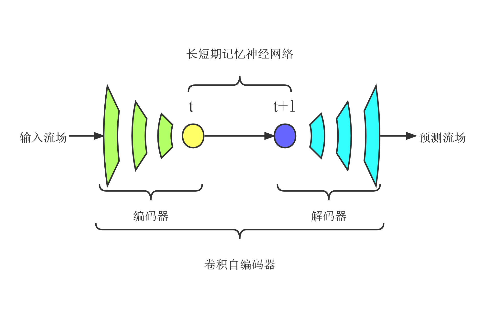

---

# 背景介绍

降阶模型可有效降低使用CFD方法的设计成本和周期。对于复杂的可压缩流动，使用POD等线性方法进行流场降维，需要大量的模态才能保证流场重建的精度，而采用非线性降维方法能够有效减少所需模态数。卷积自编码器(CAE)是一种由编码器和解码器组成的神经网络，能够实现数据降维和重构，可看作是POD方法的非线性拓展。采用CAE进行流场数据的非线性降维，同时使用LSTM进行流场状态的时间演化。对于非定常可压缩流动，“CAE-LSTM”降阶模型能够在使用较少自由变量数的前提下获得较高的重构和预测精度。

# 模型架构

CAE-LSTM的基本框架主要基于[论文](https://doi.org/10.13700/j.bh.1001-5965.2022.0085)，其由CAE和LSTM组成，其中CAE中的编码器降低时间序列流场的维数，实现特征提取，LSTM学习低维时空特征并进行预测，CAE中的解码器实现流场重建。

+ 输入：输入一段时间的流场;
+ 压缩：通过CAE的编码器对流场进行降维，提取高维时空流动特征;
+ 演化：通过LSTM学习低维空间流场时空特征的演变，预测下一时刻;
+ 重建：通过CAE的解码器将预测的流场低维特征恢复到高维空间；
+ 输出：输出对下一时刻瞬态流场的预测结果。

# 数据集

+ 来源：一维Sod激波管的数值仿真流场数据，由北京航空航天大学航空科学与工程学院于剑副教授团队提供

+ 建立方法：数据集计算状态与建立方法见[论文](https://doi.org/10.13700/j.bh.1001-5965.2022.0085)

+ 数据说明：
    + Sod激波管坐标x范围为[0, 1]，中间x=0.5处有一薄膜。在初始时刻，将激波管中间的薄膜撤去，研究激波管中气体密度的变化情况。计算时间t范围为[0, 0.2]，平均分成531个时间步。
    + 数据集的下载地址为：https://download.mindspore.cn/mindscience/mindflow/dataset/applications/data_driven/cae-lstm/sod/sod.npy

# 训练过程

该模型单机单卡进行训练，根据训练任务需求，分别执行cae_train.py和lstm_train.py开始训练CAE和LSTM网络；
在开始训练前需要在config.yaml中设置数据读取保存路径和训练参数等相关训练条件。

+ python cae_train.py
+ python lstm_train.py

# 预测结果可视化

根据训练条件，执行prediction.py；
后处理操作：

+ 根据训练结果的权重参数文件，预测输出CAE的降维、重构数据，LSTM的演化数据和CAE-LSTM预测的流场数据.npy文件；

+ 分别计算CAE的重构数据和CAE-LSTM预测的流场数据的平均相对误差；

+ 保存路径默认为：prediction_result。

# 预测结果展示

以下分别为真实流场，CAE-LSTM预测结果和预测误差：

<figure class="harf">
    
    
    
</figure>
