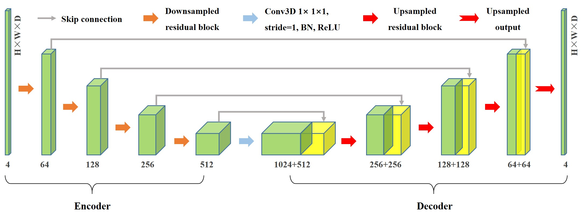
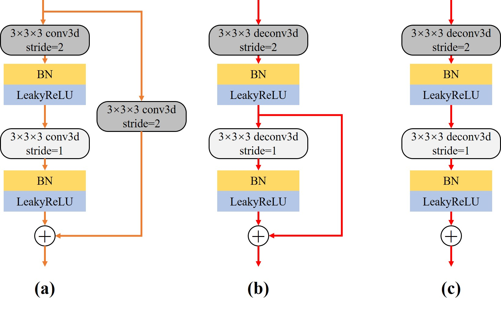
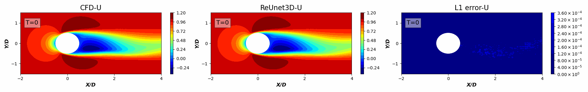

[ENGLISH](README.md) | 简体中文

# 三维非定常流动降阶模型

## 概述

### 背景

三维复杂流动广泛存在于工程实际问题中，其中流场的快速获取与准确分析十分具有挑战性。由于网格自由度的增加，涉及复杂几何的三维流场的CFD模拟会耗费大量计算资源，限制了交互式设计和实时优化控制等下游任务的开展。

近年来，深度学习技术在流场建模中的潜力得到深入挖掘，但大部分建模工作依然围绕二维形状展开，距离实际的工程应用场景还具有一定的差距。这主要是因为与2D数据相比，三维数据中的空间耦合效应更强，同时具有大量模型参数的神经网络的训练需要鲁棒的计算能力和存储资源。对于三维非定常流动，基于全卷积神经网络的“**ResUnet3D**”降阶模型能够快速建立三维流场快照之间的非线性映射。

### 模型架构

ResUnet3D的基本框架主要基于3D Unet和残差网络ResNet，遵循编码器和解码器的范式，结构整体呈对称的U型。与传统的Unet3D的主要区别在于传统的卷积操作被替换成了卷积残差块：



+ **编码器**：左侧的压缩通道(Contracting Path)，将高维的流场数据进行下采样，分层次提取目标低维特征。编码器中包含四个下采样残差块，结构如图（a）所示。在编码器使用步长为2的卷积代替池化操作进行下采样。经过一个残差块运算后，特征通道扩大为原来的两倍，尺寸减半。
+ **解码器**：相应的右侧解码器为拓展通道(Expansive Path)，负责将低维特征进行拓展，对应的具有四个上采样残差块；上采样残差块的结构如图（b）所示，首先执行反卷积进行增大特征为原来的两倍，将特征通道数降低。特别注意的是，上采样残差块舍弃恒等连接就是上采样输出块的结构图（c），负责模型的最终输出。
+ **残差连接**：除了残差块中的残差连接，还在模型中添加了如实心灰色箭头所示的跳跃连接。残差连接的增多有助于提取高维流场的低频特征，进一步丰富流场预测的细节。

<div align="center">
  
</div>

### 数据集

+ 来源：三维圆球绕流的数值仿真流场数据，由西安交通大学航天航空学院陈刚教授团队提供

+ 建立方法：数据集计算状态与建立见[论文](https://arxiv.org/abs/2307.07323), 本案例为文中基于笛卡尔均匀采样方法的示例

+ 数据说明：

    + 单流动状态：雷诺数Re=300

    + 400个连续时刻的三维流动快照，包括无量纲压强和流向、法向和展向三个方向的无量纲速度信息

    + [下载地址](https://download.mindspore.cn/mindscience/mindflow/dataset/applications/data_driven/3d_unsteady_flow)

+ 数据目录结构

  ```text
      .
      └─data
      ├── original_data.npy        // 原始流动快照
      ├── train_data.npy           // 训练流动快照
      ├── eval_data.npy            // 评估流动快照
      ├── infer_data.npy           // 推理流动快照
      ├── train_data_norm.npy      // 归一化的训练流动快照
      ├── eval_data_norm.npy       // 归一化的评估流动快照
      ├── infer_data_norm.npy      // 归一化的推理流动快照
  ```

## 快速开始

### 训练方式一：在命令行中调用`train.py`和`eval.py`分别开始训练和推理

+ 运行训练示例

```shell
# 间接预测示例
python train.py --config_file_path ./config.yaml --norm False --residual True --scale 1000.0 --mode GRAPH --device_target GPU --device_id 0

# 直接预测示例
python train.py --config_file_path ./config.yaml --norm True --residual False --scale 1.0 --mode GRAPH --device_target GPU --device_id 0
```

其中:

`--config_file_path`表示配置文件的路径，默认值'./config.yaml'

`--norm`表示原始数据是否需要进行归一化，默认值False

`--residual`表示预测模式，True表示间接（增量）预测模式，False表示直接预测模式，默认值True

`--scale`表示目标的放缩倍数，直接预测(`residual=False`)时scale=1，即对未来时刻的流场不进行放缩；间接预测（residual=False）时，往往需要将增量流场放大`scale`倍

`--mode`表示运行的模式，'GRAPH'表示静态图模式, 'PYNATIVE'表示动态图模式，默认值'GRAPH'，详见[MindSpore 官网](https://www.mindspore.cn/docs/zh-CN/master/design/dynamic_graph_and_static_graph.html)

`--device_target`表示使用的计算平台类型，可以选择'Ascend'或'GPU'，默认值'GPU'

`--device_id`表示使用的计算卡编号，可按照实际情况填写，默认值 0

其他快速入门的参数配置请参考`default_config.yaml`

+ 评估推理示例

当模型训练好之后，通过判断评估指标，重载最优的模型参数文件`.ckpt`进行多步推理任务，控制台参数用于确定模型参数存在的路径：

```shell
python eval.py  --config_file_path ./config.yaml --norm False --residual True --scale 1000.0 --device_target GPU --device_id 0
```

参数介绍与训练脚本`train.py`一致，请参考`default_config.yaml`。

### 训练方式二：运行Jupyter Notebook

您可以使用[中文版](flow_around_sphere_CN.ipynb)和[英文版](flow_around_sphere.ipynb)Jupyter Notebook逐行运行训练和验证代码。

## 结果展示

与传统CFD技术相比，训练好的神经网络大大提高了流场高保真的效率，用几秒的时间就可以给出一个周期的流场数据。下面是基于间接预测的部分推理流场结果,与CFD结果一致，最大相对误差仅为0.002，最大误差集中在尾流区域：

+ `Z=0`截面上压力随时间的变化情况：

<div align="center">
  
</div>

+ `Z=0`截面上速度随时间的变化情况：

<div align="center">
  
</div>

从图中可以看出明显的周期性特征，并且不同流动物理量在进行时间推进时都能保持相对稳定的状态，这表明模型能实现长期的稳定预测

+ 为了更清晰展示圆球绕流的三维流动特性，展示了预测两个周期后由速度场着色的三维涡量等值面（Q_criterion=0.0005）情况：

<div align="center">
  
</div>

模型预测的发夹状尾涡与CFD结果相似，但是在涡的尾部存在较大波动，充分证明了模型对于流场空间结构的特征提取能力，模型仍有改进空间

## 代码贡献

gitee id: [lixin](https://gitee.com/lixin07)

邮箱: lixinacl@stu.xjtu.edu.cn
