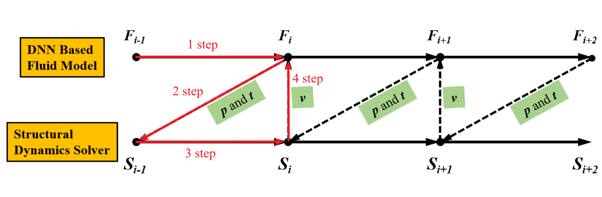

---

# Modeling method of Fluid-structure interaction system based on deep neural network

## Overview

### Background

Aeroelasticity of aircraft is a typical fluid-structure interaction (FSI) problem, which studies the coupling relationship between aircraft structure and aerodynamics. High precision computational fluid dynamics (CFD) technology can accurately simulate the evolution process of the flow field around the structure to obtain the force situation of the structure, but the huge number of grids leads to high computational cost.
Therefore, the simulation of fluid structure coupling system based on computational fluid dynamics and computational structural dynamics coupling strategy is time-consuming, especially in the initial design stage, which requires repeated iterative design. Many researchers try to use the data-driven method to build the flow field evolution model to achieve high-precision and fast prediction of the flow field, so as to improve the simulation efficiency of the fluid structure coupling system.
In recent years, the rapid development of deep neural network technology depends on its strong nonlinear learning ability and depth feature capture ability, and has achieved many successful applications in the problem of flow field modeling.
Among them, flow field reconstruction can quickly predict different flow fields by building a mapping model between geometric shape and flow conditions to the flow field information at space points, which has attracted much attention because it can quickly give the current flow field status.
In this paper, the neural network model is coupled with the computational structural dynamics equation to realize the modeling of fluid structure coupling system, further improve the neural network structure and optimize the data structure, so as to obtain higher precision flow field prediction results and achieve more accurate fluid structure coupling response prediction.

### Method

The traditional numerical simulation framework of fluid structure interaction is composed of two parts: computational fluid dynamics solver and computational solid mechanics solver. The two solvers solve the state of fluid and structure at the next moment in the fluid domain and solid domain respectively, and transfer information at the interface as the input for the next calculation. The coupling process is shown in the following figure.
The fluid structure interaction modeling framework based on deep neural network proposed in this paper still adopts the same strategy. The framework uses deep neural network instead of CFD solver to predict the evolution of flow field. The structural response is still calculated by CSD solver. The structural displacement and flow field surface pressure are transferred between deep neural network and computational solid mechanics solver.

  

The basic framework of the fluid structure interaction depth neural network model (hdnn) in this paper is mainly based on the previous work: Based on this [paper](https://link.springer.com/article/10.1007/s10409-021-01129-4)
: the prediction method of fluid solid coupling unsteady flow based on hybrid depth neural network is mainly composed of convolution neural network (CNN), convolution long and short term memory network (convlstm) and deconvolution neural network (decnn). CNN reduces the dimension of time series flow field and realizes feature extraction; Convlstm learns low dimensional spatio-temporal features and predicts them; Finally, decnn realizes the reconstruction of the predicted flow field.

+ Input layer: Current flow field state and boundary conditions;
+ Convolutional layer: Capturing the spatial features of the flow field and reducing its dimensionality, and using low dimensional flow field features to predict flow field evolution can improve computational efficiency;
+ LSTM layer: Predict the flow field characteristics of the next moment based on the captured current flow field characteristics and structural motion conditions;
+ Deconvolution output layer: Restores the low-dimensional features of the predicted flow field to high-dimensional
  space, reconstructs the transient flow field at the next moment through multi-layer DeCNN, and outputs visual
  prediction results

  

### Dataset

+ Dataset directory: The total directory of the fluid–structure interaction dataset is: FSI, under which there are six subdirectories named Uri and i is 4.0, 4.5, 5.0, 5.5, 6.0, 6.5, representing different reduction speeds. Reduced velocity is a Dimensionless quantity quantity used to describe the scaling ratio of the motion velocity of an object relative to the fluid characteristics in a specific fluid environment. It is often used to analyze and compare the motion of objects in different fluid systems. Each subdirectory contains total_puv.mat and velocity.mat, respectively, represent mat files for pressure and velocity data and cylindrical motion velocity

+ Source: Compute the flow field through CFD simulation, specifically using ANSYS Fluent to obtain numerical simulation
  flow field data of unsteady two-dimensional cylindrical flow

+ Establishment method: The moving structure (cylinder) in the flow field makes one-dimensional Simple harmonic motion in the vertical direction. Physical modeling of two-dimensional cylindrical flow field, mesh discretization/partitioning, and solving control equations using Reynolds time averaged simulation method to obtain flow field information. Dimensionalize the physical quantities of the flow field and place grid sampling points in the sampling area to obtain a sample set for training and testing

+ Specification: Each flow field snapshot of dataset contains three channels, representing the pressure distribution information, horizontal velocity information, and vertical velocity information of the flow field

### Effect

Under the condition that only the initial flow field state and cylinder position are given, the coupled model can complete the prediction of the entire fluid–structure interaction evolution process. The structural response predicted by the coupled model is in good agreement with the structural response simulated by the traditional method, and the flow field state with high resolution at the current time can be given at each time, and the prediction speed is 20 times higher than that of the traditional method.

## Quick Start

### Training Method 1: Call the `train.py` script on the command line

python train.py --config_file_path ./config.yaml --data_list ['5.0', '5.5', '6.0', '6.5'] --batch_size 32 --mode GRAPH --save_graphs False --save_graphs_path ./summary --device_target Ascend --device_id 0

Among them,
`--config_file_path` represents the parameter and path control file, default './config.yaml';

`--data_list` represents the dataset used for training, defaults ['5.0', '5.5', '6.0', '6.5'];

`--batch_size` represents the number of images that will be sent to the network during each training, default 32;

`--mode` represents the running mode, 'GRAPH' indicates the static Graphical model, 'PYNATIVE' indicates the dynamic Graphical model, default 'GRAPH';

`--save_graphs` represents whether to save the calculation graph, default 'False';

`--save_graphs_path` represents the path where the calculation graph is saved, default './summary';

`--device_target` represents the type of computing platform used, which can be selected as 'Ascend' or 'GPU', default 'Ascend';

`--device_id` represents the calculation card number used, which can be filled in according to the actual situation, default 0

### Training Method 2: Running Jupyter Notebook

You can run training and validation code line by line using both the [Chinese version](fluid_structure_interaction_CN.ipynb) and the [English version](fluid_structure_interaction.ipynb) of Jupyter Notebook.

## Results Display

The following figure shows the flow field prediction status of a deep neural network at different times within a cycle. Given only the initial flow field state and cylinder position, the coupled model completed the prediction task of the entire fluid–structure interaction evolution process.

  

## Contributor

gitee id：[DUJiaoxi](https://gitee.com/ddd000g)

email: dujiaoxi@stu.xjtu.edu.cn
