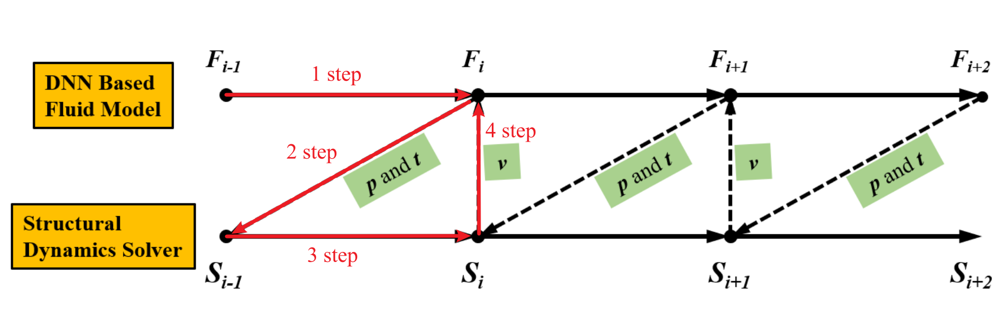
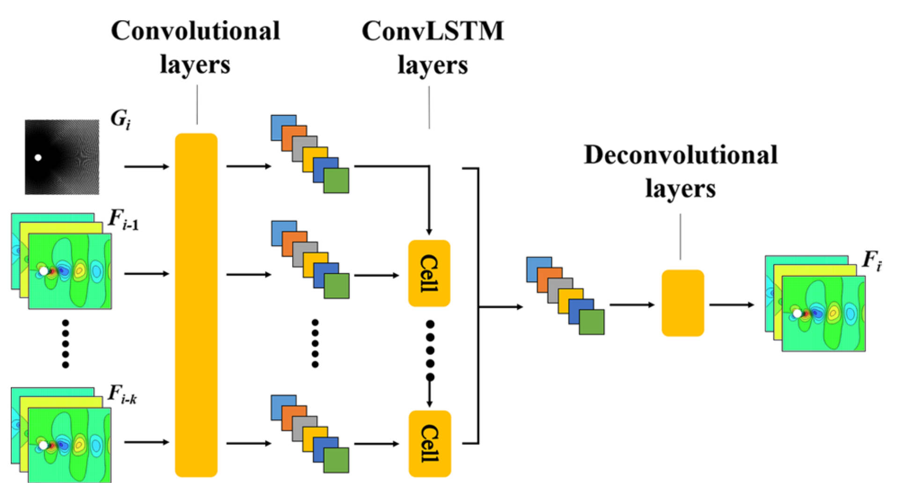
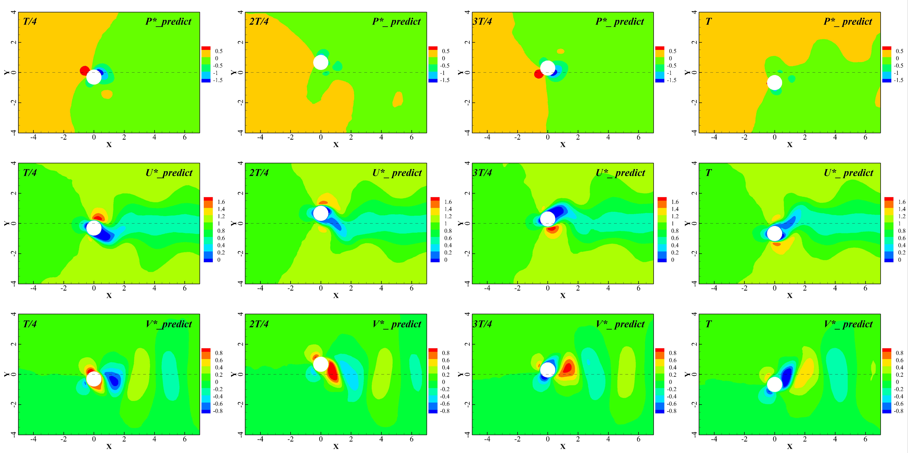

---

# 基于深度神经网络的流固耦合系统建模方法

## 概述

### 背景

飞行器气动弹性问题是研究飞行器结构与气动力相互耦合关系，是一种典型的流固耦合（fluid-structure interaction, FSI）问题。高精确度计算流体力学技术（CFD）能够准确地模拟结构周围流场演化过程从而获得结构受力情况,但是数量巨大的网格导致计算成本极高。
因此，基于计算流体力学和计算结构动力学耦合策略的流固耦合系统模拟耗时严重，尤其是在需要反复迭代设计的初始设计阶段模拟耗时是巨量的。许多研究者尝试使用数据驱动的方法构建流场演化模型，实现较高精度流场的快速预测，从而提高流固耦合系统模拟效率。
近年来迅速发展的深度神经网络技术依赖于其强大的非线性学习能力以及深度特征捕捉能力，在流场建模问题中已经取得了诸多成功应用。
其中流场重构通过构建几何形状和流动工况至空间点处的流场信息之间的映射模型，实现不同流场的快速预测，因其能快速给出当前流场状态而备受关注。
本文将神经网络模型与计算结构动力学方程耦合，实现了流固耦合系统的建模，进一步改进神经网络结构，优化数据结构，从而获得更高精度的流场预测结果，实现更准确的流固耦合响应预测。

### 方法

传统的流固耦合数值仿真框架由计算流体力学求解器和计算固体力学求解器两部分组成，两个求解器分别在流体域和固体域求解下一时刻流体和结构的状态，并在交界面进行信息传递作为下一步计算的输入，耦合过程如下图所示。
本文提出的基于深度神经网络的流固耦合建模框架仍然采用相同的策略，该框架使用深度神经网络代替CFD求解器来预测流场演化，结构响应仍由CSD求解器计算得到，结构位移和流场表面压力在深度神经网络和计算固体力学求解器之间传递。

  

本文的流固耦合深度神经网络模型(HDNN)的基本框架主要基于以前的工作：基于这篇[论文](https://link.springer.com/article/10.1007/s10409-021-01129-4)
：混合深度神经网络的流固耦合非定常流预测方法，其主要由卷积神经网络（CNN）、卷积长短期记忆网络（ConvLSTM）和反卷积神经网络（DeCNN）组成。CNN降低了时间序列流场的维数，实现特征提取；ConvLSTM学习低维时空特征并进行预测；最后，DeCNN实现预测流场的重建。

+ 输入层：当前流场状态和边界条件；
+ 卷积层：捕获流场的空间特征并降低维数，使用低维流场特征预测流场演化可以提高计算效率；
+ LSTM层：根据捕获的当前时刻流场特征和结构运动条件预测下一时刻的流场特征；
+ 反卷积输出层：将预测流场的低维特征恢复到高维空间，通过多层DeCNN重构下一时刻的瞬态流场，并输出可视化预测结果

  

### 数据集

+ 数据集目录：流固耦合数据集的总目录为：FSI，其下共有6个子目录，其名为Uri，i分别为4.0，4.5，5.0，5.5，6.0，6.5，代表了不同约化速度大小。约化速度是一个用于描述在特定流体环境中物体的运动速度相对于流体特性的缩放比例的无量纲量，常用于分析和比较不同流体系统中的物体运动。每个子目录下包含total_puv.mat和velocity.mat，分别代表压力及速度数据和圆柱运动速度的mat文件

+ 来源：通过CFD仿真计算流场，具体使用ANSYS Fluent计算得到非定常二维圆柱运动的数值仿真流场数据

+ 建立方法：流场中的运动结构（圆柱）在竖直方向做一维简谐运动。对二维圆柱流场物理建模、网格离散/划分并采用雷诺时均模拟方法求解控制方程获取流场信息。将流场物理量无量纲化，并在采样区域中放置网格采样点，获得用于训练和测试的样本集

+ 规格：数据集的每张流场快照包含3个通道，分别代表流场的压强分布信息p、水平速度信息u、竖直速度信息v

### 效果

在仅给定初始流场状态和圆柱位置情况下，耦合模型可完成整个流固耦合演化过程的预测，耦合模型预测的结构响应与使用传统方法模拟得到的结构响应吻合较好，且在每个时刻均可以给出当前时刻较高分辨率的流场状态，预测速度较传统方法提高二十倍。

## 快速开始

### 训练方式一：在命令行中调用`train.py`脚本

python train.py --config_file_path ./config.yaml --data_list ['5.0', '5.5', '6.0', '6.5'] --batch_size 32 --mode GRAPH --save_graphs False --save_graphs_path ./summary --device_target Ascend --device_id 0

其中，`--config_file_path`表示参数和路径控制文件，默认值'./config.yaml'；

`--data_list`表示训练所用的数据集forced_move的子目录，默认值['5.0', '5.5', '6.0', '6.5']；

`--batch_size`表示每次训练送入网络的图片数量，默认值32；

`--mode`表示运行的模式，'GRAPH'表示静态图模式, 'PYNATIVE'表示动态图模式， 默认值'GRAPH'；

`--save_graphs`表示是否保存计算图，默认值'False'；

`--save_graphs_path`表示计算图保存的路径，默认值'./summary'；

`--device_target`表示使用的计算平台类型，可以选择'Ascend'或'GPU'，默认值'Ascend'；

`--device_id`表示使用的计算卡编号，可按照实际情况填写，默认值0

### 训练方式二：运行Jupyter Notebook

您可以使用[中文版](fluid_structure_interaction.ipynb)和[英文版](fluid_structure_interaction.ipynb)Jupyter Notebook逐行运行训练和验证代码。

## 结果展示

下图展示了一个周期内不同时刻深度神经网络的流场预测状态。在仅给定初始流场状态和圆柱位置情况下，耦合模型完成了整个流固耦合演化过程的预测任务。

  

## Contributor

gitee id：[DUJiaoxi](https://gitee.com/ddd000g)

email: dujiaoxi@stu.xjtu.edu.cn
