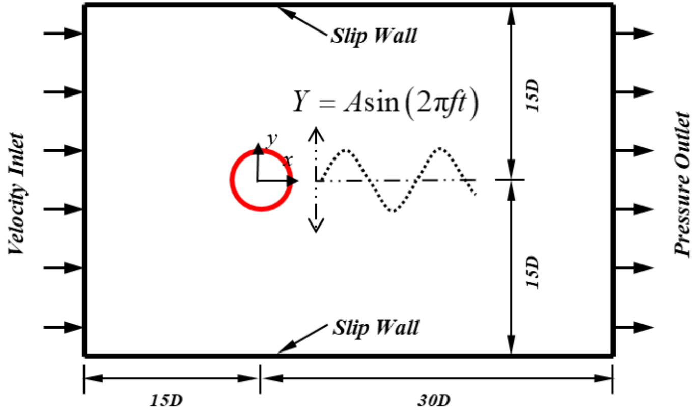
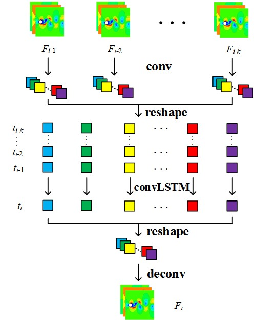
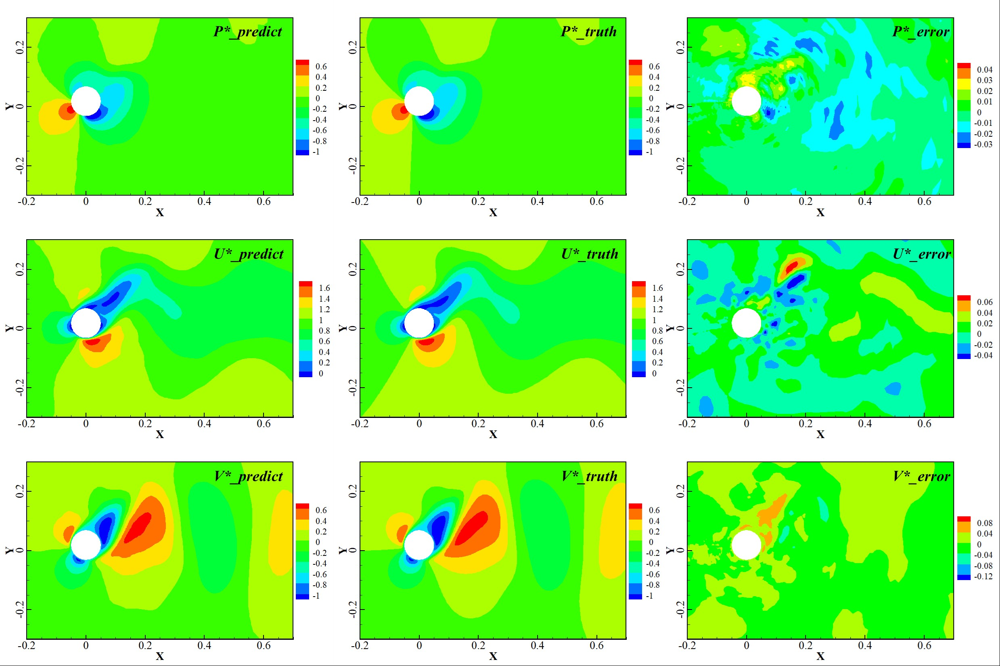
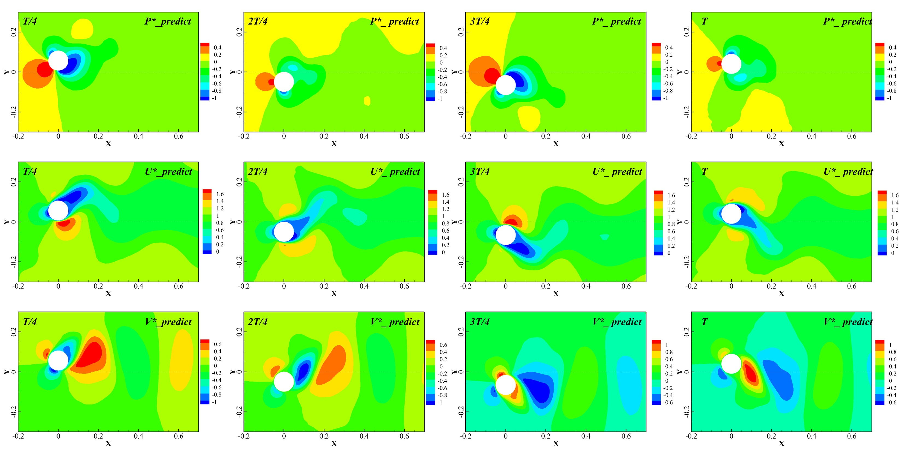

---

# 基于神经网络的含运动边界非定常流场预测方法

## 概述

### 背景

对具有移动边界的非定常流场系统进行模拟，以分析运动结构在流场中的受力情况，可在工程上优化设计运动结构。高精确度计算流体力学技术（CFD）能够准确模拟流场演化和结构受力情况，但是高精度动边界问题需要大量网格，导致计算成本巨大，动态网格构造也格外耗时。深度神经网络可学习流动工况与流场之间的演化关系，快速实现流场高精度重构。为了高效解决动边界流场重构问题，提出了一种混合深度神经网络(HDNN)，以实现非定常动边界流场重构，并基于此实现流场的快速预测。流场相关尺寸如图所示，其中 $$Y = Asin(2\pi ft)$$ 代表圆柱体在竖直方向做简谐运动的运动表达式，A为振幅，f为频率；D代表圆柱体直径；矩形边界代表计算域。

  

### 方法

本文的动边界深度神经网络模型(HDNN)的基本框架主要基于以前的工作：混合深度神经网络框架[论文](https://doi.org/10.1016/j.ast.2022.107636)
，其主要由卷积神经网络（CNN）、卷积长短期记忆网络（ConvLSTM）和反卷积神经网络（DeCNN）组成。CNN降低了时间序列流场的维数，实现特征提取；ConvLSTM学习低维时空特征并进行预测；最后，DeCNN实现预测流场的重建。

+ 输入层：输入历史流场信息；
+ 卷积层：通过多层CNN对输入流场进行降维，提取高维时空流动特征；
+ 记忆层：通过ConvLSTM学习低维空间流场时空特征的演变，预测下一时刻；
+ 反卷积输出层：将预测流场的低维特征恢复到高维空间，通过多层DeCNN重构下一时刻的瞬态流场，并输出可视化预测结果

  

### 数据集

+ 数据集目录：动边界数据集的总目录为：forced_move，其下共有8个子目录，其名为f0.90h0.i，i分别为00，20，25，30，35，40，45，50，代表了不同振幅大小。每个子目录下的小目录（project）包含Matrix_01.mat、total_puv_project.mat和velocity.mat，分别代表包含0或1的矩阵、压力及速度数据和圆柱运动速度的mat文件

+ 来源：通过CFD仿真计算流场，具体使用ANSYS Fluent计算得到非定常二维圆柱运动的数值仿真流场数据

+ 建立方法：流场相关物理量为：雷诺数Re = 200、圆柱直径D = 0.02m、时间步长t = 0.01s。圆柱在竖直方向做一维简谐运动，振动频率（Hz）分别为1.25、1.43、1.67、2.00，振幅与直径比值（A/D）分别为0.5、0.6、0.7、0.8，两两组合总共16组运动状态。对二维圆柱流场物理建模、网格离散/划分并采用雷诺时均模拟方法求解控制方程获取流场信息。将流场物理量无量纲化，并在采样区域中放置128×128个网格采样点，获得用于训练和测试的样本集

+ 规格：数据集的每张流场快照包含3个通道，分别代表流场的压强分布信息p、水平速度信息u、竖直速度信息v

### 效果

训练完成的神经网络在振幅为0.45D的工况下进行流场预测，使用经过训练的神经网络获得150个时间步的流场只需17秒，而CFD求解器却需要240秒，这则展示了该方法的高效性。

## 快速开始

### 训练方式一：在命令行中调用`train.py`脚本

python train.py --mode GRAPH --save_graphs False --save_graphs_path ./summary --device_target Ascend --device_id 0 --data_list ['0.00', '0.25', '0.35', '0.45'] --batch_size 16 --config_file_path ./config.yaml

其中，
`--mode`表示运行的模式，'GRAPH'表示静态图模式, 'PYNATIVE'表示动态图模式， 默认值'GRAPH'；

`--save_graphs`表示是否保存计算图，默认值'False'；

`--save_graphs_path`表示计算图保存的路径，默认值'./summary'；

`--device_target`表示使用的计算平台类型，可以选择'Ascend'或'GPU'，默认值'Ascend'；

`--device_id`表示使用的计算卡编号，可按照实际情况填写，默认值0；

`--data_list`表示训练所用的数据集forced_move的子目录，默认值['0.00', '0.25', '0.35', '0.45']；

`--batch_size`表示每次训练送入网络的图片数量，默认值16；

`--config_file_path`表示参数和路径控制文件，默认值'./config.yaml'

### 训练方式二：运行Jupyter Notebook

您可以使用[中文版](move_boundary_hdnn_CN.ipynb)和[英文版](move_boundary_hdnn.ipynb)Jupyter Notebook逐行运行训练和验证代码。

## 结果展示

下图为训练完备的HDNN模型实现对振动频率为1.43Hz，振幅为0.8（振幅比泛化状态）下非定常动边界单步预测和一完整周期预测的结果（展示压强场、水平速度场和竖直速度场）。

  
  

## 贡献者

gitee id：[DUJiaoxi](https://gitee.com/ddd000g)

email: dujiaoxi@stu.xjtu.edu.cn
