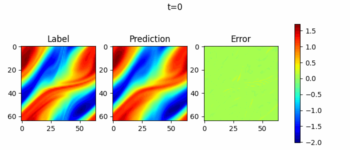

# Solve 2D Navier-Stokes Equation by FNO

## Overview

Navier-Stokes equation is a classical equation in computational fluid dynamics. It is a set of
partial differential equations describing the conservation of fluid momentum, called N-S equation
for short. Its vorticity form in two-dimensional incompressible flows is as follows:

$$
\partial_t w(x, t)+u(x, t) \cdot \nabla w(x, t)=\nu \Delta w(x, t)+f(x), \quad x \in(0,1)^2, t \in(0, T]
$$

$$
\nabla \cdot u(x, t)=0, \quad x \in(0,1)^2, t \in[0, T]
$$

$$
w(x, 0)=w_0(x), \quad x \in(0,1)^2
$$

where $u$ is the velocity field, $w=\nabla \times u$ is the vorticity, $w_0(x)$ is the initial
vorticity, $\nu$ is the viscosity coefficient, $f(x)$ is the forcing function.

We aim to solve two-dimensional incompressible N-S equation by learning the Fourier Operator mapping from
each time step to the next time step:

$$
w_t \mapsto w(\cdot, t+1)
$$

## QuickStart

You can download dataset from  [data_driven/navier_stokes/dataset](https://download.mindspore.cn/mindscience/mindflow/dataset/applications/data_driven/navier_stokes/dataset/). Save these dataset at `./dataset`.

### Run Option 1: Call `train.py` from command line

```shell
python train.py --config_file_path ./configs/fno2d.yaml --mode GRAPH --device_target Ascend --device_id 0
```

where:

`--config_file_path` indicates the path of the parameter file. Default './configs/fno2d.yaml'；

`--mode` is the running mode. 'GRAPH' indicates static graph mode. 'PYNATIVE' indicates dynamic graph mode. Default 'GRAPH'.

`--device_target` indicates the computing platform. You can choose 'Ascend' or 'GPU'. Default 'Ascend'.

`--device_id` indicates the index of NPU or GPU. Default 0.

### Run Option 2: Run Jupyter Notebook

You can use [Chinese](./FNO2D_CN.ipynb) or [English](./FNO2D.ipynb)Jupyter Notebook to run the training and evaluation code line-by-line.

## Results

Take 1 samples, and do 10 consecutive steps of prediction. Visualize the prediction as follows.



## Performance

| Parameter               | Ascend               | GPU                |
|:----------------------:|:--------------------------:|:---------------:|
| Hardware                | Ascend 32G           | NVIDIA V100 32G    |
| MindSpore version       | >=2.1.0                | >=2.1.0                   |
| dataset                 | [2D Navier-Stokes Equation Dataset](https://download-mindspore.osinfra.cn/mindscience/mindflow/dataset/applications/data_driven/navier_stokes/)      | [2D Navier-Stokes Equation Dataset](https://download-mindspore.osinfra.cn/mindscience/mindflow/dataset/applications/data_driven/navier_stokes/)                   |
| Parameters              | 9e5                  | 9e5                   |
| Train Config            | batch_size=19, steps_per_epoch=1000, epochs=150 | batch_size=19, steps_per_epoch=1000, epochs=150 |
| Evaluation Config       | batch_size=1      | batch_size=1               |
| Optimizer               | Adam                 | Adam                   |
| Train Loss(MSE)         | 0.7                 | 0.7             |
| Evaluation Error(RMSE)  | 0.06                | 0.06              |
| Speed(ms/step)          | 15                   | 45                 |

## Contributor

gitee id：[yi-zhang95](https://gitee.com/yi-zhang95)

email: zhang_yi_1995@163.com
