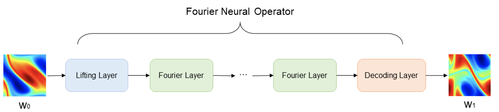

# FNO3D求解纳维-斯托克斯方程

## 概述

纳维-斯托克斯方程（Navier-Stokes equation）是计算流体力学领域的经典方程，是一组描述流体动量守恒的偏微分方程，简称N-S方程。它在二维不可压缩流动中的涡度形式如下：

$$
\partial_t w(x, t)+u(x, t) \cdot \nabla w(x, t)=\nu \Delta w(x, t)+f(x), \quad x \in(0,1)^2, t \in(0, T]
$$

$$
\nabla \cdot u(x, t)=0, \quad x \in(0,1)^2, t \in[0, T]
$$

$$
w(x, 0)=w_0(x), \quad x \in(0,1)^2
$$

其中$u$表示速度场，$w=\nabla \times u$表示涡度，$w_0(x)$表示初始条件，$\nu$表示粘度系数，$f(x)$为外力合力项。

本案例利用Fourier Neural Operator学习某一个时刻对应涡度到下一时刻涡度的映射，实现二维不可压缩N-S方程的求解：

$$
w_t \mapsto w(\cdot, t+1)
$$



## 快速开始

从 [data_driven/navier_stokes_3d/](https://download.mindspore.cn/mindscience/mindflow/dataset/applications/data_driven/navier_stokes_3d/) 中下载验证所需要的数据集，并保存在`./dataset`目录下。

### 训练方式一：在命令行中调用`train.py`脚本

```shell
export PYTHONPATH=$(cd ../../../../../ && pwd):$PYTHONPATH
python train.py --config_file_path ./configs/fno3d.yaml --mode GRAPH --device_target Ascend --device_id 0
```

其中，

`--config_file_path`表示参数文件的路径，默认值'./configs/fno3d.yaml'；

`--mode`表示运行的模式，'GRAPH'表示静态图模式, 'PYNATIVE'表示动态图模式，默认值'GRAPH'；

`--device_target`表示使用的计算平台类型，可以选择'Ascend'或'GPU'，默认值'Ascend'；

`--device_id`表示使用的计算卡编号，可按照实际情况填写，默认值0；

### 训练方式二：运行Jupyter Notebook

您可以使用[中文版](./FNO3D_CN.ipynb)和[英文版](./FNO3D.ipynb)Jupyter Notebook逐行运行训练和验证代码。

## 结果展示

得到结果如下：

```text
epoch: 141 train loss: 0.014623 epoch time: 12.42s step time: 0.12s
epoch: 142 train loss: 0.012681 epoch time: 12.46s step time: 0.12s
epoch: 143 train loss: 0.022258 epoch time: 12.48s step time: 0.12s
epoch: 144 train loss: 0.014924 epoch time: 12.48s step time: 0.12s
epoch: 145 train loss: 0.015092 epoch time: 12.54s step time: 0.13s
epoch: 146 train loss: 0.013113 epoch time: 12.45s step time: 0.12s
epoch: 147 train loss: 0.013670 epoch time: 12.42s step time: 0.12s
epoch: 148 train loss: 0.011905 epoch time: 12.53s step time: 0.13s
epoch: 149 train loss: 0.018703 epoch time: 12.48s step time: 0.12s
epoch: 150 train loss: 0.013277 epoch time: 12.45s step time: 0.12s
loss: 0.013277
step: 150, time elapsed: 12457.710981369019ms
================================Start Evaluation================================
mean rms_error: 0.016683187
predict total time: 5.692582845687866 s
=================================End Evaluation=================================
```

## 性能

| 参数               | Ascend               |
|:----------------------:|:--------------------------:|
| 硬件资源                | Ascend, 显存32G            |
| MindSpore版本           | 2.7.0                 |
| 数据集                  | [三维NS方程数据集](https://download.mindspore.cn/mindscience/mindflow/dataset/applications/data_driven/navier_stokes_3d/)      |
| 参数量                  | 6.5e6                   |
| 训练参数                | batch_size=10, steps_per_epoch=100, epochs=150 |
| 测试参数                | batch_size=1          |
| 优化器                  | Adam                 |
| 训练损失(MSE)           | 0.01                |
| 验证损失(RMSE)          | 0.02                |
| 速度(ms/epoch)           | 12179                   |

## Contributor

gitee id：[chengzrz](https://gitee.com/chengzrz),[huangwangwen2025](https://gitee.com/huangwangwen2025)

email: czrzrichard@gmail.com,wangwen@isrc.iscas.ac.cn
