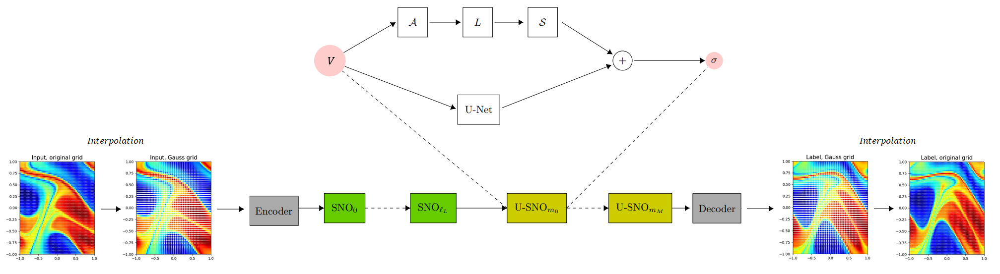
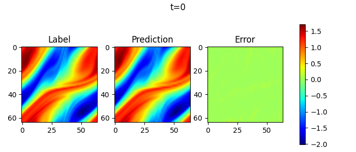

# Solve 2D Navier-Stokes Equation by SNO

## Overview

Navier-Stokes equation is a classical equation in computational fluid dynamics. It is a set of
partial differential equations describing the conservation of fluid momentum, called N-S equation
for short. Its vorticity form in two-dimensional incompressible flows is as follows:

$$
\partial_t w(x, t)+u(x, t) \cdot \nabla w(x, t)=\nu \Delta w(x, t)+f(x), \quad x \in(0,1)^2, t \in(0, T]
$$

$$
\nabla \cdot u(x, t)=0, \quad x \in(0,1)^2, t \in[0, T]
$$

$$
w(x, 0)=w_0(x), \quad x \in(0,1)^2
$$

where $u$ is the velocity field, $w=\nabla \times u$ is the vorticity, $w_0(x)$ is the initial
vorticity, $\nu$ is the viscosity coefficient, $f(x)$ is the forcing function.

We aim to solve two-dimensional incompressible N-S equation by learning the Spectral Neural Operator mapping from
each time step to the next time step:

$$
w_t \mapsto w(\cdot, t+1)
$$

### Technical Path

Spectral Neural Operator is the FNO-like architecture using polynomial transformation to spectral space (Chebyshev, Legendre, etc.) instead of Fourier.
To compute forward and inverse polynomial transformation matrices for spectral convolutions, the input should be interpolated at the respective Gauss quadrature nodes (Chebyshev grid, etc.).
The interpolated input is lifted to a higher dimension channel space by a convolutional Encoder layer. The result comes to the input of a sequence of spectral (SNO) layers, each of which applies a linear convolution to its truncated spectral representation. The output of SNO layers is projected back to the target dimension by a convolutional Decoder, and finally interpolated back to the original nodes.

The spectral (SNO) layer performs the following operations: applies the polynomial transformation $A$ to spectral space (Chebyshev, Legendre, etc.); a linear convolution $L$ on the lower polynomial modes and filters out the higher modes; then applies the inverse conversion $S={A}^{-1}$ (back to the physical space). Then a linear convolution $W$ of input is added, and nonlinear activation is applied.

U-SNO is the SNO modification, where a sequence of modified spectral convolution layers comes after the main sequence. In the modified U-SNO layer, $U-Net$ architecture (with custom number of steps) is used as a skip block instead of linear $W$.



## QuickStart

You can download dataset from  [data_driven/navier_stokes/dataset](https://download.mindspore.cn/mindscience/mindflow/dataset/applications/data_driven/navier_stokes/dataset/). Save these dataset at `./dataset`.

### Run Option 1: Call `train.py` from command line

```shell
python train.py --config_file_path ./configs/sno2d.yaml --mode GRAPH --device_target Ascend --device_id 0
```

where:

`--config_file_path` indicates the path of the parameter file. Default './configs/sno2d.yaml'；

`--mode` is the running mode. 'GRAPH' indicates static graph mode. 'PYNATIVE' indicates dynamic graph mode. Default 'GRAPH'.

`--device_target` indicates the computing platform. You can choose 'Ascend' or 'GPU'. Default 'Ascend'.

`--device_id` indicates the index of NPU or GPU. Default 0.

### Run Option 2: Run Jupyter Notebook

You can use [Chinese](./SNO2D_CN.ipynb) or [English](./SNO2D.ipynb)Jupyter Notebook to run the training and evaluation code line-by-line.

## Results

Take 1 samples, and do 10 consecutive steps of prediction. Visualize the prediction as follows.



## Performance

| Parameter               | NPU               | GPU                |
|:----------------------:|:--------------------------:|:---------------:|
| Hardware                | Ascend 64G           | NVIDIA V100 16G    |
| MindSpore version       | >=2.2.0                | >=2.2.0                   |
| dataset                 | [2D Navier-Stokes Equation Dataset](https://download-mindspore.osinfra.cn/mindscience/mindflow/dataset/applications/data_driven/navier_stokes/)      | [2D Navier-Stokes Equation Dataset](https://download-mindspore.osinfra.cn/mindscience/mindflow/dataset/applications/data_driven/navier_stokes/)                   |
| Parameters              | 2.4e6                  | 2.4e6                   |
| Train Config            | batch_size=19, steps_per_epoch=1000, epochs=90 | batch_size=19, steps_per_epoch=1000, epochs=90 |
| Evaluation Config       | batch_size=1      | batch_size=1               |
| Optimizer               | AdamWeightDecay                 | AdamWeightDecay                   |
| Train Loss(MSE)         | 0.0016                 | 0.0016             |
| Evaluation Error(RMSE)  | 0.056                | 0.056              |
| Speed(ms/step)          | 13                   | 29                |

## Contributor

gitee id：[juliagurieva](https://gitee.com/JuliaGurieva)

email: gureva-yulya@list.ru
