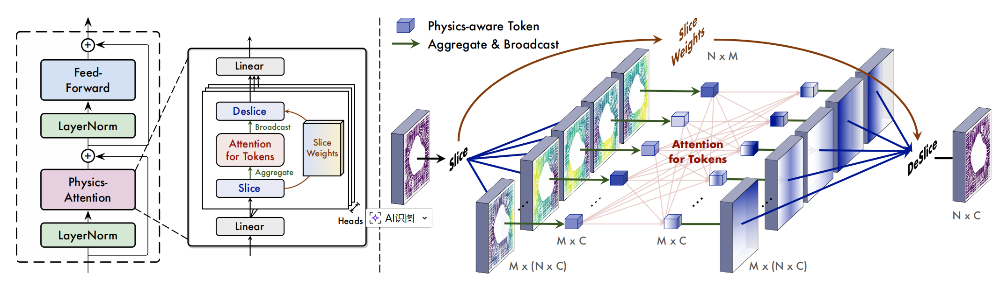
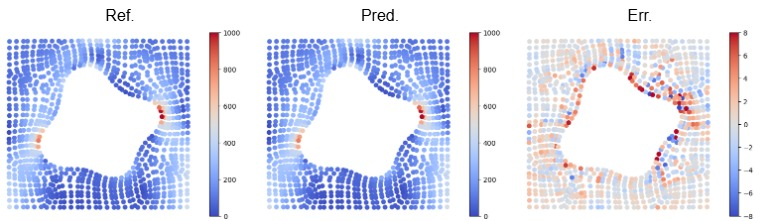

# Transolver求解二维Elasticity问题

## 背景简介

### 概述（Overview）

偏微分方程（Partial Differential Equations, PDEs）广泛描述了自然界和工程系统中的连续物理过程，如流体力学、固体力学、电磁场与材料变形等。传统数值方法（有限元、有限差分、谱方法等）在精度和稳定性方面具有严格的理论保证，但在面对复杂几何、高分辨率网格或多次重复求解时，往往计算成本高昂。

近年来，**神经算子（Neural Operator）** 作为一种新范式，尝试直接学习“函数到函数”的映射关系，从而在推理阶段绕过昂贵的数值求解过程，实现快速预测。相比于点值回归模型，神经算子在处理不同网格分辨率、不同输入函数以及复杂物理场分布时表现出更强的泛化能力。

Transolver 正是在这一背景下提出的一种面向不规则几何与复杂物理场的神经算子模型，为工程结构分析等问题提供了一种高效的数据驱动求解途径。更多信息可参考 [Transolver: A Fast Transformer Solver for PDEs on General Geometries](https://arxiv.org/abs/2402.02366).

### Transolver 简介

Transolver 是一种基于 Transformer 架构的神经算子模型，旨在解决传统神经算子在不规则网格、非结构化几何以及复杂边界条件下建模能力不足的问题。



其核心思想包括：

- 将计算域中的离散网格点（或单元）视为 token；
- 通过自注意力机制（Self-Attention）建模任意空间位置之间的长程相互作用；
- 在不依赖规则网格或卷积结构的情况下，直接学习物理场的全局映射关系。

与基于傅里叶变换的神经算子（如 FNO）相比，Transolver 不要求规则的周期网格，能够自然适配有限元网格或其他非结构化离散形式。这一特性使其非常适合应用于结构力学、材料力学等工程问题。

本项目基于 MindSpore 框架，对 Transolver 模型进行了完整复现，并重点验证其在超弹性材料（Hyper-elastic Material）问题上的建模能力。

### 超弹性材料（Hyper-elastic Material）控制方程

超弹性材料是一类能够在大变形条件下保持可逆力学行为的非线性弹性材料，广泛应用于橡胶材料、生物软组织以及工程结构分析等场景。在连续介质力学框架下，其动力学平衡方程可以写为：

$$
\rho^s \frac{\partial^2 \bm u}{\partial t^2} + \nabla \cdot \bm \sigma = 0
$$

其中：

- $\rho^s$表示材料的质量密度；
- $\bm u$ 为位移向量场；
- $\bm \sigma$为应力张量；

该方程描述了固体在外力作用下的动量守恒。为了闭合该方程组，需要引入本构关系（constitutive model） ，将应变张量与应力张量联系起来。对于超弹性材料，应力通常由应变能密度函数关于形变梯度的导数得到。

## 模型实现

### 硬件与Mindspore版本

硬件：Ascend NPU

Mindspore：>= 2.7.1

### 准备

1. 确保环境已经安装正确版本的Mindspore
2. 克隆MindScience仓库或者直接获取[MindFlow/applications/data_driven/transolver](https://atomgit.com/mindspore-lab/mindscience/tree/master/MindFlow/applications/data_driven/transolver)下的代码
3. 下载训练和测试数据集[Elasticity](https://drive.google.com/drive/folders/1YBuaoTdOSr_qzaow-G-iwvbUI7fiUzu8)，保存至 `./data/elasticity/Meshes/`目录下

### 快速开始

训练

```shell
python exp_elas.py --save_name elas_transolver
```

训练权重会保存至 `./checkpoints/elas_transolver.ckpt`

部分训练日志如下

```shell
Epoch 1 Iter 1000/1000 Loss 0.50575: 100%|██████████| 1000/1000 [02:24<00:00,  6.93it/s]
Epoch 1 Train loss : 0.52137
100%|██████████| 200/200 [00:02<00:00, 68.02it/s]
rel_err : 0.4935893748700619
...
Epoch 500 Iter 1000/1000 Loss 0.01106: 100%|██████████| 1000/1000 [02:09<00:00,  7.72it/s]
Epoch 500 Train loss : 0.01136
100%|██████████| 200/200 [00:02<00:00, 67.58it/s]
rel_err : 0.00951484518358484
save modelshell
```

测试

```shell
python exp_elas.py --eval 1 --save_name elas_transolver
```

## 实验结果

测试数据集中的一个样本及预测结果



### 性能

| 参数           | 内容                                         |
| -------------- | -------------------------------------------- |
| 硬件           | Ascend NPU                                   |
| Mindspore版本  | 2.7.1                                        |
| 数据集         | Elasticity                                   |
| 参数量         | 714k                                         |
| 训练参数       | learning_rate=1e-3, batch_size=1, epochs=500 |
| 优化器         | AdamW                                        |
| 训练损失       | 0.0114                                       |
| 测试损失       | 0.0095                                       |
| 速度 (ms/step) | 136.5                                        |

## 许可证

- 开源协议：`Apache License 2.0`
- 许可证连接：`https://atomgit.com/mindspore-lab/mindscience/blob/master/LICENSE`
