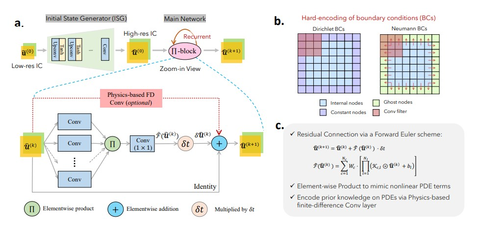

ENGLISH | [简体中文](README_CN.md)

# Physics-encoded Recurrent Convolutional Neural Network (PeRCNN)

## Overview

PDE equations occupy an important position in the modeling of physical systems. But many underlying PDEs have not yet been fully explored in epidemiology, meteorological science, fluid mechanics, and biology. However, for those known PDE equations, such as Naiver-Stokes equations, the exact numerical calculation of these equations requires huge computing power, which hinders the application of numerical simulation in large-scale systems. Recently, advances in machine learning provide a new way for PDE solution and inversion.



Recently, Huawei and Professor Sun Hao's team from Renmin University of China proposed Physics-encoded Recurrent Convolutional Neural Network, PeRCNN(https://www.nature.com/articles/s42256-023-00685-7) based on Ascend platform and MindSpore. Compared with physical information neural network, ConvLSTM, PDE-NET and other methods, generalization and noise resistance of PeRCNN are significantly improved. The long-term prediction accuracy is improved by more than 10 times. This method has broad application prospects in aerospace, shipbuilding, weather forecasting and other fields. The results have been published in nature machine intelligence.

The physical structure is embedded in PeRCNN. A π-convolution module combines partial physical prior and achieves nonlinear approximation by producting elements between feature graphs. This physical embedding mechanism guarantees that the model strictly follows a given physical equation based on our prior knowledge. The proposed method can be applied to various problems related with PDE systems, including data-driven modeling and PDE discovery, and can ensure accuracy and generality.。

Burgers' equation is a nonlinear partial differential equation that simulates the propagation and reflection of shock waves. It is widely used in the fields of fluid mechanics, nonlinear acoustics, gas dynamics et al. It is named after Johannes Martins Hamburg (1895-1981). In this case, the 2D Burgers' equation with viscosity is solved based on PeRCNN method.

## Quick Start

Download the data from [link](https://download.mindspore.cn/mindscience/mindflow/dataset/applications/data_mechanism_fusion/PeRCNN) and save them in `./dataset`.

### Stage 1: call `train.py` to carry out data-driven PeRCNN simulation

```shell
python train.py --mode GRAPH --save_graphs_path ./graphs --device_target Ascend --device_id 0 --config_file_path ./percnn_burgers.yaml --pattern data_driven
```

where

`--mode` is the running mode. 'GRAPH' indicates static graph mode. 'PYNATIVE' indicates dynamic graph mode. Default 'GRAPH'.

`--save_graphs` represents whether to save the computing graph. Default 'False'；

`--save_graphs_path` represents save path of the computing graph. Default './graphs'

`--device_target` represents the type of computing platform used, which can be selected as 'Ascend' or 'GPU', default 'Ascend';

`--device_id` represents the calculation card number used, which can be filled in according to the actual situation, default 0;

`--config_file_path` represents the parameter and path control file, default './percnn_burgers.yaml';

`--pattern` represents research pattern. Choose 'data_driven' in this stage;

### Stage 2: call `uncover_coef.py` uncover the underlying physical equations by sparse regression

```shell
python uncover_coef.py --mode GRAPH --save_graphs_path ./graphs --device_target Ascend --device_id 0 --config_file_path ./percnn_burgers.yaml --pattern data_driven
```

where,

`--data_path` represents the path of the data file. You can select the data obtained from stage1, default './data/Burgers_2001x2x100x100_[dt=00025].mat';

### Stage 3: call `train.py` to fine-tune the coefficients with physics-driven PeRCNN

```shell
python train.py --mode GRAPH --save_graphs_path ./graphs --device_target Ascend --device_id 0 --config_file_path ./percnn_burgers.yaml --pattern data_driven
```

where,

`--config_file_path` represents the parameter and path control file, default './percnn_burgers.yaml'；

`--pattern` represents research pattern. Choose 'physics_driven' in this stage;

## Results


## Performance

|        Parameter         |        Ascend               |    GPU       |
|:----------------------:|:--------------------------:|:---------------:|
|     Hardware         |     Ascend 910A, 32G；CPU: 2.6GHz, 192 cores      |      NVIDIA V100 32G       |
|     MindSpore   |        2.1.0             |      2.1.0       |
|        train loss      |        0.00125               |       0.00122      |
|        valid liss      |        0.14               |       0.10    |
|        speed          |     0.04s/epoch        |    0.14s/epoch  |

## Contributor

gitee id：[yi-zhang95](https://gitee.com/yi-zhang95), [chengzrz](https://gitee.com/chengzrz)

email: zhang_yi_1995@163.com