# Turbulence AI Model

## Introduction

Turbulence AI model is a high-precision AI simulation model for high Reynolds number problems in aerospace engineering developed based on Ascend AI and supported by the MindSpore fluid simulation suite. A large-scale parallel intelligent turbulence simulation method for large passenger aircraft wing and wing body assembly is established, which greatly improves the calculation efficiency and precision of traditional turbulence simulation method, and the absolute error of flow field precision is less than 5%, which reaches the industrial standard.

This tutorial introduces the research background, technical path and usage guide of the turbulence AI model,  and shows how to train the model through MindFlow. The trained model will be released in Hongshan Community.

## Background

Since Platt proposed boundary layer theory in 1904, turbulence simulation has been studied for more than 100 years, but no essential breakthrough has been made. Although the traditional RANS turbulent closed model has been widely used in aerospace and other engineering fields, the prediction ability is relatively accurate only in the flow dominated by small angle of attack and attached flow. There are still no accurate turbulence simulation methods suitable for vortex and separation-dominated flow  engineering problems, such as aircraft maneuver flight and control rate design at high angles of attack, accurate evaluation of drag and noise of civil aircraft, and aerodynamic thermal and thermal protection design of hypersonic vehicles. It must rely on wind tunnel experiments and even flight tests. The DNS simulation of complex turbulent fields still needs more than trillion degrees of freedom. Traditional methods often take months or even years, which becomes an important bottleneck in the development of high-end equipment and brings double challenges of computational efficiency and precision.

Common turbulence models can be classified according to the number of differential equations used: zero-equation model, one-equation model and two-equation model. There are two kinds of zero-equation models, which are C-S model proposed by Cebeci-Smith and B-L model proposed by Baldwin-Lomax. There are two kinds of one-equation models: S-A model, which is developed step by step for simple flow from empirical and dimensional analysis, and Baldwin-Barth model, which is simplified from two-equation model. The widely used two-equation models are k-e model and k-omega model. In addition, the turbulence model also includes Reynolds stress model.

<div align=center>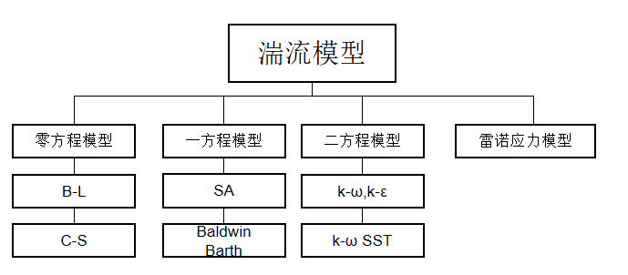</div>

<div align=center>Figure 1. Turbulence Model Classification</div>

In recent years, with the great improvement of computer computing and storage capabilities, AI technology has been widely used in many fields. For turbulence problems, massive turbulence field big data can be obtained by fine experimental measurement means and high-resolution numerical simulation method, and the flow field big data can be mined and analyzed by means of powerful computing capability of high-performance computers and advanced machine learning technology. It provides a new paradigm for constructing a new turbulence model and solving the problem of accurate turbulence simulation. The development of turbulent AI intelligent model has become a new idea to reduce the test risk and cost, and to improve the simulation precision and research efficiency.

Based on this, Xi’an Technological University and Huawei jointly developed a turbulent AI model based on MindSpore and Ascend, and validated it on two-dimensional airfoil, three-dimensional wing, and wing body assembly. The model can realize high-efficiency and high-precision inference of flow field when the geometric shape and incoming flow parameters (angle of attack/Mach number/Reynolds number) change in a certain range. It is coupled with CFD software bidirectionally to accurately predict flow field, pressure/friction distribution and lift/resistance distribution.

## Technical difficulties

Turbulence modeling challenges include the following:

The first is the **scale difference of flow field variables caused by high Re number**. From the wall surface to the outer edge of the boundary layer, the turbulent eddy viscosity evolves from almost zero to hundreds of thousands of times laminar viscosity, which varies greatly in value. And because of the large shear strain rate near the wall surface, the requirements for precision of vortex viscosity is higher. However, under the classical mean square error loss function, simply increasing the number of neurons not only does not have obvious effect, but also leads to overfitting problem. Therefore, it is not feasible to directly take vortex viscosity as the model output.

The second is the **generalization ability of the model**. The flow in the boundary layer is closely related to the change of Re number, and a high Re number means strong nonlinearity between the flow variables. The degree of non-linearity captured by machine learning models is a key factor affecting generalization ability. It is necessary to elaborate ingenious modeling strategy on the basis of grasping the characteristics of flow field according to the physical law of flow. In addition, the input features and their forms of model construction and selection are also important for generalization ability.

Finally, **the convergence after solver and the model are coupled bidirectionally**. The outliers and non-smoothness of the model output are inevitable, which will reduce the convergence of the solver to a certain extent. In addition, the high sensitivity to the small change of input will cause the residual value to oscillate, the convergence speed will slow down or even not converge.

## Technical Path

<div align=center>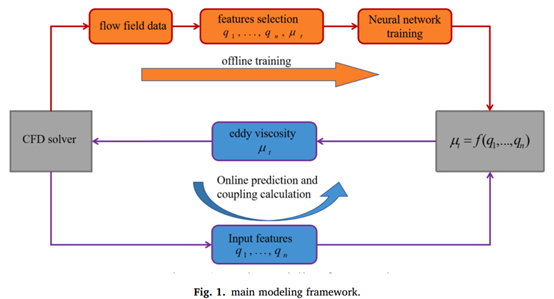</div>

<div align=center>Figure 2. Bidirectional Coupling Scheme for AI Turbulence Model</div>

As shown in the above figure, this work is divided into two parts: modeling and coupling. The modeling process includes data acquisition, data preprocessing, feature construction and selection, and network training. In the coupling process, the trained DNN model replaces the original turbulence model and is coupled to the CFD solver to participate in the process of flow field iteration, finally the convergent flow field is obtained.

### Feature Construction and Selection

In the feature structure, the features with physical meaning, including X-direction velocity, velocity curl norm, entropy, strain rate, wall distance and transformation formula, are selected as the input of the model. To ensure computability on Ascend, the feature construction is calculated using fp32 precision. In addition, to improve the accuracy of prediction of the eddy viscosity coefficient of the near-wall area by the model, the eddy viscosity coefficient is scaled based on the wall distance.
$$
trans=e^{\sqrt{\frac{Re^{-0.56}}{dis}}}
$$

$$
\mu_{T_{trans}} = \mu_T * trans
$$

### Model Design

A fully connected neural network is selected to predict the eddy viscosity coefficient. The network has four hidden layers. The number of neural units at each layer is 128, 64, 64, and 64 respectively. The activation function between layers is ReLU. Hybrid precision training is enabled during training.

<div align=center>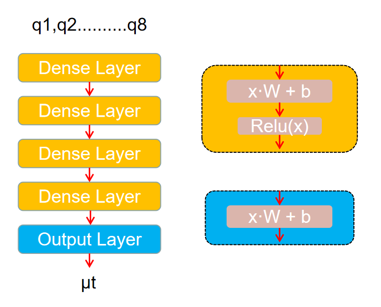</div>

<div align=center>Figure 3. Network Structure</div>

The loss function of the model consists of three parts：$Loss=L_0 + L_1 + L_2$

- $L_0$ imposes a penalty on a negative number so that the predicted value is not less than 0： $L_0=(\overline{\frac{|Pred|-Pred}{2.0}})^2$.

- $L_1$ calculate the mean square error of the predicted value and label.

- $L_2$ is the loss of Reynolds stress near the wall.

### Experimental Result

The batch size of training is 256, and the initial learning rate is 0.001. As the training continues and the error decreases, the learning rate is dynamically reduced. When the training epoch is 300, the error of the training set and validation set tends to be stable, and the error is stable on the order of 1e-5.

#### Generalization Validation under Variable Working Conditions

Based on the shape of M6 wing on the three-dimensional million-scale grid, we validate the variable working conditions such as variable angle of attack, variable Reynolds number and variable Mach number. The average relative error of concentrated force is 2%.
<div align=center>Table 1. Division of Dataset under Variable Working Condition</div>
<div align=center>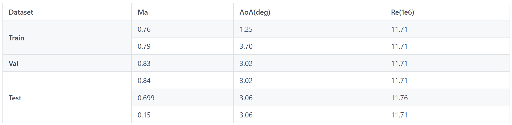</div>

<div align=center>Table 2. Experiment Results under Variable Working Condition</div>
<div align=center>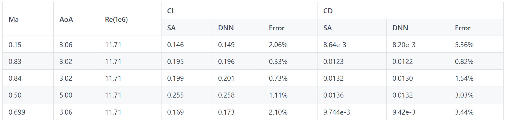</div>

<div align=center>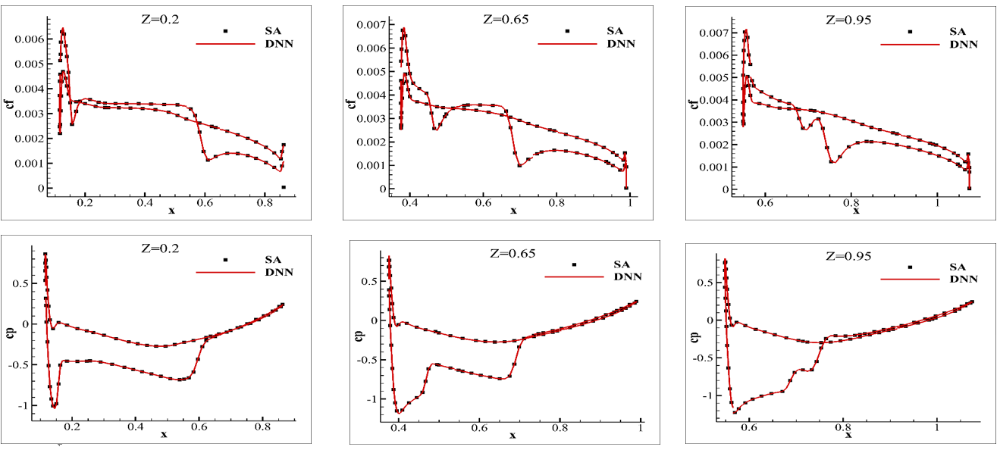</div>

<div align=center>Figure 4. Surface Distribution of Cf and Cp in Different Sections(Ma=0.84,Aoa=3.02°,Re=11.71e6)</div>

<div align=center>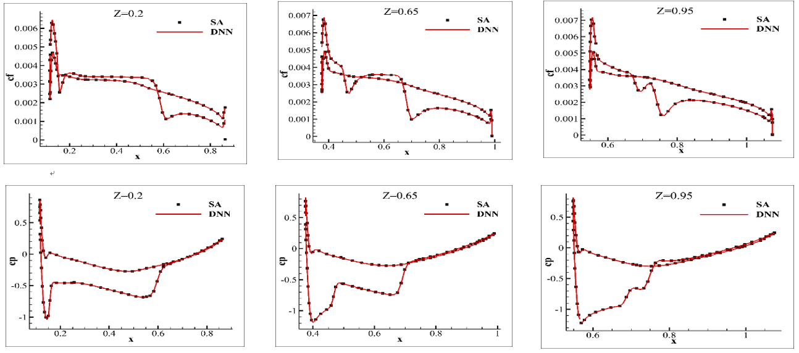</div>

<div align=center>Figure 5. Surface Distribution of Cf and Cp in Different Sections(Ma=0.83,Aoa=3.02°,Re=11.71e6)</div>

#### Generalization Validation under Variable Shape

Based on the shape of M6, DPW-W1, F6 and the like, generalization is performed on the DPW-W2 wing,  and set Ma=0.76, AoA=1.25, Re=5e6.

<div align=center>Table 3. DPW-W2 Wing Generalization Results</div>
<div align=center>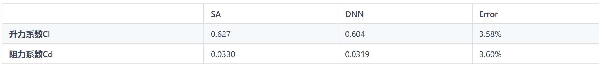</div>

<div align=center>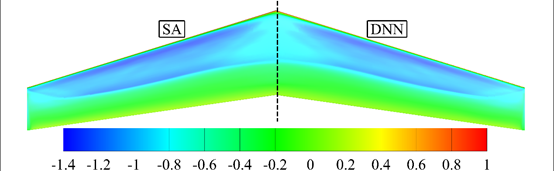</div>

<div align=center>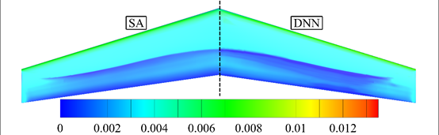</div>

<div align=center>Figure 6. Comparison of DPW-W2 Wing Flow Field Nephograms</div>

<div align=center>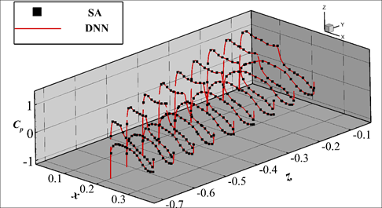</div>

<div align=center>Figure 7. Comparison of DPW-W2 Wing Cp Distribution</div>

<div align=center>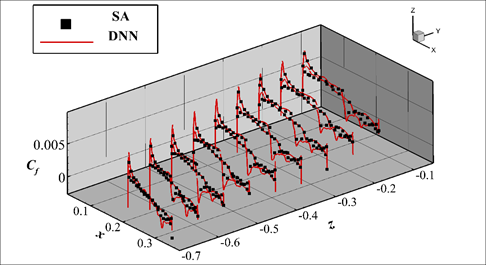</div>

<div align=center>Figure 8. Comparison of DPW-W2 Wing Cf Distribution</div>

## Usage Guide

**Our project only support Ascend now. Please download dataset from *<https://download.mindspore.cn/mindscience/mindflow/dataset/TurbAI/>* and move it to the folder `dataset`.**

### Data Preprocessing

Data is mainly divided into original data and some intermediate data. Most of them are derived from software calculation and simulation results. We need to extract standard structured data from them.

- Mach number, angle of attack, Reynolds number from raw data `data_ori`
- Other features, such as wall distance, XY direction velocity  etc. come from intermediate data `data_mid`
- The output data is listed in `data_std` folder

```shell
python ./dataset/preporcess.py
```

### Dataset Generation

The purpose of this step is to divide the training set, validation set, and test set and save them as `train.txt`、`val.txt`、`test.txt`. Meanwhile the maximum and minimum values and mean variance of features, which  subsequent 2D model and 3D model will use, are generated.
Different datasets are divided according to different experiments. This demo is the dataset division mode of variable working conditions.

```shell
python ./dataset/split_dataset.py
```

### Model Train

For specific parameters of model training and testing, please refer to the configuration file in the `./configs` folder, and you can modify them as you want.

#### Single node Multi-device & Multi-node Multi-device

The simple method of generating a configuration file for single node multi-device is as follows. The value of  `device_num`  can be [0, 1),  [0, 2),  [0, 4),  [4, 8) or [0, 8). In this demo, a single node 8-device configuration file has been generated. In the configuration file, server_id and device_ip are not real data. Please generate the real config  by using following code.

```shell
python ./scripts/hccl_tools.py
 --device_num="[0,8)"
```

Multi-node multi-device configuration needs to be integrated. For details, see the official Mindspore tutorial.：*<https://www.mindspore.cn/tutorials/experts/zh-CN/r2.0/parallel/train_ascend.html>*

#### 2D Network Train

Different features, label normalization modes  and activation functions can be selected for the 2D model. For details, see the comments in `./configs/TurbAI_2D_MLP.yaml`.

```shell
bash ./scripts/run_2d.sh 8 0
```

For details about the parameters, see the script comments.  `run_2d_xpcs.sh` is a example for multi-node multi-device script.

#### 3D Network Train

```shell
bash ./scripts/run_3d.sh 8 0
```

For details about the parameters, see the script comments.  `run_3d_xpcs.sh` is a example for multi-node multi-device script.

### Model Inference

#### 2D Network Inference

The value of activation、feature_norm and label_norm must be the same as that specified during model training. Replace `device_id` and `config_file_path` with the actual path.

```shell
python test_2d.py --device_id=1 --config_file_path="./configs/TurbAI_2D_MLP.yaml"
```

#### 3D Network Inference

```shell
python test_3d.py --device_id=1 --config_file_path="./configs/TurbAI_3D_ResMLP.yaml"
```
