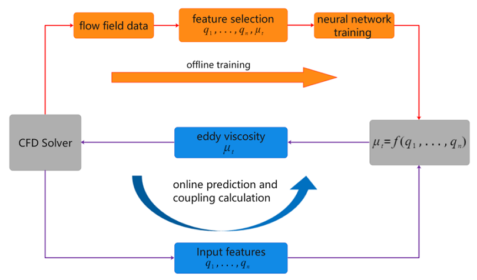
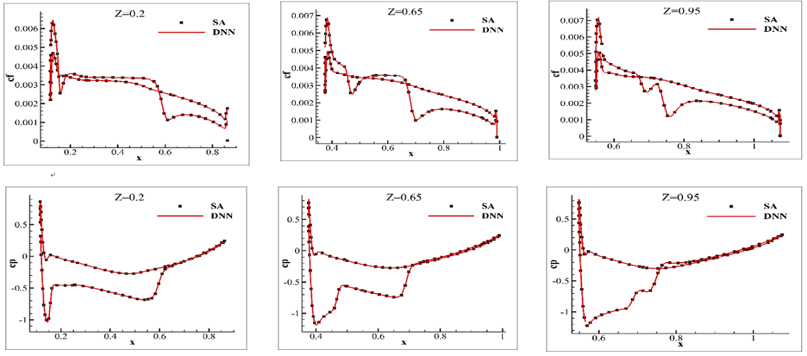
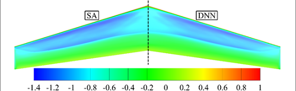
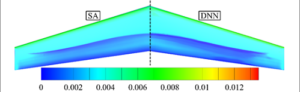
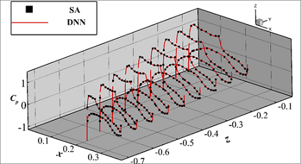

### One、Overview

Turbulence AI model is a high-precision AI simulation model for high Reynolds number problems in aerospace engineering developed based on Ascend AI and supported by the MindSpore fluid simulation suite. A large-scale parallel intelligent turbulence simulation method for large passenger aircraft wing and wing body assembly is established, which greatly improves the calculation efficiency and precision of traditional turbulence simulation method, and the absolute error of flow field precision is less than 5%, which reaches the industrial standard.

This tutorial introduces the research background and technical path of the turbulence AI model, and shows how to train the model through MindFlow. The trained model will be released in Hongshan Community.

### Two、Background introduction

Since Platt proposed boundary layer theory in 1904, turbulence simulation has been studied for more than 100 years, but no essential breakthrough has been made. Although the traditional RANS turbulent closed model has been widely used in aerospace and other engineering fields. However, the prediction ability is relatively accurate only in the flow dominated by small angle of attack and attached flow.

For vortex-dominated and separation-dominated flow problems, such as aircraft maneuvering flight and control rate design at high angles of attack, accurate evaluation of drag and noise of civil aircraft, and aerodynamic thermal and thermal protection design of hypersonic vehicles, there are still no accurate turbulence simulation methods suitable for engineering problems. It must rely on wind tunnel experiments and even flight tests.

However, the DNS simulation of complex turbulent fields still needs more than trillion degrees of freedom. Traditional methods often take several months or even years, which has become an important bottleneck in the development of high-end equipment and faces the double challenges of computing efficiency and precision.

Common turbulence models can be classified according to the number of differential equations employed: zero-equation model, one-equation model, and two-equation model. There are two kinds of zero-equation models, which are C-S model proposed by Cebeci-Smith and B-L model proposed by Baldwin Lomax. The one-equation model can be divided into two types: the S-A model developed from empirical and dimensional analysis for simple flows and the Baldwin Barth model simplified from the two-equation model. Two-equation models widely used include k-e model and k-omega model. In addition, turbulence models also include Reynolds stress models.

In recent years, with the significant improvement of computer computing and storage capabilities, AI technology has been widely applied in multiple fields. For turbulent flow problems, massive turbulent flow field data can be obtained through refined experimental measurement methods and high-resolution numerical simulation methods. By using the powerful computing capabilities of high-performance computers and advanced machine learning techniques to mine and analyze the flow field data, a new paradigm has been provided for building new turbulent flow models and solving accurate simulation problems. Developing turbulent flow AI intelligent models has become a new approach to reducing experimental risks and costs, improving simulation accuracy, and enhancing research and development efficiency.

Based on this, Northwestern Polytechnical University and Huawei jointly developed a turbulence AI model based on MindSpore and Ascend, and verified it on two-dimensional airfoils, three-dimensional wings, and wing-body combinations. The model can achieve efficient and high-precision inference of the flow field when the geometric shape and inflow parameters (angle of attack/Mach number/Reynolds number) change within a certain range. It is bi-directionally coupled with CFD solution software to accurately predict the flow field, pressure/drag distribution, and lift/drag.

### Three、Technical difficulties

The challenges faced by turbulence modeling mainly include the following aspects:

Firstly, **the scale difference of flow field variables caused by high Reynolds number.** From the wall to the outer edge of the boundary layer, the turbulent eddy viscosity evolves from almost zero to several thousand times the laminar viscosity, resulting in a large difference in numerical magnitude. Moreover, due to the large shear strain rate near the wall, higher accuracy is required for the eddy viscosity. However, under the classical mean square error loss function, simply increasing the number of neurons not only has an unclear effect but also easily causes overfitting problems. Therefore, it is not feasible to directly output the eddy viscosity as the model output.

Secondly, **the generalization ability of the model.** The flow in the boundary layer is closely related to the change of Reynolds number, and high Reynolds number means strong nonlinearity between flow field variables. Whether the machine learning model can capture and to what extent the nonlinearity is a key factor affecting the generalization ability. This requires a carefully designed modeling strategy based on the physical laws of the flow and the characteristics of the flow field. In addition, the impact of the constructed and selected model input features and their forms on the generalization ability is also very important.

Finally, **the convergence of the solver and the model after bidirectional coupling.** It is inevitable that the model output will have anomalies and non-smoothness, which will to some extent reduce the convergence of the solver. In addition, the high sensitivity to small changes in input will cause residual oscillations, slow convergence speed, or even divergence.

### Four、Technical Path

As shown in the figure above, the work is divided into two parts: modeling and coupling. The modeling process includes data acquisition, data preprocessing, feature construction and selection, and network training. The coupling process replaces the trained DNN model with the original turbulent model, and couples it to the CFD solver to participate in the iterative process of flow field changes, ultimately obtaining a converged flow field.

**Feature construction and selection：**

In feature construction, physically meaningful features are selected, including X-direction velocity, velocity vorticity norm, entropy, strain rate, wall distance, and transformation formulas, etc., as model inputs. To ensure that the feature construction can be calculated on Ascend, fp32 precision is used for calculation. At the same time, in order to improve the accuracy of the model's prediction of the near-wall region's turbulent viscosity coefficient, the turbulent viscosity coefficient is scaled with respect to the wall distance.

$$trans=e^{\sqrt{\frac{Re^{-0.56}}{dis}}}$$

$$\mu_{T_{trans}} = \mu_T * trans$$

**Model design：**

The full-connected neural network is chosen to predict the eddy viscosity coefficient. The network has four hidden layers, and the number of neurons in each layer is 128, 64, 64, and 64, respectively. The activation function between layers is ReLU, and mixed precision training is enabled during training.

The loss function of the model is as follows：

$$Loss = Lx0 + Lx1 + Lx2$$

$Lx0$ Penalize negative numbers so that the predicted value is not less than 0.：$Lx0 = \overline{{\frac{|Pred|-Pred}{2.0}}^2}$

$Lx1$ Calculate the mean square error of the predicted value and label.

$Lx2$ is the loss of Reynolds stress near the wall

The batch size of training is 256, the initial learning rate is 0.001. As the training continues and the error decreases, the learning rate is dynamically reduced. When the training epoch is 300, the errors of the training set and validation set tend to be stable, and the error stabilizes at the level of 1e-5.

We conducted verification of variable operating conditions and shapes on a three-dimensional mesh with millions of nodes：

Based on the M6 wing profile, verification is carried out under various working conditions such as variable angle of attack, variable Reynolds number, and variable Mach number：

<table>
<tr>
<td>Dataset</td>
<td>Ma</td>
<td>AoA(deg)</td>
<td>Re(1e6)</td>
</tr>
<tr>
<td rowspan="2">train</td>
<td>0.76</td>
<td>1.25</td>
<td>11.71</td>
</tr>
<tr>
<td>0.79</td>
<td>3.70</td>
<td>11.71</td>
</tr>
<tr>
<td>val</td>
<td>0.83</td>
<td>3.02</td>
<td>11.71</td>
</tr>
<tr>
<td rowspan="3">test</td>
<td>0.84</td>
<td>3.02</td>
<td>11.71</td>
</tr>
<tr>
<td>0.699</td>
<td>3.06</td>
<td>11.76</td>
</tr>
<tr>
<td>0.15</td>
<td>3.06</td>
<td>11.71</td>
</tr>
</table>

The average error of concentration is 2%：

<table>
<tr>
<td rowspan="2">Ma</td>
<td rowspan="2">AoA</td>
<td rowspan="2">Re(1e6)</td>
<td colspan="3">CL</td>
<td colspan="2">CD</td>
</tr>
<tr>
<td>SA</td>
<td>DNN</td>
<td>Error</td>
<td>SA</td>
<td>DNN</td>
</tr>
<tr>
<td>0.15</td>
<td>3.06</td>
<td>11.71</td>
<td>1.46e-1</td>
<td>1.49e-1</td>
<td>2.06%</td>
<td>8.64e-3</td>
<td>8.20e-3</td>
</tr>
<tr>
<td>0.83</td>
<td>3.02</td>
<td>11.71</td>
<td>1.95e-1</td>
<td>1.96e-1</td>
<td>0.33%</td>
<td>1.23e-2</td>
<td>1.22e-2</td>
</tr>
<tr>
<td>0.84</td>
<td>3.02</td>
<td>11.71</td>
<td>1.99e-1</td>
<td>2.01e-1</td>
<td>0.73%</td>
<td>1.32e-2</td>
<td>1.30e-2</td>
</tr>
<tr>
<td>0.5</td>
<td>5</td>
<td>11.71</td>
<td>2.55e-1</td>
<td>2.58e-1</td>
<td>1.11%</td>
<td>1.36e-2</td>
<td>1.32e-2</td>
</tr>
<tr>
<td>0.699</td>
<td>3.06</td>
<td>11.71</td>
<td>1.69e-1</td>
<td>1.73e-1</td>
<td>2.10%</td>
<td>9.744e-3</td>
<td>9.42e-3</td>
</tr>
</table>

Ma=0.84 Aoa=3.02°Re=11.71e6（Different cross-sections of cf and cp indicate distribution.）

Ma=0.83 Aoa=3.02°Re=11.71e6（Different cross-sections of cf and cp indicate distribution.）

Based on the training using the shapes of M6, DPW-W1, F6, etc., generalization is performed on the DPW-W2 wing：

Ma=0.76 AoA=1.25 Re=5e6

<table>
<tr>
<td></td>
<td>SA</td>
<td>DNN</td>
<td>Error</td>
</tr>
<tr>
<td>lift coefficient Cl</td>
<td>6.27*$10^{-1}$</td>
<td>6.04*$10^{-1}$</td>
<td>3.58%</td>
</tr>
<tr>
<td>drag coefficient Cd</td>
<td>3.30*$10^{-2}$</td>
<td>3.19*$10^{-2}$</td>
<td>3.60%</td>
</tr>
</table>

