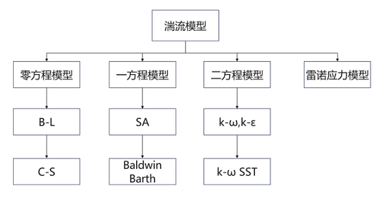
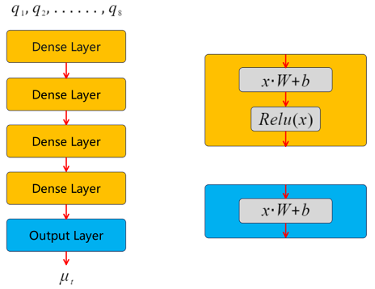
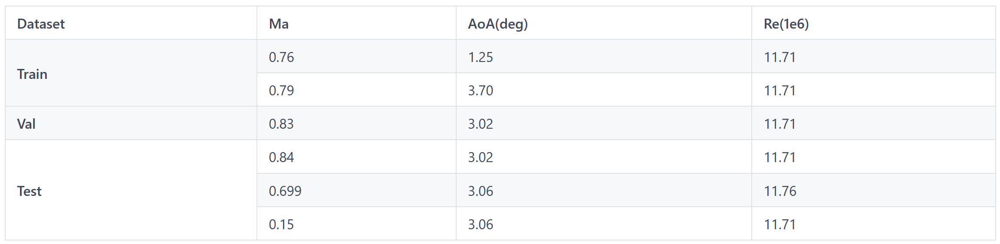
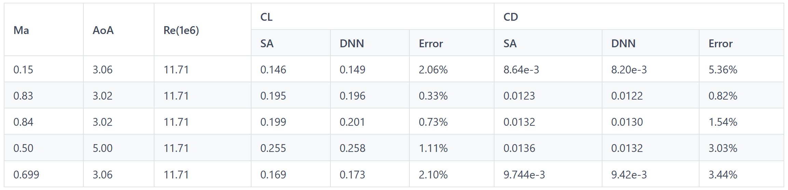
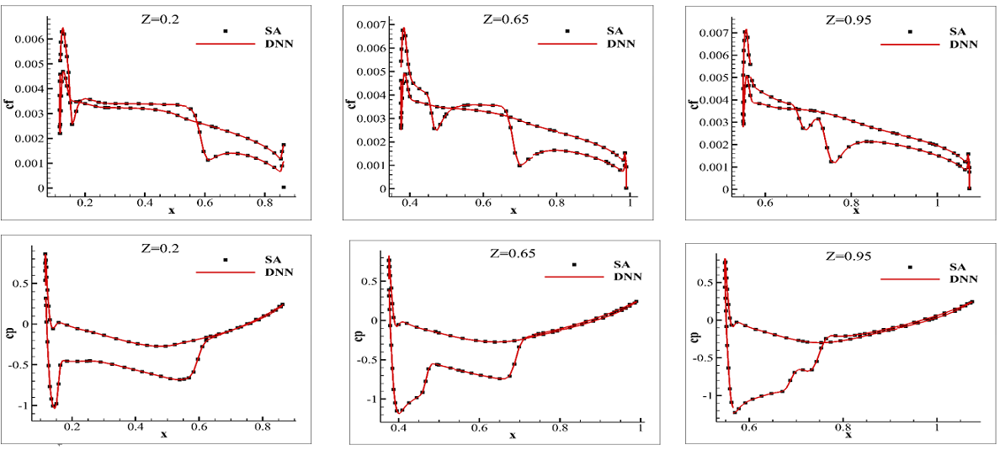
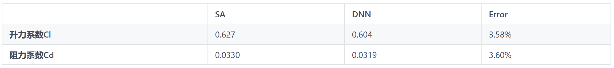
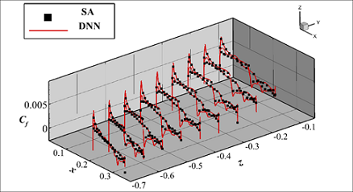

# 湍流AI模型

## 概述

湍流AI模型是基于昇腾AI开发的面向航空航天工程高雷诺数问题的高精度AI仿真模型，并在昇思MindSpore流体仿真套件的支持下，建立了大型客机机翼、翼身组合体等千万网格量级全尺度应用级大规模并行智能化的高效湍流模拟方法，大力提升传统湍流模拟方法的计算效率和计算精度，流场精度绝对误差小于5%，达到工业级标准。

本教程将对湍流AI模型的研究背景、技术路径和使用指南进行介绍，并展示如何通过MindFlow实现该模型的训练，训练好的模型，将在红山社区发布。

## 背景介绍

自1904年普朗特提出边界层理论以来，湍流模拟问题已开展一百多年的研究，然而并未取得本质性的突破。传统的RANS湍流封闭模式虽然已经被广泛应用于航空航天等工程领域，但仅在小攻角、附着流主导的流动中有较准确的预测能力。对于漩涡、分离主导的流动问题，如飞行器大攻角机动飞行与控制率设计、民机阻力与噪声的精准评估以及高超声速飞行器的气动热与热防护设计等仍然没有适用于工程问题的湍流准确模拟方法，必须依赖于风洞实验甚至飞行试验。而对于复杂湍流场的DNS准确模拟，仍需要万亿量级以上的求解自由度，传统方法往往耗时数月甚至上年，这成为了高端装备研制的重要瓶颈，也带来了计算效率和精度的双重挑战。

常用的湍流模型可根据所采用的微分方程数进行分类：零方程模型、一方程模型和两方程模型。零方程模型分为两种，分别是由Cebeci-Smith提出的C-S模型和由Baldwin-Lomax提出的B-L模型。一方程模型分为两种，分别是从经验和量纲分析出发针对简单流动逐步发展的S-A模型和由二方程模型简化而来的Baldwin-Barth模型。应用广泛的二方程模型有k-e模型和k-omega模型。此外，湍流模型还包括雷诺应力模型。

<div align=center></div>

<div align=center>图1.湍流模型分类</div>

近年来，随着计算机运算和存储能力的大幅提升，AI技术已经被广泛应用于多个领域。对于湍流问题，通过精细化实验测量手段和高分辨率数值模拟方法可以得到海量的湍流场大数据，借助高性能计算机强大的运算能力和先进的机器学习技术对流场大数据进行挖掘、分析，为构建湍流新模型、解决湍流准确模拟问题，提供了新的范式。发展湍流AI智能模型，成为降低试验风险和成本，提升仿真精度和研制效率的新思路。

基于此，西工大和华为联合开发了基于昇思MindSpore和昇腾的湍流AI模型，并在二维翼型、三维机翼和翼身组合体上进行了验证，该模型能在几何形状、来流参数（攻角/马赫数/雷诺数）在一定范围发生变化时，实现流场的高效高精度推理，与CFD求解软件双向耦合，精准预测流场、压力/摩阻分布及升/阻力。

## 技术难点

湍流建模所面临的挑战主要包含以下几个方面：

首先是**高** **Re** **数导致的流场变量的尺度差异**。从壁面处到边界层外边缘，湍流涡粘从几乎为零演化到几百上千倍的层流粘性，在数值上存在很大的量级差异。而且由于壁面附近的剪切应变率值很大，因此对涡粘精度的要求更高。然而，在经典的均方差损失函数下，简单的增加神经元的数目不仅效果不明显还容易造成过拟合问题。所以，直接将涡粘作为模型输出是不可行的。

其次是**模型的泛化能力**。边界层内的流动与 Re 数的变化息息相关，高 Re 数意味着流场变量之间的强非线性。机器学习模型能否捕获以及捕获多少程度的非线性是影响泛化能力的关键因素。这需要根据流动的物理规律，在把握流场特性的基础上精心设计巧妙的建模策略。此外，构建和选择的模型输入特征及其形式对泛化能力的影响也十分重要。

最后是**求解器与模型双向耦合后的收敛性**。模型输出的异值和不光滑是在所难免的，在一定程度上会降低求解器的收敛性。另外，对输入微小变化的高敏感性则会造成残值的振荡、收敛速度变慢甚至不收敛。

## 技术路径

<div align=center></div>

<div align=center>图2.AI湍流模型双向耦合方案</div>

如上图，本次工作分为两部分，建模和耦合。建模流程包括数据获取、数据预处理、特征构建和选择以及网络训练。耦合过程则将训练出的DNN模型替换掉原始湍流模型，将其耦合到CFD求解器中参与到流场迭代变化的过程中，最终获取收敛的流场。

### 特征构建及选择

在特征构造上，选取有物理含义的特征，包括X方向速度、速度旋度范数、熵、应变率、壁面距离及变换公式等特征，作为模型输入。为保证在昇腾上可算，将特征构造使用fp32精度计算。同时，为了提升模型对于近壁面区域的涡黏系数预测更准确，将涡黏系数进行关于壁面距离的缩放：
$$
trans=e^{\sqrt{\frac{Re^{-0.56}}{dis}}}
$$

$$
\mu_{T_{trans}} = \mu_T * trans
$$

### 模型设计

选择全连接神经网络来预测涡黏系数，网络共有四个隐藏层每层的神经单元数分别为128、64、64、64，层与层之间的激活函数是ReLU，在训练时开启混合精度训练。

<div align=center></div>

<div align=center>图3.网络结构</div>

模型的损失函数由三部分组成：$Loss=L_0 + L_1 + L_2$

- $L_0$ 对负数进行惩罚，使得预测值不小于0：$L_0=(\overline{\frac{|Pred|-Pred}{2.0}})^2$。

- $L_1$ 计算预测值和Label的均方误差。

- $L_2$ 为近壁面雷诺应力的损失。

### 实验结果

训练的batch size为256，初始学习率为0.001，随着训练持续和误差减小，动态地减少学习率，训练epoch为300时，训练集和验证集误差就趋于稳定，误差稳定在1e-5的数量级上。

#### 变工况泛化性验证

我们基于M6机翼外形在三维百万级网格上，进行了变攻角、变雷诺数、变马赫数等变工况的验证，集中力相对误差平均为2%。

<div align=center>表1.变工况数据集划分</div>
<div align=center></div>

<div align=center>表2.变工况实验结果</div>
<div align=center></div>

<div align=center></div>

<div align=center>图4.不同截面Cf、Cp表面分布图（Ma=0.84，Aoa=3.02°，Re=11.71e6）</div>

<div align=center></div>

<div align=center>图5.不同截面Cf、Cp表面分布图（Ma=0.83，Aoa=3.02°，Re=11.71e6）</div>

#### 变外形泛化性验证

基于M6、DPW-W1、F6等外形进行训练，在DPW-W2机翼上进行泛化，设置Ma=0.76，AoA=1.25，Re=5e6。

<div align=center>表3.DPW-W2机翼泛化结果</div>
<div align=center></div>

<div align=center></div>

<div align=center></div>

<div align=center>图6.DPW-W2机翼流场云图对比</div>

<div align=center></div>

<div align=center>图7.DPW-W2机翼Cp分布对比</div>

<div align=center></div>

<div align=center>图8.DPW-W2机翼Cf分布对比</div>

## 使用指南

**模型训练、推理代码目前只支持Ascend后端。数据集下载请到<https://download.mindspore.cn/mindscience/mindflow/dataset/TurbAI/>* 并将其复制到 `dataset`文件夹下.**

### 数据预处理

数据主要分为原始数据和一部分中间数据，它们大部分来自于软件计算及仿真结果的导出，我们需要从中提取出标准的结构化数据。

- 马赫数、攻角、雷诺数来自于原始数据`data_ori`
- 其他特征如壁面距离、XY方向速度等来自于中间数据`data_mid`
- 输出数据为`data_std`

```shell
python ./dataset/preporcess.py
```

### 数据集生成

该步目的是划分训练集、验证集、测试集，保存为`train.txt`、`val.txt`、`test.txt`，并生成其对应的二维模型下和三维模型下的特征最大最小值、均值方差。
根据不同实验划分成不同的数据集，本demo为变工况的数据集划分方式

```shell
python ./dataset/split_dataset.py
```

### 模型训练

模型训练、测试的具体参数见`./configs`文件夹下配置文件，开发者可自行修改。

#### 单机多卡&多机多卡

单机多卡生成配置文件简易方法如下，device_num可以为[0,1)，[0,2)，[0,4)，[4,8)，[0,8)等。本demo已经生成1个单机八卡的配置文件，其中server_id，device_ip等为非真实数据，应通过如下代码生成机器真实数据。

```shell
python ./scripts/hccl_tools.py --device_num="[0,8)"
```

多机多卡需要整合各个机器配置，具体参考Mindspore官方教程：*<https://www.mindspore.cn/tutorials/experts/zh-CN/r2.0/parallel/train_ascend.html>*

#### 二维网络训练

二维模型可选择不同的特征、标签归一化方式及激活函数，具体值见`./configs/TurbAI_2D_MLP.yaml`中注释。

```shell
bash ./scripts/run_2d.sh 8 0
```

参数见脚本注释，多机多卡可参考run_2d_xpcs.sh

#### 三维网络训练

```shell
bash ./scripts/run_3d.sh 8 0
```

参数见脚本注释，多机多卡可参考`run_3d_xpcs.sh`

### 模型推理

#### 二维网络推理

activation、feature_norm、label_norm需与模型训练时参数保持一致。`device_id`和`config_file_path`应替换为真实的路径。

```shell
python test_2d.py --device_id=1 --config_file_path="./configs/TurbAI_2D_MLP.yaml"
```

#### 三维网络推理

```shell
python test_3d.py --device_id=1 --config_file_path="./configs/TurbAI_3D_ResMLP.yaml"
```
