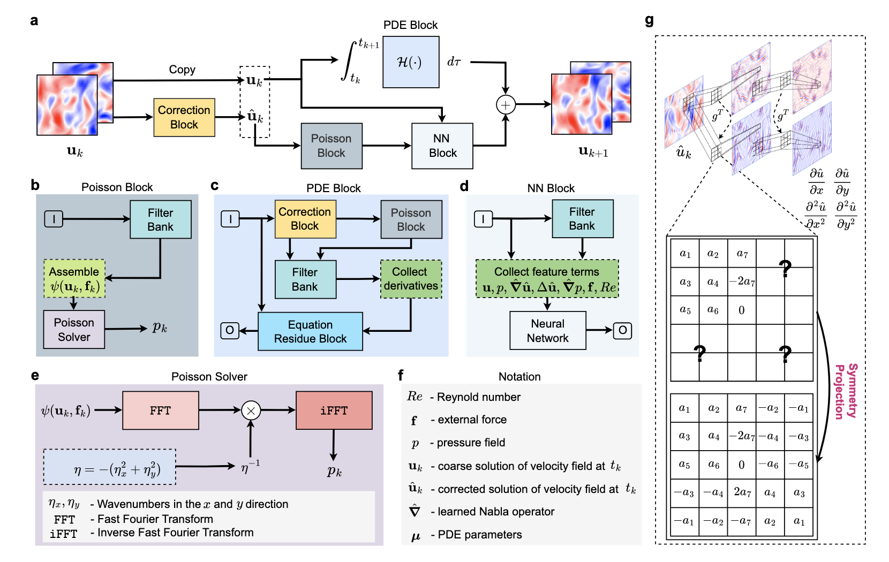

[ENGLISH](README.md) | 简体中文

# P2C2Net求解二维Burgers方程

## 概述

**P2C2Net（PDE-Preserved Coarse Correction Network**是一种新型神经网络架构，旨在在粗网格和有限训练数据条件下高效求解时空偏微分方程（PDE）。其原始论文为 《P2C2Net: PDE-Preserved Coarse Correction Network for Efficient Prediction of Spatiotemporal Dynamics》。

如上图所示，该模型由两个协同模块组成：(1) 可训练的PDE模块：基于高阶数值格式并结合边界条件编码，学习更新粗网格解；(2) 神经网络校正模块：在预测过程中对解进行动态一致的修正。特别地，P2C2Net采用了一种可学习的对称卷积滤波器，其权重在整个模型中共享，可基于神经网络校正后的系统状态精确估计PDE的空间导数。

Burgers 方程是一类非线性偏微分方程，用于描述激波的传播与反射，广泛应用于流体力学、非线性声学、气体动力学等领域。在本项目中，我们重点研究如何利用 P2C2Net 高效求解**二维 Burgers**方程。

## 快速开始

### 1. 数据生成

首先运行以下命令以生成训练和测试数据：

```shell
cd src
python dataGen.py
```

### 2. 训练

运行以下命令在生成的数据上训练 P2C2Net：

```shell
python p2c2net/train_burgers.py --experiment p2c2net
```

其中：

`--experiment` 是实验目录，应包含位于'config/'下的实验配置文件；

`--mode` 是运行模式. 'GRAPH' 表示静态图模式. 'PYNATIVE' 表示动态图模式. 详见[MindSpore官网](https://www.mindspore.cn/docs/zh-CN/r2.0/design/dynamic_graph_and_static_graph.html?highlight=pynative)，默认值'GRAPH'；

`--device_target` 表示所使用的计算平台类型，可选 'Ascend' 或 'GPU'，默认值为 'Ascend'；

`--device_id` 表示所使用的计算卡编号，默认值为 0;

`--continue` 表示是否从已有的检查点恢复训练，默认值为 False;

`--config_filename` 是配置文件的文件名 (位于 `configs/` 目录下) ，其中定义了实验设置，如模型参数、训练参数等，默认值为 'burgers.json';

`--train_stage` 表示是否开启训练模式，默认值为 True;

`--test_stage` 表示是否开启测试模式，默认值为 True;

### 3. 结果

训练完成后，实验输出（检查点和评估结果）将保存在你提供的 --experiment 目录下的 result 文件夹中。可使用保存的检查点进行复现评估或继续训练。

#### 推理结果


## 环境依赖

1. Python>=3.9
2. MindSpore>=2.5

## 贡献者

gitee id：[liuguangyuu](https://gitee.com/liuguangyuu)

email: liuguangyuu@outlook.com