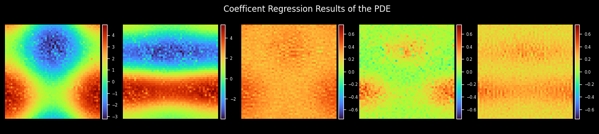
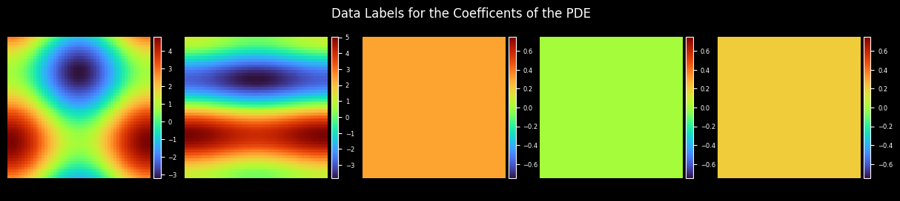

[ENGLISH](README.md) | 简体中文

# PDE-Net求解对流扩散方程

## 概述

PDE-Net是Zichao Long等人提出的一种前馈深度网络用于从数据中学习偏微分方程，同时实现了准确预测复杂系统的动力学特性和揭示潜在的PDE模型。PDE-Net的基本思想是通过学习卷积核(滤波器)来逼近微分算子，并应用神经网络或其他机器学习方法来拟合未知的非线性响应。数值实验表明，即使在噪声环境中，该模型也可以识别被观测的动力学方程，并预测相对较长时间的动态行为。更多信息可参考[PDE-Net: Learning PDEs from Data](https://arxiv.org/abs/1710.09668)。






[详见](./pde_net_CN.ipynb)

## 快速开始

### 训练方式一：在命令行中调用`train.py`脚本

```shell
python train.py --config_file_path ./configs/pde_net.yaml --device_target Ascend --device_id 0 --mode GRAPH
```

其中，

`--config_file_path`表示参数和路径控制文件，默认值'./configs/pde_net.yaml'

`--device_target`表示使用的计算平台类型，可以选择'Ascend'或'GPU'，默认值'Ascend'；

`--device_id`表示使用的计算卡编号，可按照实际情况填写，默认值0；

`--mode`表示运行的模式，'GRAPH'表示静态图模式, 'PYNATIVE'表示动态图模式， 默认值'GRAPH'；

### 训练方式二：运行Jupyter Notebook

您可以使用[中文版](pde_net_CN.ipynb)和[英文版](pde_net.ipynb)Jupyter Notebook逐行运行训练和验证代码。

## 性能

|        参数         |        Ascend               |    GPU       |
|:----------------------:|:--------------------------:|:---------------:|
|     硬件资源         |     Ascend      |      NVIDIA V100 显存32G       |
|     MindSpore版本   |        2.1            |      2.1       |
|        训练损失      |        0.9               |       0.6       |
|        验证损失      |        6e-2               |       4e-2    |
|        速度          |     45ms/epoch        |    150ms/epoch  |

## 贡献者

gitee id：[liulei277](https://gitee.com/liulei277)

email: liulei2770919@163.com