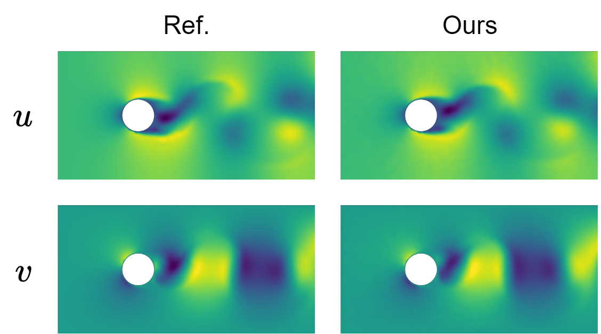

non-uniformly and sparsely observed nodes

# PhyMPGN: Physics-encoded Message Passing Graph Network for spatiotemporal PDE systems

Complex dynamical systems governed by partial differential equations (PDEs) exist in a wide variety of disciplines. Recent progresses have demonstrated grand benefits of data-driven neural-based models for predicting spatiotemporal dynamics.

Physics-encoded Message Passing Graph Network (PhyMPGN) is capable to model spatiotemporal PDE systems on irregular meshes given small training datasets. Specifically:

- A physics-encoded grapph learning model with the message-passing mechanism is proposed, where the temporal marching is realized via a second-order numerical integrator (e.g. Runge-Kutta scheme)
- Considering the universality of diffusion processes in physical phenomena, a learnable Laplace Block is designed, which encodes the discrete Laplace-Beltrami operator
- A novel padding strategy to encode different types of BCs into the learning model is proposed.

Paper link: [https://arxiv.org/abs/2410.01337](https://gitee.com/link?target=https%3A%2F%2Farxiv.org%2Fabs%2F2410.01337)

## Problem Setup

Let's consider complex physical systems, governed by spatiotemporal PDEs in the general form:

$$
\begin{equation}
\dot {\boldsymbol {u}}(\boldsymbol x, t) = \boldsymbol F (t, \boldsymbol x, \boldsymbol u, \nabla \boldsymbol u, \Delta \boldsymbol u, \dots)
\end{equation}
$$

where $\boldsymbol u(\boldsymbol x, y) \in \mathbb{R}^m$ is the vector of state variable with $m$ components，such as velocity, temperature or pressure, defined over the spatiotemporal domain $\{ \boldsymbol x, t \} \in \Omega \times [0, \mathcal{T}]$. Here, $\dot{\boldsymbol u}$ denotes the derivative with respect to time and $\boldsymbol F$ is a nonlinear operator that depends on the current state $\boldsymbol u$ and its spatial derivatives.

We focus on a spatial domain $\Omega$ with non-uniformly and sparsely observed nodes $\{ \boldsymbol x_0, \dots, \boldsymbol x_{N-1} \}$ (e.g., on an unstructured mesh). Observations $\{ \boldsymbol U(t_0), \dots, \boldsymbol U(t_{T-1}) \}$ are collected at time points $t_0, ... \dots, t_{T- 1}$, where $\boldsymbol U(t_i) = \{ \boldsymbol u(\boldsymbol x_0, t_i), \dots, \boldsymbol u (\boldsymbol x_{N-1}, t_i) \}$ denote the physical quantities. Considering that many physical phenomena involve diffusion processes, we assume the diffusion term in the PDE is known as a priori knowledge. Our goal is to develop a graph learning model with small training datasets capable of accurately predicting various spatiotemporal dynamics on coarse unstructured meshes, handling different types of BCs, and producing the trajectory of dynamics for an arbitrarily given IC.

## Model Architecture


For Equation (1), a second-order Runge-Kutta (RK2) scheme can be used for discretization:

$$
\begin{equation}
\boldsymbol u^{k+1} = \boldsymbol u^k + \frac{1}{2}(\boldsymbol g_1 + \boldsymbol g_2); \quad \boldsymbol g_1 = \boldsymbol F(t^k, \boldsymbol x, \boldsymbol u^k, \dots); \quad \boldsymbol g_2 = \boldsymbol F(t^{k+1}, \boldsymbol x, \boldsymbol u^k + \delta t \boldsymbol g_1, \dots)
\end{equation}
$$

where $\boldsymbol u^k$ is the state variable at time $t^k$，and $\delta t$ denotes the time interval between $t^k$ and $t^{k+1}$. According to the Equation (2), we develop a GNN to learn the nonlinear operator $\boldsymbol F$.

As shown in Figure, the NN block aims to learn the nonlinear operator $\boldsymbol F$ and consists of two parts: a GNN block followed the Encode-Process-Decode module and a learnable Laplace block. Due to the universality of diffusion processes in physical phenomena, we design the learnable Laplace block, which encodes the discrete Laplace-Beltrami operator, to learn the increment caused by the diffusion term in the PDE, while the GNN block is responsible to learn the increment induced by other unknown mechanisms or sources.

## Requirements

- python 3.11
- mindspore 2.5.0
- numpy 1.26

## Dataset

This [dataset](https://download-mindspore.osinfra.cn/mindscience/mindflow/dataset/applications/data_mechanism_fusion/PhyMPGN/) contains simulation data for cylinder flow, stored in HDF5 format, including geometric structures, fluid properties, and flow dynamics information. After downloading, please save it in the `data/2d_cf` directory. The dataset is divided into training and test sets:

- **Training set** : `train_cf_4x2000x1598x2.h5` contains 4 trajectories.
- **Test set** : `test_cf_9x2000x1598x2.h5` contains 9 trajectories.

### Data Format

Each HDF5 file contains the following attributes and datasets:

- `f.attrs['x_c']`, `f.attrs['y_c']`: **Float**, coordinates of the cylinder center.
- `f.attrs['r']`: **Float**, radius of the cylinder.
- `f.attrs['x_l']`, `f.attrs['x_r']`, `f.attrs['y_b']`, `f.attrs['y_t']`: **Float**, boundaries of the computational domain.
- `f.attrs['mu']`: **Float**, fluid viscosity.
- `f.attrs['rho']`: **Float**, fluid density.
- `f['pos']`: **(n, 2)**, positions of the observation nodes.
- `f['mesh']`: **(n_tri, 3)**, triangular mesh of the observation nodes.
- `g = f['node_type']`: Node type information.
    - `g['inlet']`: **(n_inlet,)**, indices of inlet boundary nodes.
    - `g['cylinder']`: **(n_cylinder,)**, indices of cylinder boundary nodes.
    - `g['outlet']`: **(n_outlet,)**, indices of outlet boundary nodes.
    - `g['inner']`: **(n_inner,)**, indices of inner domain nodes.
- `g = f[i]`: The i-th trajectory.
    - `g['U']`: **(t, n, 2)**, velocity states.
    - `g['dt']`: **Float**, time interval between steps.
    - `g['u_m']`: **Float**, inlet velocity.

## Usage

The `yamls/train.yaml` file serves as the configuration file for the project, including settings for dataset size, model parameters, and paths for logging and weight saving.

**Traing**

```python
python main.py --config_file_path yamls/train.yaml --train
```

**Testing**

```python
python main.py --config_file_path yamls/train.yaml
```

## Visualization of results

$Re=480$



## Performance

| Parameter                             | Ascend                         |
| ------------------------------------- | ------------------------------ |
| Hardware Resources                    | NPU 32G                        |
| Framework Version                     | Minspore 2.5.0                 |
| Dataset                               | Cylinder flow                  |
| Model Parameters                      | 950k                           |
| Training Configuration                | batch_size=4,<br />epochs=1600 |
| Training Loss<br />(MSE)              |                                |
| Inference Loss<br />(MSE)             |                                |
| Training Speed<br />(s / epoch)       | 420 s                          |
| Inference Speed<br />(s / trajectory) | 174 s                          |
