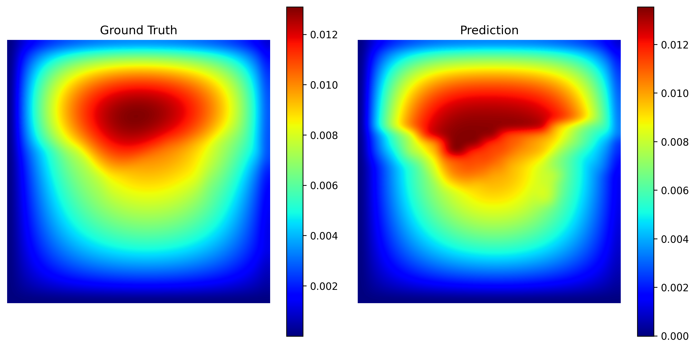

# Transolver求解二维Darcy Flow方程

## 背景简介

### 概述

在科学计算与工程仿真中，求解偏微分方程（PDE）通常面临几何形状复杂和计算成本高昂的挑战。传统的数值方法（如FEM、FDM）依赖于高质量的网格划分，且每次求解新工况都需要重新计算。

Transolver 是基于 Transformer 架构设计的通用算子学习模型，旨在解决复杂几何上的物理场预测问题。它通过引入物理感知的注意力机制（Physics-Augmented Attention），能够高效地处理结构化与非结构化网格数据。本教程展示了 Transolver 在 **Darcy Flow**（多孔介质流动）问题上的应用，利用 Structured Mesh 架构实现对流场压力的快速预测。

更多信息可参考论文：[Transolver: A Fast Transformer Solver for PDEs on General Geometries](https://arxiv.org/abs/2402.02366)。

### Transolver 模型架构

Transolver 的核心在于通过 Learned Slice Integration 将物理域离散化为一系列切片（Slices），并在这些切片上利用 Transformer 强大的全局建模能力捕捉物理规律。

对于 Darcy Flow 2D 任务，我们采用了基于结构化网格的 Transolver 变体，其流程如下：

1. **Embedding**: 将输入的渗透率场（Permeability）映射到高维特征空间。

2. **Transolver Block**: 堆叠多层物理注意力模块，提取全局与局部特征。

3. **Decoding**: 将特征解码回物理空间，输出压力场（Pressure）。

### Darcy Flow 方程

Darcy Flow 方程描述了流体在多孔介质中的稳态流动，其二维形式的控制方程如下：

$$
-\nabla \cdot (a(x) \nabla u(x)) = f(x), \quad x \in (0,1)^2
$$

$$
u(x) = 0, \quad x \in \partial \Omega
$$

其中：

- $a(x)$ 表示介质的渗透率系数（输入）。
- $u(x)$ 表示流体的压力头（待求解的输出）。
- $f(x)$ 为源项（本案例中设为常数）。
- $\nabla$ 为梯度算子。

本案例的目标是学习映射算子 $a(x) \mapsto u(x)$。

## 模型实现

### 硬件要求

- 硬件：Ascend AI 处理器
- 显存：> 16G

### MindSpore和MindScience版本关系

- MindSpore >= 2.0.0
- MindScience == 0.8.0

### 数据集

本案例使用经典的 Darcy Flow 2D 数据集。

- **输入分辨率**：原始数据为 $421 \times 421$，本案例通过下采样至 $32 \times 32$ 进行训练和推理。
- **数据预处理**：使用了 **GaussianNormalizer** 对输入和标签进行标准化处理（均值0，方差1），以加速模型收敛。

### 编码

#### 训练方式：在命令行中调用 `exp_darcy.py` 脚本

```shell
# 假设位于 transolver 目录下
python exp_darcy.py --mode GRAPH --device_target Ascend --device_id 0 --epochs 500
```

其中：

- `--mode`：运行模式，'GRAPH' 表示静态图模式（推荐），'PYNATIVE' 表示动态图模式。
- `--device_target`：计算平台，默认 'Ascend'。
- `--device_id`：设备编号。

## 实验结果

我们在 Ascend NPU 上训练了 500 个 Epoch。下图展示了测试集中的一个样本，对比了模型预测值（Prediction）与真实值（Label）。可以看到，Transolver 能够精确地重建流场的细节。



### 性能

| 参数 | Ascend | 备注 |
| :--- | :--- | :--- |
| **硬件资源** | Ascend 910 | |
| **MindSpore版本** | 2.x | |
| **模型配置** | Layers=4, Hidden=64, Ref=8 | 符合论文轻量化配置 |
| **训练参数** | batch_size=8, epochs=500 | |
| **优化器** | AdamWeightDecay | LR=1e-3 (Cosine Decay) |
| **训练损失 (MSE)** | **0.1507** | 归一化尺度 (Normalized Scale) |
| **验证损失 (RMSE)** | **4.20e-04** | 物理真实尺度 (Physical Scale) |
| **推理速度** | **~24 ms/step** | Batch Size = 8 |

> **说明**：
>
> 1. 训练损失 (MSE) 是在归一化数据（Gaussian Distribution）上计算的，用于监控收敛趋势。
> 2. 验证损失 (RMSE) 是在反归一化后的物理数值上计算的，代表真实的物理误差。
> 3. 采用余弦退火（Cosine Decay）策略训练 500 Epoch，模型收敛更充分，精度相比基准提升约 11%。

## 许可证

- 开源协议：Apache License 2.0
- 许可证链接：[LICENSE](https://gitee.com/mindspore/mindscience/blob/master/MindFlow/LICENSE)

## 联系我们

如果您对 MindSpore MindScience 有任何建议，请通过 [Issue](https://gitee.com/mindspore/mindscience/issues) 与我们联系。
