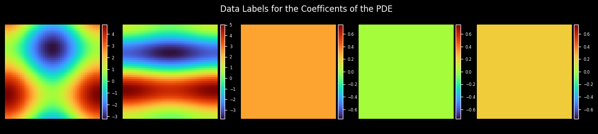
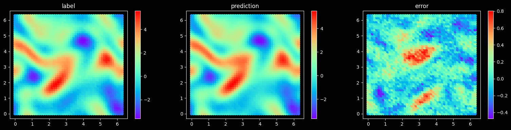
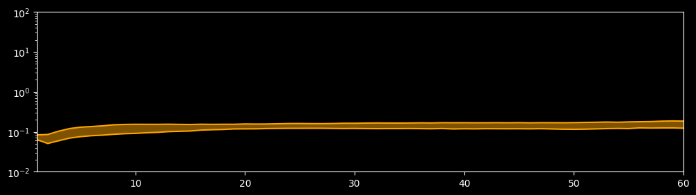

[ENGLISH](README.md) | 简体中文

# PDE-Net求解对流扩散方程

## 概述

PDE-Net是Zichao Long等人提出的一种前馈深度网络用于从数据中学习偏微分方程，同时实现了准确预测复杂系统的动力学特性和揭示潜在的PDE模型。PDE-Net的基本思想是通过学习卷积核(滤波器)来逼近微分算子，并应用神经网络或其他机器学习方法来拟合未知的非线性响应。数值实验表明，即使在噪声环境中，该模型也可以识别被观测的动力学方程，并预测相对较长时间的动态行为。更多信息可参考[PDE-Net: Learning PDEs from Data](https://arxiv.org/abs/1710.09668)。

[详见](https://gitee.com/mindspore/mindscience/blob/r0.2.0/MindFlow/applications/data_mechanism_fusion/variant_linear_coe_pde_net/pde_net_CN.ipynb)

## 贡献者

liulei277