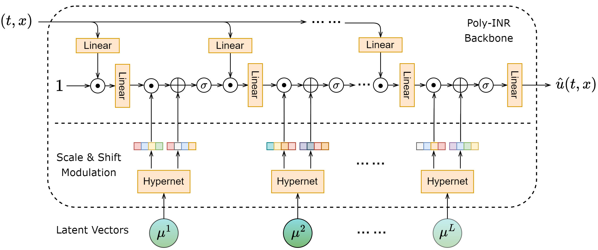

[ENGLISH](README.md) | 简体中文

# PDEformer-1: 面向一维 PDE 的基础模型

[](https://www.bilibili.com/video/BV1wm411C7Sq)

## 概述

### 问题描述

偏微分方程（PDEs）的变化与一系列广泛的物理现象和工程应用有关，如机翼设计、电磁场模拟、应力分析等。这些实际的工程应用均需要多次调用求解 PDE。
尽管传统的 PDE 求解方法通常表现出较高的准确性，但往往需要大量的计算资源和时间，且难以针对所有 PDE 形式设计统一的求解器。
近年来，神经算子（Neural Operator）方法使用神经网络学习大量 PDE 解的数据来近似 PDE 的解算子，极大地提高了 PDE 正问题的求解速度，同时训练得到的神经网络模型也可以作为可微分的 surrogate model 来处理反问题。
然而，目前的神经算子方法仍难以对新的 PDE 形式泛化，针对新 PDE 进行训练往往也会遇到训练代价高和数据获取难的问题。

针对以上问题，我们提出了 PDEformer 模型，这是一种可以直接输入任意 PDE 形式的神经算子模型。
经过在大规模的一维 PDE 数据上进行训练，PDEformer 模型已经能够快速准确地求解任意形式的一维 PDE 正问题，且在训练数据分布内 zero-shot 预测精度高于针对某一种方程专门进行训练的专家模型（如 FNO、DeepONet）。
PDEformer 针对方程系数分布内的新问题无需重新训练，对于方程系数分布外的情形则可以通过少量数据 finetune 的 few-shot learning 快速泛化到下游任务。
与此同时，我们还可以直接将 PDEformer 运用到反问题的求解中。
通过进一步增大数据集规模，PDEformer 有望成为解决各种 PDE 问题的基础模型，推动科学研究和工程应用的发展。

## 技术路径

我们考虑定义在 $(t,x)\in[0,1]\times[-1,1]$ 上的一维含时偏微分方程（PDEs），其一般形式为

$$ \mathcal{F}(u_1,u_2,\dots,c_1,c_2,\dots,s_1(x),s_2(x),\dots)=0,$$

其中 $c_1,c_2,\dots \in \mathbb{R}$ 是实值系数，$s_1(x),s_2(x)\dots$ 是标量函数（在方程中可作为初始条件、系数场等），$u_1,u_2,\dots$ 为待求解的物理场的各个分量。
在这里，我们假设算子 $\mathcal{F}$ 具有符号表达式，其中可能涉及微分和代数运算。
PDEformer 的目标是构建一个方程解的 surrogate model，形式为 $(\mathcal{F},c_1,c_2,\dots,s_1(x),s_2(x),\dots)\mapsto (u_1,u_2,\dots)$，
它将 PDE 的符号形式 $\mathcal{F}$ 及其中涉及的数值信息 $c_1,c_2,\dots,s_1(x),s_2(x),\dots$ 作为输入，输出相应方程的预测解 $u_1,u_2,\dots$。
以具有周期边界条件的对流方程（单分量）$u_t+cu_x=0$，$u(0,x)=g(x)$ 为例：


### 构建 PDE 计算图

首先，我们将$\mathcal{F}$（关于待求解 PDE 形式的符号信息）表示为计算图。
在这个计算图中，一个节点可以代表一个未知场分量（用 `UF` 表示）、标量系数（`SC`）、系数场（`CF`）、初始条件（`IC`），以及微分或代数运算，一条有向边则用于指定参与运算的操作数。
这构成了一个具有异构节点和同构边的有向无环图（DAG）。

然后，为了体现 PDE 中涉及的数值信息，我们为图中的每个节点赋予一个 $d_e$ 维的输入特征。
对于一个标量系数 $c$，我们将它的数值输入一个标量编码器（scalar encoder），将编码器给出的 $d_e$ 维的输出作为相应 `SC` 节点的输入特征。
考虑到标量函数 $s(x)$ 包含的信息相对更为丰富，我们为每个这样的标量函数引入 $N$ 个新的“分支”节点（类型为 $\mathtt{b}_1,\mathtt{b}_2,\dots,\mathtt{b}_N$），用这 $N$ 个节点的输入特征表示 $s(x)$ 所包含的数值信息。
具体地说，我们使用一个函数编码器（function encoder），其输入为一系列散点 $\{(x_i,s(x_i))\}$（散点的位置与分布可任意选取），而输出的 $d_eN$ 维向量被用于给出 $N$ 个分支节点的输入特征。
图中的这些分支节点与 $s(x)$ 所对应的 `IC` 或 `CF` 节点之间有相连的边。
所有剩余节点的输入特征都设为零（为简化编程实现，实际上是标量编码器接收零输入时的对应输出）。

此外，我们还为每个待求解的场分量引入了 $L$ 个额外节点（类型为 $\mathtt{m}_1,\mathtt{m}_2,\dots,\mathtt{m}_L$），并将它们与相应的 `UF` 节点连接起来。
后续使用 graph Transformer 处理图数据时，关于这一场分量的预测解的信息将被汇总到这些新节点所对应的嵌入向量当中。

更多实现细节以及 PDE 计算图的实例请参考 [docs/PDE_DAG_CN.md](docs/PDE_DAG_CN.md)。

### 编码图数据

上一步获得的图数据包含了 PDE 涉及的符号与数值信息。
我们将融合图数据中这些信息，并为每个待求解的场分量 $u_j$ 生成一个表征解的隐编码

$$\pmb{\mu}_j = [{\mu}^1_j, \dots, {\mu}^L_j]^{\mathrm{T}} \in {\mathbb{R}}^{L \times d_e}.$$

该融合过程使用了 graph Transformer，其是一类功能强大的、基于 Transformer 的图神经网络，擅长捕捉和表达复杂的图结构信息。
在具体实现时，我们采用了 [Graphormer](https://proceedings.neurips.cc/paper/2021/hash/f1c1592588411002af340cbaedd6fc33-Abstract.html) 架构，并针对 PDE 编码这一场景做了一些适配调整。
Graph Transformer 输出层中类型为 $\mathtt{m}_\ell$（且与 $u_j$ 对应）节点对应的嵌入向量记为 $\mu_j^\ell\in\mathbb{R}^{d_e}$，它将在下一步中参与“调制”INR 中的第 $\ell$ 个隐藏层，以生成最终的预测解。

### 解码获得 PDE 的预测解

我们采用 INR（隐式神经表示）方式来表示方程解的各个分量。
这一网络以时空坐标 $(t,x)$ 作为输入，并根据隐编码 $\pmb{\mu}_j$ 来预测出相应的方程解分量在该坐标点的取值 $\hat u_j(t,x)$。
通过这种方式给出的预测不依赖于特定的离散网格。
在具体实现时，我们选用了 Poly-INR 架构，并做了相应的适配（见下图）。
Poly-INR 的隐层数目为 $L$，其中第 $\ell$ 个隐层的激活值将被 $\mu_j^\ell$“调制”。
注意 PDE 中的所有的分量共享同一套 INR 的参数，它们仅仅是对应的隐编码 $\pmb{\mu}_j$ 有所不同。



## 安装

首先确保 MindSpore 已成功安装，见 [安装教程](https://www.mindspore.cn/install)。
其他依赖库可以通过如下命令安装：

```bash
pip3 install -r pip-requirements.txt
```

## 文件目录结构

```text
./
│  inverse_function.py                           # 反问题代码，PDE 中的函数（源项、波方程速度场）
│  inverse_scalar.py                             # 反问题代码，PDE 中的标量（方程系数）
│  PDEformer_inference.ipynb                     # 英文版模型预测交互式 notebook
│  PDEformer_inference_CN.ipynb                  # 中文版模型预测交互式 notebook
│  pip-requirements.txt                          # 模型依赖库
│  preprocess_data.py                            # 预处理数据、并将结果保存到新建的辅助数据文件中
│  README.md                                     # 英文版说明文档
│  README_CN.md                                  # 中文版说明文档
│  train.py                                      # 模型训练代码
├─configs                                        # 配置文件目录
│  │  full_config_example.yaml                   # 完整配置文件示例，包含了所有可能的选项
│  ├─baseline                                    # Baseline 模型配置
│  │      advection-beta-0.1_fno.yaml            # FNO 在 Advection beta=0.1 数据集上训练
│  │      burgers-nu-0.1_deeponet.yaml           # DeepONet 在 Burgers nu=0.1 数据集上训练
│  │      reacdiff-nu-1.0-rho-1.0_unet.yaml      # U-Net 在 reaction-diffusion nu=1.0 rho=1.0 数据集上训练
│  ├─finetune                                    # 微调模型训练配置
│  │      burgers-nu-0.1_pdeformer-L.yaml        # 加载预训练的 L 规模 PDEformer 在 Burgers nu=0.1 数据上微调
│  ├─inference                                   # 加载预训练的模型参数用于推理
│  │      pdeformer-L.yaml                       # 加载预训练的 L 规模 PDEformer 用于推理
│  │      pdeformer-M.yaml                       # 加载预训练的 M 规模 PDEformer 用于推理
│  │      pdeformer-XL.yaml                      # 加载预训练的 XL 规模 PDEformer 用于推理
│  ├─inverse                                     # 预训练模型反问题测试配置
│  │      inverse_function.yaml                  # 反演函数（源项、波方程波速场）配置
│  │      inverse_scalar.yaml                    # 反演方程标量系数
│  └─pretrain                                    # 预训练模型训练配置
│         pdeformer-L.yaml                       # L 规模模型训练配置
│         pdeformer-M.yaml                       # M 规模模型训练配置
│         pdeformer-S.yaml                       # S 规模模型训练配置
│         pdeformer-XL.yaml                      # XL 规模模型训练配置
├─docs                                           # 附加说明文档
│      DATASET.md                                # 数据集说明文档（英文）
│      DATASET_CN.md                             # 数据集说明文档（中文）
│      PDE_DAG.md                                # PDE 计算图说明文档（英文）
│      PDE_DAG_CN.md                             # PDE 计算图说明文档（中文）
├─images                                         # 保存 readme 中的图片
├─scripts                                        # 用于拉起训练、微调、反问题的 shell 脚本
│      run_distributed_train.sh                  # 用于分布式训练的 shell 脚本
│      run_inverse_function.sh                   # 用于求解反演函数的 shell 脚本
│      run_inverse_scalar.sh                     # 用于求解反演标量的 shell 脚本
│      run_standalone_train.sh                   # 用于单卡训练的 shell 脚本
├─data_generation                                # 训练所用的自定义数据集生成
│      common.py                                 # 通用组件
│      custom_multi_component.py                 # 多分量方程数据生成主文件
│      custom_sinus.py                           # 带三角函数项方程数据生成主文件
│      custom_wave.py                            # 波方程数据生成主文件
│      inverse_sinus.py                          # 带三角函数项方程反问题数据生成主文件
│      inverse_wave.py                           # 波方程反问题数据生成主文件
│      README.md                                 # 数据集生成说明文档（英文）
│      README_CN.md                              # 数据集生成说明文档（中文）
└─src                                            # 基础代码目录
    │  inference.py                              # 用于针对自定义 PDE 生成预测解
    ├─cell                                       # 模型架构相关的代码
    │  │  basic_block.py                         # 基本单元模块
    │  ├─baseline                                # Baseline 模型架构
    │  │      check_func.py                      # 函数入参检查
    │  │      deeponet.py                        # DeepONet 网络架构
    │  │      dft.py                             # 离散傅里叶变换模块
    │  │      fno2d.py                           # 二维 FNO 网络架构
    │  │      unet2d.py                          # 二维 UNet 网络架构
    │  └─pdeformer                               # PDEFormer 模型架构
    │      │  function_encoder.py                # 函数编码器模块
    │      │  pdeformer.py                       # PDEFormer 网络架构
    │      ├─graphormer                          # Graphormer 网络架构
    │      │      graphormer_encoder.py          # 编码器模块
    │      │      graphormer_encoder_layer.py    # 层级信息模块
    │      │      graphormer_layer.py            # 编码节点自身信息、节点连通信息模块
    │      │      multihead_attention.py         # 多头注意力模块
    │      └─inr_with_hypernet                   # INR + HyperNet 模型架构
    │              mfn.py                        # MFN + HyperNet 模块
    │              siren.py                      # Siren + HyperNet 模块
    │              poly_inr.py                   # Poly-INR + HyperNet 模块
    ├─core                                       # 网络训练核心模块
    │      losses.py                             # 损失函数模块
    │      lr_scheduler.py                       # 学习率衰减模块
    │      metric.py                             # 评估指标模块
    │      optimizer.py                          # 优化器模块
    ├─data                                       # 数据加载代码
    │      env.py                                # 已稳定、不宜放在 config.yaml 中的一系列配置，如整形、浮点型数据精度，以及各种常量、开关
    |      load_data.py                          # 不同数据集加载的封装函数
    │      load_inverse_data.py                  # 反问题数据加载
    │      load_multi_pde.py                     # 同时包含多种方程形式的数据集加载（正问题）
    │      load_single_pde.py                    # 只包含单一方程形式的数据集加载（正问题）
    │      pde_dag.py                            # 根据 PDE 形式生成有向无环图及相应图数据的通用模块
    │      utils_multi_pde.py                    # 同时包含多种方程形式的数据集相关组件（DAG 构建、PDE 形式生成等）
    │      utils_dataload.py                     # 不同数据集加载的通用模块
    └─utils                                      # 记录实验结果可视化的代码
            load_yaml.py                         # 读取 yaml 配置文件的工具函数
            record.py                            # 记录实验结果的工具函数
            tools.py                             # 其他工具函数
            visual.py                            # 可视化工具函数
```

## 模型运行

我们在 [configs/pretrain](configs/pretrain) 文件夹下提供了不同参数量的 PDEformer 模型的配置文件。对应的经过预训练的 PDEformer 权重，可以在 [北大网盘](https://disk.pku.edu.cn/anyshare/zh-cn/link/AA6ABF7FEB034446069108D0B6B3920C35/768396ABFD014CF8B81FA886E6577D23/44E9E35239854ED8817718DFCCEA3B4D/C62E2F6D95624A79AB80EBD0AD9A7C1A) `pdeformer/ckpt` 下载。具体如下表所示：
| 模型 | 参数量 | 配置文件 | 预训练权重文件 |
| ---- | ---- | ---- | ---- |
| PDEformer-S | 3.60M | [configs/pretrain/pdeformer-S.yaml](configs/pretrain/pdeformer-S.yaml) | - |
| PDEformer-M | 6.92M |[configs/pretrain/pdeformer-M.yaml](configs/pretrain/pdeformer-M.yaml) | model-M_3M_pretrained.ckpt |
| PDEformer-L | 22.40M |[configs/pretrain/pdeformer-L.yaml](configs/pretrain/pdeformer-L.yaml) | model-L_3M_pretrained.ckpt |
| PDEformer-XL | 58.24M |[configs/pretrain/pdeformer-XL.yaml](configs/pretrain/pdeformer-XL.yaml) | model-XL_3M_pretrained.ckpt |

### 推理示例

下面的示例代码展示了如何使用 PDEformer 预测给定 PDE 的解，以无粘 Burgers 方程（周期边界）为例。
运行前需要先从 [北大网盘](https://disk.pku.edu.cn/anyshare/zh-cn/link/AA6ABF7FEB034446069108D0B6B3920C35/768396ABFD014CF8B81FA886E6577D23/44E9E35239854ED8817718DFCCEA3B4D/C62E2F6D95624A79AB80EBD0AD9A7C1A)  下载经过预训练的 PDEformer 权重 `pdeformer/ckpt/model-L_3M_pretrained.ckpt`，并将 [configs/inference/pdeformer-L.yaml](configs/inference/pdeformer-L.yaml) 中 `model/load_ckpt` 参数的值改为相应的权重文件路径。

```python
import numpy as np
import matplotlib.pyplot as plt
from mindspore import context
from mindspore import dtype as mstype
from src import load_config, get_model, PDENodesCollector, inference_pde

# 基本设定
context.set_context(mode=context.PYNATIVE_MODE, device_target="CPU")
config, _ = load_config("configs/inference/pdeformer-L.yaml")
model = get_model(config, compute_type=mstype.float32)

# 定义时空坐标点
x_coord = np.linspace(-1, 1, 257)[:-1]
t_coord = np.linspace(0, 1, 101)

# 指定待求解的 PDE
pde = PDENodesCollector()
u = pde.new_uf()
pde.set_ic(u, x_coord, np.sin(np.pi * x_coord))
pde.sum_eq0(pde.dt(u), pde.dx(0.5 * pde.square(u)))

# 使用 PDEformer 预测解并绘图
pde_dag = pde.gen_dag(config)
u_pred = inference_pde(model, pde_dag, t_coord, x_coord)
plt.imshow(u_pred)
plt.show()
```

更多的示例见 [PDEformer_inference_CN.ipynb](PDEformer_inference_CN.ipynb)。

### 预训练

#### 准备预训练数据集

为了有效地预训练模型，首要任务是准备预训练数据。
我们采用传统的（谱方法）数值求解器 [Dedalus](https://dedalus-project.org/) 来生成这些预训练数据。
预训练数据集由以下形式的（单分量）PDE 的解构成：

$$
\begin{split}
u_t+f_0(u)+s(x)+(f_1(u)-\kappa(x)u_x)_x&=0 , \quad (t,x) \in [0,1] \times [-1,1], \\
u(0,x) &= g(x), \quad x \in [-1,1]
\end{split}
$$

其中 $f_i(u) = c_{i1}u+c_{i2}u^2+c_{i3}u^3$，$i=0,1$。
每个系数 $c_{ik}$ 以概率 $0.5$ 被设为零（从而相应的项不会出现在 PDE 的计算图中），其他情况下从 $U([-3,3])$ 中随机抽取。
系数场 $s(x),\kappa(x)$ 以一定概率取为（无空间依赖）随机常数或零，其中 $\kappa(x)$ 的取值范围为 $[10^{-3},1]$。
初始条件 $g(x)$、非常数源项 $s(x)$ 的生成方式与 [PDEBench 数据集](https://arxiv.org/abs/2210.07182) 的初始条件生成方式相同。
对于非周期边界情形，边界条件种类从 Dirichlet、Neumann 和 Robin 中随机选取，齐次与否也随机选取，且左右两端点的边界条件独立生成。
运行预训练数据集生成代码的方法请参考 [data_generation/README_CN.md](data_generation/README_CN.md)。
此外，也可以直接下载我们已经生成的数据，具体方式请看 [docs/DATASET_CN.md](docs/DATASET_CN.md)。

#### 预训练模型

为了预训练 PDEformer-L 模型，我们需要首先调整配置文件 [configs/pretrain/pdeformer-L.yaml](configs/pretrain/pdeformer-L.yaml)。
在这个配置文件中，我们需要指定数据集的文件路径和文件名（不带 `.hdf5` 后缀）：

```yaml
# ...
data:
    path: ../data_download  # 数据集路径
    # ...
    multi_pde:
        train:  # 训练数据集
            sinus0_c:  # 周期性边界条件对应的数据集
                - custom_v4.21_sinus0_circ_cU3_k1e-03_1_seed2
                - custom_v4.21_sinus0_circ_cU3_k1e-03_1_seed3
                - custom_v4.21_sinus0_circ_cU3_k1e-03_1_seed4
                - custom_v4.21_sinus0_circ_cU3_k1e-03_1_seed5
                - custom_v4.21_sinus0_circ_cU3_k1e-03_1_seed6
                # ...
            sinus0_r:  # Robin 边界条件对应的数据集
                - custom_v4.23_sinus0_robin_cU3_k1e-03_1_seed2
                - custom_v4.23_sinus0_robin_cU3_k1e-03_1_seed3
                - custom_v4.23_sinus0_robin_cU3_k1e-03_1_seed4
                - custom_v4.23_sinus0_robin_cU3_k1e-03_1_seed5
                - custom_v4.23_sinus0_robin_cU3_k1e-03_1_seed6
                # ...
        test:  # 测试数据集
            sinus0_c:
                - custom_v4.21_sinus0_circ_cU3_k1e-03_1_seed1
            sinus0_r:
                - custom_v4.23_sinus0_robin_cU3_k1e-03_1_seed1
# ...
```

示例中的数据集文件可以使用 [data_generation/custom_sinus.py](data_generation/custom_sinus.py)
生成，或者从 [北大网盘](https://disk.pku.edu.cn/anyshare/zh-cn/link/AA6ABF7FEB034446069108D0B6B3920C35/768396ABFD014CF8B81FA886E6577D23/44E9E35239854ED8817718DFCCEA3B4D/434EE9473D90449A8B1E4847065BCA89) `pdeformer/sinus0` 下载。
完成配置文件的修改后，我们可以通过运行如下命令来启动单机 8 卡并行训练：

```bash
# path to the config file
config_path=configs/pretrain/pdeformer-L.yaml

# preprocess data
python preprocess_data.py --config_file_path $config_path

# pretrain model
mpirun -n 8 --output-filename log_output --merge-stderr-to-stdout \
    python train.py --config_file_path $config_path
```

也可以通过运行如下 shell 脚本来启动：

```bash
bash scripts/run_distributed_train.sh
```

预训练模型的训练日志、模型权重、实验结果可视化等文件将保存在`exp/pdeformer-L`文件夹中。

### PDEBench 推理与微调

经过预训练的 PDEformer 在处理各种方程时展现出了卓越的通用性。
为了评估它在正问题上的性能，我们可以从 PDEBench 数据集中挑选出一些 1D 方程，包括 Burgers 方程、Advection 方程以及 Reaction-Diffusion 方程。
虽然我们的模型能够直接对这些方程进行求解（zero-shot inference），但为了针对特定类型的方程获得更高的求解精度，我们可以选择对模型进行进一步的微调。

为了用特定的 PDEBench 数据集（这里以 Burgers 方程为例）进行微调，我们需要从 [北大网盘](https://disk.pku.edu.cn/anyshare/zh-cn/link/AA6ABF7FEB034446069108D0B6B3920C35/768396ABFD014CF8B81FA886E6577D23/44E9E35239854ED8817718DFCCEA3B4D/C62E2F6D95624A79AB80EBD0AD9A7C1A)  下载经过预训练的 PDEformer 权重 `pdeformer/ckpt/model-L_3M_pretrained.ckpt`，并下载 PDEBench 数据集中的 [1D_Burgers_Sols_Nu0.1.hdf5](https://darus.uni-stuttgart.de/api/access/datafile/133139)，调整配置文件 [configs/finetune/burgers-nu-0.1_pdeformer-L.yaml](configs/finetune/burgers-nu-0.1_pdeformer-L.yaml)。
在这个配置文件中，我们需要指定数据集的文件路径和文件名，以及预训练好的模型权重路径 ：

```yaml
# ...
model:
    # ...
    load_ckpt: ./exp/pdeformer-L/last_model.pth  # 预训练模型权重路径
# ...
data:
    path: ../data_download  # 数据集所在目录
    num_samples_per_file:
        train: 9000  # 训练数据集样本数
        test: 1000  # 测试数据集样本数
    single_pde:
        param_name: burgers_nu2  # 方程参数名
        train: [0.1]  # 粘性系数
        test: [0.1]  # 粘性系数
    # ...
# ...
```

完成配置文件的修改后，我们可以通过运行如下命令来启动单机单卡的微调任务：

```bash
# path to the config file
config_path=configs/finetune/burgers-nu-0.1_pdeformer-L.yaml

# finetune model
python train.py --config_file_path $config_path --no_distributed --device_id 0
```

也可以通过运行如下 shell 脚本来启动：

```bash
bash scripts/run_standalone_train.sh
```

要使用其他 PDEBench 中的数据集进行微调，请参考[docs/DATASET_CN.md](docs/DATASET_CN.md)。

### 反问题

#### 反演标量（方程系数）

除了求解正问题外，我们还可以利用预训练好的 PDEformer 来解决方程系数反演问题。
针对每个 PDE，我们将当前估算的方程系数输入预训练的 PDEformer，以得出预测解，并通过最小化与观测数据之间的相对 $L^2$ 误差来获取恢复的系数。
鉴于此优化问题具有众多局部最小点，我们采用了粒子群优化算法来进行求解。

我们需要首先从北大网盘下载经过预训练的 [PDEformer 权重](https://disk.pku.edu.cn/anyshare/zh-cn/link/AA6ABF7FEB034446069108D0B6B3920C35/768396ABFD014CF8B81FA886E6577D23/44E9E35239854ED8817718DFCCEA3B4D/C62E2F6D95624A79AB80EBD0AD9A7C1A) `pdeformer/ckpt/model-L_3M_pretrained.ckpt`，以及 [反问题数据集](https://disk.pku.edu.cn/anyshare/zh-cn/link/AA6ABF7FEB034446069108D0B6B3920C35/768396ABFD014CF8B81FA886E6577D23/44E9E35239854ED8817718DFCCEA3B4D/CDBCBEF0F0D4459C893F3CBBE62F521E) `pdeformer/inverse`。反演标量（方程系数）与反演函数（源项）所用的数据集相同，更多关于反问题数据集的详细信息请参考 [docs/DATASET_CN.md](docs/DATASET_CN.md)。之后，调整配置文件 [configs/inverse/inverse_scalar.yaml](configs/inverse/inverse_scalar.yaml)。
在这个配置文件中，我们需要指定反问题数据集的文件路径和文件名，以及预训练好的模型权重路径 ：

```yaml
# ...
model:
    # ...
    load_ckpt: ./exp/pdeformer-L/last_model.pth  # 预训练模型权重路径
data:
    path: ../data_download  # 反问题数据文件路径
    # ...
# ...
inverse:
    data_file: custom_v4.23_inv_sinus0_circ_fS_cU3_k1e-03_1_seed1  # 反问题数据文件名（不带后缀）
    system_identification: False  # 是否进行系统识别
    # ...
# ...
```

完成配置文件的修改后，我们可以通过运行如下命令来启动单机单卡的方程系数反演任务：

```bash
# path to the config file
config_path=configs/inverse/inverse_scalar.yaml

# run the inverse process
python inverse_scalar.py --config_file_path $config_path --device_id 0
```

也可以通过运行如下 shell 脚本来启动：

```bash
bash scripts/run_inverse_scalar.sh
```

#### 反演函数（源项）

我们还可以利用预训练好的 PDEformer 来解决函数反演问题（这里的函数指的是源项）。
针对每个 PDE，我们将当前待估算的源项设为 trainable 参数，并输入到预训练好的 PDEformer，以得出预测解，并通过梯度下降算法来优化源项参数，以最小化与观测数据之间的相对$L^2$误差。

我们需要首先从北大网盘下载经过预训练的 [PDEformer 权重](https://disk.pku.edu.cn/anyshare/zh-cn/link/AA6ABF7FEB034446069108D0B6B3920C35/768396ABFD014CF8B81FA886E6577D23/44E9E35239854ED8817718DFCCEA3B4D/C62E2F6D95624A79AB80EBD0AD9A7C1A) `pdeformer/ckpt/model-L_3M_pretrained.ckpt`，以及 [反问题数据集](https://disk.pku.edu.cn/anyshare/zh-cn/link/AA6ABF7FEB034446069108D0B6B3920C35/768396ABFD014CF8B81FA886E6577D23/44E9E35239854ED8817718DFCCEA3B4D/CDBCBEF0F0D4459C893F3CBBE62F521E) `pdeformer/inverse`。反演标量（方程系数）与反演函数（源项）所用的数据集相同，更多关于反问题数据集的详细信息请参考 [docs/DATASET_CN.md](docs/DATASET_CN.md)。之后，调整配置文件[configs/inverse/inverse_function.yaml](configs/inverse/inverse_function.yaml)。
在这个配置文件中，我们需要指定反问题数据集的文件路径和文件名，以及预训练好的模型权重路径 ：

```yaml
# ...
model:
    # ...
    load_ckpt: ./exp/pdeformer-L/last_model.pth  # 预训练模型权重路径
data:
    path: ../data_download  # 反问题数据集所在目录
    # ...
# ...
inverse:
    data_file: custom_v4.23_inv_sinus0_circ_fS_cU3_k1e-03_1_seed1  # 反问题数据文件名（不带后缀）
    # ...
# ...
```

完成配置文件的修改后，我们可以通过运行如下命令来启动单机单卡的函数反演任务：

```bash
# path to the config file
config_path=configs/inverse/inverse_function.yaml

# run the inverse process
python inverse_function.py --config_file_path $config_path --device_id 0
```

也可以通过运行如下 shell 脚本来启动：

```bash
bash scripts/run_inverse_function.sh
```

## 参考文献

* [Ye Z, Huang X, Chen L, et al. PDEformer: Towards a Foundation Model for One-Dimensional Partial Differential Equations[J]. arXiv preprint arXiv:2402.12652, 2024.](https://arxiv.org/abs/2402.12652)

* [Ying C, Cai T, Luo S, et al. Do transformers really perform badly for graph representation?[J]. Advances in neural information processing systems, 2021, 34: 28877-28888.](https://proceedings.neurips.cc/paper/2021/hash/f1c1592588411002af340cbaedd6fc33-Abstract.html)

* [Takamoto M, Praditia T, Leiteritz R, et al. PDEBench: An extensive benchmark for scientific machine learning[J]. Advances in Neural Information Processing Systems, 2022, 35: 1596-1611.](https://proceedings.neurips.cc/paper_files/paper/2022/hash/0a9747136d411fb83f0cf81820d44afb-Abstract-Datasets_and_Benchmarks.html)

## 贡献者

gitee id: functoreality, huangxiang360729, ChenLeheng, BingyangWu-pkusms21, juste_une_photo

email: yezhanhong@pku.edu.cn, sahx@mail.ustc.edu.cn, chenlh@pku.edu.cn, wby2003@stu.pku.edu.cn, ziningliu31@outlook.com
