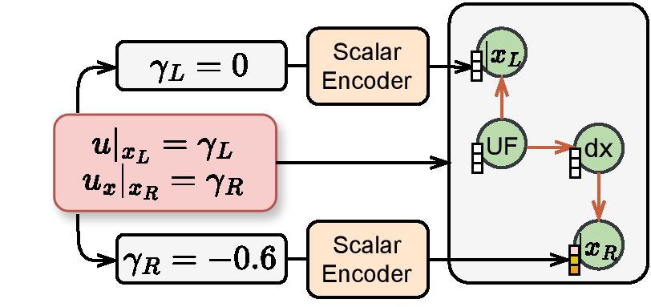
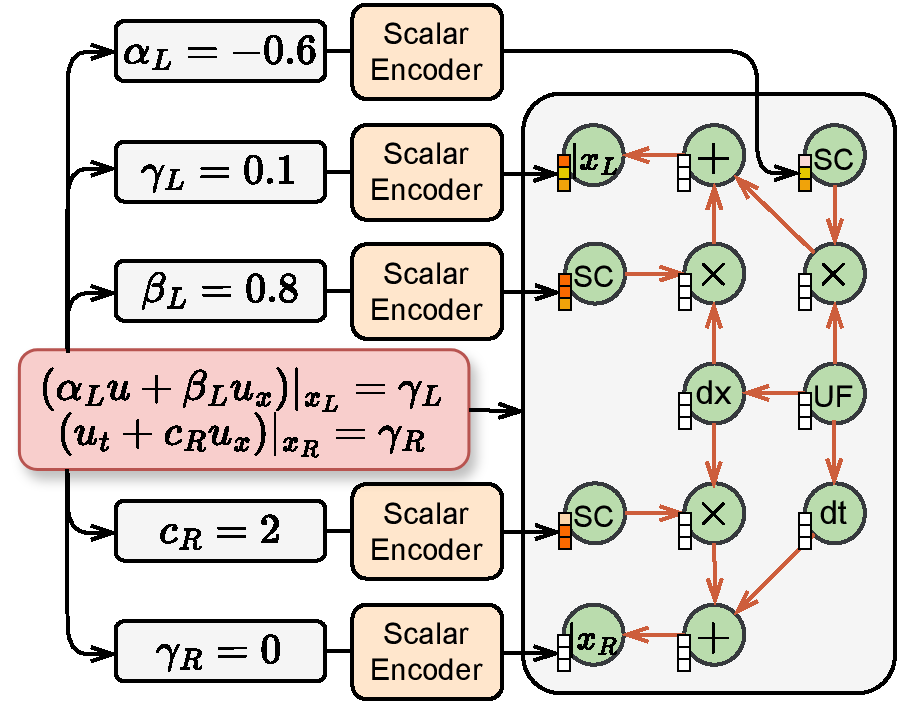
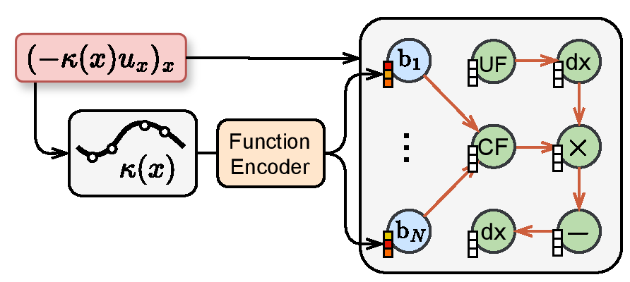
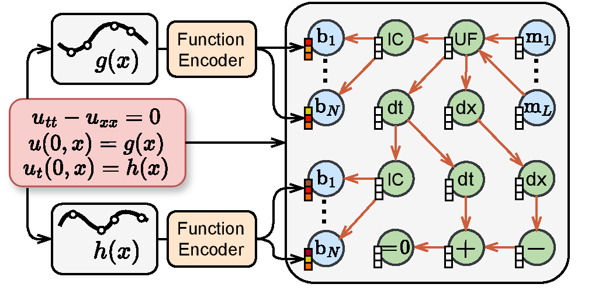
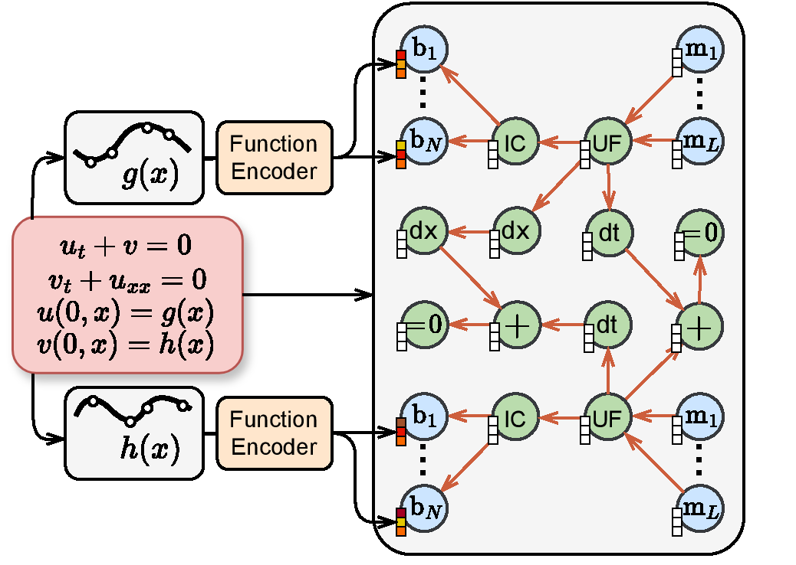
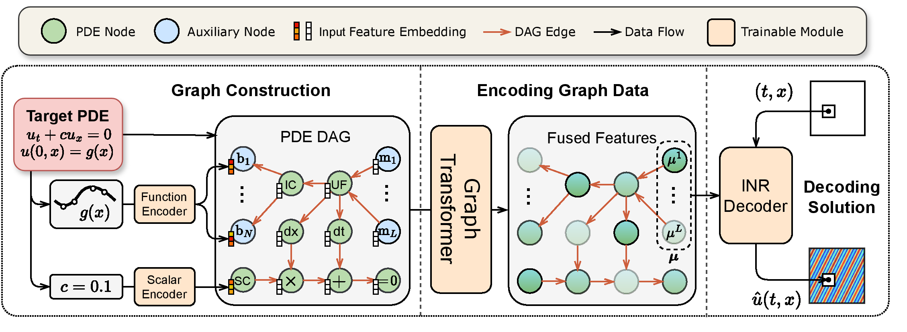
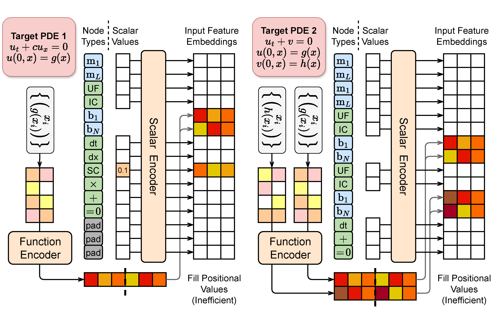
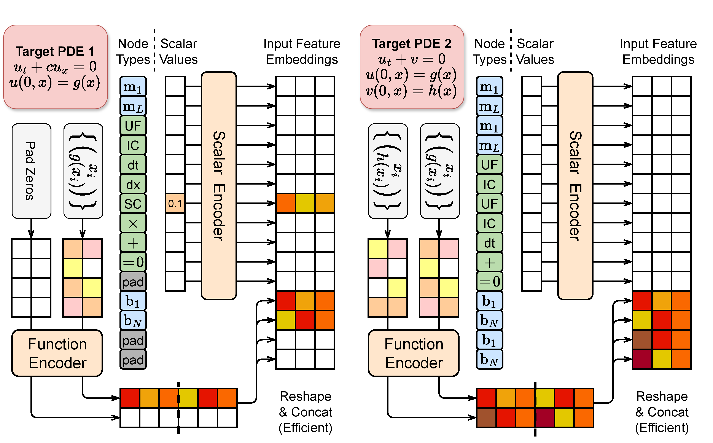

# PDE 中边界条件、系数场等元素在计算图中的表达方式

## 边界条件

PDE 若采用周期边界条件，相应的计算图中无需引入额外节点。
对于非周期边界，以左边界 Dirichlet、右边界 Neumann 的情形为例：

（注：如无特别说明，以下示意图中所有的 scalar encoder 都共享参数，function encoder 也是如此。）

以下是一个更复杂的例子，其左边界为 Robin，右边界为 Mur（这是一种针对波方程的吸收边界条件）：

## 非常数系数

如果 PDE 中涉及的系数不是常数，而是一个有空间依赖的系数场 $s(x)$ ，这样的系数可以通过一个 `CF` 节点表示。
下图所展示的例子在包含非常数扩散项的方程中会出现：

有时间依赖的系数（即形如 $s(t)$，它是一个关于时间 $t$ 的函数）也可以类似地用一个 `VC` 节点表示。
通过引入额外的乘积节点，可以在计算图中表达出 $s^\mathrm{T}(t)s^\mathrm{X}(x)$ 这样的（可分离变量的）可变系数场。
目前的代码暂时不支持表示一般形式的可变系数场 $s(t,x)$。

## 时间二阶导

下图以简单的波方程为例，展示了含有时间二阶导数的方程如何通过计算图来表示：

## 多变量方程组

含有多个变量（方程解的多个分量）的偏微分方程组也可以使用计算图表示，一个简单的示例如下（尽管我们目前还没有提供在多分量方程数据上训练过的模型参数）：

# 编程实现——为图节点赋予输入特征嵌入

回忆如下所示的 PDEformer 整体架构示意图：

在左侧展示的 DAG 构建过程中，我们为图中的每个节点都赋予一个 $d_e$ 维的输入特征嵌入，其中一部分节点的输入特征由标量编码器给出，而另一部分节点则由函数编码器给出。
针对这种设定，最直接而朴素的编程实现方式如下（为简化示意图，图中选取了 $L=N=2$，并且 PDE 2 选用了一个不完整的方程）：

对于这种方式，我们需要分别考察各 PDE 所涉及的每个输入函数的信息，判断该输入函数对应的“分支”节点（$\mathtt{b}_1,\dots,\mathtt{b}_N$）在所有图节点中的排列位次，然后将函数编码器的相应输出填充到（包含了所有顶点的）整体输入特征张量的相应位置当中
（在编程实现时，网络的所有输入输出都采用张量数据的形式）。
而在训练过程中，一个数据批次（batch）往往同时包含多种不同的 PDE，其中每个 PDE 的输入函数的个数各不相同，相应的分支节点的排列位次也各不相同。
如果使用这种实现方式，代码不仅编写起来比较麻烦，运行阶段的效率也不高。

在实际编程实现中，我们采取了如下所示的变通做法：

（这里利用了图 Transformer 的特殊性：不同于大多数针对序列数据设计的 Transformer 架构，图 Transformer 的前传计算过程只会用到图的拓扑结构信息，而不考虑各节点的排列顺序，因此我们可以任意地重新排列节点。）
这种做法指定了排列位次靠前的节点的输入特征由标量编码器给出，而位次靠后的节点输入特征由函数编码器给出。
只需要相对简单的张量形状修改（reshape）和张量拼接（concatenate）操作，就能够获得最终的整体输入特征张量，而不再需要进行繁琐的判断与赋值过程。
