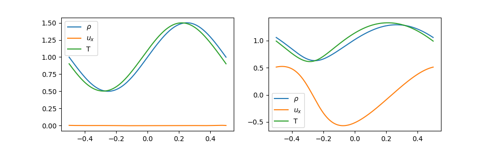
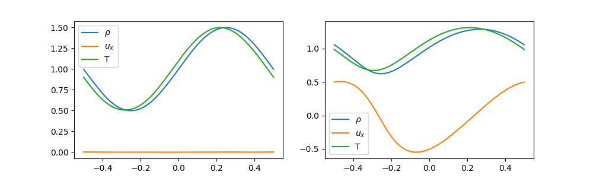
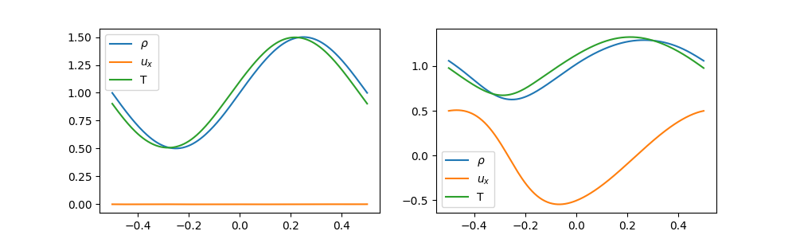

ENGLISH | [简体中文](README_CN.md)

# Boltzmann equation

## Overview

The Boltzmann equation or the Boltzmann transport equation (BTE) is an equation proposed by Boltzmann in 1872 to describe the statistical behavior of non-equilibrium thermodynamic systems. In this case, the MindFlow fluid simulation suite is used to solve the one-dimensional BGK and the Boltzmann equation of the quadratic collision item based on the neural network sparse representation method. More information can be found in the paper [Solving Boltzmann equation with neural sparse representation](https://arxiv.org/abs/2302.09233).

## QuickStart

### Run Option 1: Call `train.py` from command line

```shell
python train.py --mode GRAPH --device_target GPU --device_id 0 --config_file_path ./config/WaveD1V3_BGK.yaml
```

where:

`--mode` is the running mode. 'GRAPH' indicates static graph mode. 'PYNATIVE' indicates dynamic graph mode. You can refer to [MindSpore official website](https://www.mindspore.cn/docs/en/r2.0.0-alpha/design/dynamic_graph_and_static_graph.html) for details.Default 'GRAPH'.

`--device_target` indicates the computing platform. You can choose 'Ascend' or 'GPU'. Default 'Ascend'.

`--device_id` indicates the index of NPU or GPU. Default 0.

`--config_file_path` indicates the path of the parameter file. Default './burgers_cfg.yaml'；

Here we provide examples of different models and methods for different Boltzmann equations, corresponding to different configuration files.

Among them, `WaveD1V3_BGK.yaml` and `WaveD1V3_LR.yaml` correspond to BGK collision items, which are directly based on the discrete velocity model and modeled using neural network sparse representation.

Among them, `WaveD1V3_FSM.yaml` and `WaveD1V3_LA.yaml` correspond to the quadratic collision model, which are directly based on the fast spectral method model and modeled using neural network sparse representation. Before running the sample corresponding to `WaveD1V3_LA.yaml`, you need to run the `WaveD1V3_FBGK.yaml` sample to generate the corresponding approximate solution.

### Run Option 2: Run Jupyter Notebook

You can use [Chinese](https://gitee.com/mindspore/mindscience/blob/master/MindFlow/applications/physics_driven/boltzmann/boltzmannD1V3_CN.ipynb) or [English](https://gitee.com/mindspore/mindscience/blob/master/MindFlow/applications/physics_driven/boltzmann/boltzmannD1V3.ipynb)Jupyter Notebook to run the training and evaluation code line-by-line.

## Results

### BGK model

#### WaveD1V3_BGK



#### WaveD1V3_LR


### Quadratic collision model

#### WaveD1V3_FSM



#### WaveD1V3_LA



## Contributor

gitee id：positive-one

email: lizhengyi@pku.edu.cn