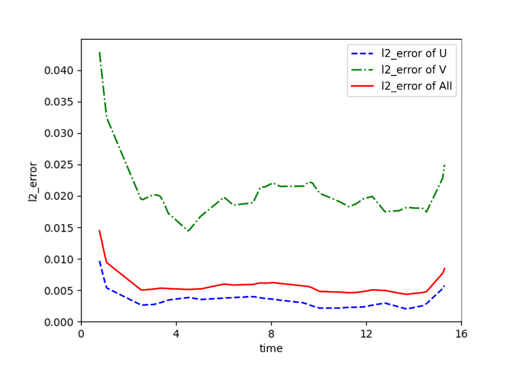
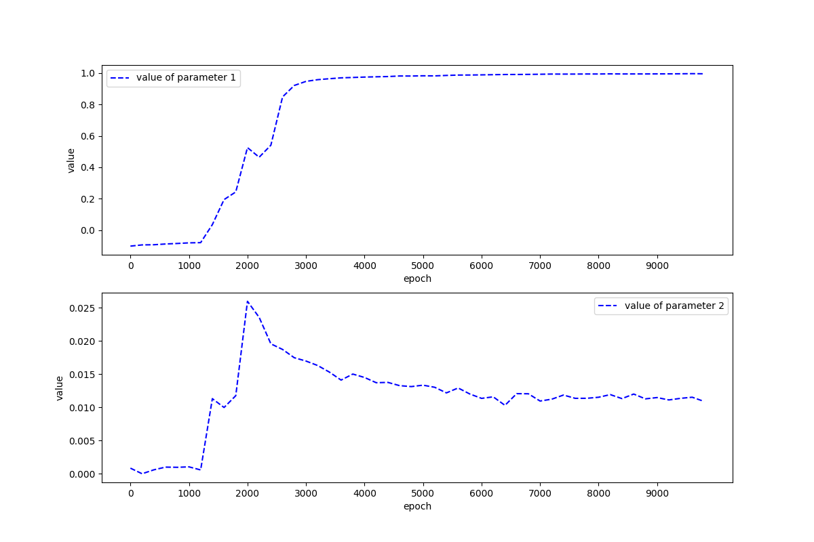

[ENGLISH](README.md) | 简体中文

# Navier Stokes反问题

## 概述

Navier-Stokes的反问题是指，在已知某些流体运动特征（如流量、速度等）的条件下，求解出能够产生这些运动特征的流体性质（如黏度、密度等）和流体边界条件（如壁面摩擦力等）的问题。与正问题（即已知流体性质和边界条件，求解流体的运动特征）不同，反问题的解决需要通过数值优化和逆推算法等方法进行求解。

|Correct PDE|Identified PDE|
|  ----  | ----  |
|$u_t + (u u_x + v u_x) = - p_x + 0.01(u_{xx} + u_{yy})$|$u_t + 0.9984444 (u u_x + v u_x) = - p_x + 0.01072927(u_{xx} + u_{yy})$|
|$v_t + (u v_x + v v_x) = - p_y + 0.01(v_{xx} + v_{yy})$|$v_t + 0.9984444 (u v_x + v v_x) = - p_y + 0.01072927(v_{xx} + v_{yy})$|

[详见](https://gitee.com/mindspore/mindscience/blob/master/MindFlow/applications/physics_driven/navier_stokes/cylinder_flow_inverse/navier_stokes_inverse_CN.ipynb)
