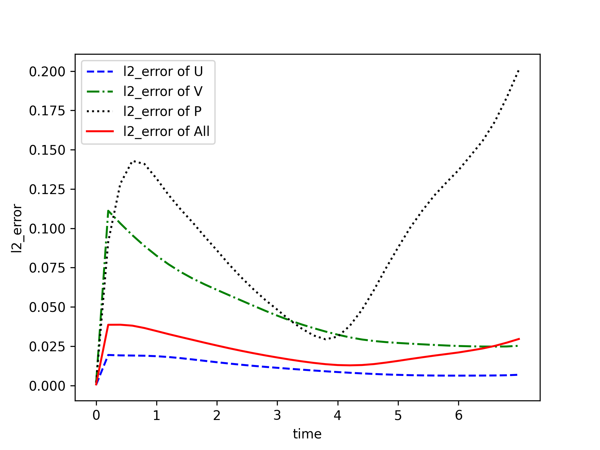

[ENGLISH](README.md) | 简体中文

# 二维圆柱绕流

## 概述

## 问题描述

圆柱绕流，即二维圆柱低速非定常绕流，流动特性与雷诺数`Re`有关。。在`Re`≤1 时，流场中的惯性力与粘性力相比居次要地位，圆柱上下游的流线前后对称，阻力系数近似与`Re`成反比，此`Re`数范围的绕流称为斯托克斯区；随着 Re 的增大，圆柱上下游的流线逐渐失去对称性。这种特殊的现象反映了流体与物体表面相互作用的奇特本质，求解圆柱绕流则是流体力学中的经典问题。本案例利用 PINNs 求解圆柱绕流的尾流流场。

### 技术路径

纳维-斯托克斯方程（Navier-Stokes equation），简称`N-S`方程，是流体力学领域的经典偏微分方程，在粘性不可压缩情况下，无量纲`N-S`方程的形式如下：

$$
\frac{\partial u}{\partial x} + \frac{\partial v}{\partial y} = 0
$$

$$
\frac{\partial u} {\partial t} + u \frac{\partial u}{\partial x} + v \frac{\partial u}{\partial y} = - \frac{\partial p}{\partial x} + \frac{1} {Re} (\frac{\partial^2u}{\partial x^2} + \frac{\partial^2u}{\partial y^2})
$$

$$
\frac{\partial v} {\partial t} + u \frac{\partial v}{\partial x} + v \frac{\partial v}{\partial y} = - \frac{\partial p}{\partial y} + \frac{1} {Re} (\frac{\partial^2v}{\partial x^2} + \frac{\partial^2v}{\partial y^2})
$$

其中，`Re`表示雷诺数。

本案例利用 PINNs 方法学习位置和时间到相应流场物理量的映射，实现`N-S`方程的求解：

$$
(x, y, t) \mapsto (u, v, p)
$$

## 快速开始

数据集下载地址：[physics_driven/flow_past_cylinder/dataset/](https://download.mindspore.cn/mindscience/mindflow/dataset/applications/physics_driven/flow_past_cylinder/dataset/). 将数据集保存在`./dataset`路径下.

### 训练方式一：在命令行中调用`train.py`脚本

```shell
python train.py --config_file_path ./configs/cylinder_flow.yaml --device_target GPU --device_id 0 --mode GRAPH
```

其中，

`--config_file_path`表示配置文件的路径，默认值'./configs/cylinder_flow.yaml'；

`--device_target`表示使用的计算平台类型，可以选择'Ascend'或'GPU'，默认值'GPU'；

`--device_id`表示使用的计算卡编号，可按照实际情况填写，默认值 0；

`--mode`表示运行的模式，'GRAPH'表示静态图模式, 'PYNATIVE'表示动态图模式。

### 训练方式二：运行 Jupyter Notebook

您可以使用[中文版](./navier_stokes2D_CN.ipynb)和[英文版](./navier_stokes2D.ipynb)Jupyter Notebook 逐行运行训练和验证代码。

## 结果展示




## 性能

| 参数               | Ascend               | GPU                |
|:----------------------:|:--------------------------:|:---------------:|
| 硬件资源                | Ascend, 显存32G            | NVIDIA V100, 显存32G    |
| MindSpore版本           | >=2.0.0                 | >=2.0.0                   |
| 数据集                  | [圆柱绕流流场数据集](https://download-mindspore.osinfra.cn/mindscience/mindflow/dataset/applications/physics_driven/flow_past_cylinder/)      | [圆柱绕流流场数据集](https://download-mindspore.osinfra.cn/mindscience/mindflow/dataset/applications/physics_driven/flow_past_cylinder/)                   |
| 参数量                  | 1.3e5                   | 1.3e5                   |
| 训练参数                | batch_size=8192, steps_per_epoch=2, epochs=12000 | batch_size=8192, steps_per_epoch=2, epochs=12000 |
| 测试参数                | batch_size=8192      | batch_size=8192               |
| 优化器                  | Adam                 | Adam                   |
| 训练损失(MSE)           | 9e-5                 | 4e-5               |
| 验证损失(RMSE)          | 2e-2                 | 2e-2               |
| 速度(ms/step)           | 100                  | 450                |

## 贡献者

gitee id：[liulei277](https://gitee.com/liulei277)

email: liulei2770919@163.com
