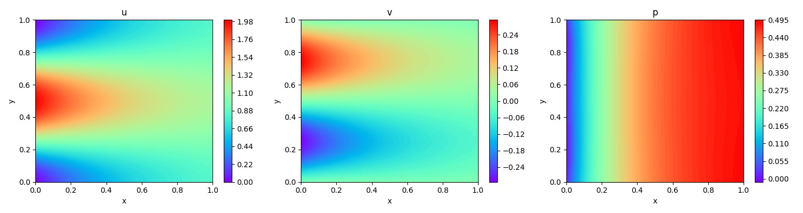

[ENGLISH](README.md) | 简体中文

# Kovasznay流

## 概述

Kovasznay流动是Navier-Stokes方程的一个精确解，广泛应用于流体力学领域，并常用作基准问题。它在空气动力学和计算流体力学等领域有着广泛的应用。本示例演示了如何使用MindFlow流体仿真套件，基于物理信息神经网络（PINNs）方法来求解Kovasznay流动问题。

## 快速开始

### 训练方式一：在命令行中调用`train.py`脚本

```shell
python train.py --mode GRAPH --device_target GPU --device_id 0 --config_file_path ./configs/kovasznay_cfg.yaml
```

其中，
`--mode`表示运行的模式，'GRAPH'表示静态图模式, 'PYNATIVE'表示动态图模式，详见[MindSpore官网](https://www.mindspore.cn/docs/zh-CN/r2.0.0-alpha/design/dynamic_graph_and_static_graph.html?highlight=pynative)，默认值'GRAPH'；

`--device_target`表示使用的计算平台类型，可以选择'Ascend'或'GPU'，默认值'Ascend'；

`--device_id`表示使用的计算卡编号，可按照实际情况填写，默认值0；

`--config_file_path`表示参数文件的路径，默认值'./configs/kovasznay_cfg.yaml'；

### 训练方式二：运行Jupyter Notebook

您可以使用[中文版](./kovasznay_CN.ipynb)和[英文版](./kovasznay.ipynb)Jupyter Notebook逐行运行训练和验证代码。

## 结果展示



## 性能

|     参数      |             Ascend             |                 GPU                 |
| :-----------: | :----------------------------: | :---------------------------------: |
|   硬件资源    | Ascend | NVIDIA RTX 3090, 显存24G；CPU: 40核 |
| MindSpore版本 |            2.0.dev             |                 2.0                 |
|   训练损失    |             6.5e-5             |               4.4e-5                |
|   验证损失    |              4e-3              |                3e-3                 |
|     速度      |           5.8s/epoch           |             12.8s/epoch             |

## Contributor

liangjiaming2023
