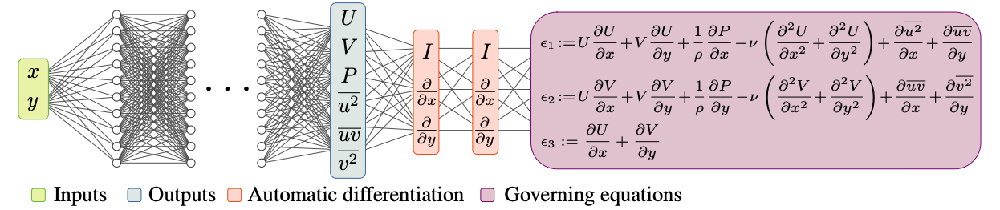
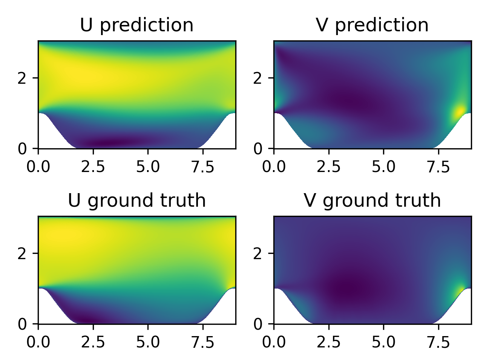
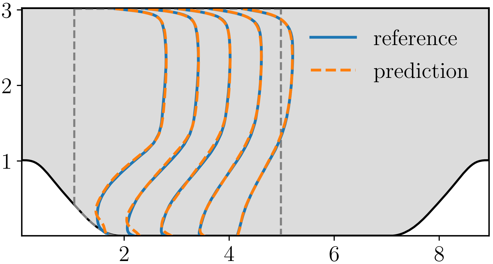

# 雷诺平均Navier-Stokes方程求解周期山流动

## 概述

雷诺平均Navier-Stokes方程求解周期山流动问题是流体力学和气象学领域中的一个经典数值模拟案例，用于研究空气或流体在周期性山地地形上的流动行为。这个问题旨在探究山地地形对大气或流体运动的影响，从而深入理解气象现象、地形效应以及流体在复杂地形下的特性。本项目采取雷诺平均模型模拟湍流在二维周期山地地形上的流动.

### 雷诺平均模型

雷诺平均模型（Reynolds-Averaged Navier-Stokes equations，RANS）是流体力学领域中常用的数值模拟方法之一，用于研究流体在不同雷诺数条件下的平均行为。该模型以法国科学家雷诺（Osborne Reynolds）的名字命名，通过对流场变量进行时间平均操作，提供了一种处理湍流问题的工程实用途径。雷诺平均模型基于雷诺分解原理，将流场变量分解为平均分量与脉动分量。通过对雷诺方程进行时间平均操作，消除了非定常的脉动项，得到了宏观流动的时间平均方程。以二维情况下的雷诺平均动量方程和连续方程为例：

**雷诺平均动量方程：**

$$
\rho \bar{u}_j \frac{\partial \bar{u}_i}{\partial x_j}=\rho \bar{f}_i+\frac{\partial}{\partial x_j}\left[-\bar{p} \delta_{i j}+\mu\left(\frac{\partial \bar{u}_i}{\partial x_j}+\frac{\partial \bar{u}_j}{\partial x_i}\right)-\rho \overline{u_i^{\prime} u_j^{\prime}}\right]
$$

**连续方程：**

$$\frac{\partial \overline{u}}{\partial x} + \frac{\partial \overline{v}}{\partial y} = 0$$

其中，$\overline{u}$ 和 $\overline{v}$ 分别代表 x 和 y 方向的速度分量的时间平均值，$\overline{p}$ 为压力的时间平均值，$\rho$ 是流体密度，$\nu$ 是运动粘性系数，$u$ 和 $v$ 分别为 x 和 y 方向的速度分量.

### 求解模型介绍

RANS-PINNs方法的核心思想是将物理方程和神经网络相结合，以获得同时具备传统RANS模型准确性和神经网络灵活性的模拟结果。在该方法中，基于RANS的平均流动方程与涉及湍流的各向同性涡粘性模型相结合，形成了精确的基准解。然后，通过物理信息神经网络，将剩余的湍流脉动部分进行建模，进一步提高了模拟精度.

RANS-PINNs模型结构图如下:

<figure class="harf">
    
</figure>

### 数据集

来源：二维圆柱绕流数值仿真流场数据，由北京航空航天大学航空科学与工程学院于剑副教授团队提供。

数据说明：
数据格式为numpy的npy，维度为：[300，700， 10]。其中前两个维度分别为流场的长和宽，最后维度为包含（x, y, u, v, p, uu, uv, vv, rho, nu）共计10个变量。其中，x, y, u, v, p分别为流场的x坐标、y坐标、x方向速度、y方向速度、压力；uu, uv, vv雷诺平均统计量；rho为流体密度，nu为运动粘性系数。

数据集下载链接:
[periodic_hill.npy](https://download.mindspore.cn/mindscience/mindflow/dataset/periodic_hill_2d/)

## 快速开始

### 训练方式一：在命令行中调用`train.py`脚本

该模型单机单卡进行训练，根据训练任务需求，直接执行train.py即可开始训练RANS-PINNs模型，在开始训练前需要在 `rans.yaml` 中设置数据读取保存路径和训练参数等相关参数：

```bash
python -u train.py --mode GRAPH --device_target GPU --device_id 0 --config_file_path ./configs/rans.yaml
```

其中，

`--mode`表示运行的模式，'GRAPH'表示静态图模式, 'PYNATIVE'表示动态图模式，默认值'GRAPH'；

`--device_target`表示使用的计算平台类型，可以选择'Ascend'或'GPU'，默认值'GPU'；

`--device_id`表示使用的计算卡编号，可按照实际情况填写，默认值0；

`--config_file_path`表示参数文件的路径，默认值'./configs/rans.yaml'。

### 训练方式二：运行Jupyter Notebook

您可以使用中英文版本的Jupyter Notebook逐行运行训练和验证代码：

中文版本: [rans_CN.ipynb](./rans_CN.ipynb)

英文版本: [rans.ipynb](./rans.ipynb)

## 预测结果可视化

根据训练条件，执行eval.py进行模型推理，此操作将会根据训练结果的权重参数文件，预测输出periodic hill流场预测结果。

```bash
python -u eval.py
```

上述后处理输出路径默认为`./prediction_result`，可在`rans.yaml`里修改保存路径。

## 结果展示

以下为RANS-PINNs模型预测结果和真实值的对比：

<figure class="harf">
    
</figure>

结果展现了流场中不同位置的横向速度U和纵向速度V的分布情况，其中，下图为真实值，上图为预测值。

以下为RANS-PINNs模型的横向速度剖面图：

<figure class="harf">
    
</figure>

其中蓝线为真实值，橙色虚线为预测值

## 性能

|        参数         |        NPU               |    GPU       |
|:----------------------:|:--------------------------:|:---------------:|
|     硬件资源         |     Ascend, 显存32G   |      NVIDIA V100, 显存32G       |
|     MindSpore版本   |        2.0.0             |      2.0.0       |
| 数据集 | [Periodic_hill](https://download.mindspore.cn/mindscience/mindflow/dataset/periodic_hill_2d/) | [Periodic_hill](https://download.mindspore.cn/mindscience/mindflow/dataset/periodic_hill_2d/) |
|  参数量 | 1.3e5 | 1.3e5 |
|  训练参数 | batch_size=4002, epochs=1600, steps_per_epoch=50| batch_size=4002, epochs=1600, steps_per_epoch=50 |
|  测试参数 | batch_size=4002 | batch_size=4002 |
|  优化器 | Adam | Adam |
|        训练损失      |        6.21e-4          |   5.30e-4       |
|        验证损失      |          0.103          |   0.113           |
|        速度          |     180毫秒/步       |   389毫秒/步  |

## Contributor

代码贡献者的gitee id: [Marc-Antoine-6258](https://gitee.com/Marc-Antoine-6258)

代码贡献者的email: 775493010@qq.com

