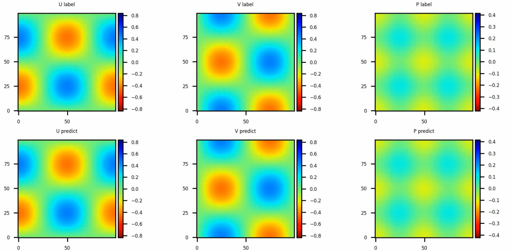
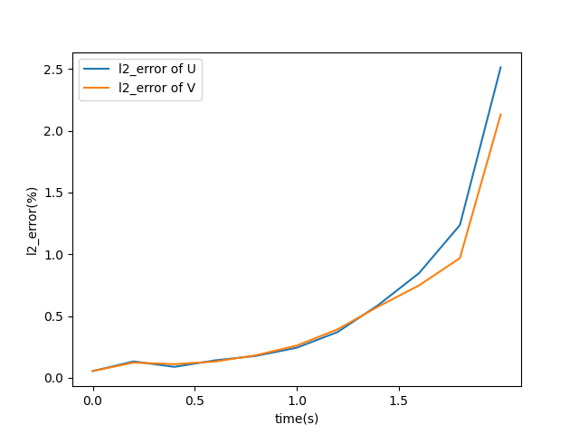

ENGLISH | [简体中文](README_CN.md)

# 2D Taylor Green Vortex

## Overview

In fluid dynamics, the Taylor–Green vortex is an unsteady flow of a decaying vortex, which has an exact closed form solution of the incompressible Navier–Stokes equations in Cartesian coordinates. In this case, the data-driven characteristic of neural network is used along with `PINNs` to solve the 2D taylor green vortex problem.

[See More](https://gitee.com/mindspore/mindscience/blob/master/MindFlow/applications/physics_driven/navier_stokes/taylor_green/taylor_green_2D.ipynb)

## Performance

| Parameter               | Ascend               | GPU                |
|:----------------------:|:--------------------------:|:---------------:|
| Hardware                | Ascend 32G           | NVIDIA V100 32G    |
| MindSpore version       | >=2.0.0                | >=2.0.0                   |
| Parameters              | 1.3e5                  | 1.3e5                   |
| Train Config            | batch_size=1024, steps_per_epoch=64, epochs=300 | batch_size=1024, steps_per_epoch=64, epochs=300 |
| Evaluation Config       | batch_size=1024      | batch_size=1024                |
| Optimizer               | Adam                 | Adam                   |
| Train Loss(MSE)         | 0.0004                | 0.0001             |
| Evaluation Error(RMSE)  | 0.06                | 0.01              |
| Speed(ms/step)          | 15                   | 50                |