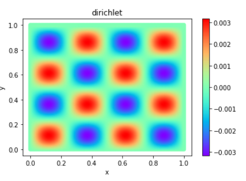
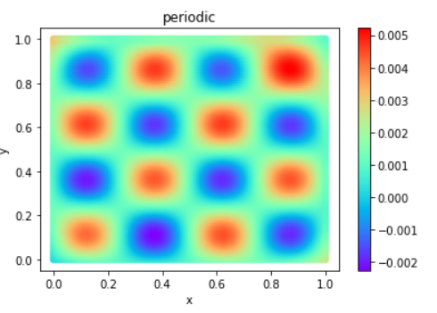
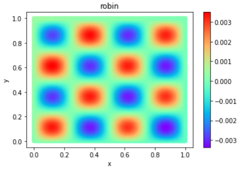
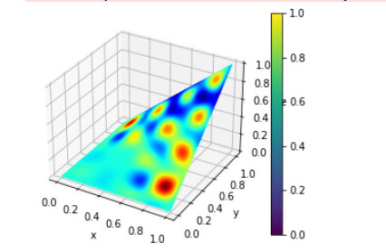

# Poisson Equation

## Overview

This case study uses the MindFlow fluid simulation suite and the Physics Informed Neural Networks (PINNs) method to solve the one-dimensional, two-dimensional, and three-dimensional Poisson equations:

The Poisson equation is a widely used partial differential equation in theoretical physics, given by:

$$
\Delta u = f
$$

where $\Delta$ is the Laplacian operator, and $u$ and $f$ are real or complex-valued functions defined on a manifold. Usually, $f$ is given, and $\varphi$ is sought.

In this case study, for the one-dimensional Poisson equation, we have:

$$
\Delta u = -\sin(4\pi x),
$$

for the two-dimensional Poisson equation, we have:

$$
\Delta u = -\sin(4\pi x)\sin(4\pi y),
$$

and for the three-dimensional Poisson equation, we have:

$$
\Delta u = -\sin(4\pi x)\sin(4\pi y)\sin(4\pi z),
$$

and we can choose the boundary conditions to be used by modifying the BC_type in YAML, which currently includes: Dirichlet boundary, Robin boundary, and periodic boundary conditions.

For the one-dimensional problem, this case study uses the one-dimensional axis interval as the solution domain. For the two-dimensional problem, it demonstrates solving the equation in rectangular, circular, triangular, L-type, and pentagonal regions. For the three-dimensional problem, we solve the equation in tetrahedral, cylindrical, and conical regions.

## Quick Start

### Training Method 1: Call the `train.py` Script in Command Line

In the command line, enter the following command to start the training:

```bash
python train.py --geom_name disk --mode GRAPH --save_graphs_path ./graphs --device_target GPU --device_id 0 --config_file_path ./poisson_cfg.yaml
```

where `--geom_name` specifies the name of the geometric shape, and you can choose from `'interval'`, `'rectangle'`, `'disk'`, `'triangle'`, `'polygon'`, `'pentagon'`, `'tetrahedron'`, `'cylinder'`, `'cone'`, with the default value `'disk'`.

`--mode` specifies the running mode, with `'GRAPH'` indicating static graph mode, and `'PYNATIVE'` indicating dynamic graph mode. Refer to the MindSpore official website for more details, with the default value `'GRAPH'`.

`--device_target` specifies the computing platform type, and you can choose from `'Ascend'` or `'GPU'`, with the default value `'GPU'`.

`--device_id` specifies the device ID, which can be filled in according to the actual situation, with the default value `0`.

`--ckpt_dir` specifies the path to save the model, with the default value `'./ckpt'`.

`--n_epochs` specifies the number of training epochs.

`--config_file_path` specifies the path to the parameter file, with the default value `'./configs/poisson_cfg.yaml'`.

You can choose the boundary condition function to use by modifying the BC_type in poisson_cfg.yaml, and the following is a table based on the case parameters under each boundary condition and sampling interval：

| Boundary Condition |                                               Dirichlet                                               |                                                robin                                                |                                               Periodic                                               |
| :-----------------: | :---------------------------------------------------------------------------------------------------: | :-------------------------------------------------------------------------------------------------: | :--------------------------------------------------------------------------------------------------: |
|      hardware      |                                        GPU: 1\*T4,<br />CPU: 4                                        |                                      GPU: 1\*T4,<br /> CPU: 4                                      |                                       GPU: 1\*T4,<br />CPU: 4                                       |
|  MindSpore version  |                                                 2.2.0                                                 |                                                2.2.0                                                |                                                2.2.0                                                |
| Training parameters | n_epochs=50,<br />batch_size=5000,<br />BC_size=1000000, <br />domain_size=1000000,<br />max_lr=5e-4 | n_epochs=50,<br />batch_size=5000,<br />BC_size=2000000,<br />domain_size=2000000,<br />max_lr=5e-4 | n_epochs=100,<br />batch_size=5000,<br />BC_size=2000000,<br />domain_size=2000000,<br />max_lr=5e-4 |
| Testing Parameters |                                            batch_size=5000                                            |                                           batch_size=5000                                           |                                           batch_size=5000                                           |
|  Sampling interval  |                                               rectangle                                               |                                              rectangle                                              |                                              rectangle                                              |
|   training error   |                                                0.00818                                                |                                               0.00258                                               |                                               0.01809                                               |
|      Optimizer      |                                                 Adam                                                 |                                                Adam                                                |                                                 Adam                                                 |
|     test error     |                                                0.0028                                                |                                               0.0812                                               |                                                0.8790                                                |
|   per step time   |                                                163.4ms                                                |                                               286.1ms                                               |                                               146.0ms                                               |
|     parameters     |                                                1688002                                                |                                               1688002                                               |                                               1688002                                               |

The results of the training parameters in other sampling intervals are [here](./evaluation_table.md)

### Training Method 2: Run Jupyter Notebook

You can run the training and validation code line by line using the [Chinese](./poisson_CN.ipynb) or [English](./poisson.ipynb) version of the Jupyter Notebook.

### Result

<p align = "center">




</p>

## Performance

| Parameter               | Ascend               | GPU                |
|:----------------------:|:--------------------------:|:---------------:|
| Hardware                | Ascend 32G           | NVIDIA V100 32G    |
| MindSpore version       | >=2.0.0                | >=2.0.0                   |
| Parameters              | 1e5                  | 1e5                   |
| Train Config            | batch_size=5000, steps_per_epoch=200, epochs=50 | batch_size=5000, steps_per_epoch=200, epochs=50 |
| Evaluation Config       | batch_size=5000      | batch_size=5000               |
| Optimizer               | Adam                 | Adam                   |
| Train Loss(MSE)         | 0.001                | 0.001             |
| Evaluation Error(RMSE)  | 0.01                 | 0.01              |
| Speed(ms/step)          | 0.3                  | 1                |