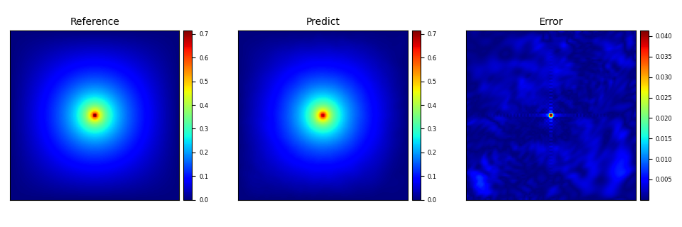

[ENGLISH](README.md) | 简体中文

# 带点源的泊松方程

## 概述

本案例采用MindFlow流体仿真套件，基于物理驱动的PINNs (Physics Informed Neural Networks)方法，求解二维带点源的泊松方程：
$$
\Delta u = - \delta(x-x_{src})\delta(y-y_{src}),
$$
其中 $(x_{src}, y_{src})$ 为点源位置对应的坐标。
点源在数学上可以用狄拉克 $\delta$ 函数来表示：
$$
\delta(x) = \begin{cases}
+\infty, & x = 0    \\
0,       & x \neq 0
\end{cases}
\qquad
\int_{-\infty}^{+\infty}\delta(x)dx = 1.
$$

与该案例相对应的论文为：
[Xiang Huang, Hongsheng Liu, Beiji Shi, Zidong Wang, Kang Yang, Yang Li, Min Wang, Haotian Chu, Jing Zhou, Fan Yu, Bei Hua, Bin Dong, Lei Chen. “A Universal PINNs Method for Solving Partial Differential Equations with a Point Source”. Thirty-First International Joint Conference on Artificial Intelligence (IJCAI 2022), Vienna, Austria, Jul, 2022, Pages 3839-3846.](https://www.ijcai.org/proceedings/2022/0533.pdf)

## 快速开始

### 训练方式一：在命令行中调用`train.py`脚本

```shell
python --mode GRAPH --save_graphs_path ./graphs --device_target Ascend --device_id 0 --n_epochs 250 --config_file_path ./poisson_cfg.yaml
```

其中，
`--mode`表示运行的模式，'GRAPH'表示静态图模式, 'PYNATIVE'表示动态图模式，详见[MindSpore官网](https://www.mindspore.cn/docs/zh-CN/r2.0.0-alpha/design/dynamic_graph_and_static_graph.html?highlight=pynative)，默认值'GRAPH'；

`--save_graphs`表示是否保存计算图，默认值'False'；

`--save_graphs_path`表示计算图保存的路径，默认值'./graphs'；

`--device_target`表示使用的计算平台类型，可以选择'Ascend'或'GPU'，默认值'Ascend'；

`--device_id`表示使用的计算卡编号，可按照实际情况填写，默认值0；

`--n_epochs`表示训练的epoch数目，默认值为250；

`--config_file_path`表示参数文件的路径，默认值'./poisson_cfg.yaml'；

### 训练方式二：运行Jupyter Notebook

您可以使用[中文版](https://gitee.com/mindspore/mindscience/blob/master/MindFlow/applications/physics_driven/poisson/point_source/poisson_CN.ipynb)和[英文版](https://gitee.com/mindspore/mindscience/blob/master/MindFlow/applications/physics_driven/poisson/point_source/poisson_CN.ipynb) Jupyter Notebook逐行运行训练和验证代码。

## 结果展示



## Contributor

gitee id: huangxiang360729

email: <sahx@mail.ustc.edu.cn>
