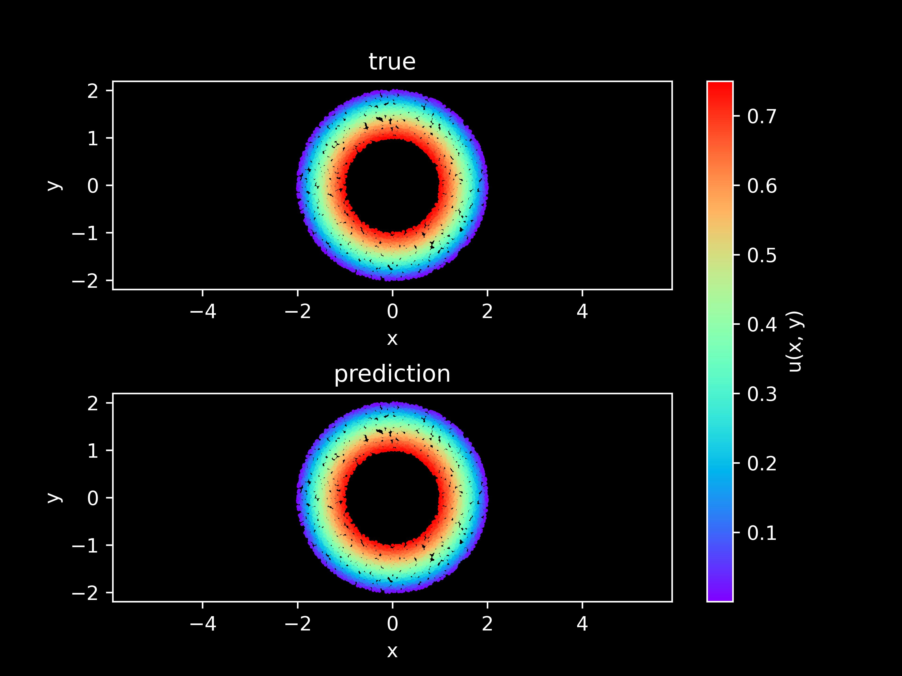

# Solve Poisson-2D' Equation based on PINNs

## Overview

Poisson's equation is an elliptic partial differential equation of broad utility in theoretical physics. For example, the solution to Poisson's equation is the potential field caused by a given electric charge or mass density distribution; with the potential field known, one can then calculate electrostatic or gravitational (force) field.

## Problem Description

We start from a 2-D homogeneous Poisson equation,
$$
f + \Delta u = 0
$$
where `u` is the primary variable, `f` is the source term, and $\Delta$ denotes the Laplacian operator.

We consider the source term f is given ($f=1.0$), then the form of Poisson' equation is as follows:

$$
\frac{\partial^2u}{\partial x^2} + \frac{\partial^2u}{\partial y^2} + 1.0 = 0,
$$

In this case, the Dirichlet boundary condition and the Neumann boundary condition are used. The format is as follows:

Dirichlet boundary condition on the boundary of outside circle:
$$
u = 0
$$

Neumann boundary condition on the boundary of inside circle.
$$
du/dn = 0
$$

In this case, the PINNs method is used to learn the mapping $(x, y) \mapsto u$. So that the solution of Poisson' equation is realized.

## Technology Path

MindFlow solves the problem as follows:

1. Training Dataset Construction.
2. Neural Network Construction.
3. Problem Modeling.
4. Model Training.
5. Model Evaluation and Visualization.

## Training Dataset Construction

In this case, random sampling is performed according to the solution domain, initial condition and boundary value condition to generate training data sets and test data sets. The specific settings are as follows:

```python
from src import create_training_dataset

dataset = create_training_dataset(config)
train_dataset = dataset.batch(batch_size=config["train_batch_size"])
```

## Neural Network Construction

This example uses a simple fully-connected network with a depth of 6 layers and the activation function is the `tanh` function.

```python
from mindflow import MultiScaleFCCell

model = MultiScaleFCCell(in_channels=2,
                         out_channels=1,
                         layers=6,
                         neurons=128,
                         residual=False,
                         act='tan',
                         num_scales=1)

# define optimizer
optimizer = nn.Adam(model.trainable_params(), config["optimizer"]["initial_lr"])
```

## Problem Modeling

The following `Poission` defines the 2D Poisson' problem. The `sympy` is used for delineating partial differential equations in symbolic forms and computing all equations' loss. Specifically, it includes 3 parts: governing equation, initial condition and boundary conditions.

```python
from mindflow.pde import Poisson, sympy_to_mindspore

class Poisson2D(Poisson):
    def __init__(self, model, loss_fn=nn.MSELoss()):
        super(Poisson2D, self).__init__(model, loss_fn=loss_fn)
        self.bc_outer_nodes = sympy_to_mindspore(self.bc_outer(), self.in_vars, self.out_vars)
        self.bc_inner_nodes = sympy_to_mindspore(self.bc_inner(), self.in_vars, self.out_vars)

    def bc_outer(self):
        bc_outer_eq = self.u
        equations = {"bc_outer": bc_outer_eq}
        return equations

    def bc_inner(self):
        bc_inner_eq = sympy.Derivative(self.u, self.normal) - 0.5
        equations = {"bc_inner": bc_inner_eq}
        return equations

    def get_loss(self, pde_data, bc_outer_data, bc_inner_data, bc_inner_normal):
        pde_res = self.parse_node(self.pde_nodes, inputs=pde_data)
        pde_loss = self.loss_fn(pde_res[0], Tensor(np.array([0.0]), mstype.float32))

        bc_inner_res = self.parse_node(self.bc_inner_nodes, inputs=bc_inner_data, norm=bc_inner_normal)
        bc_inner_loss = self.loss_fn(bc_inner_res[0], Tensor(np.array([0.0]), mstype.float32))

        bc_outer_res = self.parse_node(self.bc_outer_nodes, inputs=bc_outer_data)
        bc_outer_loss = self.loss_fn(bc_outer_res[0], Tensor(np.array([0.0]), mstype.float32))

        return pde_loss + bc_inner_loss + bc_outer_loss
```

## Model Training

With MindSpore version >= 2.0.0, we can use the functional programming for training neural networks.

```python
def train():
    problem = Poisson2D(model)

    def forward_fn(pde_data, bc_outer_data, bc_inner_data, bc_inner_normal):
        loss = problem.get_loss(pde_data, bc_outer_data, bc_inner_data, bc_inner_normal)
        return loss

    grad_fn = ops.value_and_grad(forward_fn, None, optimizer.parameters, has_aux=False)

    @jit
    def train_step(pde_data, bc_outer_data, bc_inner_data, bc_inner_normal):
        loss, grads = grad_fn(pde_data, bc_outer_data, bc_inner_data, bc_inner_normal)
        loss = ops.depend(loss, optimizer(grads))
        return loss

    steps = config["train_steps"]
    sink_process = ms.data_sink(train_step, train_dataset, sink_size=1)
    model.set_train()
    for step in range(steps):
        local_time_beg = time.time()
        cur_loss = sink_process()
        if step % 100 == 0:
            print(f"loss: {cur_loss.asnumpy():>7f}")
            print("step: {}, time elapsed: {}ms".format(step, (time.time() - local_time_beg) * 1000))
            calculate_l2_error(model, inputs, label, config["train_batch_size"])

time_beg = time.time()
train()
print("End-to-End total time: {} s".format(time.time() - time_beg))
```

The model results are as follows:

```python
loss: 0.000145
step: 4600, time elapsed: 322.16882705688477ms
    predict total time: 7.802009582519531 ms
    l2_error:  0.015489169733942706
==================================================================================================
loss: 0.000126
step: 4700, time elapsed: 212.70012855529785ms
    predict total time: 1.6586780548095703 ms
    l2_error:  0.009361597111586684
==================================================================================================
loss: 0.000236
step: 4800, time elapsed: 215.49749374389648ms
    predict total time: 1.7461776733398438 ms
    l2_error:  0.02566272469054492
==================================================================================================
loss: 0.000124
step: 4900, time elapsed: 256.4735412597656ms
    predict total time: 55.99832534790039 ms
    l2_error:  0.009129306458721625
==================================================================================================
End-to-End total time: 1209.8912012577057 s
```

## Model Evaluation and Visualization

After training, all data points in the flow field can be inferred. And related results can be visualized.

```python
from src import visual_result

visual_result(model, inputs, label, config["train_steps"]+1)
```


