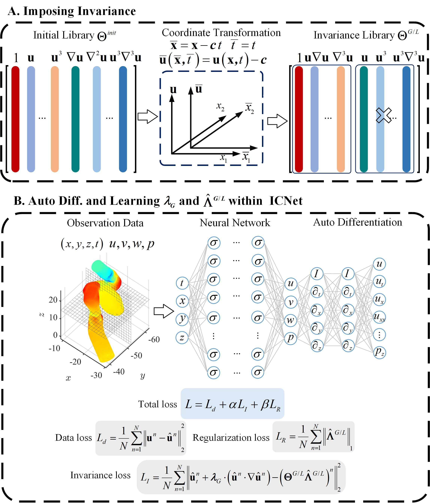

# ICNet: Invariance Constrained Discovery for Partial Differential Equations

## Background 1

The physical laws described by partial differential equations are widely present in the natural environment. The calculation and simulation of physical systems rely on accurate basic equations and models. The traditional method of deriving control equations is mainly based on first principles, such as the Navier-Stokes equations based on momentum conservation. The difficulty of traditional methods lies in the fact that models and equations of complex dynamics are often difficult to derive, such as multiphase flow, neuroscience, and biological science. In the era of big data, mining control equations from data through artificial intelligence methods has become a new research idea. The existing data-driven method of discovering equations still has certain limitations. At present, there is a lack of guiding principles when constructing candidates for a complete library, and it is impossible to ensure that the discovered equations meet basic physical requirements. At the same time, when dealing with complex multidimensional systems, the candidate library is too large, and it is difficult to discover simple and accurate equations. Considering that basic physical requirements (invariance, conservation, etc.) are the cornerstones of many physical problems, it is necessary to study how to impose physical constraints in discovering equations.

## Model framework

The model framework is as shown in the following figure:



In the figure: A. Schematic diagram of the derivation process of embedding invariance constraints into the framework of partial differential equation discovery; B. The neural network module of partial differential equation discovery with invariance constraints uses neural network automatic differentiation to obtain the partial derivatives required to construct the invariance candidate function. The loss function includes data loss, invariance loss, and regularization loss for enhancing sparsity.

## QuickStart

Dataset download link: [ICNet/dataset](https://download-mindspore.osinfra.cn/mindscience/mindflow/dataset/applications/research/ICNet/)., Save the dataset to `./dataset`.

The case provides two training methods

- Run Option 1: Call `train_GI_1D_KS.py` from command line

  ```python
  # Call `train.py` from command line
  python train.py --device_target GPU --device_id 0 --config_file_path ./config/ICNet_KS.yaml

  ```

  `--config_path` indicates the path of the parameter file. Default path "./config/config.yaml".

  In the "./config/config.yaml" parameter file:

  'lambda_GP' represents the gradient penalty coefficient, with a default value of 10;

  'critic_model_lr' represents the learning rate of discriminator, with a default value of 0.00025;

  'gan_model_lr' represents the learning rate of generator, with a default value of 0.004；

  'case' represents the case name;

  'device' representsthe type of computing platform used, with options of 'CPU', 'GPU', or 'Ascend', with a default value of 'GPU';

  'device_id' represents the index of NPU or GPU. Default 0;

  'network_size' represents the size of network；

  'learning_rate' represents the learning rate；

  'epochs' represents number of training iterations；

- Run Option 2: Run Jupyter Notebook

  You can use [chinese](./ICNet_CN.ipynb) or [English](./ICNet.ipynb) Jupyter Notebook to run the training and evaluation code line-by-line.

## Case description

The case run by the Jupyter Notebook named ICNet is the one-dimensional Kuramoto–Sivashinsky equation with Galileo invariance constraints. In addition to providing the running code and data of this equation, this open source also provides the code and data of the two-dimensional Burgers equation (Galileo invariance), the two-dimensional univariate Klein-Gordon equation (Lorentz invariance), and the two-dimensional coupled variable Klein-Gordon equation (Lorentz invariance). You can call the `train_GI_2D_Burgers.py`, `train_LI_2D_SKG.py` and `train_LI_2D_CKG.py` scripts in the command line to run them directly.

## Performance

|        Parameters         |           GPU           |        NPU         |
|:-------------------------:|:-----------------------:|:------------------:|
|         hardware          | NVIDIA 1080Ti(memory 11G) | Ascend(memory 32G) |
|     MindSpore version     |         2.2.14          |       2.2.14       |
|         data_size         |          12800          |       12800        |
|        batch_size         |           1             |        1           |
|          epochs           |           60w           |        60w         |
|         optimizer         |         Adam            |      Adam          |
|  total loss (MSE)         |         1.8e-3          |       9.4e-4       |
|  data loss (MSE)          |         1.3e-3          |       3.7e-4       |
| invariance loss (MSE)     |         5.5e-4          |       5.7e-4       |
|  regularization loss (MSE)|         1.9e-7          |       1.8e-7       |
|       speed(s/step)       |          0.27           |        0.041       |

## Contributor

gitee id: [chenchao2024](https://gitee.com/chenchao2024)
email: chenchao@isrc.iscas.ac.cn

## Reference

chen c, Li H, Jin X. An invariance constrained deep learning network for partial differential equation discovery[J]. Physics of Fluids, 2043, 65: 471202.  https://doi.org10.1063/5.02026339
