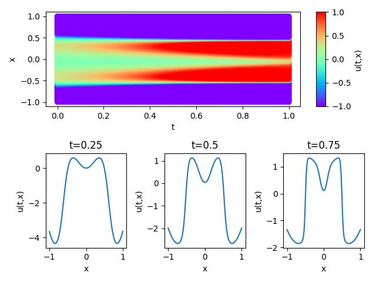

ENGLISH | [简体中文](README_CN.md)

# Allen Cahn

## Overview

The Allen-Cahn euqation (after John W. Cahn and Sam Allen) is a reaction-diffusion equation of mathematical physics which describes the process of phase separation in multi-component alloy systems including order-disorder transitions. The equation describes the time evolution of a scalar-valued state variable $\eta$ on a domain $\Omega$ during a time interval $T$. In this case, MindFLow fluid simulation suite is used to solve the Allen Cahn's equation based on the physical-driven PINNs (Physics INformed Neural Networks) method.

## QuickStart

You can download dataset from [dataset](https://download.mindspore.cn/mindscience/mindflow/dataset/applications/research/allen_cahn/) for model evaluation. Save these dataset at `./dataset`.

### Run Option 1: Call `train.py` from command line

```shell
python train.py --config_file_path ./configs/allen_cahn_cfg.yaml --mode GRAPH --device_target Ascend --device_id 0
```

where:

`--config_file_path` indicates the path of the parameter file. Default './configs/allen_cahn_cfg.yaml'；

`--mode` is the running mode. 'GRAPH' indicates static graph mode. 'PYNATIVE' indicates dynamic graph mode. You can refer to [MindSpore official website](https://www.mindspore.cn/docs/en/r2.0.0-alpha/design/dynamic_graph_and_static_graph.html) for details.Default 'GRAPH'.

`--device_target` indicates the computing platform. You can choose 'Ascend' or 'GPU'. Default 'Ascend'.

`--device_id` indicates the index of NPU or GPU. Default 0.

### Run Option 2: Run Jupyter Notebook

You can use [Chinese](allen_cahn_CN.ipynb) or [English](allen_cahn.ipynb) Jupyter Notebook to run the training and evaluation code line-by-line.

## Results



## Performance

|        Parameter         |        Ascend               |    GPU       |
|:----------------------:|:--------------------------:|:---------------:|
|     Hardware         |     Ascend      |      NVIDIA GeForce RTX 4070 Ti       |
|     MindSpore版本   |        2.0.0rc1            |      2.0.0rc1       |
|        train loss      |       0.12                |       1.2e-06       |
|        valid loss      |        0.2               |       0.005    |
|        speed          |     0.6s/epoch       |    0.09s/epoch  |

## Contributor

gitee id：[yanglin2023](https://gitee.com/yanglin2023)

email: lucky@lucky9.cyou
