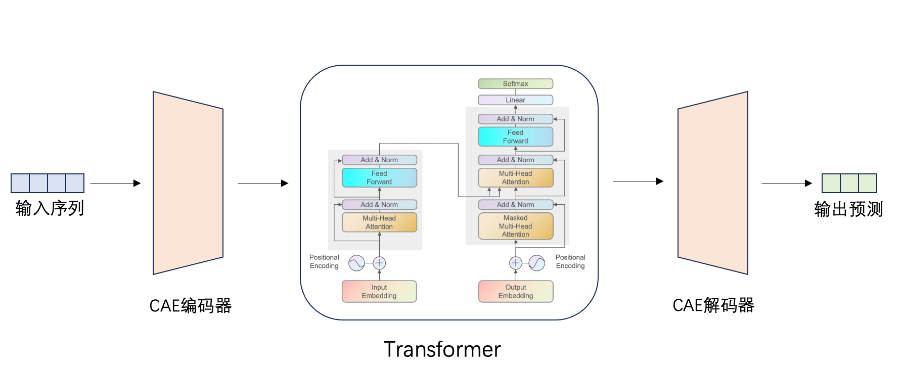

# CAE-Transformer流场预测模型

## 概述

### 背景介绍

降阶模型可有效降低使用CFD方法的设计成本和周期。对于复杂的可压缩流动，使用POD等线性方法进行流场降维，需要大量的模态才能保证流场重建的精度，而采用非线性降维方法能够有效减少所需模态数。卷积自编码器(CAE)是一种由编码器和解码器组成的神经网络，能够实现数据降维和重构，可看作是POD方法的非线性拓展。采用CAE进行流场数据的非线性降维，同时使用Transformer进行流场状态的时间演化。对于非定常可压缩流动，“CAE-Transformer”降阶模型能够在使用较少自由变量数与较短计算周期的前提下获得较高的重构和预测精度。

### 模型架构

CAE-Transformer的基本框架主要基于[论文1](https://doi.org/10.13700/j.bh.1001-5965.2022.0085)和[论文2](https://doi.org/10.1609/aaai.v35i12.17325)，其由CAE和Transformer组成，其中CAE中的编码器降低时间序列流场的维数，实现特征提取，Transformer学习低维时空特征并进行预测，CAE中的解码器实现流场重建：

+ 输入：输入一段时间的流场

+ 压缩：通过CAE的编码器对流场进行降维，提取高维时空流动特征；

+ 演化：通过Transformer学习低维空间流场时空特征的演变，预测下一时刻；

+ 重建：通过CAE的解码器将预测的流场低维特征恢复到高维空间；

+ 输出：输出对下一时刻瞬态流场的预测结果。

### 数据集

来源：二维圆柱绕流数值仿真流场数据，由北京航空航天大学航空科学与工程学院于剑副教授团队提供。

数据说明：
数据集针对10个雷诺数的圆柱绕流进行了数值模拟，每个雷诺数下的流场数据包含401个时间步，每个时间步的流场数据为256*256的二维流场，每个变量的数据类型为float32，数据集总大小为约1.96GB。

数据集下载链接:
[2D_cylinder_flow.npy](https://download.mindspore.cn/mindscience/mindflow/dataset/applications/data_driven/cae-transformer/2D_cylinder_flow.npy)

## 快速开始

### 训练方式一：在命令行中调用`train.py`脚本

该模型单机单卡进行训练，根据训练任务需求，直接执行train.py即可开始训练CAE和Transformer网络
在开始训练前需要在config.yaml中设置数据读取保存路径和训练参数等相关参数：

`python -u train.py --mode GRAPH --device_target GPU --device_id 0 --config_file_path ./config.yaml`

其中，

`--mode`表示运行的模式，'GRAPH'表示静态图模式, 'PYNATIVE'表示动态图模式，默认值'GRAPH'；

`--device_target`表示使用的计算平台类型，可以选择'Ascend'或'GPU'，默认值'GPU'；

`--device_id`表示使用的计算卡编号，可按照实际情况填写，默认值0；

`--config_file_path`表示参数文件的路径，默认值'./config.yaml'。

### 训练方式二：运行Jupyter Notebook

您可以使用中英文版本的Jupyter Notebook逐行运行训练和验证代码：

中文版本: [train_CN.ipynb](./cae_transformer_CN.ipynb)

英文版本: [train.ipynb](./cae_transformer.ipynb)

## 预测结果可视化

根据训练条件，执行eval.py进行模型推理，此操作将会根据训练结果的权重参数文件，预测输出CAE的降维、重构数据，Transformer的演化数据和CAE-Transformer预测的流场数据。

此操作还会分别计算CAE的重构数据和CAE-Transformer预测的流场数据的平均相对误差：

`python -u eval.py`

上述后处理输出路径默认为`./prediction_result`，可在config.yaml里修改保存路径。

## 结果展示

以下为CAE-Transformer和真实值的对比：

<figure class="harf">
    
</figure>

结果展现了流场中不同位置的速度随时间的变化情况。预测结果与真实值的平均相对误差为6.3e-06。

## 性能

|        参数         |        NPU               |    GPU       |
|:----------------------:|:--------------------------:|:---------------:|
|     硬件资源         |     Ascend, 显存32G      |      NVIDIA V100, 显存32G       |
|     MindSpore版本   |        2.0.0             |      2.0.0       |
| 数据集 | [Cylinder_flow数据集](https://download.mindspore.cn/mindscience/mindflow/dataset/applications/data_driven/cae-transformer/2D_cylinder_flow.npy) | [Cylinder_flow数据集](https://download.mindspore.cn/mindscience/mindflow/dataset/applications/data_driven/cae-transformer/2D_cylinder_flow.npy) |
|  参数量 | 3.8e5 | 3.8e5 |
|  训练参数 | batch_size=32, epochs=100, steps_per_epoch=97 | batch_size=32, epochs=100, steps_per_epoch=97 |
|  测试参数 | batch_size=32 | batch_size=32 |
|  优化器 | Adam | Adam |
|        训练损失      |        1.21e-6          |   1.21e-6       |
|        验证损失      |          3.85e-7          |   3.86e-7           |
|        速度          |     216毫秒/步       |   220毫秒/步  |

## Contributor

代码贡献者的gitee id: [Marc-Antoine-6258](https://gitee.com/Marc-Antoine-6258)

代码贡献者的email: 775493010@qq.com
