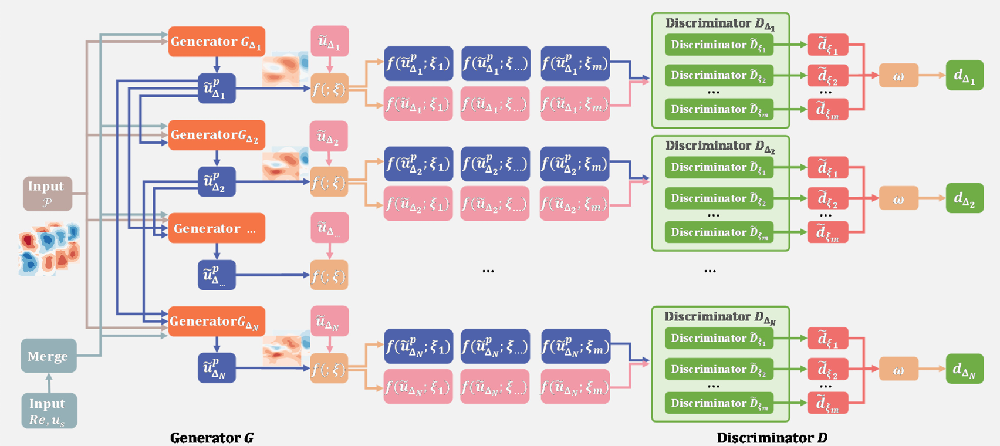
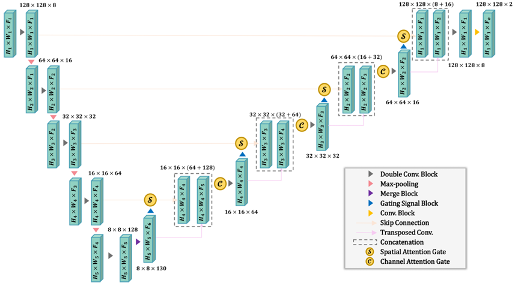
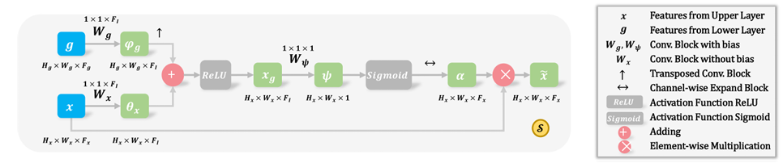
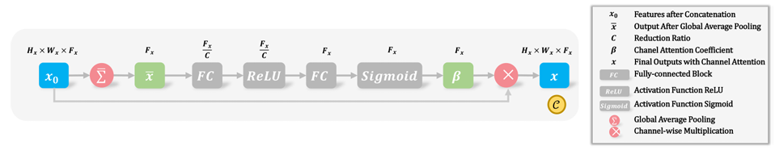

# Cascade-Net预测圆柱尾迹脉动速度时空场

## 背景介绍

在湍流时空演化过程中，脉动速度场包含了一系列重要的流体物理过程，如分离、转捩和能量传递。在高雷诺数下，脉动速度场表现出明显的非线性特征。湍流尾迹中存在着从最大尺度到最小尺度的涡结构，这些流体运动模式构成了复杂的流场结构特征。在这些流场结构中，能量从大尺度结构向小尺度结构转移的过程被称为能量级串物理原理。受到这一原理的启发，可以将小尺度预测问题转化为由大尺度向小尺度逐级预测问题。

## 模型框架

模型框架如下图所示：



图中，Generater为具有空间和通道注意力门的U-Net结构，其框架如下图所示：



其中空间注意力门*S*和通道注意力门*C*示意图如下：





## 快速开始

数据集下载地址：[Cascade_Net/dataset](https://download-mindspore.osinfra.cn/mindscience/mindflow/dataset/applications/research/Cascade_Net/). 将数据集保存在`./dataset`路径下。

案例提供两种训练方式

- 训练方式一：在命令行中调用`train.py`脚本

  ```python
  # 在命令行调用train.py进行训练示例
  python train.py --device_target GPU --device_id 0 --config_file_path ./config/Cascade-Net.yaml

  ```

  `--config_path`表示配置文件的路径，默认值为 "./config/config.yaml"。

  在 "./config/config.yaml" 配置文件中：

  'lambda_GP' 表示梯度惩罚系数，默认值为10；

  'critic_model_lr' 表示判别器学习率，默认值为0.00025；

  'gan_model_lr' 表示生成器学习率，默认值为0.004；

- 训练方式二：运行Jupyter Notebook

  您可以使用[中文版](./Cascade-Net_CN.ipynb) 和[英文版](./Cascade-Net.ipynb) Jupyter Notebook逐行运行训练和验证代码。

## 性能

|         参数          |           GPU           |        NPU         |
|:-------------------:|:-----------------------:|:------------------:|
|         硬件          | NVIDIA 3090(memory 24G) | Ascend(memory 32G) |
|     MindSpore版本     |         2.2.14          |       2.2.14       |
|        数据大小         |          10792          |       10792        |
|       batch大小       |           128           |        128         |
|        训练步数         |           300           |        300         |
|         优化器         |         RMSProp         |      RMSProp       |
|  scale I 训练精度(MAE)  |         3.4e-2          |       4.6e-2       |
|  scale I 测试精度(MAE)  |         5.4e-2          |       5.2e-2       |
| scale II 训练精度(MAE)  |         3.2e-2          |       3.6e-2       |
| scale II 测试精度(MAE)  |         5.2e-2          |       5.0e-2       |
| scale III 训练精度(MAE) |         3.3e-2          |       3.7e-2       |
| scale III 测试精度(MAE) |         5.4e-2          |       5.2e-2       |
| scale IV 训练精度(MAE)  |         3.6e-2          |       4.1e-2       |
| scale IV 测试精度(MAE)  |         5.5e-2          |       5.4e-2       |
|     性能(s/step)      |          2.60           |        3.94        |

## 贡献者

gitee id: [GQEm](https://gitee.com/guoqicheng2024)
email: qicheng@isrc.iscas.ac.cn

## 参考文献

Mi J, Jin X, Li H. Cascade-Net for predicting cylinder wake at Reynolds numbers ranging from subcritical to supercritical regime[J]. Physics of Fluids, 2023, 35: 075132.  https://doi.org/10.1063/5.0155649
