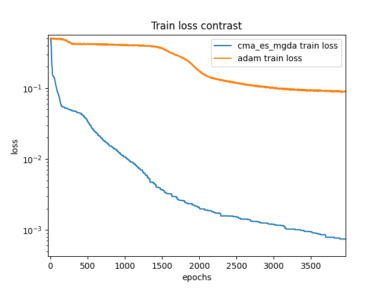
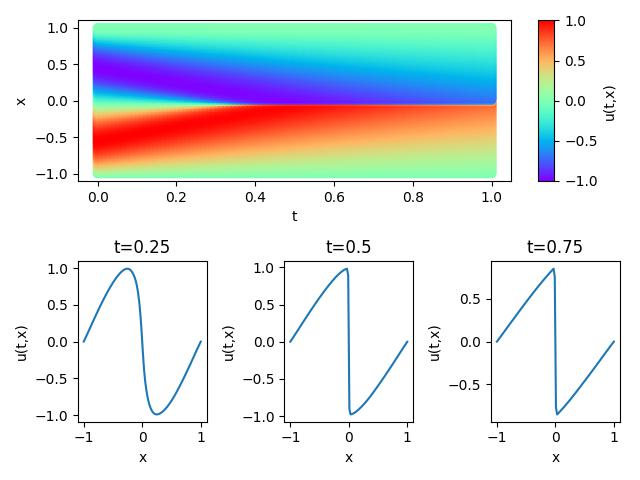
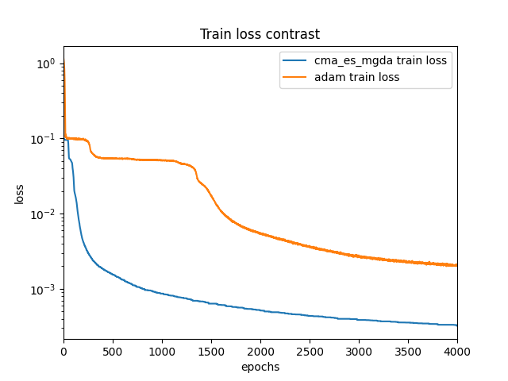
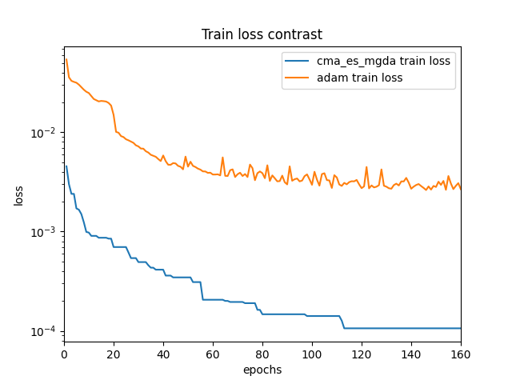
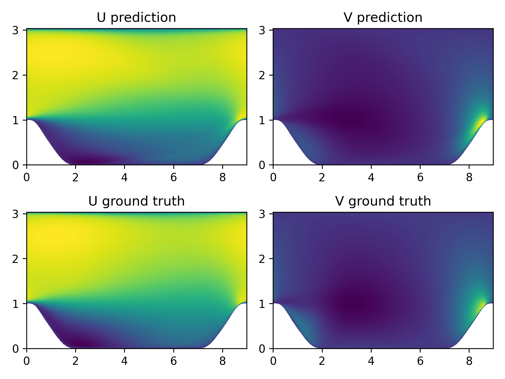

[ENGLISH](README.md) | 简体中文

# CMA-ES结合多目标梯度下降算法训练PINNS神经网络

## 概述

### 整体背景

PINNs 的训练往往需要求解一个高度非线性、非凸的优化问题，并且损失函数中权重值的设置对网络训练效果有显著影响。本案例将免梯度优化算法—— CMA-ES和多目标梯度优化算法（mgda）相结合，克服优化中的高度非凸、梯度异常难题。

### 技术路线

算法的整体框架为CMA-ES算法，其中嵌入了多目标梯度优化算法。
CMA-ES算法主要参考文章[《Neuroevolution Surpasses Stochastic Gradient Descent for Physics-Informed Neural Networks》](https://arxiv.org/abs/2212.07624)以及[cma代码包](https://pypi.org/project/cma/)，mgda的代码实现参考了[代码](https://github.com/isl-org/MultiObjectiveOptimization)。

算法流程如下：

- step1: 构建train_dataset用于多目标梯度下降中的训练，构建train_dataset_loss用于计算给定解的适应度（即loss）
- step2: 构建神经网络模型、优化器
- step3：通过CMA-ES算法、从高斯分布中随机筛选出一定数目的参数后代
- step4：随机从筛选出的后代中选取一定比例的后代进行多目标梯度下降、并替换原有后代
- step5: 计算此时的后代适应度
- step6: 根据后代适应度和参数后代对CMA-ES算法中的参数进行更新
- step7: 重复step3~step6直至满足停止条件

### 验证方程

该训练神经网络的方法在本方法在Burgers方程和Navier-Stokes方程两个方程上进行验证。

#### Burgers方程简介

伯格斯方程（Burgers' equation）是一个模拟冲击波的传播和反射的非线性偏微分方程。

Burgers'方程的形式如下：

$$
u_t + uu_x = \epsilon u_{xx}, \quad x \in[-1,1], t \in[0, T],
$$

其中$\epsilon=0.01/\pi$，等号左边为对流项，右边为耗散项，本案例使用迪利克雷边界条件和正弦函数的初始条件，形式如下：

$$
u(t, -1) = u(t, 1) = 0,
$$

$$
u(0, x) = -sin(\pi x),
$$

本案例利用PINNs方法学习位置和时间到相应物理量的映射$(x, t) \mapsto u$，实现Burgers'方程的求解。

#### Navier-Stokes方程简介

圆柱绕流，即二维圆柱低速非定常绕流，流动特性与雷诺数`Re`有关。

纳维-斯托克斯方程（Navier-Stokes equation），简称`N-S`方程，是流体力学领域的经典偏微分方程，在粘性不可压缩情况下，无量纲`N-S`方程的形式如下：

$$
\frac{\partial u}{\partial x} + \frac{\partial v}{\partial y} = 0
$$

$$
\frac{\partial u} {\partial t} + u \frac{\partial u}{\partial x} + v \frac{\partial u}{\partial y} = - \frac{\partial p}{\partial x} + \frac{1} {Re} (\frac{\partial^2u}{\partial x^2} + \frac{\partial^2u}{\partial y^2})
$$

$$
\frac{\partial v} {\partial t} + u \frac{\partial v}{\partial x} + v \frac{\partial v}{\partial y} = - \frac{\partial p}{\partial y} + \frac{1} {Re} (\frac{\partial^2v}{\partial x^2} + \frac{\partial^2v}{\partial y^2})
$$

其中，`Re`表示雷诺数。

本案例利用PINNs方法学习位置和时间到相应流场物理量的映射，实现`N-S`方程的求解：

$$
(x, y, t) \mapsto (u, v, p)
$$

#### 雷诺平均Navier-Stokes方程

雷诺平均Navier-Stokes方程求解周期山流动问题是流体力学和气象学领域中的一个经典数值模拟案例，用于研究空气或流体在周期性山地地形上的流动行为。雷诺平均动量方程如下：

$$\rho \bar{u}_j \frac{\partial \bar{u}_i}{\partial x_j}=\rho \bar{f}_i + \frac{\partial}{\partial x_j}\left[-\bar{p} {\delta \_ {i j}+}\mu\left(\frac{\partial \bar{u}_i}{\partial x_j}+\frac{\partial \bar{u}_j}{\partial x_i}\right)-\rho \overline{u_i^{\prime} u_j^{\prime}}\right]$$

## 快速开始

从[physics_driven/burgers_pinns/dataset](https://download.mindspore.cn/mindscience/mindflow/dataset/applications/physics_driven/burgers_pinns/dataset/)、[physics_driven/cylinder_flow_pinns/dataset](https://download.mindspore.cn/mindscience/mindflow/dataset/applications/physics_driven/flow_past_cylinder/dataset/) 中下载验证所需要的数据集，并保存在`./dataset`目录下。

### 训练方式一：在命令行中调用`train.py`脚本

```shell
python train.py --case burgers --mode GRAPH --device_target Ascend --device_id 0 --config_file_path ./configs/burgers.yaml
```

其中，
`--case`表示案例的选择，'burgers'表示选择burgers方程，'cylinder_flow'表示选择Navier-Stokes方程的圆柱绕流数据集，'periodic_hill'表示选择雷诺平均Navier-Stokes方程对周期山数据集进行训练。

`--mode`表示运行的模式，'GRAPH'表示静态图模式, 'PYNATIVE'表示动态图模式，详见[MindSpore官网](https://www.mindspore.cn/docs/zh-CN/r2.0.0-alpha/design/dynamic_graph_and_static_graph.html?highlight=pynative)，默认值'GRAPH'；

`--device_target`表示使用的计算平台类型，可以选择'Ascend'或'GPU'，默认值'Ascend'；

`--device_id`表示使用的计算卡编号，可按照实际情况填写，默认值0；

`--config_file_path`表示参数文件的路径，默认值'./configs/burgers.yaml'；

### 训练方式二：运行Jupyter Notebook

您可以使用[中文版](./cma_es_mgda_CN.ipynb)和[英文版](./cma_es_mgda.ipynb)Jupyter Notebook逐行运行训练和验证代码。

## 结果展示

### Burgers方程上的验证效果

对相同神经网络组成（5层神经网络、每层20个神经元）的PINNS进行4000个epoch的训练，蓝色曲线为采用本方法（cma_es遗传算法与多目标梯度下降相结合方法）的loss曲线，橙色曲线为采用[Adam](https://gitee.com/mindspore/mindscience/tree/master/MindFlow/applications/physics_driven/burgers)进行训练的loss曲线，充分说明了本方法的有效性：



经过4000个epoch的训练后，模型预测值如下图所示：



### Navier-Stokes方程上的验证效果

对相同神经网络组成（5层神经网络、每层20个神经元）的PINNS进行4000个epoch的训练，蓝色曲线为采用本方法（cma_es遗传算法与多目标梯度下降相结合方法）的loss曲线，橙色曲线为采用[Adam](https://gitee.com/mindspore/mindscience/tree/master/MindFlow/applications/physics_driven/navier_stokes/cylinder_flow_forward)进行训练的loss曲线，充分说明了本方法的有效性：



经过4000个epoch的训练后，模型预测值与真实值对比如下图所示：


### 雷诺平均Navier-Stokes方程上的验证效果

对相同神经网络组成（5层神经网络、每层64个神经元）的PINNS进行160个epoch的训练，蓝色曲线为采用本方法（cma_es遗传算法与多目标梯度下降相结合方法）的loss曲线，橙色曲线为采用Adam进行训练的loss曲线，充分说明了本方法的有效性：



经过160个epoch的训练后，模型预测值与真实值对比如下图所示：



## 性能

### Burgers方程

|      参数      |                            NPU                            |                             GPU                              |
| :------------: | :----------------------------------------------------------: | :----------------------------------------------------------: |
|    硬件资源    |           Ascend, 显存32G           |                     NVIDIA V100 显存32G                      |
| MindSpore版本  |                            2.0.0                             |                            2.0.0                             |
|     数据集     | [Burgers数据集](https://download.mindspore.cn/mindscience/mindflow/dataset/applications/physics_driven/burgers_pinns/) | [Burgers数据集](https://download.mindspore.cn/mindscience/mindflow/dataset/applications/physics_driven/burgers_pinns/) |
|     参数量     |                             2751                             |                             2751                             |
|    训练参数    |       batch_size=8192, steps_per_epoch=1, epochs=4000        |       batch_size=8192, steps_per_epoch=1, epochs=4000        |
|    测试参数    |                   batch_size=8192, steps=1                    |                   batch_size=8192, steps=1                    |
|     优化器     |                             cma_es_mgda                             |                             cma_es_mgda                             |
| 训练损失(MSE)  |                           6.44e-4                            |                           7.28e-4                            |
| 验证损失(RMSE) |                            0.020                             |                            0.058                             |
| 速度(ms/step)  |                             970                              |                             1330                             |

### Navier-Stokes方程

|      参数      | NPU                                                       | GPU                                                          |
| :------------: | :------------------------------------------------------------: | :------------------------------------------------------------: |
|    硬件资源    | Ascend, 显存32G                     | NVIDIA V100 显存32G                                          |
| MindSpore版本  | 2.0.0                                                        | 2.0.0                                                        |
|     数据集     | [cylinder_flow数据集](https://download.mindspore.cn/mindscience/mindflow/dataset/applications/physics_driven/flow_past_cylinder/dataset/) | [cylinder_flow数据集](https://download.mindspore.cn/mindscience/mindflow/dataset/applications/physics_driven/flow_past_cylinder/dataset/) |
|     参数量     | 17411                                                        | 17411                                                        |
|    训练参数    | batch_size=8192, steps_per_epoch=2, epochs=4000              | batch_size=8192, steps_per_epoch=2, epochs=4000              |
|    测试参数    | batch_size=8192, steps=2                                      | batch_size=8192, steps=2                                      |
|     优化器     | cma_es_mgda                                                         | cma_es_mgda                                                         |
| 训练损失(MSE)  | 3.46e-4                                                      | 3.23e-4                                                      |
| 验证损失(RMSE) | 0.091                                                        | 0.124                                                        |
| 速度(ms/step)  | 1220                                                         | 1150                                                         |

### 雷诺平均Navier-Stokes方程方程

|      参数      | NPU                                                       | GPU                                                          |
| :------------: | :------------------------------------------------------------: | :------------------------------------------------------------: |
|    硬件资源    | Ascend, 显存32G                     | NVIDIA V100 显存32G                                          |
| MindSpore版本  | 2.0.0                                                        | 2.0.0                                                        |
|     数据集     | [Periodic_hill数据集](https://download.mindspore.cn/mindscience/mindflow/dataset/periodic_hill_2d/) | [Periodic_hill数据集](https://download.mindspore.cn/mindscience/mindflow/dataset/periodic_hill_2d/) |
|     参数量     | 17383                                                        | 17383                                                        |
|    训练参数    | batch_size=1000, steps_per_epoch=80, epochs=160              | batch_size=1000, steps_per_epoch=80, epochs=160              |
|    测试参数    | batch_size=20000, steps=4                                     | batch_size=20000, steps=4                                     |
|     优化器     | cma_es_mgda                                                         | cma_es_mgda                                                         |
| 训练损失(MSE)  | 8.92e-05                                                     | 1.06e-4                                                      |
| 验证损失(RMSE) | 0.115                                                        | 0.125                                                        |
| 速度(ms/step)  | 1650                                                         | 2250                                                         |

## Contributor

gitee id: [lin109](https://gitee.com/lin109)

email: 1597702543@qq.com