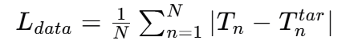
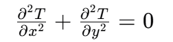
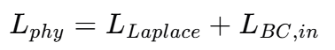
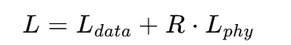
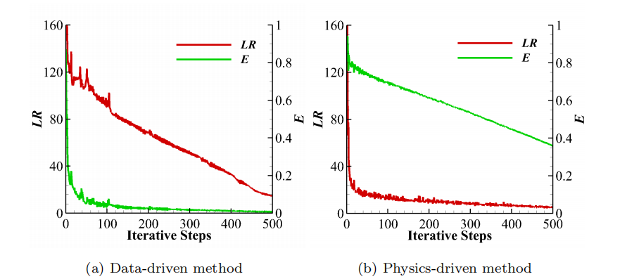
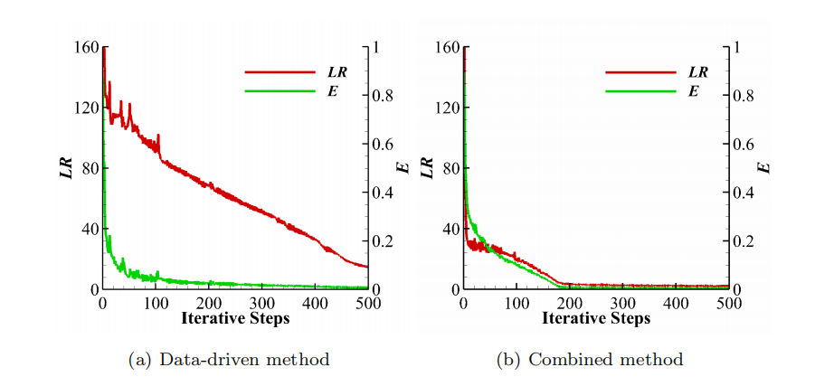
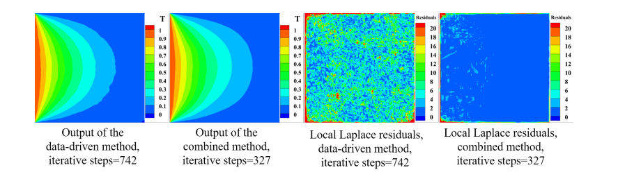
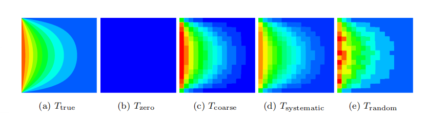
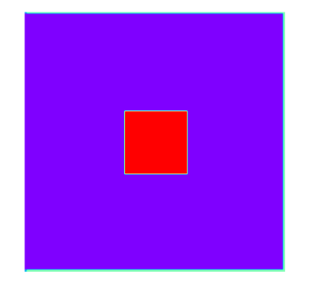
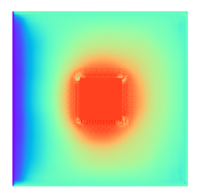

# Physical Field Prediction Model Driven by Data and Physics Hybridization

## Overview (Background)

We explore a method that combines data-driven and physics-driven approaches using deep convolutional neural networks (CNNs) to predict steady-state heat conduction problems. In traditional numerical methods (such as finite volume/element/difference methods, e.g., computational fluid dynamics CFD), computing the solution of physical fields typically requires calculations for a large number of candidate designs or operating conditions, leading to significant computational costs. In contrast, neural networks in machine learning can serve as alternative models to obtain sufficiently accurate solutions at realistic computational costs. We choose the solution of steady-state heat conduction as a case study, whose physical laws can be represented by a second-order partial differential equation (PDE), namely the Laplace equation. Focusing on this problem, we will first use the CNN architecture and original data-driven and physics-driven methods.

### Objective

The objective of the case is to compare the application of data-driven and physics-driven learning methods in deep CNNs and to propose a learning method that combines these two approaches to accelerate the learning process and improve the accuracy of the solution. Specifically, the goal is to enhance the efficiency and accuracy of predicting physical fields by introducing a weighted loss function that leverages both reference data and physical equations to drive learning.

### Data Acquisition and Processing

- In the data-driven approach, the dataset is generated through traditional numerical solutions (such as the finite volume method FVM), with each numerical solution interpolated onto a 128×128 grid to match the resolution of the learning domain.
- The physics-driven approach (such as Physics-Informed Neural Networks PINN) does not require labeled data but instead trains the model by incorporating partial differential equations (PDEs) into the loss function to obtain solutions that satisfy the laws of physics.
- In the proposed hybrid method, two different datasets are used: one with a single sample and another with multiple samples. The datasets are obtained by varying the temperatures of 5 boundaries (0/0.5/1), the shape of the hole (square/circle), and its position (9 different locations), resulting in a total of 35×2×9=4374 samples. These samples are randomly divided into training and testing sets with an 80/20 ratio.
- Data augmentation is achieved through basic geometric transformations (such as flipping and rotation), which, while not adding as much variability as collecting other configurations, are inexpensive and quick methods to reduce overfitting and improve the generalization of the trained model.

The dataset processing involves inputting the geometry and boundary conditions as square matrices into the CNN architecture and then encoding them layer by layer through convolutional computation. During the encoding process, the values of the input matrix are progressively downsampled, and large-scale information is extracted as the number of feature channels increases. Eventually, a compressed encoding of the input is obtained, represented as a 1×1 size feature map with 256 channels. Then, through a series of decoding layers that mirror the encoding process, the solution is reconstructed with increasing spatial resolution and decreasing feature channel numbers. The final output has only one channel, providing the temperature field. Additionally, there are connection operations between the encoding and decoding blocks, which effectively double the number of feature channels at each decoding block and enable the neural network to consider information from the encoding layers.

#### Loss Function of the Original Data-Driven Method (Mean Absolute Error, MAE)

#### Physical Law of Heat Conduction, the Steady-State Heat Conduction Equation (Laplace Equation)

#### Total Physical Loss of the Physics-Driven Method

#### Weighted Loss Function of the Combined Method

Where R is a manually selected constant hyperparameter to adjust the values of different loss terms.

### Comparison of the Original Data-Driven Method and the Combined Method

Changes in the Laplace residual (LR) and overall error (E) when using the original data-driven method and the combined method in single-case training. The combined method significantly improves the convergence speed of LR, indicating that the combined method can learn solutions that satisfy the laws of physics more quickly. The combined method reduces the number of iterations from 684 steps of the original data-driven method to 267 steps, accelerating by 60.9%.

CNN outputs and local Laplace residuals obtained using the original data-driven method and the combined method. When the overall errors (E) of the two methods are similar, the local structure obtained by the combined method has better physical consistency, i.e., smaller local Laplace residuals and smoother temperature distribution contours.

This figure shows five different reference targets, including the true temperature distribution (Ttrue), zero temperature distribution (Tzero), and three temperature distributions with different roughness (Tcoarse, Tsystematic, Trandom). In physics-driven based training, using reference targets with different roughness, the combined method can improve training speed by up to 49.0% compared to the original physics-driven method.

## Quick Start

Download the required dataset from [dataset](https://download.mindspore.cn/mindscience/mindflow/dataset/applications/research/allen_cahn/) and save it in the `./dataset` directory.

### Training Method 1: Invoking the `train.py` script from the command line

`python train.py --mode GRAPH --device_target Ascend --device_id 0 --config_file_path ./configs/combined_methods.yaml`

Where,
`--mode` indicates the running mode, 'GRAPH' for static graph mode, 'PYNATIVE' for dynamic graph mode, see [MindSpore Official Website](https://www.mindspore.cn/docs/zh-CN/r2.0.0-alpha/design/dynamic_graph_and_static_graph.html?highlight=pynative) for details, with a default value of 'GRAPH';

`--device_target` indicates the type of computing platform to use, with options 'Ascend' or 'GPU', with a default value of 'Ascend';

`--device_id` indicates the number of the computing card to use, which can be filled in according to the actual situation, with a default value of 0;

`--config_file_path` indicates the path to the parameter file, with a default value of './configs/combined_methods.yaml';

The computing platform type requires the use of Ascend.

### Training Method 2: Running Jupyter Notebook

You can use the [Chinese version](allen_cahn_CN.ipynb) and [English version](allen_cahn.ipynb) Jupyter Notebook to run the training and verification code line by line.

## Results Presentation

The first image is the input initial temperature field, and the second image is the predicted temperature field.

## Performance

| Parameter          | Acsend          | GPU             |
| ------------------ | --------------- | --------------- |
| Hardware Resources | Ascend          | 910A            |
| MindSpore Version  | MindSpore2.2.12 | MindSpore2.2.12 |
| Training Loss      | 0.001           | 0.001           |
| Verification Loss  | 0.001           | 0.001           |
| Speed              | 0.9s/epoch      | 0.9s/epoch      |

## Contributor

gitee id: ZYF00000

email: zhzyf@zua.edu.cn