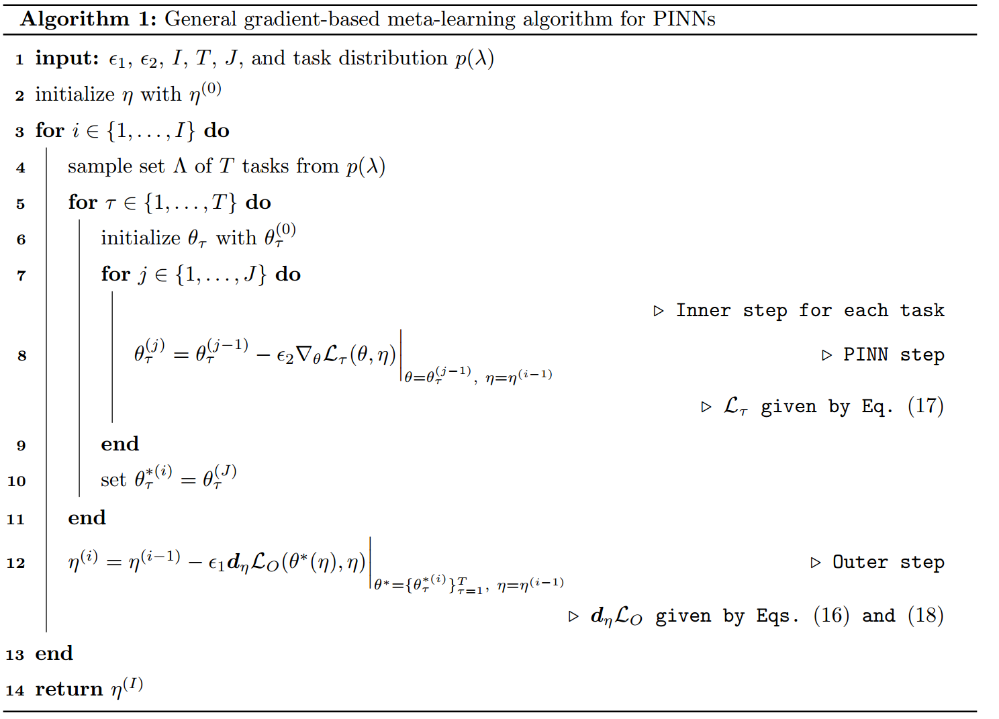
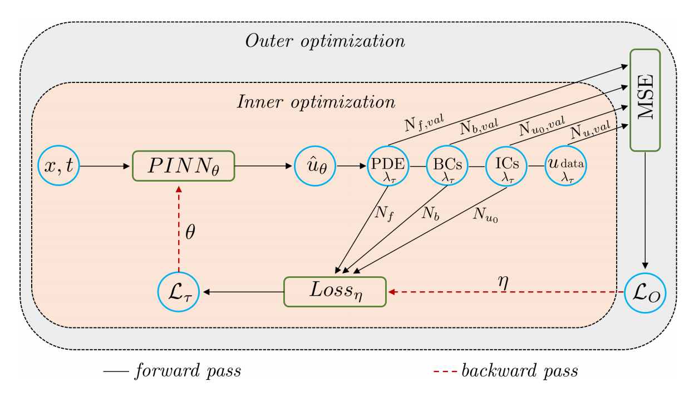
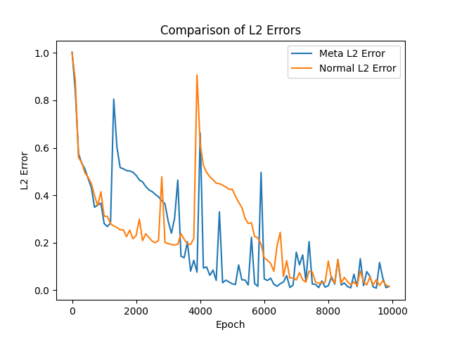
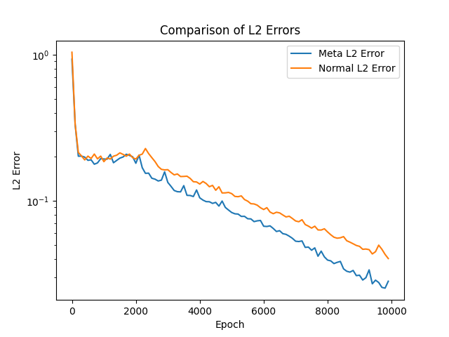
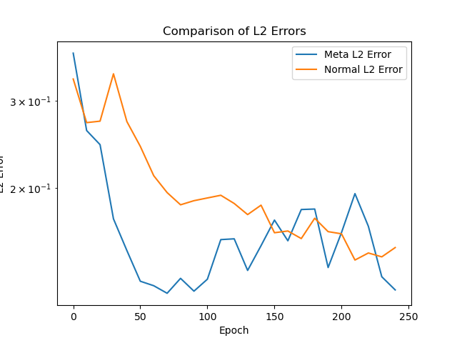
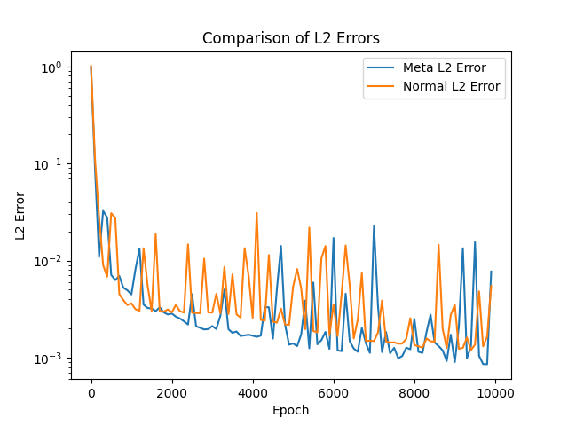

[ENGLISH](README.md) | 简体中文

# Meta-pinns

## 概述

在不同的物理应用场景下，选取合适的PINNs 损失函数目前仍主要依赖于经验和手工设计。为了解决上述问题，Apostolos F Psarosa等人在论文[Meta-learning PINN loss functions](https://www.sciencedirect.com/science/article/pii/S0021999122001838)中提出了Meta-PINNs 算法，该算法通过在训练中以梯度下降的方式更新作用于损失函数的超参，从而训练出一组适用于一类同族偏微分方程的超参数。

### 整体背景

传统上，在神经网络训练中，损失函数选择对于模型的收敛速度和性能至关重要。Apostolos F Psarosa等人提出了将损失函数作为超参数来选择的想法，并通过元学习的方式来优化损失函数。

### 技术路线

具体来讲，该算法在元训练阶段主要分为内部优化和外部优化，算法流程如下：

- 从任务分布中抽取参数化偏微分方程（PDE）任务，并且PINNs被随机重新初始化
- 内部优化阶段，使用当前学习到的损失函数对PINN进行几次迭代求解，跟踪学习到的损失参数的梯度，更新PINN模型的参数
- 外部优化阶段，根据最终（优化后）的PINN参数的均方误差（MSE），更新损失函数参数。

完成元训练后，使用得到的学习到的损失函数进行元测试，即解决未见过的任务直到收敛。

算法伪代码如下所示：


算法示例图如下所示：


### 验证方程

该元学习方法在一维的Burgers方程、一维线性化burgers方程、Navier-Stokes方程、雷诺平均Navier-Stokes方程上进行验证。

#### 一维的Burgers方程简介

伯格斯方程（Burgers' equation）是一个模拟冲击波的传播和反射的非线性偏微分方程。

Burgers方程的形式如下：

$$
u_t + uu_x = \lambda u_{xx}, \quad x \in[-1,1], t \in[0, 1],
$$

其中等号左边为对流项，右边为耗散项，$\lambda$为动力粘度系数是训练中变化的参数，从均匀分布$U[0.001, 0.005]中筛选$。

本案例使用迪利克雷边界条件和正弦函数的初始条件，形式如下：

$$
u(t, -1) = u(t, 1) = 0,
$$

$$
u(0, x) = -sin(\pi x),
$$

$\lambda=0.01/\pi$为本案例的验证情况。

#### 一维的线性化Burgers方程简介

一维线性化Burgers方程是Burgers方程的一种近似形式，用于描述流体或气体中的可压缩流动。它通过对Burgers方程的非线性项进行线性化来简化模型。

一维的线性化Burgers方程的形式如下：

$$
u_t + u_x = \lambda u_{xx}, \quad x \in[-1.5, 4.5], t \in[0, 2],
$$

$\lambda$为动力粘度系数是训练中变化的参数，从均匀分布$U[0.01, 0.03]$中筛选

本案例使用的初始条件，形式如下：

$$
u(x, 0) = 10 * e^{-(2x)^2},
$$

$\lambda=0.02$为本案例的验证情况。

#### Navier-Stokes方程简介

圆柱绕流，即二维圆柱低速非定常绕流，流动特性与雷诺数`Re`有关。

纳维-斯托克斯方程（Navier-Stokes equation），简称`N-S`方程，是流体力学领域的经典偏微分方程，在粘性不可压缩情况下，无量纲`N-S`方程的形式如下：

$$
\frac{\partial u}{\partial x} + \frac{\partial v}{\partial y} = 0
$$

$$
\frac{\partial u} {\partial t} + u \frac{\partial u}{\partial x} + v \frac{\partial u}{\partial y} = - \frac{\partial p}{\partial x} + \frac{1} {Re} (\frac{\partial^2u}{\partial x^2} + \frac{\partial^2u}{\partial y^2})
$$

$$
\frac{\partial v} {\partial t} + u \frac{\partial v}{\partial x} + v \frac{\partial v}{\partial y} = - \frac{\partial p}{\partial y} + \frac{1} {Re} (\frac{\partial^2v}{\partial x^2} + \frac{\partial^2v}{\partial y^2})
$$

其中，`Re`表示雷诺数是训练中变化的参数，从均匀分布$U[90, 110]$中筛选。本案例在periodic_hill数据集上进行验证。

$\lambda=100$为本案例的验证情况。

#### 雷诺平均Navier-Stokes方程

雷诺平均Navier-Stokes方程求解周期山流动问题是流体力学和气象学领域中的一个经典数值模拟案例，用于研究空气或流体在周期性山地地形上的流动行为。雷诺平均动量方程如下：

$$\rho \bar{u}_j \frac{\partial \bar{u}_i}{\partial x_j}=\rho \bar{f}_i + \frac{\partial}{\partial x_j}\left[-\bar{p} {\delta \_ {i j}+}\mu\left(\frac{\partial \bar{u}_i}{\partial x_j}+\frac{\partial \bar{u}_j}{\partial x_i}\right)-\rho \overline{u_i^{\prime} u_j^{\prime}}\right]$$
其中$\rho$是流体密度，是训练中变化的参数，从均匀分布$U[0.8, 1.2]$中筛选

$\rho=1.0$为本案例的验证情况。

## 快速开始

### 训练方式一：在命令行中调用`train.py`脚本

```shell
python train.py --case burgers --mode GRAPH --device_target Ascend --device_id 0 --config_file_path ./configs/burgers.yaml
```

其中，
`--case`表示案例的选择，共有burgers、l_burgers、cylinder_flow、periodic_hill，默认为burgers。

`--mode`表示运行的模式，'GRAPH'表示静态图模式, 'PYNATIVE'表示动态图模式，详见[MindSpore官网](https://www.mindspore.cn/docs/zh-CN/r2.0.0-alpha/design/dynamic_graph_and_static_graph.html?highlight=pynative)，默认值'GRAPH'；

`--device_target`表示使用的计算平台类型，可以选择'Ascend'或'GPU'，默认值'Ascend'；

`--device_id`表示使用的计算卡编号，可按照实际情况填写，默认值0；

`--config_file_path`表示参数文件的路径，默认值'./configs/burgers.yaml'；

### 训练方式二：运行Jupyter Notebook

您可以使用[中文版](https://gitee.com/mindspore/mindscience/tree/master/MindFlow/applications/research/)和[英文版](https://gitee.com/mindspore/mindscience/tree/master/MindFlow/applications/research/)Jupyter Notebook逐行运行训练和验证代码。

## 结果展示

### 方程上的验证效果

#### Burgers方程



#### Navier-Stokes方程



#### 雷诺平均Navier-Stokes方程



#### 一维的线性化Burgers方程



## 性能

### Burgers方程

|        参数         |        NPU               |    GPU       |
|:----------------------:|:--------------------------:|:---------------:|
|     硬件资源         |     Ascend, 显存32G      |      NVIDIA V100 显存32G       |
|     MindSpore版本   |        2.0.0             |      2.0.0       |
|     数据集         |      [Burgers数据集](https://download.mindspore.cn/mindscience/mindflow/dataset/applications/physics_driven/burgers_pinns/)             |      [Burgers数据集](https://download.mindspore.cn/mindscience/mindflow/dataset/applications/physics_driven/burgers_pinns/)       |
|      参数量       |       2751       |         2751         |
|      训练参数     | batch_size=5000, steps_per_epoch=1, epochs=10000 | batch_size=5000, steps_per_epoch=1, epochs=10000 |
|     测试参数      |  batch_size=10000, steps=1  | batch_size=10000, steps=1 |
|     优化器         |        Adam     |        Adam         |
|     训练损失(MSE)    |  2.78e-4  | 3.05e-4 |
|        验证损失(RMSE)     |    0.0792    |       0.0838       |
|     速度(ms/step)   |  270  | 284  |

### Navier-Stokes方程

|        参数         |    NPU |    GPU    |
|:----------------------:|:---------------:|:---------------:|
|     硬件资源         | Ascend, 显存32G | NVIDIA V100 显存32G |
|     MindSpore版本   |      2.0.0  |      2.0.0  |
|     数据集         | [cylinder_flow数据集](https://download.mindspore.cn/mindscience/mindflow/dataset/applications/physics_driven/flow_past_cylinder/dataset/) | [cylinder_flow数据集](https://download.mindspore.cn/mindscience/mindflow/dataset/applications/physics_driven/flow_past_cylinder/dataset/) |
|      参数量       |         17411         |         17411         |
|      训练参数     | batch_size=10000, steps_per_epoch=4, epochs=10000 | batch_size=10000, steps_per_epoch=4, epochs=10000 |
|     测试参数      | batch_size=10000, steps=8 | batch_size=10000, steps=8 |
|     优化器         |        Adam     |        Adam     |
|     训练损失(MSE)    |     2.37e-4     |    1.90e-4 |
|        验证损失(RMSE)     |       0.0297       |       0.0276       |
|     速度(ms/step)   |  1173  |  1152  |

### 雷诺平均Navier-Stokes方程

|        参数         |    NPU |    GPU    |
|:----------------------:|:---------------:|:---------------:|
|     硬件资源         | Ascend, 显存32G | NVIDIA V100 显存32G |
|     MindSpore版本   |      2.0.0  |      2.0.0  |
|     数据集         | [Periodic_hill数据集](https://download.mindspore.cn/mindscience/mindflow/dataset/periodic_hill_2d/) | [Periodic_hill数据集](https://download.mindspore.cn/mindscience/mindflow/dataset/periodic_hill_2d/) |
|      参数量       |         17383         |         17383         |
|      训练参数     | batch_size=10000, steps_per_epoch=4, epochs=250 | batch_size=10000, steps_per_epoch=4, epochs=250 |
|     测试参数      | batch_size=10000, steps=8 | batch_size=10000, steps=8 |
|     优化器         |        Adam     |        Adam     |
|     训练损失(MSE)    |  2.45e-4 |  2.83e-4 |
|        验证损失(RMSE)     |       0.0231       |       0.0267       |
|     速度(ms/step)   |  2390  |  2450  |

### 一维的线性化Burgers方程

|        参数         |    NPU    |    GPU    |
|:----------------------:|:---------------:|:---------------:|
|     硬件资源         | Ascend, 显存32G | NVIDIA V100 显存32G |
|     MindSpore版本   | 2.0.0  | 2.0.0  |
|     数据集         | [L_Burgers Dataset](https://download-mindspore.osinfra.cn/mindscience/mindflow/dataset/applications/research/meta-pinns/linear.npz) | [L_Burgers Dataset](https://download-mindspore.osinfra.cn/mindscience/mindflow/dataset/applications/research/meta-pinns/linear.npz) |
|      参数量       |         2751         |         2751         |
|      训练参数     | batch_size=10000 , steps_per_epoch=2, epochs=10000 | batch_size=10000, steps_per_epoch=2, epochs=10000 |
|     测试参数      | batch_size=10000, steps=2 | batch_size= 10000, steps=2 |
|     优化器         |    Adam     |    Adam     |
|     训练损失(MSE)    | 1.26e-3 | 1.23e-3 |
|        验证损失(RMSE)     |       9.83e-4       |       8.56e-4       |
|     速度(ms/step)   |  467  |  474  |

## Contributor

gitee id: [lin109](https://gitee.com/lin109)

email: 1597702543@qq.com