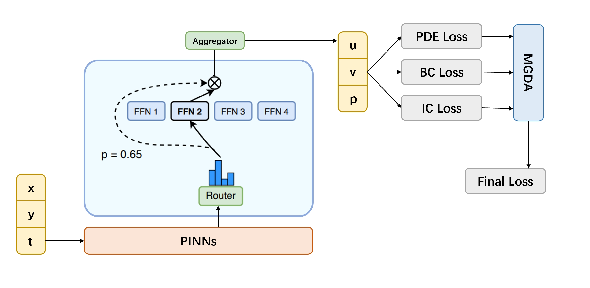
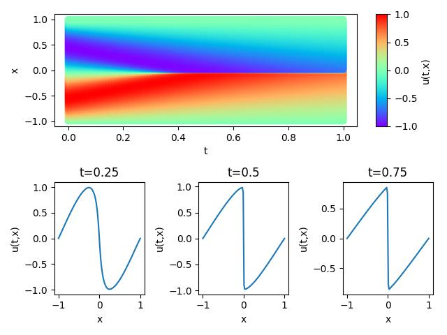
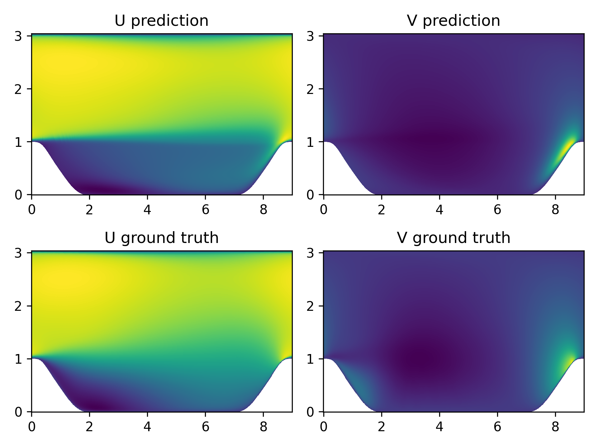
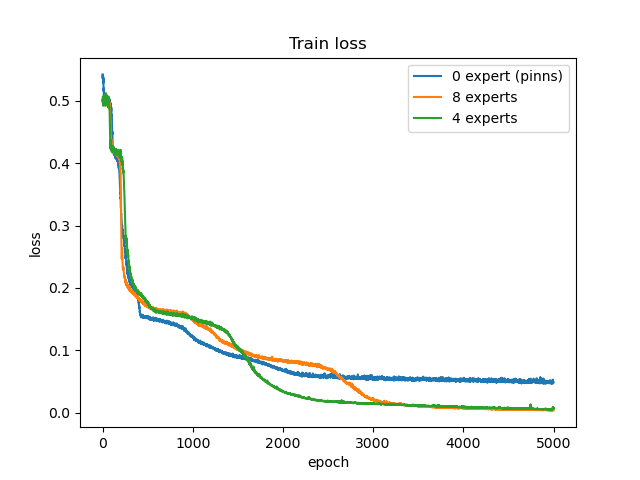

[简体中文](README_CN.md) | ENGLISH

# MOE-PINNs Network

## Overview

The core idea of MOE-PINNs is to integrate multiple expert networks into a unified network to solve complex problems. Each expert network is responsible for predicting specific aspects, and then their outputs are combined or weighted to obtain the final prediction. MOE-PINNs achieve this by introducing a router and aggregator behind the PINNs network. The router allocates input data to different expert networks, while the aggregator combines the outputs of expert networks into the final prediction result. The router and aggregator can be of any type of network, such as MLP, CNN, RNN, and so on. In this case, both the router and aggregator are MLP networks.

### Model Structure

The model structure is as shown in the following diagram:



First, spatial coordinates and time coordinates are input into the PINNs main network. The obtained output is then fed into the router, which allocates input data to different expert networks. Each expert network is responsible for predicting specific aspects. Then, the aggregator combines the outputs of expert networks into the final prediction result.The prediction results are compared with the real value to obtain three loss terms, and finally the joint optimization of multiple optimization objectives is realized through the MGDA optimizer.

### Verification equation

The proposed neural network training method is verified on three datasets: Burgers, Cylinder Flow and Periodic Hill.

#### Burgers

Burgers' equation is a nonlinear partial differential equation that simulates the propagation and reflection of shock waves.

The Burgers' equation has the following form:

$$
u_t + uu_x = \epsilon u_{xx}, \quad x \in[-1,1], t \in[0, T],
$$

where $\epsilon=0.01/\pi$, the left of the equal sign is the convection term, and the right is the dissipation term. In this case, the Dirichlet boundary condition and the initial condition of the sine function are used. The format is as follows:

$$
u(t, -1) = u(t, 1) = 0,
$$

$$
u(0, x) = -sin(\pi x).
$$

In this case, the PINNs method is used to learn the mapping $(x, t) \mapsto u$ from position and time to corresponding physical quantities. So that the solution of Burgers' equation is realized.

#### Cylinder Flow

Flow around a cylinder, that is, low speed unsteady flow around a two-dimensional cylinder, the flow characteristics are related to the Reynolds number `Re`.

The Navier-Stokes equation, referred to as `N-S` equation, is a classical partial differential equation in the field of fluid mechanics. In the case of viscous incompressibility, the dimensionless `N-S` equation has the following form:

$$
\frac{\partial u}{\partial x} + \frac{\partial v}{\partial y} = 0
$$

$$
\frac{\partial u} {\partial t} + u \frac{\partial u}{\partial x} + v \frac{\partial u}{\partial y} = - \frac{\partial p}{\partial x} + \frac{1} {Re} (\frac{\partial^2u}{\partial x^2} + \frac{\partial^2u}{\partial y^2})
$$

$$
\frac{\partial v} {\partial t} + u \frac{\partial v}{\partial x} + v \frac{\partial v}{\partial y} = - \frac{\partial p}{\partial y} + \frac{1} {Re} (\frac{\partial^2v}{\partial x^2} + \frac{\partial^2v}{\partial y^2})
$$

where `Re` stands for Reynolds number.

In this case, the PINNs method is used to learn the mapping from the location and time to flow field quantities to solve the `N-S` equation.

$$
(x, y, t) \mapsto (u, v, p)
$$

#### Periodic Hill

The Reynolds averaged Navier-Stokes equation solves the periodic mountain flow problem, a classical numerical simulation example in the field of fluid mechanics and meteorology to study the flow behavior of air or fluid over periodic mountain terrain. The Reynolds average momentum equation is as follows:

$$
\rho \bar{u}_j \frac{\partial \bar{u}_i}{\partial x_j}=\rho \bar{f}_i+\frac{\partial}{\partial x_j}\left[-\bar{p} \delta_{i j}+\mu\left(\frac{\partial \bar{u}_i}{\partial x_j}+\frac{\partial \bar{u}_j}{\partial x_i}\right)-\rho \overline{u_i^{\prime} u_j^{\prime}}\right]
$$

## Quick start

You can download dataset from [physics_driven/burgers_pinns/dataset](https://download.mindspore.cn/mindscience/mindflow/dataset/applications/physics_driven/burgers_pinns/dataset/)、[physics_driven/cylinder_flow_pinns/dataset](https://download.mindspore.cn/mindscience/mindflow/dataset/applications/physics_driven/flow_past_cylinder/dataset/) 、[dataset/periodic_hill_2d](https://download.mindspore.cn/mindscience/mindflow/dataset/periodic_hill_2d/)for model evaluation. Save these dataset at `./dataset`.

### Run Option 1: Call `train.py` from command line

```shell
python train.py --case burgers --mode GRAPH --device_target Ascend --device_id 0 --config_file_path ./configs/burgers.yaml
```

where:
`--case` represents the selection of cases, 'burgers' represents the selection of burgers equation, 'cylinder_flow' represents the selection of Navier-Stokes equation and cylinder flow datasets, 'periodic_hill' means selecting Reynolds mean Navier-Stokes equations to train the periodic hill dataset.

`--mode` is the running mode. 'GRAPH' indicates static graph mode. 'PYNATIVE' indicates dynamic graph mode. You can refer to [MindSpore official website](https://www.mindspore.cn/docs/en/r2.0.0-alpha/design/dynamic_graph_and_static_graph.html) for details.Default 'GRAPH'.

`--device_target` indicates the computing platform. You can choose 'Ascend' or 'GPU'. Default 'Ascend'.

`--device_id` indicates the index of NPU or GPU. Default 0.

`--config_file_path` indicates the path of the parameter file. Default './configs/burgers.yaml'.

### Run Option 2: Run Jupyter Notebook

You can use [Chinese](./moe_pinns.ipynb) or [English](./moe_pinns.ipynb) Jupyter Notebook to run the training and evaluation code line-by-line.

## Result

### Verification effect on Burgers equation

After training with 4000 epochs, the model predicted values are shown in the figure below:



### Verification effect on Navier-Stokes equation

After training with 4000 epochs, the predicted value of the model is matched with the true value as shown in the following figure:


### Verification effect on Raynold-averaged Navier-Stokes equations

After the training of 160 epochs, the predicted value of the model is matched with the true value as shown in the following figure:



### Ablation study

In order to verify the effectiveness of the MOE architecture, we tested the effect of the MOE-PINNs model on the burgers dataset when the number of expert models was 0, 4, and 8, respectively. The number of expert models is 0, which corresponds to the PINNs network without any processing. The specific experimental results are as follows:



It can be seen that the addition of MOE architecture can effectively reduce model loss and improve model prediction accuracy.

## Performance

### Burgers dataset

|        Parameter         |        NPU               |    GPU       |
|:----------------------:|:--------------------------:|:---------------:|
|     Hardware         |     Ascend, Memory：32G  |      NVIDIA V100, Memory：32G       |
|     MindSpore version   |        2.0.0             |        |
| Dataset | [Burgers](https://download.mindspore.cn/mindscience/mindflow/dataset/applications/physics_driven/burgers_pinns/dataset/) |  |
|  Parameters | 1908 |  |
|  Training hyperparameters | batch_size=8192, epochs=20000, steps_per_epoch=1 |  |
|  Testing hyperparameters | batch_size=8192 | |
|  Optimizer | MGDA |  |
|        Train loss      |        7.8e-4               |       8.0e-4       |
|        Validation loss      |        0.014              |       0.013       |
|        Speed(ms/step)          |     93        |    103  |

### Cylinder Flow dataset

|        Parameter         |        NPU               |    GPU       |
|:----------------------:|:--------------------------:|:---------------:|
|     Hardware         |     Ascend, Memory32G   |      NVIDIA V100, Memory32G       |
|     MindSpore version   |        2.0.0             |            |
| Dataset | [Cylinder-flow](https://download.mindspore.cn/mindscience/mindflow/dataset/applications/physics_driven/flow_past_cylinder/dataset/) | |
|  Parameters | 2096 |  |
|  Training hyperparameters | batch_size=8192, epochs=10000, steps_per_epoch=2| |
|  Testing hyperparameters | batch_size=8192 | |
|  Optimizer | MGDA |  |
|        Train loss      |        1.34e-4               |       1.31e-4     |
|        Validation loss      |         0.037             |       0.033      |
|        Speed(ms/step)          |     380        |    115  |

### Periodic Hill dataset

|        Parameter         |        NPU               |    GPU       |
|:----------------------:|:--------------------------:|:---------------:|
|     Hardware         |     Ascend, Memory32G      |      NVIDIA V100, Memory32G       |
|     MindSpore version   |        2.0.0             |         |
| Dataset | [Periodic_hill](https://download.mindspore.cn/mindscience/mindflow/dataset/periodic_hill_2d/) | |
|  Parameters | 2328 |  |
|  Training hyperparameters | batch_size=1000, epochs=10000, steps_per_epoch=200 |  |
|  Testing hyperparameters | batch_size=1000 |  |
|  Optimizer | MGDA |  |
|        Train loss      |        5.12e-4               |       5.17e-4      |
|        Validation loss      |        0.167              |       0.177       |
|        Speed(ms/step)          |     150        |    96  |

## Contributor

gitee id: [Marc-Antoine-6258](https://gitee.com/Marc-Antoine-6258)

email: 775493010@qq.com