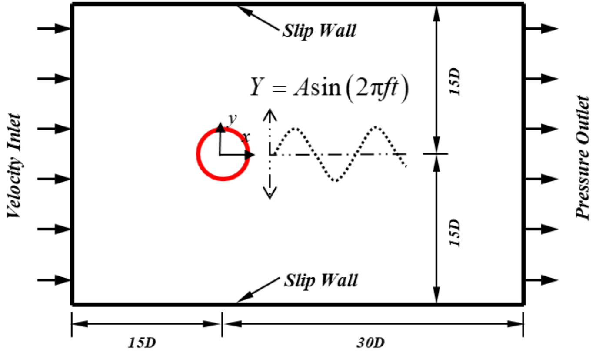
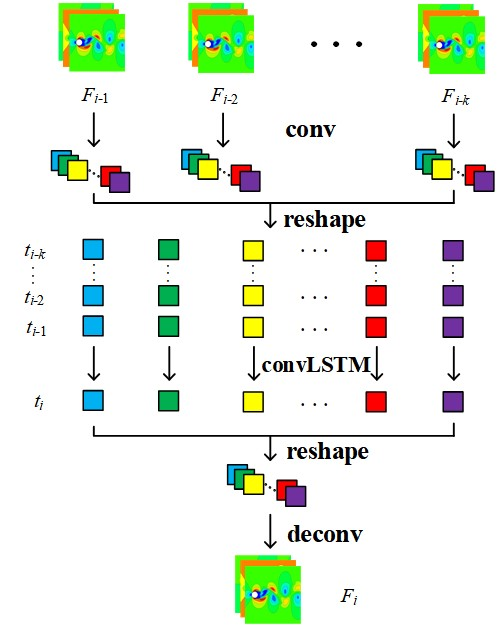
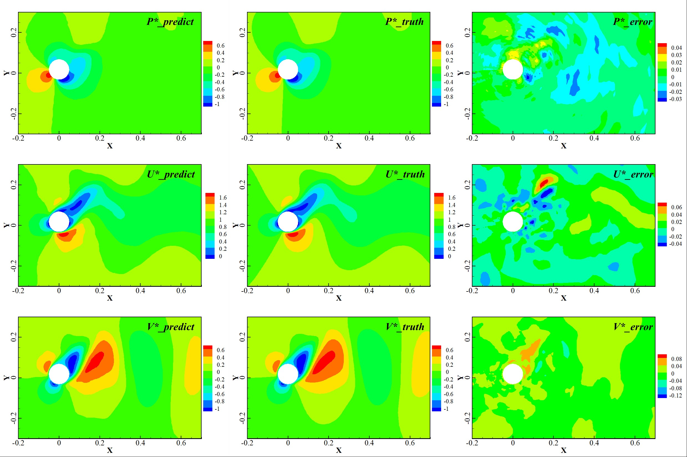
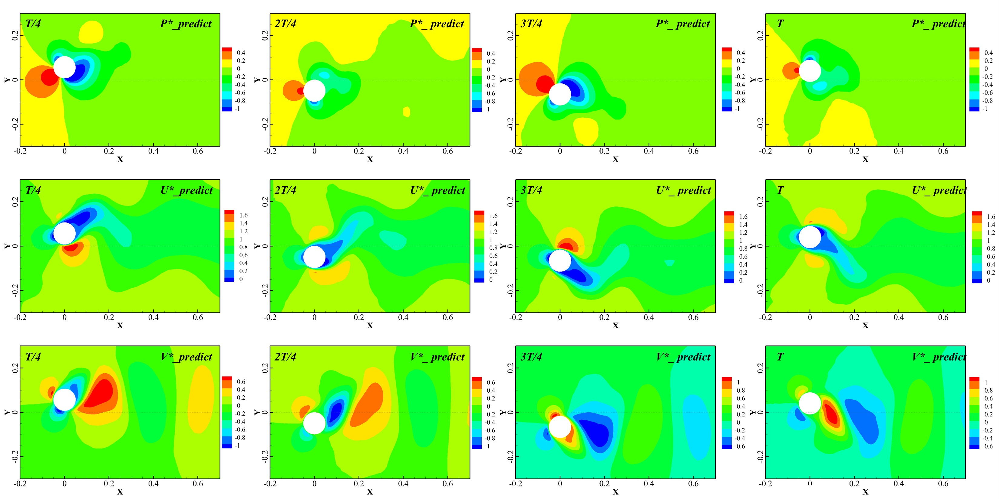

---

# A Neural Network Based Method for Predicting Unsteady Flow Fields with Moving Boundaries

## 0verview

### Background

Simulating unsteady flow field systems with moving boundaries to analyze the force acting on moving structures in the
flow field can optimize the design of moving structures in engineering. High precision computational fluid dynamics (
CFD) technology can accurately simulate the flow field evolution and structural stress, but high precision dynamic
boundary problems require many grids, resulting in huge computing costs and extremely time-consuming dynamic grid
construction. Deep neural networks can learn the evolutionary relationship between flow conditions and flow fields, and
quickly achieve high-precision reconstruction of flow fields. In order to efficiently solve the problem of
reconstructing dynamic boundary flow fields, a hybrid deep neural network (HDNN) is proposed to achieve unsteady dynamic
boundary flow field reconstruction and fast prediction of flow fields based on this. The relevant dimensions of the flow
field are shown in the figure, where $$Y = Asin(2\pi ft)$$ represents the motion expression of the cylinder Simple harmonic
motion in the vertical direction, A is the amplitude, and f is the frequency; D represents the diameter of the cylinder;
The rectangular boundary represents the computational domain.

  

### Method

The moving boundary deep neural network model (HDNN) in this article is built through the new generation open-source
deep learning framework MindSpore, which can efficiently complete model construction and training through its model
optimization, inference acceleration, and other functions.The basic framework of HDNN is mainly based on previous work:
a hybrid deep neural network framework [paper](https://doi.org/10.1016/j.ast.2022.107636) ,It is mainly composed of
convolutional neural network (CNN), convolutional long short-term memory network (ConvLSTM) and deconvolution neural
network (DeCNN). CNN reduces the dimensionality of the time series flow field and achieves feature extraction; ConvLSTM
learns low dimensional spatiotemporal features and makes predictions; Finally, DeCNN achieves reconstruction of
predicted flow fields.

+ Input layer: Input historical flow field;
+ Convolutional layer: By using multi-layer CNN to reduce the dimensionality of the input flow field and extract
  high-dimensional spatiotemporal flow characteristics;
+ Memory layer: Learn the evolution of spatiotemporal characteristics of low dimensional spatial flow fields through
  ConvLSTM and predict the next moment;
+ Deconvolution output layer: Restores the low-dimensional features of the predicted flow field to high-dimensional
  space, reconstructs the transient flow field at the next moment through multi-layer DeCNN, and outputs visual
  prediction results

  

### Dataset

+ Dataset directory: The total directory of moving boundary datasets is: forced_move, which has a total of 8
  subdirectories named f0.90h0.i, with i being 00, 20, 25, 30, 35, 40, 45, and 50, representing different amplitude
  sizes. The small directory (project) under each subdirectory contains Matrix_01.mat, total_puv_project.mat and
  velocity.mat represent mat files containing matrices of 0 or 1, pressure velocity data, and cylindrical motion
  velocity, respectively

+ Source: Compute the flow field through CFD simulation, specifically using ANSYS Fluent to obtain numerical simulation
  flow field data of unsteady two-dimensional cylindrical flow

+ Establishment method: The physical quantities related to the flow field are: Reynolds number Re=200, cylinder diameter
  D=0.02m, time step t=0.01s. The cylinder undergoes one-dimensional harmonic motion in the vertical direction, with
  vibration frequencies (Hz) of 1.25, 1.43, 1.67, and 2.00, and amplitudes (A/D) of 0.5, 0.6, 0.7, and 0.8,
  respectively. A total of 16 sets of motion states are formed by pairing. Physical modeling of two-dimensional
  cylindrical flow field, mesh discretization/partitioning, and solving control equations to obtain flow field
  information. Dimensionalize the physical quantities of the flow field and place 128 in the sampling area × 128 grid
  sampling points to obtain a sample set for training and testing

+ Specification:Each flow field snapshot of dataset contains three channels, representing the pressure distribution information, horizontal velocity information, and vertical velocity information of the flow field

### Effect

The trained neural network predicts the flow field under operating conditions with an amplitude of 0.45D. It only takes 17 seconds to obtain a flow field of 150 time steps using the trained neural network, while the CFD solver takes 240 seconds, demonstrating the efficiency of this method.

## Quick Start

### Training Method 1: Call the `train.py` script on the command line

python train.py --mode GRAPH --save_graphs False --save_graphs_path ./summary --device_target Ascend --device_id 0 --data_list ['0.00', '0.25', '0.35', '0.45'] --batch_size 16 --config_file_path ./config.yaml

Among them,
`--mode` represents the running mode, 'GRAPH' indicates the static Graphical model, 'PYNATIVE' indicates the dynamic Graphical model, default 'GRAPH';

`--save_graphs` represents whether to save the calculation graph, default 'False';

`--save_graphs_path` represents the path where the calculation graph is saved, default './summary';

`--device_target` represents the type of computing platform used, which can be selected as 'Ascend' or 'GPU', default 'Ascend';

`--device_id` represents the calculation card number used, which can be filled in according to the actual situation, default 0;

`--data_list` represents the dataset used for training, defaults ['0.00', '0.25', '0.35', '0.45'];

`--batch_size` represents the number of images that will be sent to the network during each training, default 16;

`--config_file_path` represents the parameter and path control file, default './config.yaml'

### Training Method 2: Running Jupyter Notebook

You can run training and validation code line by line using both the [Chinese version](move_boundary_hdnn_CN.ipynb) and the [English version](move_boundary_hdnn.ipynb) of Jupyter Notebook.

## Results Display

The following figure shows the results of a fully trained HDNN model for one-step prediction and one complete cycle
prediction of unsteady moving boundaries with a vibration frequency of 1.43Hz and an amplitude of 0.8 (amplitude ratio
generalization state) (displaying pressure field, horizontal velocity field, and vertical velocity field). Below are the specific default commands to be executed and the input meanings of the startup command.

  
  

## Contributor

gitee id：[DUJiaoxi](https://gitee.com/ddd000g)

email: dujiaoxi@stu.xjtu.edu.cn
