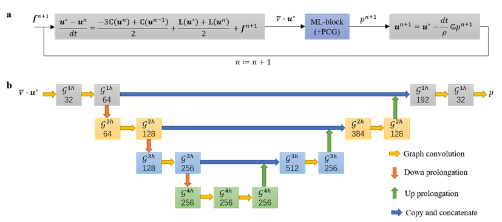
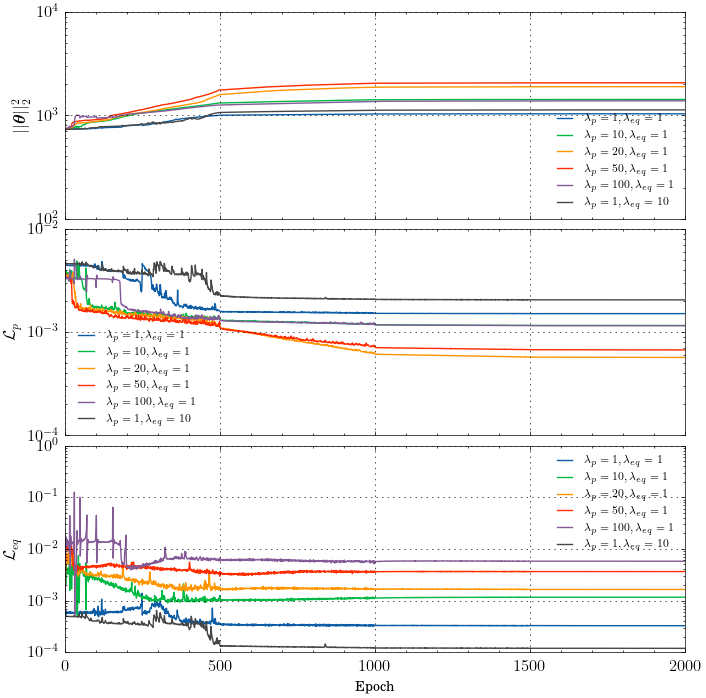
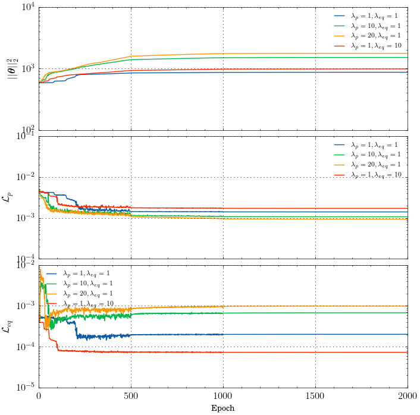
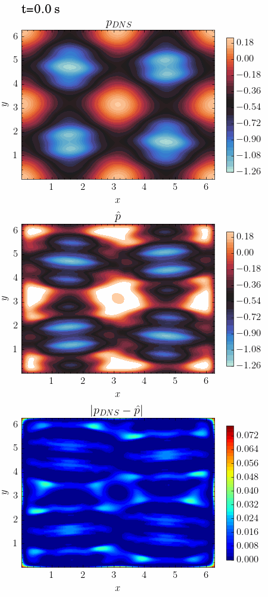

# MultiscaleGNN

## 概述

在使用投影法（或分步法）求解不可压缩 Navier-Stokes 方程时，投影步骤涉及求解大规模的压力泊松方程（pressure Possion Equation, PPE），通常是整个计算过程中计算成本最高、最耗时的步骤。提出了一种基于机器学习的 PPE 问题求解方法，设计了一种新型多尺度图神经网络（multi-scale GNN）嵌入式求解器来加速不可压缩 Navier-Stokes 方程的数值求解。通过替换求解 PPE 的传统迭代求解器，将 multi-scale GNN 无缝地嵌入到不可压缩 Navier-Stokes 方程的数值求解框架中。在 multi-scale GNN 框架中，原始的高分辨率图对应解域的离散网格，相同分辨率的图通过图卷积操作连接，不同分辨率的图通过上、下延拓操作连接。经过充分训练的 multi-scale GNN 将充当某类流动问题的通用 PPE 求解器。

### 模型框架

模型框架如下图所示：



图中

a. 嵌入 ML 模块的不可压缩 Navier-Stokes 方程数值求解框架（二阶显式-隐式时间离散格式）；

b. ML 模块（multi-scale GNN），$\mathcal{G}^{1h}$ 对应原始高分辨率图，$\mathcal{G}^{2h}$、$\mathcal{G}^{3h}$ 和 $\mathcal{G}^{4h}$ 分别对应二级、三级和四级低分辨率图，数字代表相应层中的神经元数量。

## 快速开始

运行本案例请使用MindSpore Version=2.2.X，MindFlow Version>=0.1.0。数据集下载地址：[data_driven/multiscale_gnn/dataset](https://download-mindspore.osinfra.cn/mindscience/mindflow/dataset/applications/research/MultiScaleGNN/), 将数据集保存在`./dataset`路径下。

### 训练方式一：在命令行中调用`train.py`脚本

```shell
python train.py --config_path ./config/config.yaml

```

其中

`--config_path`表示配置文件的路径，默认值为 "./config/config.yaml"。

在 "./config/config.yaml" 配置文件中：

`grid_type` 表示网格类型，'structure' 表示选择结构化网格，'unstructure' 表示选择非结构网格，默认值 'structure'；

`activ_fun` 表示激活函数类型，可以选择 'swish'、'elu' 或 'gelu'，默认值 'swish'；

`device_target` 表示使用的计算平台类型，可以选择 'CPU'、'GPU' 或 'Ascend'，默认值 'CPU'；

`device_id` 表示后端平台端口号，默认值为 0；

`mode` 表示计算模式，默认为静态图模式 "GRAPH"；

`lambda_p` 表示有监督压力匹配损失项的权重系数，默认值 1；

`lambda_eq` 表示无监督方程残差损失项的权重系数，默认值 1。

#### 注：

提供了 'unstructure' 和 'structure' 两种网格类型的模型实现方法，其中 'unstructure' 网格类型的模型中图卷积涉及稀疏矩阵乘法操作，而 'structure' 的模型中图卷积则根据定义计算，避免使用稀疏矩阵乘法操作。

对于 `grid_type=unstructure`，计算平台设备支持 'CPU' 和 'GPU'；

对于 `grid_type=structure`，计算平台设备支持 'CPU' 、'GPU' 和 'Ascend'；

### 训练方式二：运行Jupyter Notebook

您可以使用[中文版](./multiscale_gnn_CN.ipynb)和[英文版](./multiscale_gnn.ipynb)Jupyter Notebook逐行运行训练和验证代码。

## 求解案例：Kolmogorov Flow

### 工况描述

$Re=1000$, 驱动力 $\boldsymbol{f} = \sin(8y)\hat{\boldsymbol{x}} $，初始条件 $u_0=\sin(x)\cos(y), v_0=-\cos(x)\sin(y)$，双向周期边界条件。

训练集：$t \in [0, 5]$ 内的 100 个样本；测试集：$t \in [0, 10]$。

默认使用 swish 激活函数，训练了不同网格类型、不同权重系数组合下的多个模型，具体包括：

grid_type=unstructure: lambda_p=1,lambda_eq=1; lambda_p=10,lambda_eq=1; lambda_p=20,lambda_eq=1; lambda_p=1,lambda_eq=10;

grid_type=structure: lambda_p=1,lambda_eq=1; lambda_p=10,lambda_eq=1; lambda_p=20,lambda_eq=1; lambda_p=50,lambda_eq=1; lambda_p=100,lambda_eq=1; lambda_p=1,lambda_eq=10;

经充分训练的这些模型均保存在'./Savers/'文件夹下。

### 训练损失曲线

grid_type=structure:



grid_type=unstructure:



### 测试方式：在命令行中调用`test.py`脚本

```shell
python test.py --grid_type=structure --activ_fun=swish --device=CPU --lambda_p=1 --lambda_eq=1 --plot_figure=1

```

## 性能对比: $\lambda_p=20, \lambda_{eq}=1$

|        参数         |        NPU             |    GPU             |      CPU        |
|:------------------:|:----------------------:|:------------------:|:---------------:|
|     硬件            |   Ascend(memory 32G) | NVIDIA V100(memory 32G) | memory 32G |
|     MindSpore版本   |      2.2.10            |     2.2.10         |     2.2.10      |
|     数据大小         |       50               |      50            |      50         |
|     训练轮次         |      2000              |     2000           |     2000        |
|     优化器           |      AdamWeightDecay  |     AdamWeightDecay |  AdamWeightDecay |
|  structure 训练精度(MSE, $\epsilon_p$) |      8.93e-4      |      9.53e-4      | 5.68e-4      |
|  structure 测试精度(MSE, $\epsilon_p$) |     2.10e-3       |     1.81e-3       |     2.14e-3    |
|  structure 性能(s/step)                |     4.3           |     2.2           |     8.5        |
|  unstructure 训练精度(MSE, $\epsilon_p$)  |     -          |        1.02e-3    |     9.31e-4    |
|  unstructure 测试精度(MSE, $\epsilon_p$)  |     -          |        2.27e-3    |     2.01e-3    |
|  unstructure 性能(s/step)                 |     -          |       1.7         |     6.4        |

### 测试结果展示：

`grid_type=structure`, `activ_fun=swish`, `lambda_p=20`, `lambda_eq=1`



## 贡献者

gitee id: [chenruilin2024](https://gitee.com/chenruilin2024)

email: chenruilin@isrc.iscas.ac.cn

## 参考文献

Chen R, Jin X, Li H. A machine learning based solver for pressure Poisson equations[J]. Theoretical and Applied Mechanics Letters, 2022, 12(5): 100362. https://www.sciencedirect.com/science/article/pii/S2095034922000423
