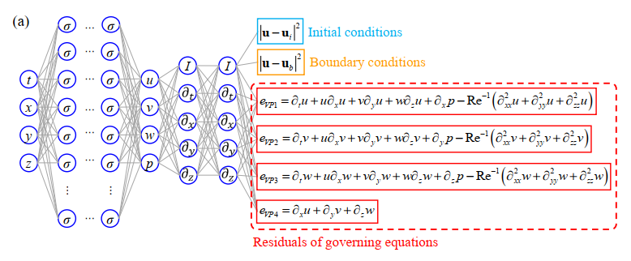

# NSFNets用于不可压缩 Navier-Stokes 方程求解的物理信息神经网络

## 背景介绍

在AI-CFD的工业应用方面，对NavierStokes方程的求解以及对多精度数据的融合的场景十分广泛，具有重要的经济和社会意义。求解不适定问题（例如部分边界条件缺失）或反演问题是其中的重点和难点之一，且往往代价高昂，需要推导适用于特定问题的不同公式、编写全新代码。如何用一套统一代码以相同计算代价解决上述问题亟需深入研究。在此，金晓威和李惠等使用物理信息神经网络（PINNs），通过自动微分将控制方程直接编码到深度神经网络中，以克服上述一些模拟不可压缩层流和湍流流动的限制。并开发了Navier-Stokes流动网络（NSFnets，Navier-Stokes flow nets）。

## 模型框架

模型框架如下图所示：



图中表示的是压力-速度形式的纳维-斯托克斯方程求解网络，利用神经网络的自动微分计算方程中所需要的偏导项，损失函数包括，边界条件损失，初始条件损失以及为了满足方程平衡的物理损失。

## 快速开始

数据集可以通过提供的代码直接生成。

案例提供两种训练方式

- 训练方式一：在命令行中调用`train.py`脚本

  ```python
  # 在命令行调用train.py进行训练示例
  python train.py --device_target GPU --device_id 0 --config_file_path ./config/NSFNet.yaml

  ```

  `--config_path`表示配置文件的路径，默认值为 "./config/config.yaml"。

  在 "./config/config.yaml" 配置文件中：
  'case' 表示案例名称；

  'device' 表示使用的计算平台类型，可以选择 'CPU'、'GPU' 或 'Ascend'，默认值 'GPU'；

  'device_id' 表示后端平台端口号，默认值为 0；

  'network_size' 表示网络大小；

  'learning_rate' 表示学习率；

  'epochs' 表示训练迭代次数；

- 训练方式二：运行Jupyter Notebook

  您可以使用[中文版](./NSFNets_CN.ipynb) 和[英文版](./NSFNets.ipynb) Jupyter Notebook逐行运行训练和验证代码。

## 案例说明

其中命名为NSFNets的Jupyter Notebook 运行的案例为三维Beltrami流动，本次开源除了提供该方程的运行代码和数据以外，还提供了二维Kovasznay流动，可以在命令行中调用`train_KF.py` 脚本即可直接运行。

## 性能

|         参数          |           GPU           |        NPU         |
|:-------------------:|:-----------------------:|:------------------:|
|         硬件          | NVIDIA 1080Ti(memory 11G) | Ascend(memory 32G) |
|     MindSpore版本     |         2.2.14          |       2.2.14       |
|        数据大小       |          91648          |       91648        |
|       batch大小       |           10000         |        10000       |
|        训练步数       |           11w           |        11w         |
|         优化器        |         Adam            |      Adam          |
|  total loss 训练精度(MSE)  |         2.6e-3     |       3.3e-3       |
|  boundary loss 测试精度(MSE)  |         5.9e-6  |       1.0e-5       |
|  initial condition loss 训练精度(MSE)  |         2.6e-6          |       6.3e-6       |
|  equation loss 测试精度(MSE)  |         1.7e-3      |       1.8e-3       |
|     性能(s/epoch)      |          0.43           |        0.068        |

## 贡献者

gitee id: [chenchao2024](https://gitee.com/chenchao2024)
email: chenchao@isrc.iscas.ac.cn

## 参考文献

Jin x, Cai s, Li H, Karniadakis G. NSFnets (Navier-Stokes flow nets): Physics-informed neural networks for the incompressible Navier-Stokes equations[J]. Journal of Computational Physics, 2020, 426: 1. https://doi.org/10.1016/j.jcp.2020.109951
