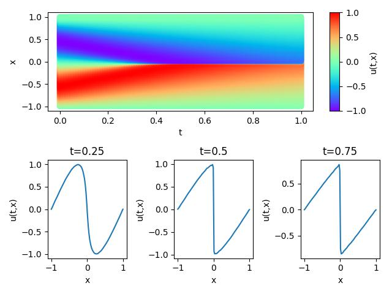
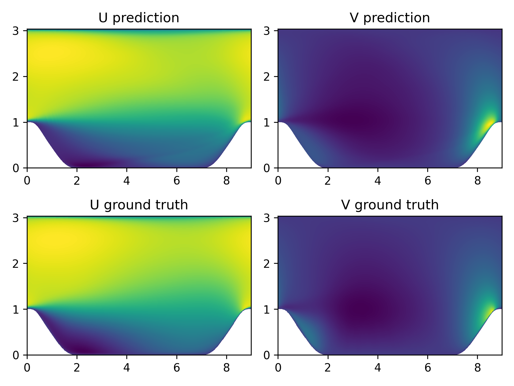

[中文](README_CN.md) | ENGLISH

# R-DLGA method

## Overview

### Background

The data-driven discovery of partial differential equations has made great progress in recent years. Sparse regression and neural network-based methods have solved several aspects of the problem. However, the existing methods lack stability when dealing with high noise sparse data, high order derivatives, shock waves and other complex situations, which brings obstacles to the accurate calculation of derivatives. Therefore, a robust PDE discovery framework, the Robust Deep Learning Genetic Algorithm (R-DLGA), which combines physical information neural networks, is proposed.

In this framework, the preliminary results of potential terms provided by DLGA are added to PINN's loss function as physical constraints to improve the accuracy of derivative calculation. By eliminating the error compensation term, it helps to optimize the initial results and obtain the final discovered PDE.

## Technical route

The R-DLGA method is developed by the paper [《Robust discovery of partial differential equations in complex situations》](https://journals.aps.org/prresearch/abstract/10.1103/PhysRevResearch.3.033270) proposed and implemented.

The workflow of Robust Deep Learning Genetic Algorithm (R-DLGA), including DLGA steps and Physical Information Neural Network (PINN) steps:

- Use neural networks to build proxy models from existing data
- Use generalized genetic algorithms to identify potential items
- Add the discovered potential term to the loss function $L_{PINN}(θ)$as a physical constraint to further optimize the derivative
- Discover the final partial differential equation PDE

### Verification equation

#### An introduction to the Burgers equation

The Burgers' equation is a nonlinear partial differential equation that simulates the propagation and reflection of shock waves.

The Burgers' equation has the following form:

$$
u_t + uu_x = \epsilon u_{xx}, \quad x \in[-1,1], t \in[0, T],
$$

which$\epsilon=0.01/\pi$，the left side of the equal sign is the convective term, and the right side is the dissipative term. In this case, the Dilliclet boundary conditions and the initial conditions of the sine function are used as follows:

$$
u(t, -1) = u(t, 1) = 0,
$$

$$
u(0, x) = -sin(\pi x),
$$

#### An introduction to Navier-Stokes equation

Flow around a cylinder, that is, low speed unsteady flow around a two-dimensional cylinder, the flow characteristics are related to the Reynolds number `Re`.

The Navier-Stokes equation (abbreviated `N-S` equation) is a classical partial differential equation in fluid mechanics. In the case of viscous incompressibility, the dimensionless `N-S` equation has the following form:

$$
\frac{\partial u}{\partial x} + \frac{\partial v}{\partial y} = 0
$$

$$
\frac{\partial u} {\partial t} + u \frac{\partial u}{\partial x} + v \frac{\partial u}{\partial y} = - \frac{\partial p}{\partial x} + \frac{1} {Re} (\frac{\partial^2u}{\partial x^2} + \frac{\partial^2u}{\partial y^2})
$$

$$
\frac{\partial v} {\partial t} + u \frac{\partial v}{\partial x} + v \frac{\partial v}{\partial y} = - \frac{\partial p}{\partial y} + \frac{1} {Re} (\frac{\partial^2v}{\partial x^2} + \frac{\partial^2v}{\partial y^2})
$$

#### An introduction to Reynolds mean Navier-Stokes equations

The Reynolds mean Navier-Stokes equation for solving the problem of periodic mountain flow is a classic numerical simulation case in the field of fluid mechanics and meteorology to study the behavior of air or fluid flow over periodic mountain terrain. The Reynolds mean momentum equation is as follows:

$$\rho \bar{u}_j \frac{\partial \bar{u}_i}{\partial x_j}=\rho {\bar{f}}\_ i + \frac{\partial}{\partial x_j}\left[-\bar{p} {\delta \_ {i j}+}\mu\left(\frac{\partial \bar{u}_i}{\partial x_j}+\frac{\partial \bar{u}_j}{\partial x_i}\right)-\rho \overline{u_i^{\prime} u_j^{\prime}}\right]$$

## Quick Start

You can download dataset from [physics_driven/burgers_pinns/dataset](https://download.mindspore.cn/mindscience/mindflow/dataset/applications/physics_driven/burgers_pinns/dataset/)、[physics_driven/cylinder_flow_pinns/dataset](https://download.mindspore.cn/mindscience/mindflow/dataset/applications/physics_driven/flow_past_cylinder/dataset/) 、[dataset/periodic_hill_2d/](https://download.mindspore.cn/mindscience/mindflow/dataset/periodic_hill_2d/) for model evaluation. Save these dataset at `./dataset`.

### Training method 1: Call the script `train.py` in the command line, modify the calculation method of term in util.py and the expression of term in train_pinn according to the running result of the train.py script, and run the script `train_pinn.py`

```shell
python train.py --case burgers --mode GRAPH --device_target Ascend --device_id 0 --config_file_path ./configs/burgers.yaml
```

```shell
python train_pinn.py --case burgers --mode GRAPH --device_target Ascend --device_id 0 --config_file_path ./configs/burgers.yaml
```

where:
`--case` represents the selection of cases, 'burgers' represents the selection of burgers equation, 'cylinder_flow' represents the selection of Navier-Stokes equation and cylinder flow datasets, 'periodic_hill' means selecting Reynolds mean Navier-Stokes equations to train the periodic hill dataset.

`--mode` is the running mode. 'GRAPH' indicates static graph mode. 'PYNATIVE' indicates dynamic graph mode. You can refer to [MindSpore official website](https://www.mindspore.cn/docs/en/r2.0.0-alpha/design/dynamic_graph_and_static_graph.html) for details.Default 'GRAPH'.

`--device_target` indicates the computing platform. You can choose 'Ascend' or 'GPU'. Default 'Ascend'.

`--device_id` indicates the index of NPU or GPU. Default 0.

`--config_file_path` indicates the path of the parameter file. Default './configs/burgers.yaml'.

### Training method 2: Run Jupyter Notebook

You can use the [Chinese version](https://gitee.com/mindspore/mindscience/blob/master/MindFlow/applications/research/r_dlga/r_dlga_part1_CN.ipynb) and [English version](https://gitee.com/mindspore/mindscience/blob/master/MindFlow/applications/research/r_dlga/r_dlga_part1.ipynb)Jupyter Notebook runs the training and validation code line by line.

## Result show

### Verification on Burgers

This method first constructs a proxy model from 5000 training sample data, obtains metadata and saves it, and performs genetic algorithm to obtain the right potential term of the prediction equation, and then trains the PINN model according to this potential term. Finally, the Burgers equation discovered by this method is as follows:

$$
u_t + 0.43811008 * uu_x =  0.00292014 * u_{xx},
$$

The verification effect is as follows:



### Verification on the Cylinder_flow dataset for the Navier-Stokes equations

This method first constructs a surrogate model from 36,000 training samples, retrieves the metadata, and saves it. Then, using a genetic algorithm, it obtains the latent terms on the right-hand side of the predictive equation. Subsequently, the PINN (Physics-Informed Neural Network) model is trained based on these latent terms. The discovered Navier-Stokes equations are as follows:
$$
u_t + 0.26797492 * u_x + 0.55881415 * u * v_y - 0.2171481 * p = 0 \\
v_t + 0.79272866 * v - 0.19479636 * v_x - 0.05810321 * p_y = 0\\
p_t + 0.63546702 * p_x + 0.22271018 * p = 0  \\
$$
The validation results are displayed in the following animation:


### Verification on the Reynolds-averaged Navier-Stokes Equation

This method also begins by constructing a surrogate model from 36,000 training samples, retrieving the metadata, and saving it. Using a genetic algorithm, it determines the latent terms on the right-hand side of the predictive equation. The PINN model is then trained based on these latent terms. The discovered RANS equations are as follows:
$$
u + 0.12345678 * u_x - 0.54321098 * u_y * v_y + 0.24681357 * p_x = 0 \\
0.78901234 * v_x - 0.45678901 * v_y - 0.01234567 * p_y = 0\\
0.65432109 * v_x + 0.86420975 * p_x= 0  \\
$$
The validation results are shown in the following image:



## Performance

### Burgers

|      Parameter         |        NPU              |    GPU       |
|:----------------------:|:--------------------------:|:---------------:|
|     Hardware           |     Ascend, 32GB Memory      |      NVIDIA V100, 32GB Memory       |
|     MindSpore Version  |        2.0.0             |      2.0.0       |
|     Dataset            |      [Burgers dataset](https://download.mindspore.cn/mindscience/mindflow/dataset/applications/physics_driven/burgers_pinns/)             |      [Burgers dataset](https://download.mindspore.cn/mindscience/mindflow/dataset/applications/physics_driven/burgers_pinns/)       |
|      Parameters        |       2751       |         2751         |
|      Training Parameters | batch_size=5000, steps_per_epoch=1, epochs=30000 | batch_size=5000, steps_per_epoch=1, epochs=30000 |
|     Testing Parameters |  batch_size=10000, steps=1  | batch_size=10000, steps=1 |
|     Optimizer            |        Adam     |        Adam         |
|     Training Loss (MSE) |  2.78e-4  | 3.05e-4 |
|     Validation Loss (RMSE) |    0.0792    |       0.0838       |
|     Speed (ms/step)   |  270  | 284  |

### Navier-Stokes equation

|      Parameter         |    NPU |    GPU    |
|:----------------------:|:---------------:|:---------------:|
|     Hardware           | Ascend, 32GB Memory | NVIDIA V100, 32GB Memory |
|     MindSpore Version  |      2.0.0  |      2.0.0  |
|     Dataset            | [Cylinder Flow dataset](https://download.mindspore.cn/mindscience/mindflow/dataset/applications/physics_driven/flow_past_cylinder/dataset/) | [Cylinder Flow dataset](https://download.mindspore.cn/mindscience/mindflow/dataset/applications/physics_driven/flow_past_cylinder/dataset/) |
|      Parameters        |         17411         |         17411         |
|      Training Parameters | batch_size=10000, steps_per_epoch=4, epochs=30000 | batch_size=10000, steps_per_epoch=4, epochs=30000 |
|     Testing Parameters | batch_size=10000, steps=8 | batch_size=10000, steps=8 |
|     Optimizer            |        Adam     |        Adam     |
|     Training Loss (MSE) |     2.37e-4     |    1.90e-4 |
|     Validation Loss (RMSE) |       0.0297       |       0.0276       |
|     Speed (ms/step)   |  1173  |  1152  |

### The Reynolds-averaged Navier-Stokes Equation

|      Parameter         |    NPU |    GPU    |
|:----------------------:|:---------------:|:---------------:|
|     Hardware           | Ascend, 32GB Memory | NVIDIA V100, 32GB Memory |
|     MindSpore Version  |      2.0.0  |      2.0.0  |
|     Dataset            | [Periodic Hill dataset](https://download.mindspore.cn/mindscience/mindflow/dataset/periodic_hill_2d/) | [Periodic Hill dataset](https://download.mindspore.cn/mindscience/mindflow/dataset/periodic_hill_2d/) |
|      Parameters        |         17383         |         17383         |
|      Training Parameters | batch_size=10000, steps_per_epoch=4, epochs=30000 | batch_size=10000, steps_per_epoch=4, epochs=30000 |
|     Testing Parameters | batch_size=10000, steps=8 | batch_size=10000, steps=8 |
|     Optimizer            |        Adam     |        Adam     |
|     Training Loss (MSE) |  2.45e-4 |  2.83e-4 |
|     Validation Loss (RMSE) |       0.0231       |       0.0267       |
|     Speed (ms/step)   |  2390  |  2450  |

## Contributor

gitee id: [lin109](https://gitee.com/lin109)

email: 1597702543@qq.com