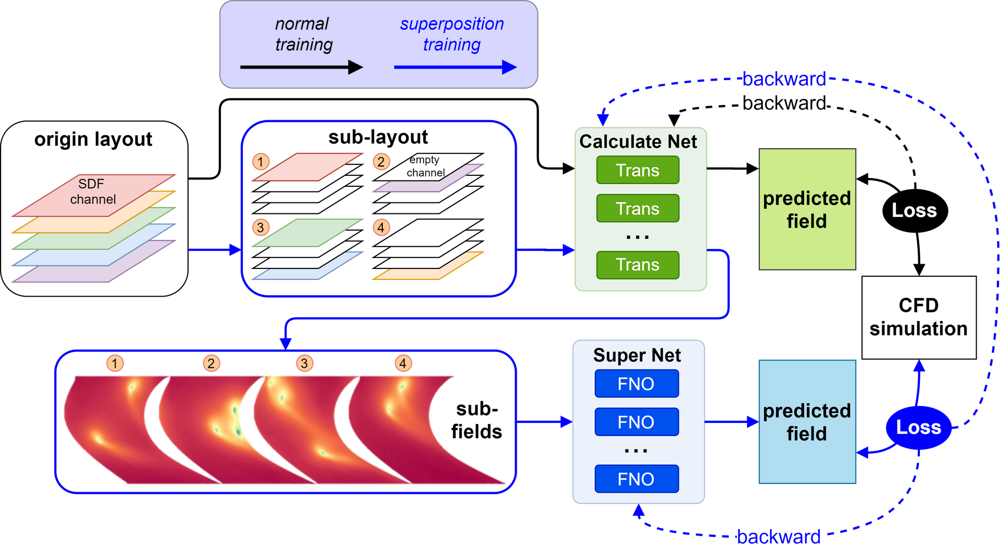
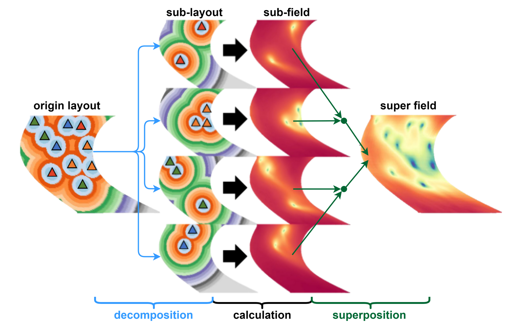
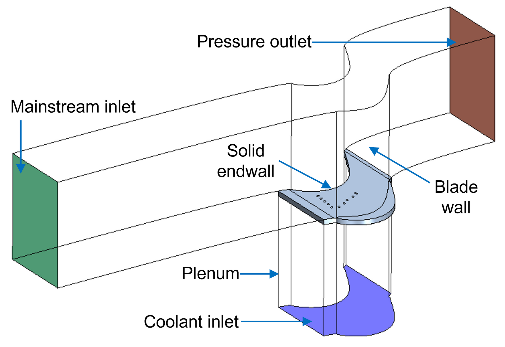
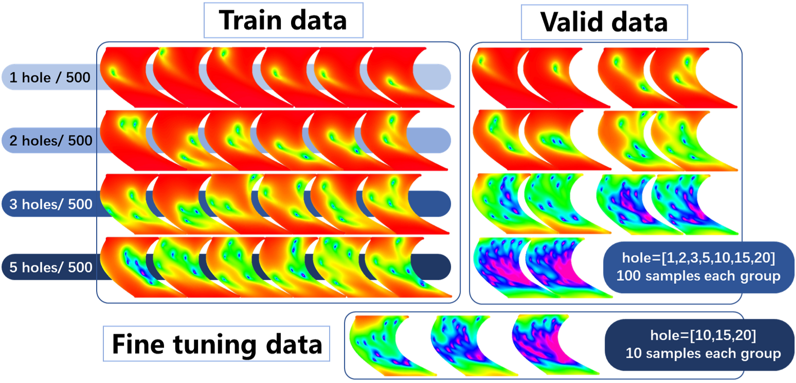
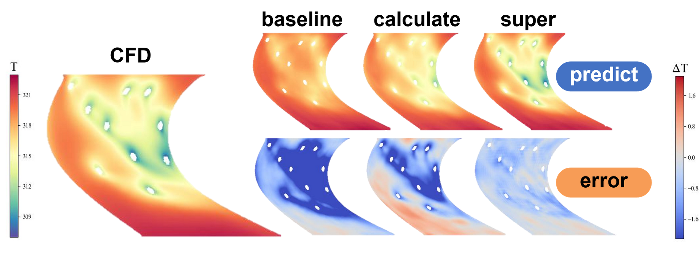
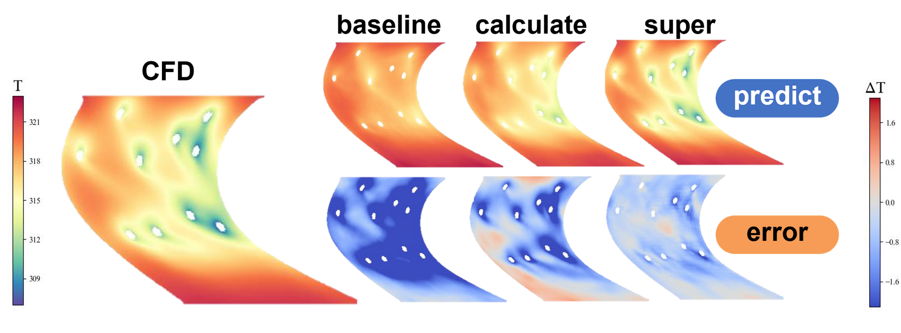
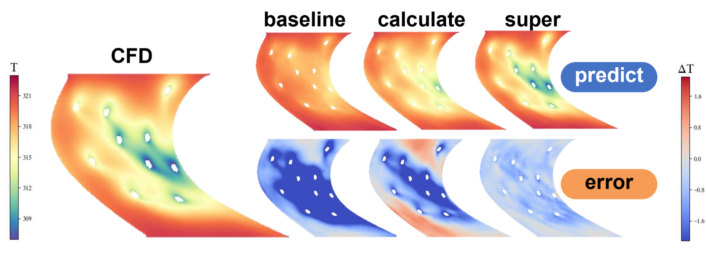
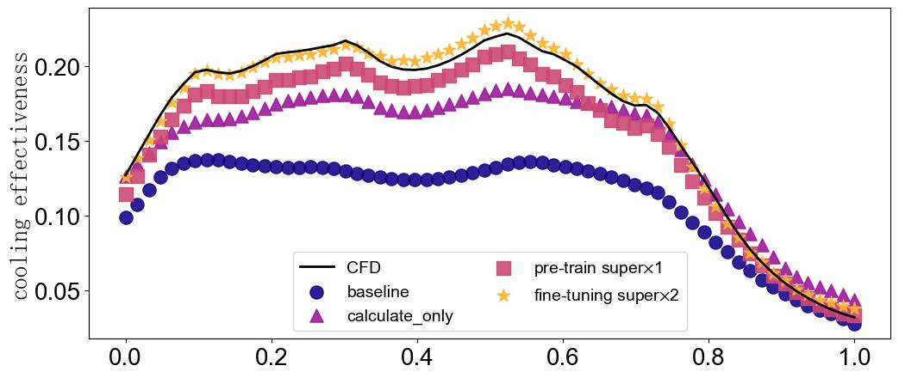
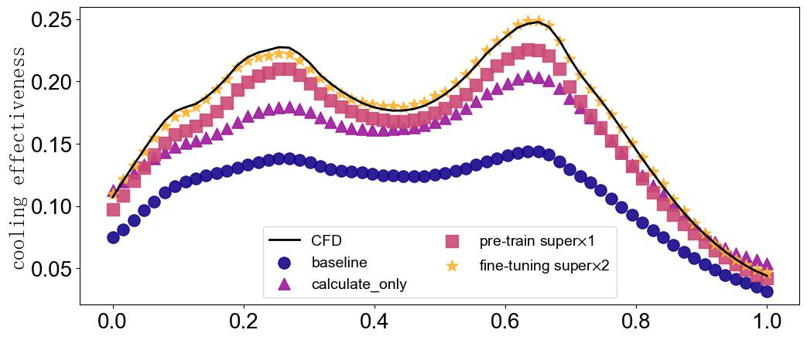
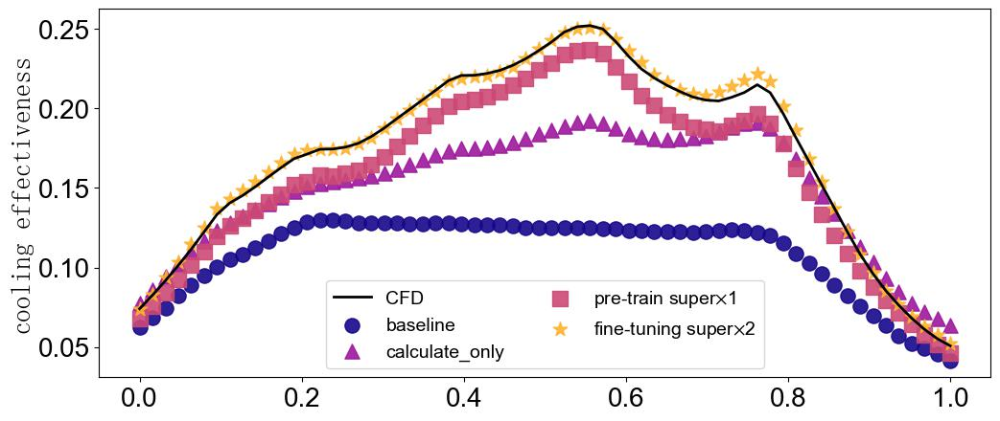

## Fusion of Physical Mechanism for Predicting Complex Flow Temperature Fields

## Background

In the field of engineering, the prediction of temperature fields under complex flow conditions has attracted widespread attention. Especially in situations where there are numerous discrete heat sources/cold sources distributed in space, the coupling effect between these heat sources and the working fluid flow not only increases the design freedom of the research object but also significantly increases the complexity and time cost required for computational fluid dynamics (CFD) simulations. For such problems, purely data-driven model construction often fails to achieve high-precision predictions and performs poorly in terms of extrapolation generalization, and its training process relies on a large amount of high-cost CFD data.
This study abstracts the traditional cold effect superposition formula (Seller's formula) and integrates it into the network structure to enhance the accuracy and generalization ability of the neural network in predicting temperature fields under complex flows, providing an efficient and reliable solution for dealing with highly complex temperature field prediction problems.

### Method

A superposition-based operator neural network (SDNO) is constructed. The overall architecture is shown in the figure.

1. The architecture consists of two key components: one is a computational network responsible for calculating the temperature field based on the arrangement of gas film holes, and the other is a superposition network constructed according to Seller's formula to achieve the superposition of physical field results. The deep operator network's fusion superposition principle elaborates on two different processing methods for the same sample during forward calculation. The standard processing method (as shown by the black arrow path in the figure) only involves the use of the computational network, while in the fusion superposition processing method (as shown by the blue arrow path in the figure), the entire process is divided into three key steps: "decomposition - calculation - superposition."

<div align="center">

<div align="left">

2. Based on the proposed superposition training strategy, the network is trained. In a single forward calculation, the superposition network can be called multiple times in a loop; moreover, the same sample participates in the model parameter training in various ways, and this feature of the superposition network effectively enhances the model's generalization and reduces the required sample requirements, which is particularly important in fields where data acquisition is costly or data is scarce.

<div align="center">

<div align="left">

3. After training the model using the training data, further fine-tuning training is conducted on the superposition network using a small amount of data.

### Data set

This study focuses on the arrangement of gas film holes on the end wall of the Pak-B blade. In previous studies related to end wall gas film cooling, the Pak-B blade has been widely adopted as a research object due to its typical structure and flow characteristics. As shown in Figure 1, the Pak-B blade components, flow channels, gas film holes on the end wall, and cold air chambers below the end wall. Numerical calculations are completed using the commercial CFD software Star-CCM+. [dataset download link](https://gr.xjtu.edu.cn/web/songlm/1)

<div align="center">

<div align="left">
In the composition of the dataset, this study adopts a non-mixed strategy, that is, samples with different numbers of gas film holes are strictly distinguished.
A high degree of freedom gas film hole layout parameterization method proposed generates a series of geometric models with different numbers of gas film holes. Specifically, for configurations with 1, 2, 3, and 5 gas film holes, 600 data samples were generated for each. For configurations with a larger number of gas film holes, i.e., 10, 15, and 20 holes, 110 samples were generated for each. These data samples are obtained through the established numerical calculation method to obtain the temperature field distribution on the surface of the turbine end wall.
Overall, the prepared 2730 sets of data are divided into three subsets: a training set consisting of 2000 samples, including samples with 1, 2, 3, and 5 gas film holes, with 500 samples for each configuration; a validation set consisting of 700 samples, covering all gas film hole configurations, with 100 samples for each configuration; and finally, a fine-tuning test set containing 30 samples, specifically for higher numbers of gas film hole configurations.

<div align="center">

<div align="left">

### Results

After completing the network training with the training set data, the network directly predicts the temperature field of the validation set data. Within the distribution range of the training set (in-distribution), the trained network can complete the temperature field prediction with high accuracy, with the maximum error below 0.5K and the average relative error below 2%, significantly better than the current commonly used methods. Further predictions for out-of-distribution data from the training set found that the model's extrapolation ability was significantly improved after the fusion of the superposition principle. The prediction error for OOD data was reduced by 80% compared to fully supervised learning methods.

## Quick Start

### Training method: Invoke the'main.py' script in the command line.

```
python main.py --config_file_path 'configs/FNO_PAKB' --device_target 'GPU'
```

The main.py script accepts the following input arguments:
'''
--config_file_path: Specifies the path to the configuration and control file. The default value is './config.yaml'.
--batch_size: Indicates the number of images fed into the network for each training iteration. The default value is 32.
--mode: Represents the running mode of the script. 'GRAPH' for static graph mode, 'PYNATIVE' for dynamic graph mode. The default value is 'GRAPH'.
--save_graphs: Indicates whether to save the computation graph. The default value is 'False'.
--save_graphs_path: Specifies the path where the computation graph is saved. The default value is './summary'.
--device_target: Indicates the type of computing platform used. Options include 'Ascend' or 'GPU'. The default value is 'Ascend'.
--device_id: Represents the identifier for the computing card used. This can be filled in according to actual conditions. The default value is 0.
'''

## Results Display

After the training is started, the result is as follows:

```
19:46:55INFO Epoch 295: loss_0   0.034830 and loss_1   0.190902
19:46:55INFO Train epoch time: 23.483 s, per step time: 372.740 ms
19:47:19INFO Epoch 296: loss_0   0.034766 and loss_1   0.192154
19:47:19INFO Train epoch time: 23.587 s, per step time: 374.405 ms
19:47:42INFO Epoch 297: loss_0   0.034707 and loss_1   0.188068
19:47:42INFO Train epoch time: 23.563 s, per step time: 374.022 ms
19:48:06INFO Epoch 298: loss_0   0.034653 and loss_1   0.187970
19:48:06INFO Train epoch time: 23.355 s, per step time: 370.709 ms
19:48:29INFO Epoch 299: loss_0   0.034603 and loss_1   0.189416
19:48:29INFO Train epoch time: 23.531 s, per step time: 373.513 ms
```

After the drawing is started, the result is as follows:

<div align="center">



<br>



<br>
<div align="left">

## Performance

|              Parameter              |                                      Ascend                                      |                                       GPU                                        |
| :---------------------------------: | :------------------------------------------------------------------------------: | :------------------------------------------------------------------------------: |
|         Hardware resources          |                             Ascend, 32 GB GPU memory                             |                          NVIDIA V100, 32 GB GPU memory                           |
|          MindSpore Version          |                                      2.2.14                                      |                                      2.2.12                                      |
|              Datasets               | [Endwall Film Temperature Datasets](https://gr.xjtu.edu.cn/web/guozhendong/home) | [Endwall Film Temperature Datasets](https://gr.xjtu.edu.cn/web/guozhendong/home) |
|              parameter              |                                      4.4e6                                       |                                      4.4e6                                       |
|         Training parameter          |              batch_size=32, <br>steps_per_epoch=70, <br>epochs=300               |              batch_size=32, <br>steps_per_epoch=70, <br>epochs=300               |
|           test_parameters           |                                  batch_size=32                                   |                                  batch_size=32                                   |
|              Optimizer              |                                      AdamW                                       |                                      AdamW                                       |
|         Training Loss (MSE)         |                                      0.0333                                      |                                      0.0346                                      |
|        Validation Loss (Rl2)        |                                      0.1901                                      |                                      0.1763                                      |
| extrapolation validation loss (Rl2) |                                      0.2535                                      |                                      0.2320                                      |
|   Single-step training time (ms)    |                                       1524                                       |                                       373                                        |
