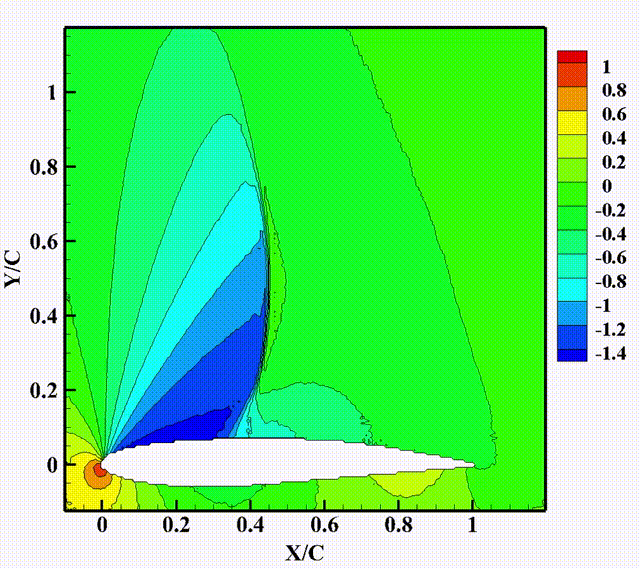
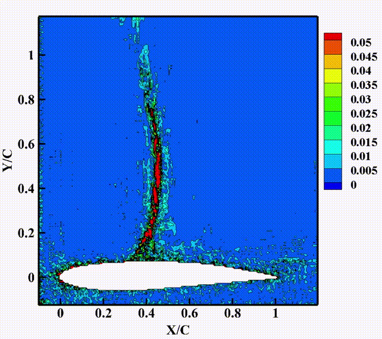

---

# 背景介绍

在跨声速流动条件下，在翼型上的自持续大尺度激波振荡被称为跨声速抖振。其原因与激波与边界层流动分离及相互作用有关。进入抖振边界后，分离区变化引起流动不稳定，影响了激波的流场位置，使得激波产生前后运动，具有复杂的非定常和非线性特征。从流场(时空流)直接学习非定常激波抖振特征对抖振研究来说，是一种有价值且具有挑战性的方法。为了找到一个高效的DL建模方法解决复杂非定常跨声速抖振问题，提出一种增强型混合深度神经网络(eHDNN)基于流场重构对非定常流场进行预测。

# 模型架构

eHDNN的基本框架主要基于混合深度神经网络框架[论文](https://doi.org/10.1016/j.ast.2022.107636)，其主要由CNN、ConvLSTM和DeCNN组成。CNN降低了时间序列流场的维数，实现特征提取;ConvLSTM学习低维时空特征并进行预测;最后，DeCNN实现预测流场的重建。

+ 输入层：输入历史流场;
+ 卷积层：通过多层CNN对流场进行降维，提取高维时空流动特征;
+ 记忆层：通过多层ConvLSTM学习低维空间流场时空特征的演变，预测下一时刻;
+ 反卷积输出层：将预测到的流场低维特征恢复到高维空间，通过多层DeCNN实现对下一时刻瞬态流场的重构，并输出预测结果

# 数据集

+ 来源：OAT15A超临界翼型非定常抖振的数值仿真流场数据，由西北工业大学航天学院王刚教授团队计算并提供

+ 建立方法：数据集计算状态与建立方法见[论文]()

+ 规格：单状态数据集与多状态数据集两类

    + 单状态数据集：单一攻角状态下的多周期抖振流场瞬态快照(数据集大小为7.8g)
    + 多状态数据集：涵盖攻角范围3.3°-3.8°（间隔0.1°变化）的6组状态多周期抖振流场瞬态快照
    + 注意：每张流场快照包含3个通道，代表流场的压强分布信息、弦向速度信息、法向速度信息
    + 数据集的下载地址为：[https://download.mindspore.cn/mindscience/mindflow/dataset/applications/data_driven/airfoil/2D_unsteady/](https://gitee.com/link?target=https%3A%2F%2Fdownload.mindspore.cn%2Fmindscience%2Fmindflow%2Fdataset%2Fapplications%2Fdata_driven%2Fairfoil%2F2D_unsteady%2F),文件大小约为50g(8个状态)

# 训练过程

该模型单机单卡进行训练，根据训练任务需求，执行 train.py开始训练；
在开始训练前需要在config.yaml中设置相关训练条件：

+ 相关路径设置
+ 训练参数设置

# 预测结果可视化

根据训练条件，执行prediction.py；
后处理操作：

+ 对预测数据进行后处理，输出预测流场云图快照(；流场数据格式为Tecplot格式，用Tecplot打开查看结果

+ 保存路径默认为：prediction_result路径下，包含指定流场变量的CFD 流场快照，预测流场快照和绝对误差云图

+ 打开流场数据操作：

  1. 打开Tecplot，导入Tecplot格式数据，批次选择预测流场（序列流场数T=84）
  2. 选择加载数据格式为Tecplot Data Loader

# 预测结果展示

下图为基于多状态下训练完备的eHDNN模型实现对攻角3.75°（泛化状态）下非定常抖振流场单周期内的变化预测结果（展示压强场）

<figure class="harf">
    
    
    

