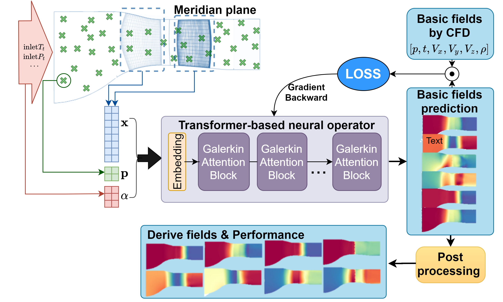
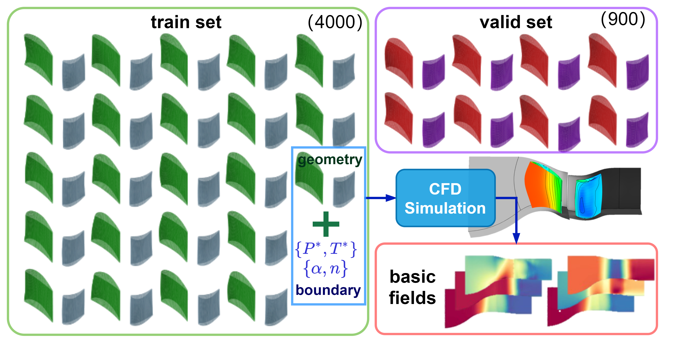
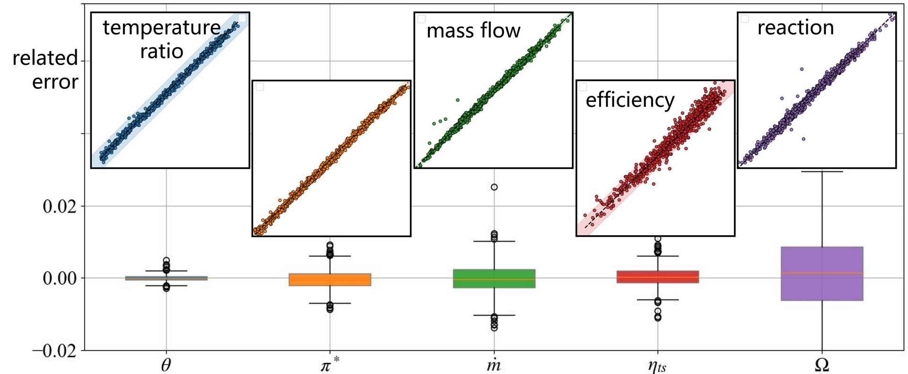
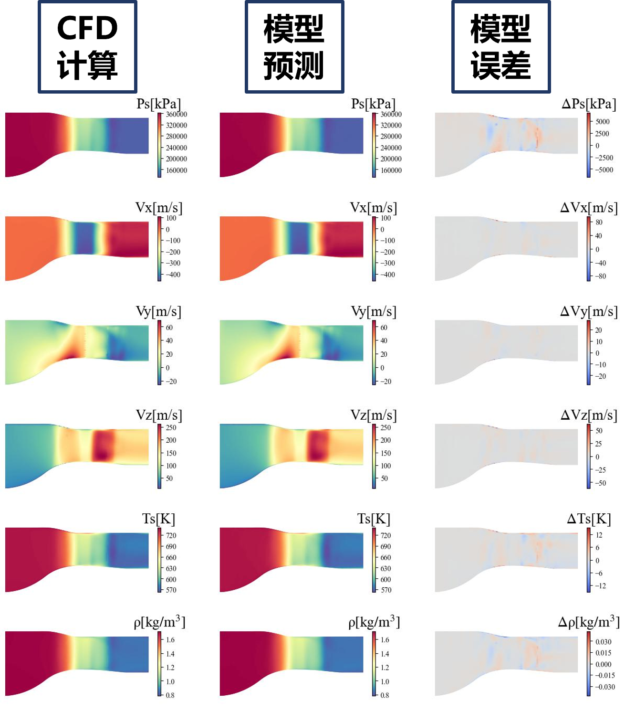
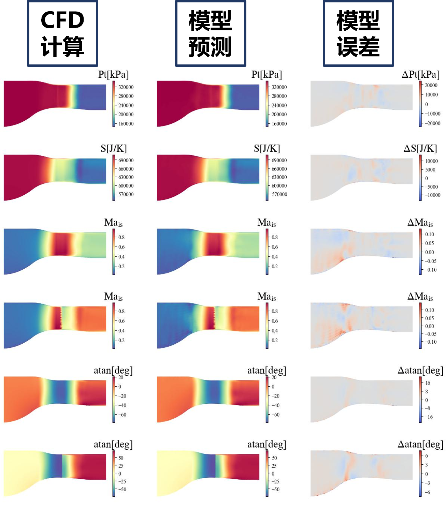
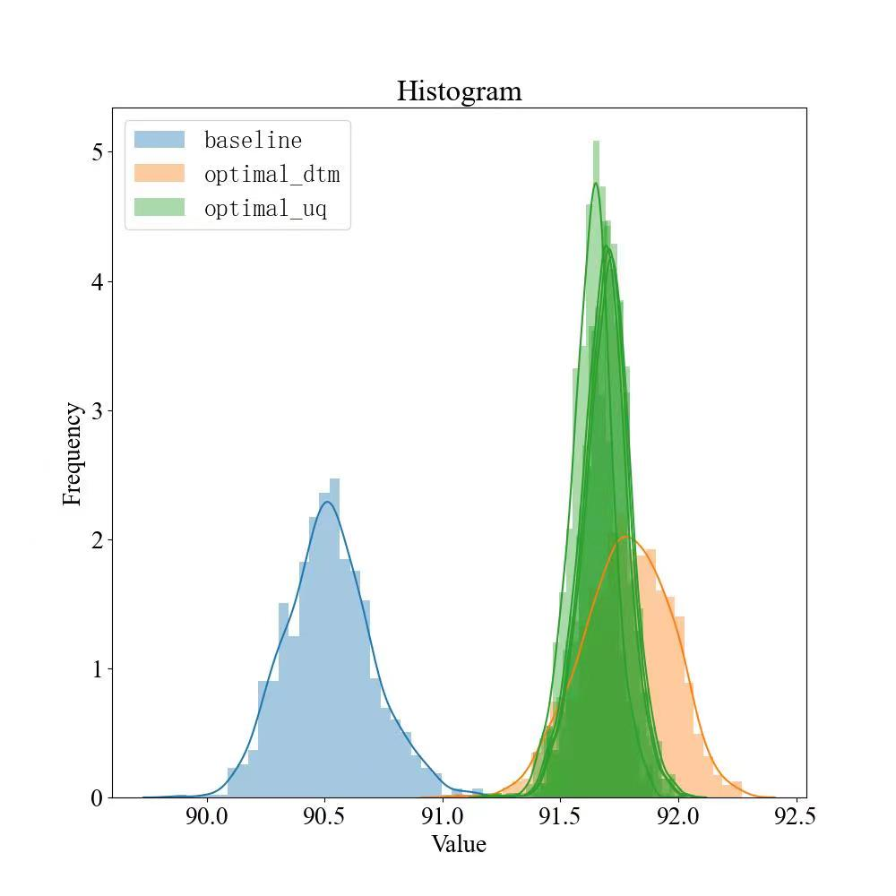

## Turbine Stage Flow Field Prediction and Uncertainty Optimization Design Based on Neural Operator Networks

## Overview

In the process of design, manufacturing, and operation of fluid machinery, there are many uncertainties that can cause actual operation parameters such as flow rate and efficiency to deviate from the design values, affecting operational performance. However, incorporating geometric and working condition uncertainties into the design consideration can dramatically increase the cost and time of comprehensive performance evaluation during the design process. Currently, there is a lack of low-cost uncertainty optimization design methods in the field of fluid machinery.

Applying high-precision neural operator networks to uncertainty optimization design as a substitute for time-consuming CFD calculations is a method to solve the above problems. This can effectively improve the efficiency of uncertainty optimization design and enhance the operational stability of the design object.

### Method

Directly using the Monte Carlo method to calculate the performance distribution of a specific design scheme under uncertain input is very costly. Traditional uncertainty optimization design often adopts uncertainty quantification methods based on surrogate models, such as polynomial chaos, to complete the assessment of uncertain parameters. However, even so, dozens or even hundreds of numerical calculations are required to evaluate a sample.

This paper adopts a Monte Carlo combined with deep learning method to complete the quantification assessment of uncertainty. Based on this assessment result, optimization design is completed, and the specific flow field is shown in the following figure:

<div align="center">

<div align="left">

1. The NSGA2 algorithm outputs the variable information of the $n$ design schemes to be calculated;
2. The ITS method is used to obtain the $m$ discrete representations of uncertain inputs;
3. Combine design variables with uncertainty variables, and use the deep learning model to calculate the $m \times n$ physical field results;
4. Post-process the physical field results to obtain performance parameter results;
5. Complete the uncertainty quantification calculation, obtain the uncertainty assessment of the $n$ designs, and return it to the algorithm module;
6. Repeat the above 5 steps until the $h$ iterations end and output the optimal solution;

In the above process, the full physical field evaluation of the design scheme is key. A total of $m \times n \times h$ evaluations are required for an optimization design, which cannot be completed with the cost of traditional CFD numerical calculations. Therefore, a neural network that is fast in calculation, convenient for parallelization, and has high prediction accuracy is needed to predict the physical field.
The physical field prediction based on the neural network is the core step of the entire process. The specific network structure is as follows:

<div align="center">

<div align="left">

1. The input of the deep operator network includes: design parameters x, working condition parameters $\alpha$, and coordinate parameters $p$, which are connected and then input into the network.
2. The network structure used in this paper is a transformer operator network using Galerkin linear calculation;
3. The output of the network is the basic physical field, including: pressure $p$, temperature $T$, velocity $V$ (three components), and density $\rho$, which are the basic characteristic quantities solved by the N-S equation, and each characteristic quantity occupies a channel;
4. When the obtained results have all the characteristic physical quantities in the N-S direction, any physical field or performance parameter value can be calculated based on the post-processing program.

### Dataset

This paper takes the first stage high-pressure turbine of GE-E3 as the research object to establish a performance evaluation model. The single-channel model of the GE-E3 high-pressure stage is shown in the following figure, which includes a set of stator blades S1 and a set of rotor blades R1. Numerical calculations are completed using the commercial CFD software Numeca. [data set download link](https://gr.xjtu.edu.cn/web/songlm/1)

<div align="center">

<div align="left">

The dataset prepared in this paper is shown in the following figure. In the data preparation process, the Latin hypercube sampling (LHS) method was used to collect 4900 samples in the design space for a total of 100 geometric and boundary condition design variables. Subsequently, the geometric parameterization method was used to generate the corresponding geometric models, and the three-dimensional flow field of each sample was calculated. Finally, 4000 samples were randomly selected as the training set, and 900 samples were selected as the verification set.

<div align="center">

<div align="left">

### Effect

After completing the network training with the training set data, the network directly predicts the physical field of the verification set data and calculates some commonly used performance indicators in the design of turbomachinery. It is found that the relative error of the predicted performance indicators is less than 1%, and the prediction accuracy basically meets the engineering practice requirements.

<div align="center">

<div align="left">

Further, the obtained network is used for uncertainty optimization design. Based on the fast assessment characteristics of the neural network, the optimization results can be obtained in a short time, which fully improves the design efficiency and obtains an engineering feasible uncertainty optimization design method.

## Quick Start

Training method: Call the main.py script in the command line

```
python main.py --config_file_path 'configs/FNO_GVRB' --device_target 'GPU'
```

The main.py script accepts the following input arguments:

```
--config_file_path: # Specifies the path to the configuration and control file. The default value is './config.yaml'.
--mode: # Represents the running mode of the script. 'GRAPH' for static graph mode, 'PYNATIVE' for dynamic graph mode. The default value is 'GRAPH'.
--device_target: # Indicates the type of computing platform used. Options include 'Ascend' or 'GPU'. The default value is 'Ascend'.
--device_id: # Represents the identifier for the computing card used. This can be filled in according to actual conditions. The default value is 0.
```

### Results Display

After the training is started, the result is as follows:

```
Epoch 495: loss 0.032
Train epoch time: 3.261 s, per step time: 51.755 ms
Epoch 496: loss 0.032
Train epoch time: 3.628 s, per step time: 57.592 ms
Epoch 497: loss 0.032
Train epoch time: 3.262 s, per step time: 51.785 ms
Epoch 498: loss 0.032
Train epoch time: 3.358 s, per step time: 53.305 ms
Epoch 499: loss 0.032
Train epoch time: 3.246 s, per step time: 51.531 ms
Epoch 500: loss 0.032
Train epoch time: 3.293 s, per step time: 52.275 ms
Epoch 500: train: 0.06596697171349167
Epoch 500: test: 0.09644165817184366
training done!
Total train time: 1777.7318394184113s
```

After the drawing is started, the result is as follows:

<div align="center">

<br>

<br>

After the optmizing is started, the result is as follows:

```
=================================================
n_gen  |  n_eval  |     f_avg     |     f_min
=================================================
...
    25 |      800 | -9.143245E-01 | -9.216238E-01
    26 |      832 | -9.143438E-01 | -9.216238E-01
    27 |      864 | -9.144188E-01 | -9.216238E-01
    28 |      896 | -9.144471E-01 | -9.216238E-01
    29 |      928 | -9.145065E-01 | -9.216238E-01
    30 |      960 | -9.145443E-01 | -9.216238E-01
optimal value of dtm task: [-0.92162382]
total optimization time of dtm task: 25.431s
```


<br>
<div align="left">

## Performance

### UNet Performance Comparison

| Parameter | Ascend | GPU |
|:----------------------:|:--------------------------:|:---------------:|
| Hardware resources | Ascend, 32 GB video memory | NVIDIA V100, 32 GB video memory |
| MindSpore Version | 2.2. 14 | 2.2. 12 |
| Dataset | [Turbine Stage Meridian Flow Dataset](https://download-mindspore.osinfra.cn/mindscience/mindflow/dataset/applications/research/turbine_uq/) | [Turbine Stage Meridian Flow Dataset](https://download-mindspore.osinfra.cn/mindscience/mindflow/dataset/applications/research/turbine_uq/) |
| Reference Quantity | 4.2e6 | 4.2e6 |
| Training parameter | batch_size=32, <br>steps_per_epoch=70, <br>epochs=500 | batch_size=32, <br>steps_per_epoch=70, <br>epochs=500 |
| Test parameter | batch_size=32 | batch_size=32 |
| Optimizer | Adam | Adam |
| Dynamic Graph - Training Loss (RL2) | 0.0654 | 0.0652 |
| Dynamic Diagram - Verification Loss (RL2) | 0.0932 | 0.0941 |
| Dynamic Diagram - Training Step Time (ms) | 52 | 54 |
| Static Graph - Training Loss (RL2) | 0.0667 | 0.0667 |
| Static Graph - Verification Loss (RL2) | 0.0956 | 0.0970 |
| Static graph - Training step time (ms) | 33 | 44 |

### FNO Performance Comparison

| Parameter | Ascend | GPU |
|:----------------------:|:--------------------------:|:---------------:|
| Hardware resources | Ascend, 32 GB video memory | NVIDIA V100, 32 GB video memory |
| MindSpore Version | 2.2. 14 | 2.2. 12 |
| Dataset | [Turbine Stage Meridian Flow Dataset](https://download-mindspore.osinfra.cn/mindscience/mindflow/dataset/applications/research/turbine_uq/) | [Turbine Stage Meridian Flow Dataset](https://download-mindspore.osinfra.cn/mindscience/mindflow/dataset/applications/research/turbine_uq/) |
| Number of References | 3.1e6 | 3.1e6 |
| Training parameter | batch_size=32, <br>steps_per_epoch=70, <br>epochs=500 | batch_size=32, <br>steps_per_epoch=70, <br>epochs=500 |
| Test parameter | batch_size=32 | batch_size=32 |
| Optimizer | Adam | Adam |
| Dynamic Graph - Training Loss (RL2) | 0.0371 | 0.0370 |
| Dynamic Graph - Verification Loss (RL2) | 0.0378 | 0.0377 |
| Dynamic Graph - Training Step Time (ms) | 124 | 116 |
| Static Graph - Training Loss (RL2) | 0.0381 | 0.0371 |
| Static Graph - Verification Loss (RL2) | 0.0446 | 0.0371 |
| Static Graph - Training Step Time (ms) | 35 | 68 |
