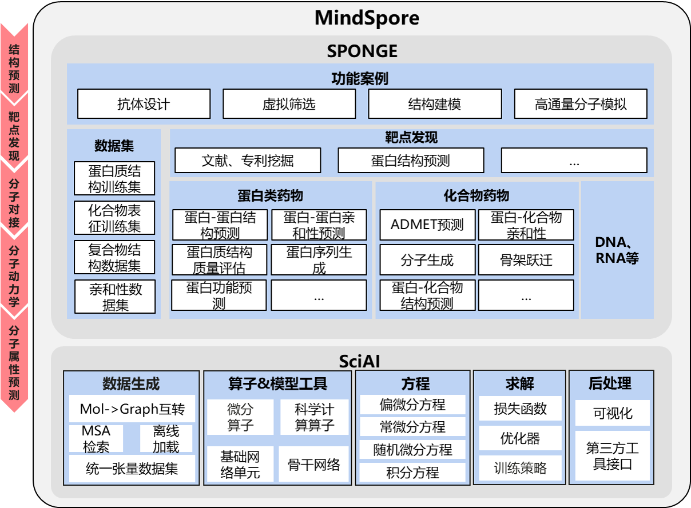

[ENGLISH](README_EN.md) | 简体中文


[](https://pypi.org/project/mindspore)
[](https://badge.fury.io/py/mindspore)
[](https://github.com/mindspore-ai/mindspore/blob/master/LICENSE)
[](https://gitee.com/mindspore/mindscience/pulls)

# **MindSPONGE**

<!-- TOC -->

- [MindSpore SPONGE](#mindspore-sponge)
    - [MindSpore SPONGE介绍](#mindspore-sponge介绍)
    - [最新消息](#最新消息-)
    - [即将到来](#即将到来-)
    - [初体验](#初体验)
        - [蛋白质 violation 计算](#蛋白质-violation-计算)
        - [四元数与旋转矩阵转换](#四元数与旋转矩阵转换)
        - [一个简单的分子动力学模拟案例](#一个简单的分子动力学模拟案例)
    - [安装教程](#安装教程)
        - [依赖安装](#依赖安装)
        - [硬件支持情况](#硬件支持情况)
        - [pip安装](#pip安装)
        - [源码安装](#源码安装)
    - [社区](#社区)
        - [CO-CHAIR](#co-chair)
        - [SIG](#sig-)
        - [核心贡献者](#核心贡献者-)
    - [许可证](#许可证)

<!-- TOC -->

## **MindSpore SPONGE介绍**

MindSpore SPONGE(Simulation Package tOwards Next GEneration molecular modelling)是基于[昇思MindSpore](https://www.mindspore.cn/)的计算生物领域套件，支持分子动力学、蛋白质折叠等常用功能，旨在于为广大的科研人员、老师及学生提供高效易用的AI计算生物软件。

<div align=center></div>

## **最新消息** 📰

- `2022.07.18` 论文"SPONGE: A GPU-Accelerated Molecular Dynamics Package with Enhanced Sampling and AI-Driven Algorithms"发表于期刊Chinese Journal of Chemistry，详情参见[论文](https://onlinelibrary.wiley.com/doi/epdf/10.1002/cjoc.202100456)和[代码](https://gitee.com/mindspore/mindscience/tree/master/MindSPONGE/mindsponge/ccsrc/molecular_dynamics)
- `2022.07.09` MEGA-Assessment在CAMEO-QE月榜取得第一名。
- `2022.06.27` 论文"PSP: Million-level Protein Sequence Dataset for Protein Structure Prediction" arxiv 预印，详情参见[论文](https://arxiv.org/pdf/2206.12240v1.pdf)和[代码](https://gitee.com/mindspore/mindscience/tree/master/MindSPONGE/applications/MEGAProtein/)。
- `2022.04.21` MEGA-Fold CAMEO竞赛月榜第一, [相关新闻](https://www.huawei.com/cn/news/2022/4/mindspore-cameo-protein-ascend)

## **即将到来** 🚀

- 🔥2022.8.11—2022.8.15 MindSpore SPONGE SIG[暑期学校活动](#sig)

## **初体验**

### 蛋白质 violation 计算

- 蛋白质推理模型预测的pdb虽然在绝大多数原子上都准确预测出理想的键长和键角，然而原子间是否存在冲突以及肽键信息对于真实结构也尤为重要，violation 则计算了预测pdb的总原子间冲突程度以及肽键键长键角是否满足一定的限制条件。该计算数值对于评估预测蛋白质结构是否合理以及后续做蛋白质relax尤其重要。
- violation计算公式如下:

\begin{align}
\mathcal L_{viol} = \mathcal L_{bondlength }+\mathcal L_{bondangle }+\mathcal L_{clash } .
\end{align}

```bash
import mindspore as ms
from mindspore import context
from mindspore.common import Tensor
from mindsponge.common.utils import get_pdb_info
from mindsponge.metrics.structure_violations import get_structural_violations

# set which gpu to use, in default use 0 card
context.set_context(mode=context.GRAPH_MODE, device_target="GPU", device_id=0)
input_pdb = "xxx.pdb"

# extract features from pdb
features = get_pdb_info(input_pdb)

violations = get_structural_violations(Tensor(features.get("atom14_gt_exists")).astype(ms.float32),
                                       Tensor(features.get("residue_index")).astype(ms.float32),
                                       Tensor(features.get("aatype")).astype(ms.int32),
                                       Tensor(features.get("residx_atom14_to_atom37")).astype(ms.int32),
                                       Tensor(features.get("atom14_gt_positions")).astype(ms.float32))
violation_all = violations[-1]
```

### 四元数与旋转矩阵转换

- geometry模块提供基础四元数、旋转矩阵、向量操作

```bash
from mindsponge.common.geometry import initial_affine
from mindsponge.common.geometry import quat_to_rot, rot_to_quat
# quaternion is a mindspore tensor
# rotation_matrix is a tuple of mindspore tensor, length is 9
# translation is a tuple of mindsproe tensor, length is 3
quat, rot, trans = initial_affine(128) # 128 is the num of residues
transformed_rot = quat_to_rot(quat)
transformed_quat = rot_to_quat(rot)
```

### 一个简单的分子动力学模拟案例

```bash
import numpy as np
from mindspore import context
from mindsponge import Sponge
from mindsponge import Molecule
from mindsponge import ForceFieldBase
from mindsponge import DynamicUpdater
from mindsponge.potential import BondEnergy, AngleEnergy
from mindsponge.callback import WriteH5MD, RunInfo
from mindsponge.function import VelocityGenerator
from mindsponge.control import LeapFrog

context.set_context(mode=context.GRAPH_MODE, device_target="GPU")

system = Molecule(
    atoms=['O', 'H', 'H'],
    coordinate=[[0, 0, 0], [0.1, 0, 0], [-0.0333, 0.0943, 0]],
    bond=[[[0, 1], [0, 2]]],
)

bond_energy = BondEnergy(
    index=system.bond,
    force_constant=[[345000, 345000]],
    bond_length=[[0.1, 0.1]],
)

angle_energy = AngleEnergy(
    index=[[1, 0, 2]],
    force_constant=[[383]],
    bond_angle=[[109.47 / 180 * np.pi]],
)

energy = ForceFieldBase(energy=[bond_energy, angle_energy])

velocity_generator = VelocityGenerator(300)
velocity = velocity_generator(system.coordinate.shape, system.atom_mass)

opt = DynamicUpdater(
    system,
    integrator=LeapFrog(system),
    time_step=1e-3,
    velocity=velocity,
)

md = Sponge(system, energy, opt)

run_info = RunInfo(10)
cb_h5md = WriteH5MD(system, 'test.h5md', save_freq=10, write_velocity=True, write_force=True)

md.run(1000, callbacks=[run_info, cb_h5md])
```

**更多应用案例请见**：👀

- [蛋白质结构弛豫](https://gitee.com/mindspore/mindscience/tree/master/MindSPONGE/applications/molecular_dynamics/protein_relax/)
- [蛋白质结构预测 MEGA-Fold](https://gitee.com/mindspore/mindscience/tree/master/MindSPONGE/applications/MEGAProtein/)
- [蛋白质结构评估 MEGA-Assessment](https://gitee.com/mindspore/mindscience/tree/master/MindSPONGE/applications/MEGAProtein/)
- [共进化数据引擎 MEGA-EvoGen](https://gitee.com/mindspore/mindscience/tree/master/MindSPONGE/applications/MEGAProtein/)
- 基于功能的蛋白设计(TO BE DONE)
- 基于结构的蛋白设计(TO BE DONE)
- 蛋白质功能预测(TO BE DONE)
- 化合物分子表征模型(TO BE DONE)

## **安装教程**

### 依赖安装

```bash
pip install -r requirements.txt
```

### 硬件支持情况

| 硬件平台      | 操作系统        | 状态 |
| :------------ | :-------------- | :--- |
| Ascend 910    | Ubuntu-x86      | ✔️ |
|               | Ubuntu-aarch64  | ✔️ |
|               | EulerOS-aarch64 | ✔️ |
|               | CentOS-x86      | ✔️ |
|               | CentOS-aarch64  | ✔️ |
| GPU CUDA 10.1 | Ubuntu-x86      | ✔️ |

### pip安装

```bash
pip install mindscience_sponge_[gpu|ascend]
```

### 源码安装

```bash
git clone https://gitee.com/mindspore/mindscience.git
cd {PATH}/mindscience/MindSPONGE
```

- 昇腾后端

```bash
bash build.sh -e ascend
```

- GPU后端

若使用传统分子动力学sponge，开启编译选项 `t`

```bash
export CUDA_PATH={your_cuda_path}
bash build.sh -e gpu -t on -j32
```

- 安装编译所得whl包

```bash
cd {PATH}/mindscience/MindSPONGE/output
pip install mindscience_sponge*.whl
```

## **社区**

### CO-CHAIR

- 深圳湾实验室[杨奕](https://gitee.com/helloyesterday)
- 北京昌平实验室[张骏](https://gitee.com/jz_90)
- 北京昌平实验室[刘思睿](https://gitee.com/sirui63)

### SIG 🏠

MindSpore SPONGE SIG(Special Interesting Group)是由一群有兴趣，有使命，旨在AI×生物计算领域做出一番成就的人组成的团队。

MindSpore SPONGE SIG小组为广大科研人员，老师和学生提供高效易用的AI计算生物软件的同时，为在这个领域有着强大的能力或者浓厚的兴趣的人们提供了一个能够共同交流合作的平台。

在SIG小组中，我们会举办各种活动，其中最为隆重的暑期学校活动即将到来，活动时间为8月11日-8月15日，我们将会邀请到六位MindSpore SPONGE SIG的老师进行一场为期五天的授课，授课主题主要包括MindSpore基础，分子动力学以及AI × Science进阶课程三大主题，还会提供四次上机课时让学生们亲自动手体验。如果想要报名暑期学校，请扫描下图二维码，我们随时欢迎你的到来。

<div align=center></div>

在SIG小组中，我们还会发布众智任务和[开源实习任务](https://gitee.com/mindspore/community/issues/I561LI?from=project-issue)，欢迎大家来认领。

如果想加入我们，成为我们小组的成员，请将自己的简历发送至邮箱dingyahao@huawei.com，我们无时无刻不在期待着你的到来。

### 核心贡献者 🧑‍🤝‍🧑

- [高毅勤课题组](https://www.chem.pku.edu.cn/gaoyq/):  [杨奕](https://gitee.com/helloyesterday)，[张骏](https://gitee.com/jz_90)，[刘思睿](https://gitee.com/sirui63)，[夏义杰](https://gitee.com/gao_hyp_xyj_admin)，[陈迪青](https://gitee.com/dechin)，[黄渝鹏](https://gitee.com/gao_hyp_xyj_admin)

## **许可证**

[Apache License 2.0](http://www.apache.org/licenses/LICENSE-2.0)
