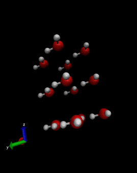

 ENGLISH | [简体中文](README_CN.md)


[](https://github.com/mindspore-ai/mindspore/blob/master/LICENSE)
[](https://gitee.com/mindspore/mindscience/pulls)
[](https://mindspore.cn/mindsponge/docs/zh-CN/r1.0.0-alpha/index.html)
[](https://gitee.com/mindspore/mindscience/blob/master/MindSPONGE/RELEASE_CN.md)

# **MindSpore SPONGE**

## **Introduction**

MindSpore SPONGE(Simulation Package tOwards Next GEneration molecular modelling) is a toolkit for Computational Biology based on AI framework [MindSpore](https://www.mindspore.cn/)，which supports MD, folding and so on. It aims to provide efficient AI computational biology software for a wide range of scientific researchers, staff, teachers and students.

<div align=center></div>

## **Latest News** 📰

- 🔥`Top` [open source internship task](https://gitee.com/mindspore/community/issues/I561LI?from=project-issue) has been released! Everyone is welcome to claim it~
- 🔥`2023.1.31` MindSPONGE version 1.0.0-alpha is released. The documents are available on [Scientific Computing MindSPONGE module](https://mindspore.cn/mindsponge/docs/en/r1.0.0-alpha/index.html) on MindSpore website
- `2022.8.23` Paper "Few-Shot Learning of Accurate Folding Landscape for Protein Structure Prediction" is preprinted in arxiv, Please refer to [Paper](https://arxiv.org/abs/2208.09652)
- `2022.8.11—2022.8.15` MindSpore SPONGE SIG [Summer School](#special-interesting-group-), [replay](https://www.bilibili.com/video/BV1pB4y167yS?spm_id_from=333.999.0.0&vd_source=94e532d8ff646603295d235e65ef1453)
- `2022.07.18` Paper "SPONGE: A GPU-Accelerated Molecular Dynamics Package with Enhanced Sampling and AI-Driven Algorithms"is published in Chinese Journal of Chemistry. Please refer to [paper](https://onlinelibrary.wiley.com/doi/epdf/10.1002/cjoc.202100456) and [codes](https://gitee.com/mindspore/mindscience/tree/master/MindSPONGE/mindsponge/ccsrc/molecular_dynamics)
- `2022.07.09` MEGA-Assessment wins CAMEO-QE monthly 1st
- `2022.06.27` Paper "PSP: Million-level Protein Sequence Dataset for Protein Structure Prediction" is preprinted in arxiv. Please refer to [Paper](https://arxiv.org/pdf/2206.12240v1.pdf) and [codes](https://gitee.com/mindspore/mindscience/tree/master/MindSPONGE/applications/MEGAProtein).
- `2022.04.21` MEGA-Fold wins CAMEO-3D monthly 1st. [Related News](https://www.huawei.com/cn/news/2022/4/mindspore-cameo-protein-ascend)

## **Coming Soon** 🚀

- Everything is coming soon, don't worry~

## **Quick Start**

### Protein Multimer Structure Prediction

```bash
import os
import stat
import pickle
from mindsponge import Pipeline
from mindsponge.common.protein import to_pdb, from_prediction

cmd = "wget https://download.mindspore.cn/mindscience/mindsponge/Multimer/examples/6T36.pkl"
os.system(cmd)

pipe = Pipeline(name="Multimer")
pipe.set_device_id(0)
pipe.initialize("predict_256")
pipe.model.from_pretrained()
f = open("./6T36.pkl", "rb")
raw_feature = pickle.load(f)
f.close()
final_atom_positions, final_atom_mask, confidence, b_factors = pipe.predict(raw_feature)
unrelaxed_protein = from_prediction_v2(final_atom_positions,
                                       final_atom_mask,
                                       raw_feature["aatype"],
                                       raw_feature["residue_index"],
                                       b_factors)
pdb_file = to_pdb_v2(unrelaxed_protein)
os.makedirs('./result/', exist_ok=True)
os_flags = os.O_RDWR | os.O_CREAT
os_modes = stat.S_IRWXU
pdb_path = './result/unrelaxed_6T36.pdb'
with os.fdopen(os.open(pdb_path, os_flags, os_modes), 'w') as fout:
    fout.write(pdb_file)
print("confidence:", confidence)
```

<div align=left>
    
</div>

### A simple example for molecular dynamics

```bash
import numpy as np
from mindspore import context
from mindsponge import Sponge
from mindsponge import Molecule
from mindsponge import ForceFieldBase
from mindsponge import DynamicUpdater
from mindsponge.potential import BondEnergy, AngleEnergy
from mindsponge.callback import WriteH5MD, RunInfo
from mindsponge.function import VelocityGenerator
from mindsponge.control import LeapFrog

context.set_context(mode=context.GRAPH_MODE, device_target="GPU")

system = Molecule(
    atoms=['O', 'H', 'H'],
    coordinate=[[0, 0, 0], [0.1, 0, 0], [-0.0333, 0.0943, 0]],
    bond=[[[0, 1], [0, 2]]],
)

bond_energy = BondEnergy(
    index=system.bond,
    force_constant=[[345000, 345000]],
    bond_length=[[0.1, 0.1]],
)

angle_energy = AngleEnergy(
    index=[[1, 0, 2]],
    force_constant=[[383]],
    bond_angle=[[109.47 / 180 * np.pi]],
)

energy = ForceFieldBase(energy=[bond_energy, angle_energy])

velocity_generator = VelocityGenerator(300)
velocity = velocity_generator(system.coordinate.shape, system.atom_mass)

opt = DynamicUpdater(
    system,
    integrator=LeapFrog(system),
    time_step=1e-3,
    velocity=velocity,
)

md = Sponge(system, energy, opt)

run_info = RunInfo(10)
cb_h5md = WriteH5MD(system, 'test.h5md', save_freq=10, write_velocity=True, write_force=True)

md.run(1000, callbacks=[run_info, cb_h5md])
```

<div align=left></div>

**More Cases**：👀

- [Protein Relaxation](https://gitee.com/mindspore/mindscience/tree/master/MindSPONGE/applications/molecular_dynamics/protein_relaxation)
- [Protein Structure Prediction MEGA-Fold](https://gitee.com/mindspore/mindscience/tree/master/MindSPONGE/applications/MEGAProtein/)
- [Protein Structure Assessment MEGA-Assessment](https://gitee.com/mindspore/mindscience/tree/master/MindSPONGE/applications/MEGAProtein/)
- [Evolution Engine MEGA-EvoGen](https://gitee.com/mindspore/mindscience/tree/master/MindSPONGE/applications/MEGAProtein/)
- Function based protein design (TO BE DONE)
- Structure based protein design (TO BE DONE)
- Protein function prediction (TO BE DONE)
- Molecular representation model (TO BE DONE)

## **Installation**

### Version dependency

Due to the dependency between MindSPONGE and MindSpore, please follow the table below and install the corresponding MindSpore version from [MindSpore download page](https://www.mindspore.cn/versions).

| MindSPONGE Version |                                  Branch                                  | MindSpore Version | Python Version |
|:------------------:|:------------------------------------------------------------------------:|:-----------------:|:--------------:|
|       1.0.0        | [master](https://gitee.com/mindspore/mindscience/tree/master/MindSPONGE) |  \>=2.0.0-alpha   |     \>=3.7     |

```bash
pip install -r requirements.txt
```

### Hardware

| Hardware      | OS              | Status |
| :------------ | :-------------- | :--- |
| Ascend 910    | Ubuntu-x86      | ✔️ |
|               | Ubuntu-aarch64  | ✔️ |
|               | EulerOS-aarch64 | ✔️ |
|               | CentOS-x86      | ✔️ |
|               | CentOS-aarch64  | ✔️ |
| GPU CUDA 10.1 | Ubuntu-x86      | ✔️ |

- CUDA>=10.1
- Ubuntu>=16.04

### **pip install**

```bash
pip install mindsponge-[gpu|ascend]
```

### **source code install**

```bash
git clone https://gitee.com/mindspore/mindscience.git
cd {PATH}/mindscience/MindSPONGE
```

- Ascend backend

```bash
bash build.sh -e ascend
```

- GPU backend

Enable `c` if you want to use Cybertron.

Enable `t` if you want to use traditional MD.

```bash
export CUDA_PATH={your_cuda_path}
bash build.sh -e gpu -j32 -t on -c on
```

- Install whl package

```bash
cd {PATH}/mindscience/MindSPONGE/output
pip install mindsponge*.whl
pip install cybertron*.whl # if "-c on" is used
```

### API

For details about MindSPONGE APIs, please refer to [API](https://mindspore.cn/mindsponge/docs/en/master/index.html) pages.

## **Community**

### CO-CHAIR

<div align=center>
    <a href="https://gitee.com/helloyesterday">
        
    </a>
    &emsp;&emsp;&emsp;&emsp;&emsp;&emsp;&emsp;&emsp;&emsp;&emsp;
    <a href="https://gitee.com/jz_90">
        
    </a>
    &emsp;&emsp;&emsp;&emsp;&emsp;&emsp;&emsp;&emsp;&emsp;
    <a href="https://gitee.com/sirui63">
        
    </a>
    <br/>
    <font>Shenzhen Bay Laboratory Yi Isaac Yang</font>
    &emsp;&emsp;&emsp;
    <font>Chang Ping Laboratory Jun Zhang</font>
    &emsp;&emsp;&emsp;
    <font>Chang Ping Laboratory Sirui Liu</font>
</div>

### Special Interesting Group 🏠

MindSpore SPONGE SIG (Special Interesting Group) is a team composed of a group of people who are interested and have a mission to make achievements in the field of AI × biological computing.

MindSpore SPONGE SIG group provides efficient and easy-to-use AI computational biology software for researchers, teachers and students, and provides a platform for people with strong abilities or strong interests in this field to communicate and cooperate together.

At present, the SIG group has six core teachers. After members joining the SIG group, our teachers will lead the team to carry out scientific research and develop the software function development. Of course, members are also welcome to do research on their own topics using MindSPONGE.

In the SIG group, we will hold various activities, including summer school, public lecture, technology communication meeting and other large-scale activities. Small-scale activities like weekly meetings, blogs writing will also be held in the group. By joining the activities, there will be lots of chances to communicate with our experts. During the summer school program ended on August 15th, we invited 13 teachers to have a five-day lecture mainly including three themes of MindSpore basics, molecular dynamics and advanced AI × Science courses. You can get the replay [here](https://www.bilibili.com/video/BV1pB4y167yS?spm_id_from=333.999.0.0&vd_source=94e532d8ff646603295d235e65ef1453).

In the SIG group, we will also release the public intelligence task and [open source internship task](https://gitee.com/mindspore/community/issues/I561LI?from=project-issue), welcome everyone to claim it.

If you want to join us and become a member of our group, please send your resume to dingyahao@huawei.com, we are always looking forward to your arrival.

### Core Contributor 🧑‍🤝‍🧑

- [Yi Qin Gao Research Group](https://www.chem.pku.edu.cn/gaoyq/):  [Yi Isaac Yang](https://gitee.com/helloyesterday)，[Jun Zhang](https://gitee.com/jz_90)，[Sirui Liu](https://gitee.com/sirui63)，[Yijie Xia](https://gitee.com/xiayijie)，[Diqing Chen](https://gitee.com/dechin)，[Yu-Peng Huang](https://gitee.com/gao_hyp_xyj_admin)

### Cooperative Partner

<div class="item1">
    
    &emsp;
    
    &emsp;
    
</div>

## **Contribution Guide**

- Please click here to see how to contribute your code:[Contribution Guide](https://gitee.com/mindspore/mindscience/blob/master/CONTRIBUTION.md)

## **License**

[Apache License 2.0](http://www.apache.org/licenses/LICENSE-2.0)
