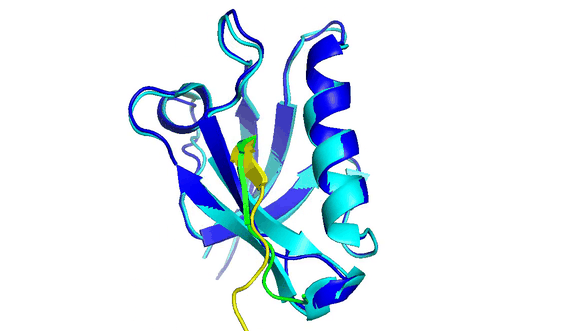

[ENGLISH](README.md) | 简体中文


[](https://github.com/mindspore-ai/mindspore/blob/master/LICENSE)
[](https://gitee.com/mindspore/mindscience/pulls)
[](https://mindspore.cn/mindsponge/docs/zh-CN/r1.0.0-alpha/index.html)
[](https://gitee.com/mindspore/mindscience/blob/master/MindSPONGE/RELEASE_CN.md)

# **MindSpore SPONGE**

## **MindSpore SPONGE介绍**

MindSpore SPONGE(Simulation Package tOwards Next GEneration molecular modelling)是基于[昇思MindSpore](https://www.mindspore.cn/)的计算生物领域套件，支持分子动力学、蛋白质折叠等常用功能，旨在于为广大的科研人员、老师及学生提供高效易用的AI计算生物软件。

<div align=center></div>

## **最新消息** 📰

- 🔥`2023.12.07` 抗体设计天工大模型荣获“2023 AIIA人工智能十大先锋应用案例”, [相关新闻](https://mp.weixin.qq.com/s/UQStKzm0fdXbA4RQgLE8fw)
- 🔥`2023.11.10` MSA生成增强模型MEGA-EvoGen论文"Unsupervisedly Prompting AlphaFold2 for Accurate Few-Shot Protein Structure Prediction"发表于计算化学期刊JCTC，详情参见[论文](https://pubs.acs.org/doi/10.1021/acs.jctc.3c00528?cookieSet=1)和[代码](https://gitee.com/mindspore/mindscience/tree/master/MindSPONGE/applications/MEGAProtein)
- 🔥`2023.8.21—2023.8.25` MindSpore SPONGE SIG[**暑期学校活动**](https://mp.weixin.qq.com/s/oOaJ9KlUnWbptZWqSvam7g)火热报名中！
- 🔥 [**开源实习任务**](https://gitee.com/mindspore/community/issues/I561LI?from=project-issue)发布！欢迎大家认领~
- 🔥`2023.6.26` MindSPONGE论文"Artificial Intelligence Enhanced Molecular Simulations"发表于计算化学期刊JCTC，同时当选Most Read Articles，详情参见[论文](https://pubs.acs.org/doi/10.1021/acs.jctc.3c00214)
- 🔥`2023.5.31` NMR核磁共振动态蛋白质结构解析方法正式开源，详情参见论文 [Assisting and Accelerating NMR Assignment with Restrained Structure Prediction](https://www.biorxiv.org/content/10.1101/2023.04.14.536890v1) 和[代码](https://gitee.com/mindspore/mindscience/tree/master/MindSPONGE/applications/research/FAAST/)
- `2023.1.31` MindSPONGE 1.0.0-alpha版本发布，文档介绍可参见MindSpore官网中的[**科学计算套件MindSPONGE模块**](https://mindspore.cn/mindsponge/docs/zh-CN/r1.0.0-alpha/index.html)
- `2022.8.23` 论文"Few-Shot Learning of Accurate Folding Landscape for Protein Structure Prediction" arxiv预印，详情参见[论文](https://arxiv.org/abs/2208.09652)
- `2022.8.11—2022.8.15` MindSpore SPONGE SIG[**暑期学校活动**](#sig-)，[**活动回放**](https://www.bilibili.com/video/BV1pB4y167yS?spm_id_from=333.999.0.0&vd_source=94e532d8ff646603295d235e65ef1453)
- `2022.07.18` 论文"SPONGE: A GPU-Accelerated Molecular Dynamics Package with Enhanced Sampling and AI-Driven Algorithms"发表于期刊Chinese Journal of Chemistry，详情参见[论文](https://onlinelibrary.wiley.com/doi/epdf/10.1002/cjoc.202100456)和[代码](https://gitee.com/mindspore/mindscience/tree/dev-md/MindSPONGE/applications/molecular_dynamics)
- `2022.07.09` MEGA-Assessment在CAMEO-QE月榜取得第一名
- `2022.06.27` 论文"PSP: Million-level Protein Sequence Dataset for Protein Structure Prediction" arxiv 预印，详情参见[论文](https://arxiv.org/pdf/2206.12240v1.pdf)和[代码](https://gitee.com/mindspore/mindscience/tree/master/MindSPONGE/applications/MEGAProtein/)
- `2022.04.21` MEGA-Fold CAMEO竞赛月榜第一, [相关新闻](https://www.huawei.com/cn/news/2022/4/mindspore-cameo-protein-ascend)

## **初体验**

### 蛋白质多聚体结构预测

```bash
import os
import stat
import pickle
from mindsponge import PipeLine
from mindsponge.common.protein import to_pdb_v2, from_prediction_v2

cmd = "wget https://download.mindspore.cn/mindscience/mindsponge/Multimer/examples/6T36.pkl"
os.system(cmd)

pipe = PipeLine(name="Multimer")
pipe.set_device_id(0)
pipe.initialize("predict_256")
pipe.model.from_pretrained()
f = open("./6T36.pkl", "rb")
raw_feature = pickle.load(f)
f.close()
final_atom_positions, final_atom_mask, confidence, b_factors = pipe.predict(raw_feature)
unrelaxed_protein = from_prediction_v2(final_atom_positions,
                                       final_atom_mask,
                                       raw_feature["aatype"],
                                       raw_feature["residue_index"],
                                       b_factors,
                                       raw_feature["asym_id"],
                                       False)
pdb_file = to_pdb_v2(unrelaxed_protein)
os.makedirs('./result/', exist_ok=True)
os_flags = os.O_RDWR | os.O_CREAT
os_modes = stat.S_IRWXU
pdb_path = './result/unrelaxed_6T36.pdb'
with os.fdopen(os.open(pdb_path, os_flags, os_modes), 'w') as fout:
    fout.write(pdb_file)
print("confidence:", confidence)
```

<div align=left>
    
</div>

**更多应用案例请见**：👀

- [NMR数据自动解析 FAAST](https://gitee.com/mindspore/mindscience/tree/master/MindSPONGE/applications/research/FAAST)
- [蛋白质结构预测 MEGA-Fold](https://gitee.com/mindspore/mindscience/tree/master/MindSPONGE/applications/MEGAProtein/)
- [蛋白质结构评估 MEGA-Assessment](https://gitee.com/mindspore/mindscience/tree/master/MindSPONGE/applications/MEGAProtein/)
- [共进化数据引擎 MEGA-EvoGen](https://gitee.com/mindspore/mindscience/tree/master/MindSPONGE/applications/MEGAProtein/)
- 基于功能的蛋白设计(TO BE DONE)
- 基于结构的蛋白设计(TO BE DONE)
- 蛋白质功能预测(TO BE DONE)
- 化合物分子表征模型(TO BE DONE)

## **安装教程**

### 硬件支持情况

| 硬件平台      | 操作系统        | 状态 |
| :------------ | :-------------- | :--- |
| Ascend 910    | Ubuntu-x86      | ✔️ |
|               | Ubuntu-aarch64  | ✔️ |
|               | EulerOS-aarch64 | ✔️ |
|               | CentOS-x86      | ✔️ |
|               | CentOS-aarch64  | ✔️ |
| GPU CUDA 10.1 | Ubuntu-x86      | ✔️ |

- CUDA>=10.1
- Ubuntu>=16.04

### pip安装

- 昇腾后端

```bash
pip install https://ms-release.obs.cn-north-4.myhuaweicloud.com/2.2.1/MindScience/mindsponge/ascend/aarch64/mindsponge_ascend-1.0.0rc2-py3-none-any.whl
```

- GPU后端

```bash
pip install https://ms-release.obs.cn-north-4.myhuaweicloud.com/2.2.1/MindScience/mindsponge/gpu/x86_64/cuda-10.1/mindsponge_gpu-1.0.0rc2-py3-none-any.whl
```

pip install安装的mindsponge包对应gitee仓中r0.5分支代码。可使用以下指令在本地获取该分支代码

```bash
git clone -b r0.5 https://gitee.com/mindspore/mindscience.git
```

### 源码安装

```bash
git clone https://gitee.com/mindspore/mindscience.git
cd {PATH}/mindscience/MindSPONGE
```

- 昇腾后端

```bash
bash build.sh -e ascend -j32
```

- GPU后端

```bash
export CUDA_PATH={your_cuda_path}
bash build.sh -e gpu -j32
```

- 安装编译所得whl包

```bash
cd {PATH}/mindscience/MindSPONGE/output
pip install mindsponge_ascend*.whl # 昇腾安装指令
pip install mindsponge_gpu*.whl # GPU安装指令
```

### API

MindSPONGE API文档请查看[文档链接](https://mindspore.cn/mindsponge/docs/zh-CN/master/index.html)

## **社区**

### CO-CHAIR

<div align=center>
    <a href="https://gitee.com/helloyesterday">
        
    </a>
    &emsp;&emsp;&emsp;
    <a href="https://gitee.com/jz_90">
        
    </a>
    &emsp;&emsp;&emsp;
    <a href="https://gitee.com/sirui63">
        
    </a>
    <br/>
    &emsp;
    <font>深圳湾实验室杨奕</font>
    &emsp;&emsp;&emsp;
    <font>北京昌平实验室张骏</font>
    &emsp;&emsp;&emsp;
    <font>北京昌平实验室刘思睿</font>
</div>

### SIG 🏠

MindSpore SPONGE SIG(Special Interesting Group)是由一群有兴趣，有使命，旨在AI×计算生物领域做出一番成就的人组成的团队。

MindSpore SPONGE SIG小组为广大科研人员，老师和学生提供高效易用的AI计算生物软件的同时，为在这个领域有着强大的能力或者浓厚的兴趣的人们提供了一个能够共同交流合作的平台。

SIG小组目前有着六位核心专家老师，加入SIG小组之后可以由老师带领团队进行科技调研以及代码仓功能的开发，当然也十分欢迎组员们使用MindSPONGE来进行自己的课题的调研。

在SIG小组中，我们会举办各种活动，包括暑期学校、公开课宣讲、科技分享会等大型活动，也有组内分享、知乎博文编写等多种小型活动，积极参与组内活动，能够获得非常多与老师们沟通交流的机会。在8月15日结束的暑期学校活动中，我们邀请到了13位专家老师进行一场为期五天的授课，授课主题主要包括MindSpore基础，分子动力学以及AI × Science进阶课程三大主题，可以在[这里](https://www.bilibili.com/video/BV1pB4y167yS?spm_id_from=333.999.0.0&vd_source=94e532d8ff646603295d235e65ef1453)获取活动回放。

在SIG小组中，我们还会发布众智任务和[开源实习任务](https://gitee.com/mindspore/community/issues/I561LI?from=project-issue)，欢迎大家来认领。

如果想加入我们，成为我们小组的成员，请将自己的简历发送至邮箱liushuo65@huawei.com，我们无时无刻不在期待着你的到来。

### 核心贡献者 🧑‍🤝‍🧑

- [高毅勤课题组](https://www.chem.pku.edu.cn/gaoyq/):  [杨奕](https://gitee.com/helloyesterday)，[张骏](https://gitee.com/jz_90)，[刘思睿](https://gitee.com/sirui63)，[夏义杰](https://gitee.com/xiayijie)，[陈迪青](https://gitee.com/dechin)，[黄渝鹏](https://gitee.com/gao_hyp_xyj_admin)

### 合作伙伴

<div class="item1">
    
    &emsp;
    
    &emsp;
    
</div>

## **贡献指南**

- 如何贡献您的代码，请点击此处查看：[贡献指南](https://gitee.com/mindspore/mindscience/blob/master/CONTRIBUTION.md)

## **许可证**

[Apache License 2.0](http://www.apache.org/licenses/LICENSE-2.0)
