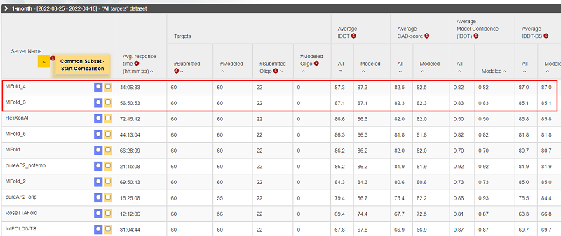
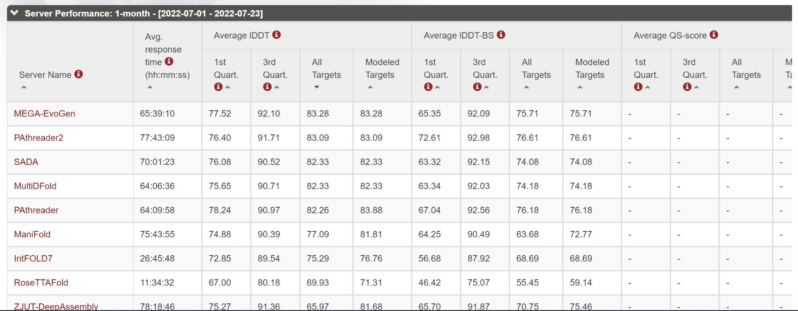
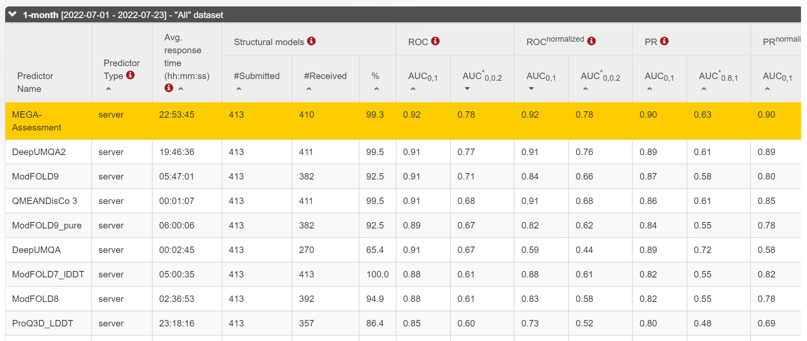
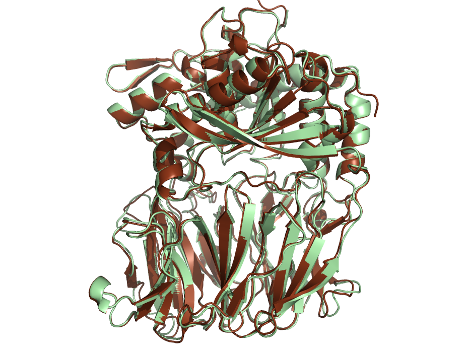

ENGLISH|[简体中文](README_CN.md)

# MEGA-Protein

The process of predicting 3D-structure of proteins from their one-dimensional sequences is called protein structure prediction, and has been regarded as a key problem in computational biology. In order to solve this, the DeepMind team proposed [AlphaFold2](https://www.nature.com/articles/s41586-021-03819-2)<sup>[1,2]</sup> in 2020. The prediction accuracy of this model is greatly improved compared to previous methods, with prediction resolution close to that of experimental methods in CASP14 evaluation. However, there are still problems such as time-consuming data preprocessing, inaccurate prediction accuracy in the absence of MSA, and lack of general evaluation tools for structural quality.

In response to these problems, Yi Qin Gao Lab cooperated with the MindScience team to conduct a series of innovative research, and developed a more accurate and efficient protein structure prediction toolkit **MEGA-Protein**. This directory is the open source code of MEGA-Protein.

MEGA-Protein mainly consists of three parts:

- **Protein Structure Prediction Tool MEGA-Fold** The nerual network architecture of this tool is the same as AlphaFold, and [MMseqs2](https://www.biorxiv.org/content/10.1101/2021.08.15.456425v1.full.pdf)<sup>[3]</sup> is applied to query MSA data(refer to ColabFold). The end-to-end speed is increased by 2-3 times compared with the original version. With memory optimization, MEGA-Fold supports longer sequence prediction (up to 3072 with 32GB RAM Ascend910). MEGA-Fold is also trainable, models trained on our PSP training dataset won the first place in the CAMEO-3D contest in April 2022.

<div align=center>

</div>

- **MSA Generation Tool MEGA-EvoGen** This tool significantly improves the prediction speed of single sequence, and can help predictive models such as MEGA-Fold/AlphaFold2 to maintain/improve the accuracy when there is less MSA (few shot) or even no MSA (zero-shot). This model aims to make accurate predictions in MSA-deficient scenarios such as "orphan sequences", highly mutated sequences and artificial proteins. It won the first place in the CAMEO-3D contest in July 2022.

<div align=center>

</div>

- **Protein Structure Assessment Tool MEGA-Assessment** This tool evaluates the prediction accuracy of each residue in the protein structure and the inter-residue distance error. It further optimizes the protein structure based on the evaluation results. This method obtains the CAMEO-QE No. 1 on the monthly list in July 2022.

<div align=center>

</div>

**Model and Data Availability**

This directory is the open source code of MEGA-Protein (including MEGA-fold, MEGA-EvoGen, and mega-Accessment). The available checkpoints and datasets are listed in the following chart:

| Model & Dataset      | Name        | Size                         | Description  | Model URL                                                                                                       |
|-----------|---------------------|------------------------------|---------------|-----------------------------------------------------------------------------------------------------------------|
| MEGA-Fold    | `MEGA_Fold_1.ckpt` | 356MB                        | model checkpoint | [download](https://download.mindspore.cn/mindscience/mindsponge/MEGAFold/checkpoint/MEGA_Fold_1.ckpt)           |
| MEGA-EvoGen     | `MEGAEvoGen.ckpt`  | 535.7MB                      | MEGA-EvoGen model checkpoint | [download](https://download.mindspore.cn/mindscience/mindsponge/MEGAEvoGen/checkpoint/MEGAEvoGen.ckpt)          |
| MEGA-Assessment     | `MEGA_Assessment.ckpt`  | 77MB        | MEGA-Assessment model checkpoint | [download](https://download.mindspore.cn/mindscience/mindsponge/MEGAAssessment/checkpoint/MEGA_Assessment.ckpt) |
| PSP          | `PSP`         | 2TB(25TB after decompressed) | multimodal dataset for protein | [download](http://ftp.cbi.pku.edu.cn/psp/)                                                                      |

<details><summary>Cite us</summary>

- MEGA-Fold and Training Dataset PSP:

    ```bibtex
    @misc{https://doi.org/10.48550/arxiv.2206.12240,
    doi = {10.48550/ARXIV.2206.12240},
    url = {https://arxiv.org/abs/2206.12240},
    author = {Liu, Sirui and Zhang, Jun and Chu, Haotian and Wang, Min and Xue, Boxin and Ni, Ningxi and Yu, Jialiang and Xie, Yuhao and Chen, Zhenyu and Chen, Mengyun and Liu, Yuan and Patra, Piya and Xu, Fan and Chen, Jie and Wang, Zidong and Yang, Lijiang and Yu, Fan and Chen, Lei and Gao, Yi Qin},
    title = {PSP: Million-level Protein Sequence Dataset for Protein Structure Prediction},
    publisher = {arXiv},
    year = {2022},
    copyright = {Creative Commons Attribution 4.0 International}
    }
    ```

- MEGA-EvoGen:

    ```bibtex
    @article{zhang2022few,
        title={Few-shot learning of accurate folding landscape for protein structure prediction},
        author={Zhang, Jun and Liu, Sirui and Chen, Mengyun and Chu, Haotian and Wang, Min and Wang, Zidong and Yu, Jialiang and Ni, Ningxi and Yu, Fan and Chen, Diqing and others},
        journal={arXiv preprint arXiv:2208.09652},
        year={2022}
      }
    ```

- MEGA-Assessment:

</details>

<details><summary>Contents</summary>

<!-- TOC -->

- [MEGA-Protein](#mega-protein)
  - [Environment](#environment)
    - [Hardware & Framework](#hardware--framework)
    - [DataBase Setting](#database-setting)
  - [Code Contents](#code-contents)
  - [Example](#example)
    - [MEGA-Fold](#mega-fold)
    - [MEGA-EvoGen](#mega-evogen)
    - [MEGA-Assessment](#mega-assessment)
    - [MEGA-Protein](#mega-protein-1)
  - [Reference](#reference)
  - [Acknowledgement](#acknowledgement)

<!-- /TOC -->

</details>

<details><summary>Updates</summary>

- 2022.11: MEGA-Assessment training and inference codes released.
- 2022.11: MEGA-EvoGen inference codes released.
- 2022.04: MEGA-Fold training codes released.
- 2021.11: MEGA-Fold inference codes released.

</details>

## Environment

### Hardware & Framework

This tool is developed based on [MindSPONGE](https://gitee.com/mindspore/mindscience/tree/master/MindSPONGE) computational biology/chemistry package and [MindSpore](https://www.mindspore.cn/) AI framework. It requires MindSpore 1.8 or later versions. This tool can be run on Ascend910 or GPU. Full fp32 precision inference is called by default on GPU. When running on Ascend, mixed-precision inference is applied. Since the recompute function is used in training, the current training mode only supports graph mode.

The protein structure prediction tool MEGA-Fold relies on the co-evolution and template information provided by database search tools for multiple sequence alignments (MSA, multiple sequence alignments) and template search generation. The searching database requires **2.5T hard disk** (SSD recommended) and a CPU with equal or higher performance than Kunpeng920.

### DataBase Setting

- MSA Search

    Installation of **MMseqs2** is required. Please refer to [MMseqs2 User Guide](https://mmseqs.com/latest/userguide.pdf) for installation details. After installation run the following command:

    ``` shell
    export PATH=$(pwd)/mmseqs/bin/:$PATH
    ```

    And download the following databases:

    - [uniref30_2103](http://wwwuser.gwdg.de/~compbiol/colabfold/uniref30_2103.tar.gz): 68G tar.gz file, 375G after decompression
    - [colabfold_envdb_202108](http://wwwuser.gwdg.de/~compbiol/colabfold/colabfold_envdb_202108.tar.gz): 110G tar.gz file, 949G after decompression

    Then unzip and use MMseqs2 to process the database. Please refer to [colabfold](http://colabfold.mmseqs.com)for detains. The main commands are as below:

    ``` bash
    tar xzvf "uniref30_2103.tar.gz"
    mmseqs tsv2exprofiledb "uniref30_2103" "uniref30_2103_db"
    mmseqs createindex "uniref30_2103_db" tmp1 --remove-tmp-files 1

    tar xzvf "colabfold_envdb_202108.tar.gz"
    mmseqs tsv2exprofiledb "colabfold_envdb_202108" "colabfold_envdb_202108_db"
    mmseqs createindex "colabfold_envdb_202108_db" tmp2 --remove-tmp-files 1
    ```

- MSA Search Accelerator(Optional)

    Download the following accelerator in need:

    - [FoldMSA](https://download.mindspore.cn/mindscience/mindsponge/msa_tools/Fold_MSA.tar.gz): install this tool according to the README in the tar.gz file

- Template Search

    Installation of [**HHsearch**](https://github.com/soedinglab/hh-suite)
    and [**kalign**](https://msa.sbc.su.se/downloads/kalign/current.tar.gz) and download of the following database is needed:

    - [pdb70](http://wwwuser.gwdg.de/~compbiol/data/hhsuite/databases/hhsuite_dbs/old-releases/pdb70_from_mmcif_200401.tar.gz):19G tar.gz file, 56G after decompression
    - [mmcif database](https://ftp.rcsb.org/pub/pdb/data/structures/divided/mmCIF/): ~ 50G compressed files, ~200G after decompression. After downloading all mmcif files need to be decompressed and put in the same folder.
    - [obsolete_pdbs](http://ftp.wwpdb.org/pub/pdb/data/status/obsolete.dat):140K

  *The download speed may be slow, and VPN configuration might be needed.*

    - Configuration of database search

    Configuration for database search should be set in  `database_search` part of `config/data.yaml` according to dataBase setting, meaning of different parameters are as follows:

    ```bash
    # configuration for template search
    hhsearch_binary_path   HHsearch exe path
    kalign_binary_path     kalign exe path
    pdb70_database_path    pdb70 folder path
    mmcif_dir              mmcif folder path
    obsolete_pdbs_path     PDB IDs\'s map file path
    max_template_date      the published time of template, default value "2100-01-01"
    # configuration for Multiple Sequence Alignment
    mmseqs_binary          MMseqs2 exe path
    uniref30_path          uniref30 path
    database_envdb_dir     colabfold_envdb_202108 path
    a3m_result_path        msa path, default value "./a3m_result/"
    ```

## Code and Running Examples

<details><summary><font size=4 color="blue">Code Contents</font></summary>

```bash
├── MEGA-Protein
    ├── main.py                         // MEGA-Protein main scripts
    ├── README.md                       // MEGA-Protein README English version
    ├── README_CN.md                    // MEGA-Protein README Chinese version
    ├── config
        ├── data.yaml                   //data process config
        ├── model.yaml                  //model config
    ├── data
        ├── dataset.py                  // Asynchronous data reading script
        ├── hhsearch.py                 // HHsearch tool
        ├── kalign.py                   // Kalign tool
        ├── msa_query.py                // MSA search tool
        ├── msa_search.sh               // Shell script that calls MMseqs2 to search for MSA
        ├── multimer_pipeline.py        // Multimer protein data process
        ├── preprocess.py               // data process
        ├── parsers.py                  // mmcif process
        ├── protein_feature.py          // MSA and template feature search and integration script
        ├── templates.py                // Template search scripts
        ├── utils.py                    // common func scripts
    ├── examples
        ├── pdb                         //example input data (.pkl file)
        ├── pkl                         //example output data (.pdb file)
    ├── model
        ├── fold.py                     // MEGA-Fold model scripts
    ├── module
        ├── evoformer.py                // evoformer module
        ├── fold_wrapcell.py            // wrapper
        ├── head.py                     // heads
        ├── loss_module.py              // loss
        ├── structure.py                // structure module
        ├── template_embedding.py       // template module
```

</details>

### MEGA-Fold inference

First configuring the database search and related hyper-parameters in `config/data.yaml`, then downloading weights [MEGA_Fold_1.ckpt](https://download.mindspore.cn/mindscience/mindsponge/MEGAFold/checkpoint/MEGA_Fold_1.ckpt). Finally running following command to start inference.

```bash
Usage:python main.py --data_config ./config/data.yaml --model_config ./config/model.yaml --run_platform PLATFORM
            --input_path INPUT_FILE_PATH --checkpoint_path CHECKPOINT_PATH


option:
--data_config        configuration for data preprocessing
--model_config       hyperparameters for the model
--input_path         input folder，multiple .pkl or .fasta files can be included
--checkpoint_path    model weights path
--use_pkl            using pkl file as input, default False
--run_platform       running platform ，Ascend or GPU，default Ascend

```

For structure prediction of multiple sequences , MEGA-Fold will automatically decide the padding length according to the largest length of all sequences. If sequences to predict is nemerous, it's recommended to cluster sequences to different folders according to their sequence length and run inference separately. Also, Since the database search hardware requirements are high, MEGA-Fold supports running database search first and save the result in the intermediate "raw_feature" file, then running inference on another machine, wich `use_pkl` argument set to True. We offer examples of pkl and according ground truth pdb file in the `examples` folder for quick test. The test command refers to `scripts/run_fold_infer_gpu.sh`.

The result is saved in `./result`folder, result for sequences are stored in separate folder named by the sequence name. pdb file saves the 3d structure coordinates of your protein in which second to last column is the confidence per residue. and the timings file saves the time information for the run and the overall prediction confidence for the sequence.

```log
{"pre_process_time": 0.61, "model_time": 87.5, "pos_process_time": 0.02, "all_time ": 88.12, "confidence ": 93.5}
```

TMscore comparison between MEGA-Fold inference and groud truth :

- 7VGB_A(Length 711, lDDT 92.3):

<div align=center>

</div>

### MEGA-Fold training

Downloading our open source protein structure training dataset [PSP dataset](http://ftp.cbi.pku.edu.cn/psp/), using follow command to start training:

```bash
Usage:python main.py --data_config ./config/data.yaml --model_config ./config/model.yaml --is_training True
            --input_path INPUT_PATH --pdb_path PDB_PATH --run_platform PLATFORM

option:
--data_config        configuration for data preprocessing
--model_config       hyperparameters for the model
--is_training        setting to training mode, inference does not need to add this parameter
--input_path         training input folder，pkl format file is required, see PSP dataset for more details
--pdb_path           output folder，pdb format file is required
--run_platform       running platform ，Ascend or GPU，default Ascend
```

Checkpoints are saved in `./ckpt` folder every 50 iterations. Dataset downloading and setting can refer to `scripts/run_fold_train.sh`.

### MEGA-EvoGen inference

First related hyper-parameters in `./config/evogen.yaml`, then downloading weights [MEGAEvoGen.ckpt](https://download.mindspore.cn/mindscience/mindsponge/MEGAEvoGen/checkpoint/MEGAEvoGen.ckpt). Finally running following command to start inference.

```bash
Usage:python main.py --data_config ./config/data.yaml --model_config ./config/model.yaml --evogen_config ./config/evogen.yaml
            --input_path INPUT_FILE_PATH --checkpoint_path CHECKPOINT_PATH --use_pkl True --run_evogen 1


option:
--data_config        configuration for data preprocessing
--model_config       hyperparameters for the MEGA-Fold model
--evogen_config      hyperparameters for the MEGA_EvoGen model
--input_path         input folder, .pkl files
--checkpoint_path    model weights path of MEGA_EvoGen and MEGA-Fold
--use_pkl            using pkl file as input, default False
--run_evogen         whether to run evogen model to generate/augmentate msa.

```

### MEGA-Assessment inference

Downloading MEGA_Assessment weights [MEGA_Assessment.ckpt](https://download.mindspore.cn/mindscience/mindsponge/MEGAAssessment/checkpoint/MEGA_Assessment.ckpt). Finally running following command to start inference.

```bash
Usage: python main.py --data_config ./config/data.yaml --model_config ./config/model.yaml --input_path INPUT_FILE_PATH
            --decoy_pdb_path CHECKPOINT_PATH --checkpoint_path_assessment CHECKPOINT_PATH_ASSESSMENT
            --run_assessment=1

option:
--data_config                   configuration for data preprocessing
--model_config                  hyperparameters for the model
--input_path                    input folder, multiple .pkl or .fasta files can be included
--decoy_pdb_path                decoy pdb folder, multiple _decoy.pdb files can be included
--checkpoint_path_assessment    MEGA-Assessment model weights path
--run_assessment                run pdb assessment
```

### MEGA-Assessment training

Downloading our open source protein structure training dataset [PSP lite dataset](http://ftp.cbi.pku.edu.cn/psp/psp_lite/) and MEGA_Fold weights [MEGA_Fold_1.ckpt](https://download.mindspore.cn/mindscience/mindsponge/MEGAFold/checkpoint/MEGA_Fold_1.ckpt), using follow command to start training:

```bash
Usage:python main.py --data_config ./config/data.yaml --model_config ./config/model.yaml --is_training True
            --input_path INPUT_PATH --pdb_path PDB_PATH --checkpoint_path CHECKPOINT_PATH --run_assessment 1

option:
--data_config        configuration for data preprocessing
--model_config       hyperparameters for the model
--is_training        setting to training mode, inference does not need to add this parameter
--input_path         training input folder, pkl format file is required, see PSP dataset for more details
--pdb_path           output folder, pdb format file is required
--checkpoint_path    MEGA-Fold model weights path
--run_assessment     run pdb assessment
```

### MEGA-Protein

To be released

## Reference

[1] Jumper J, Evans R, Pritzel A, et al. Applying and improving AlphaFold at CASP14[J].  Proteins: Structure, Function, and Bioinformatics, 2021.

[2] Jumper J, Evans R, Pritzel A, et al. Highly accurate protein structure prediction with AlphaFold[J]. Nature, 2021, 596(7873): 583-589.

[3] Mirdita M, Ovchinnikov S, Steinegger M. ColabFold-Making protein folding accessible to all[J]. BioRxiv, 2021.

## Acknowledgement

MEGA-Fold referred or used following tools:

- [AlphaFold2](https://github.com/deepmind/alphafold)
- [Biopython](https://biopython.org)
- [ColabFold](https://github.com/sokrypton/ColabFold)
- [HH Suite](https://github.com/soedinglab/hh-suite)
- [Kalign](https://msa.sbc.su.se/cgi-bin/msa.cgi)
- [ML Collections](https://github.com/google/ml_collections)
- [NumPy](https://numpy.org)
- [OpenMM](https://github.com/openmm/openmm)

We thank all the contributors and maintainers of these open source tools！
