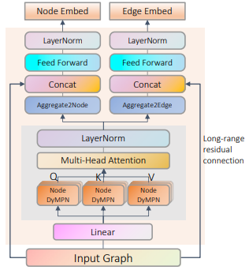
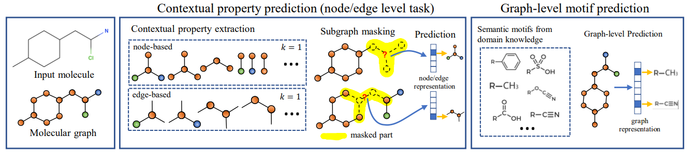

# GROVER

## 模型介绍

GROVER是一个自监督预训练GNN模型，能够对小分子进行编码，可以将消息传递网络集成到Transformer风格的架构中，从大量的未标记的分子数据中学习到丰富的分子结构和语义信息。

GROVER由两个模块组成，节点transformer和边transformer，两者有类似的结构。节点GTransformer结构如下图所示：



GROVER提出了两个预训练自监督任务，一个是在节点/边层级的上下文属性预测任务，另一个是图级别的motif预测任务。



分子指纹是一种分子的抽象表征，它将分子编码为一系列比特向量，有助于进行两个化合物之间相似性的比较，Open Babel，RDkit等多种软件均可生成分子指纹，用于后续的虚拟筛选。通过多个自监督任务的训练，GROVER也能够生成原子的特征向量以及小分子的分子指纹，完成分子指纹生成这一下游任务。

## 数据集

数据集可从[此处](https://openi.pcl.ac.cn/dangwv/grover_local)下载，数据集由单个csv文件储存，单条数据为小分子的SMILES式。

```bash
.
└─exampledata
  ├─pretune                           # 预训练数据集目录
  | └─tryout.csv
  └─finetune                          # 下游数据集目录
    ├─bbbp.csv                        # .csv文件为smiles分子式和对应标签的文件
    ├─clintox.csv
    ├─bace.csv
    ├─tox21.csv
    ├─toxcast.csv
    ├─freesolv.csv
    ├─esoll.csv
    ├─lipo.csv
    ├─qm7.csv
    └─qm8.csv
```

- 分类任务数据集: BBBP | SIDER | ClinTox | BACE | Tox21 | ToxCast

- 回归任务数据集: FreeSolv | ESOL | Lipo | QM7 | QM8

## 使用限制

当前GROVER模型只提供了预训练模型的checkpoint。如进行推理任务，需先针对推理任务完成fine-tune获取所需checkpoint后再进行推理。

## 如何使用

GROVER支持使用单个数据进行推理任务，分类和回归任务的选择通过修改config文件来完成。模型输入为csv文件，将SMILES式存放在csv文件中即可。

```bash
from mindsponge import PipeLine

pipe = PipeLine(name="Grover")
pipe.set_device_id(0)

# 第一次使用时未获取config文件，执行如下指令模型可自动下载config文件，后续使用可手动修改所需内容
# from mindsponge.pipeline.pipeline import download_config
# conf = download_config(pipe.config["eval"], pipe.config_path + "eval.yaml")

conf = load_config({YOUR_CONFIG_PATH}+"eval.yaml")
conf.dataset_type = "classification"
# conf.dataset_type = "regression"
pipe.initialize(conf=conf)
pipe.model.from_pretrained()
data_path = {YOUR_DATA_PATH}+"data.csv"
result = pipe.predict(data_path)
print(result)
```

GROVER同时支持单条数据生成分子指纹，数据输入方式与模型推理相同，具体样例代码如下所示：

```bash
from mindsponge import PipeLine

data_path = {YOUR_DATA_PATH}+"data.csv"
pipe = PipeLine(name="Grover")
pipe.set_device_id(0)
pipe.initialize(key='gen')
pipe.model.from_pretrained()
result = pipe.predict(data_path)
```

## 训练过程

GROVER共有两种训练模式，第一种为预训练，使用tryout.csv中所包含数据集进行训练，训练样例代码如下所示：

```bash
from mindsponge import PipeLine
from mindsponge.common.config_load import load_config
from mindsponge.pipeline.models.grover.grover_dataset import GroverDataSet

data_path = {YOUR_DATA_PATH} + "tryout.csv"
config = load_config("./pretrain.yaml")
dataset = GroverDataSet(config)
dataset.set_training_data_src(data_path)
a = dataset.create_pretrain_dataset()
pipe = PipeLine(name = "Grover")
pipe.initialize(key=None, config_path="pretrain.yaml",
                atom_vocab_size=dataset.config.atom_vocab_size, bond_vocab_size=dataset.config.bond_vocab_size,
                fg_size=dataset.config.fg_size, steps_per_epoch=a.get_dataset_size())
pipe.train(data_path, num_epochs = 10)
```

第二种为模型微调，微调任务分为分类任务和回归任务。通过修改config中的dataset_type可以选择任务类型，训练样例代码如下所示：

```bash
from mindsponge import PipeLine
from mindsponge.common.config_load import load_config
from mindsponge.pipeline.models.grover.grover_dataset import GroverDataSet

# 第一次使用时未获取config文件，执行如下指令模型可自动下载config文件，后续使用可手动修改所需内容
# from mindsponge.pipeline.pipeline import download_config
# conf = download_config(pipe.config["finetune"], pipe.config_path + "finetune.yaml")

conf = load_config({YOUR_CONFIG_PATH}+"finetune.yaml")
conf.dataset_type = "classification"
# conf.dataset_type = "regression"
dataset = GroverDataSet(conf)
dataset.set_training_data_src({YOUR_DATA_PATH}+'bbbp.csv')
a = dataset.create_grover_dataset()
pipe = PipeLine(name = "Grover")
pipe.set_device_id(0)
pipe.initialize(key=None, conf=conf,
                steps_per_epoch=a.get_dataset_size(), features_dim=dataset.config.features_dim,
                output_size=dataset.config.output_size)
pipe.model.from_pretrained()
pipe.train({YOUR_DATA_PATH}+'bbbp.csv', num_epochs=10)
```

## 引用

```bash
@article{rong2020self,
  title={Self-supervised graph transformer on large-scale molecular data},
  author={Rong, Yu and Bian, Yatao and Xu, Tingyang and Xie, Weiyang and Wei, Ying and Huang, Wenbing and Huang, Junzhou},
  journal={Advances in Neural Information Processing Systems},
  volume={33},
  pages={12559--12571},
  year={2020}
}
```
