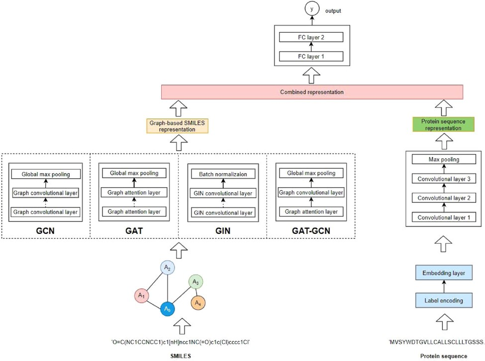

# GraphDTA

## 模型介绍

随着信息技术和生物，化学的快速发展，使用计算机来辅助药物开发的计算机辅助药物设计(Computer-Aided Drug Design, CADD)流程开始被业界广泛接受并投入使用。在CADD流程中，针对一个已知的致病蛋白，需要从十亿级规模的小分子库中，提取出每一个小分子与致病蛋白进行对接构象的计算预测，得到在计算层面两者结合的最佳构象，并对其进行结合能的计算，按照结合能对每一个小分子进行打分，最后按照小分子得分高低来筛选出与该蛋白亲和性高的小分子，再进行下一步的临床试验。

但是随着小分子数量的增多，小分子数据库的增大，先进行化合物和蛋白质的对接构象采样，再对构象进行打分这一流程显得略有冗杂，而且构象采样也会消耗大量的算力和时间。因此，通过学习局部已有小分子和蛋白质的对接亲和性，来预测分子库中其他小分子的亲和性，这一思路运营而生，业界中也慢慢涌现了许多根据未对接的小分子和蛋白质来预测两者亲和性的模型。

GraphDTA(drug-target affinity)就是一个蛋白质-配体亲和性预测模型。模型结构如下图所示：



GraphDTA以小分子SMILE式与蛋白质氨基酸序列作为输入，使用rdkit读取小分子的二级结构信息后利用GNN网络来提取小分子的特征向量，使用三层CNN层提取蛋白质的特征向量，最后根据所得特征向量预测两者间亲和性。

## 使用限制

该模型依赖于MindSpore Graph Learning，在运行该模型前需进行该库的安装。MindSpore Graph Learning的安装可参考[官网文档说明](https://www.mindspore.cn/graphlearning/docs/zh-CN/master/index.html)。

原论文中共提供了四种不同的GNN网络对小分子进行编码并分析其结果，本PipeLine继承了其中表现最好的GCN网络模型。

## 数据集

GraphDTA选择了DeepDTA中所使用的davis和kiba数据集，其中davis数据集中共有442个蛋白质序列和68个小分子的SMILES式，以及之间两两结合的Kd/Ki，即亲和性label，共有30056个数据。而kiba数据集中共有229个蛋白质序列和2111个小分子SMILES式，label为KIBA score，共有118254个数据。

## 如何使用

GraphDTA支持输入蛋白质的氨基酸序列与小分子SMILES式的数据对进行推理，从而预测两者间的亲和性。

预测时需输入一个csv文件，文件内格式如下：

|compound_iso_smiles|target_sequence|
| --- | --- |
|SMILES|Fasta|

```bash
from mindsponge import PipeLine
from mindspore_gl.nn import GNNCell

GNNCell.disable_display()
pipe = PipeLine(name="GraphDTA")
pipe.set_device_id(0)
pipe.initialize("inference")
pipe.model.from_pretrained()
res = pipe.predict({YOUR_csv_PATH})
print(res)
```

## 训练过程

GraphDTA训练支持使用蛋白质的氨基酸序列与小分子SMILES式作为输入进行训练。

训练同样需要输入一个csv文件，文件内格式如下:

|compound_iso_smiles|target_sequence|affinity|
| --- | --- | --- |
| SMILES1 | Fasta1 | label1 |
| SMILES2 | Fasta2 | label2 |
| SMILES3 | Fasta3 | label3 |
| ... | ... | ... |

```bash
from mindsponge import PipeLine
from mindspore_gl.nn import GNNCell

GNNCell.disable_display()
pipe = PipeLine(name="GraphDTA")
pipe.set_device_id(0)
pipe.initialize(key="train")
pipe.train({YOUR_csv_PATH}, num_epochs=1)
```

## 引用

```bash
@article{10.1093/bioinformatics/btaa921,
    author = {Nguyen, Thin and Le, Hang and Quinn, Thomas P and Nguyen, Tri and Le, Thuc Duy and Venkatesh, Svetha},
    title = "{GraphDTA: predicting drug–target binding affinity with graph neural networks}",
    journal = {Bioinformatics},
    volume = {37},
    number = {8},
    pages = {1140-1147},
    year = {2020},
    month = {10},
    issn = {1367-4803},
    doi = {10.1093/bioinformatics/btaa921},
    url = {https://doi.org/10.1093/bioinformatics/btaa921},
}
```
